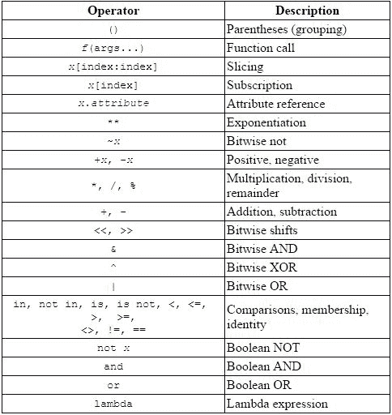

# Python 数字

> 原文： [https://thepythonguru.com/python-numbers/](https://thepythonguru.com/python-numbers/)

* * *

于 2020 年 5 月 7 日更新

* * *

此数据类型仅支持诸如`1`，`31.4`，`-1000`，`0.000023`和`88888888`之类的数值。

Python 支持 3 种不同的数字类型。

1.  `int`-用于整数值，例如`1`，`100`，`2255`，`-999999`，`0`和`12345678`。
2.  `float`-用于像`2.3`，`3.14`，`2.71`，`-11.0`之类的浮点值。
3.  `complex`-适用于`3+2j`，`-2+2.3j`，`10j`，`4.5+3.14j`等复数。

## 整数

* * *

python 中的整数字面值属于`int`类。

```py
>>> i = 100
>>> i
100

```

## 浮点数

* * *

浮点数是带有小数点的值。

```py
>>> f = 12.3
>>> f
12.3

```

需要注意的一点是，当数字运算符的操作数之一是浮点值时，结果将是浮点值。

```py
>>> 3 * 1.5
4.5

```

## 复数

* * *

如您所知，复数由实部和虚部两部分组成，用`j`表示。 您可以这样定义复数：

```py
>>> x = 2 + 3j # where 2 is the real part and 3 is imaginary

```

## 确定类型

* * *

Python 具有`type()`内置函数，可用于确定变量的类型。

```py
>>> x = 12
>>> type(x)
 <class 'int'>

```

## Python 运算符

* * *

Python 具有不同的运算符，可让您在程序中执行所需的计算。

`+`，`-`和`*`可以正常工作，其余的运算符需要一些解释。

| 名称 | 含义 | 示例 | 结果 |
| --- | --- | --- | --- |
| `+` | 加法 | `15+20` | `35` |
| `-` | 减法 | `24.5-3.5` | `21.0` |
| `*` | 乘法 | `15*4` | `60` |
| `/` | 浮点除法 | `4/5` | `0.8` |
| `//` | 整数除法 | `4//5` | `0` |
| `**` | 求幂 | `4**2` | `16` |
| `%` | 余数 | `27%4` | `3` |

**浮点除法（`/`）**：`/`运算符进行除法并以浮点数形式返回结果，这意味着它将始终返回小数部分。 例如

```py
>>> 3/2 
1.5

```

**整数除法（`//`）**：`//`执行整数除法，即它将截断答案的小数部分并仅返回整数。

```py
>>> 3//2 
1

```

**幂运算符（`**`）**：此运算符有助于计算`^b`（a 的 b 次幂）。 让我们举个例子：

```py
>>> 2 ** 3 # is same as 2 * 2 * 2
8
```

**余数运算符（`%`）**：`%`运算符也称为余数或模数运算符。 该运算符除法后返回余数。 例如：

```py
>>> 7 % 2
1

```

## 运算符优先级

* * *

在 python 中，每个表达式都使用运算符优先级进行求值。 让我们以一个例子来阐明它。

```py
>>> 3 * 4 + 1

```

在上面的表达式中，将对哪个运算进行第一个加法或乘法运算？ 为了回答这样的问题，我们需要在 python 中引用运算符优先级列表。 下图列出了 python 优先级从高到低的顺序。



如您在上表中所见`*`在`+`之上，因此`*`将首先出现，然后加法。 因此，以上表达式的结果将为`13`。

```py
>>> 3 * 4 + 1
>>> 13

```

让我们再举一个例子来说明另一个概念。

```py
>>> 3 + 4 - 2
```

在以上表达式中，将首先进行加法或减法。 从表`+`和`-`的优先级相同，然后将它们从左到右进行求值，即先加法，然后减法。

```py
>>> 3 + 4 - 2
>>> 5

```

该规则的唯一例外是赋值运算符（`=`），它从右到左出现。

```py
a = b = c

```

您可以使用括号`()`更改优先级，例如：

```py
>> 3 * (4 + 1)
>> 15

```

从优先级表中可以看出，`()`具有最高优先级，因此在表达式`3 * (4 + 1)`中，先求值`(4 + 1)`，然后相乘。 因此，您可以使用`()`更改优先级。

## 复合赋值

* * *

这些运算符使您可以编写快捷方式分配语句。 例如：

```py
>>> count = 1
>>> count = count + 1
>>> count
2

```

通过使用增强分配运算符，我们可以将其编写为：

```py
>>> count = 1
>>> count += 1
>>> count
2

```

类似地，您可以将`-`，`%`，`//`，`/`，`*`和`**`与赋值运算符一起使用以构成扩展赋值运算符。

| 运算符 | 名称 | 示例 | 等价于 |
| --- | --- | --- | --- |
| `+=` | 加法赋值 | `x += 4` | `x = x + 4` |
| `-=` | 减法赋值 | `x -= 2` | `x = x - 2` |
| `*=` | 乘法赋值 | `x *= 5` | `x = x * 5` |
| `/=` | 除法赋值 | `x /= 5` | `x = x / 5` |
| `//=` | 整数除法赋值 | `x //= 5` | `x = x // 5` |
| `%=` | 余数赋值 | `x %= 5` | `x = x % 5` |
| `**=` | 指数赋值 | `x **= 5` | `x = x ** 5` |

