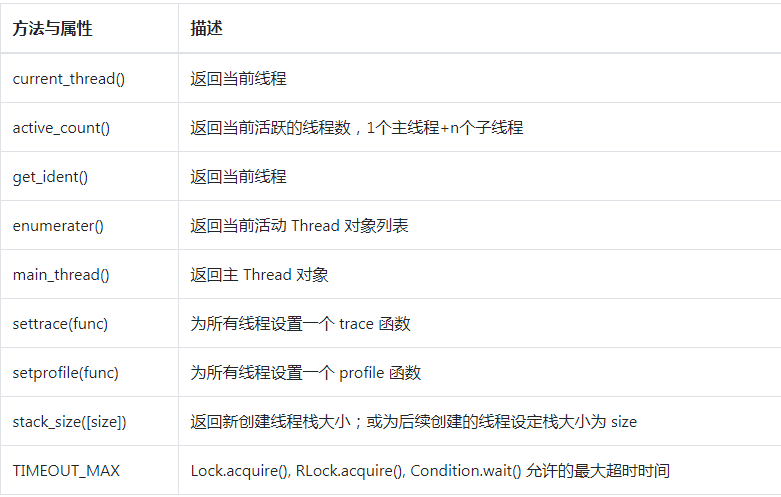
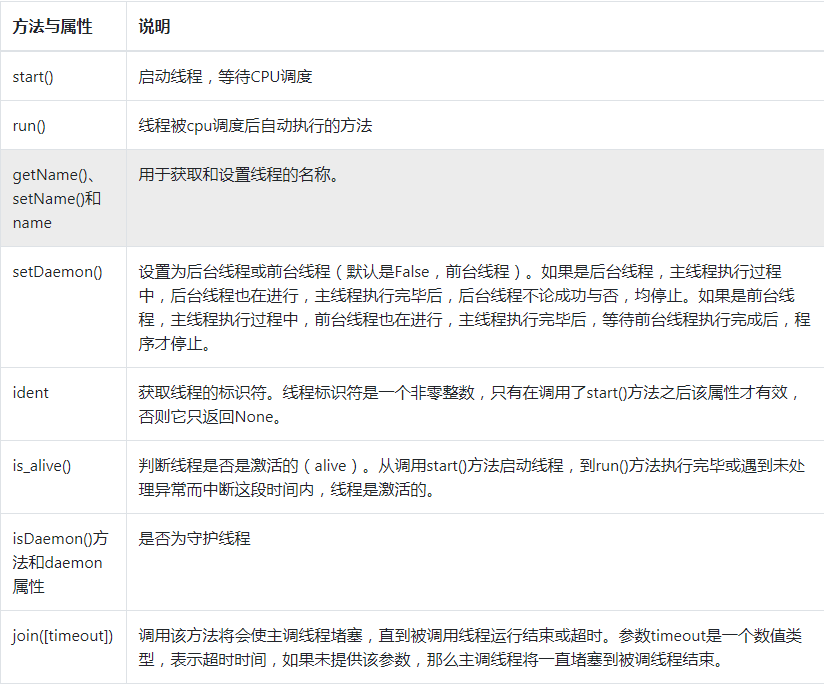

> [参考文献](https://blog.csdn.net/cdlwhm1217096231/article/details/99704267)


# 7.1 基于线程的并发执行

## 多线程实现


### 方法和属性



### theading模块包含以下的类：

* Thread: 基本线程类
* Lock：互斥锁
* RLock：可重入锁，使单一进程再次获得已持有的锁(递归锁)
* Condition：条件锁，使得一个线程等待另一个线程满足特定条件，比如改变状态或某个值。
* Semaphore：信号锁，为线程间共享的有限资源提供一个”计数器”，如果没有可用资源则会被阻塞。
* Event：事件锁，任意数量的线程等待某个事件的发生，在该事件发生后所有线程被激活。
* Timer：一种计时器
* Barrier：Python3.2新增的“阻碍”类，必须达到指定数量的线程后才可以继续执行。


### 面向对象实现方法

```py
import threading

class MyThread(threading.Thread):
    def __init__(self, thread_name):
        super(MyThread, self).__init__(name = thread_name)

    # 重写run()方法
    def run(self):
        print("%s正在运行中......" % self.name)

for i in range(10):
    MyThread("thread-" + str(i)).start()   # 启动线程
```

### 函数式实现方法

```py
import threading
import time

def show(arg):
    time.sleep(1)
    print("thread " + str(arg) + " running......")

for i in range(10):
    t = threading.Thread(target=show, args=(i,))  # 注意传入的参数一定是一个元组!
    t.start()
```

### 类参数说明
* 对于Thread类，它的定义如下：
    * 参数group是预留的，用于将来扩展
    * 参数target是一个可调用对象，在线程启动后执行；
    * 参数name是线程的名字。默认值为“Thread-N“，N是一个数字
    * 参数args和kwargs分别表示调用target时的参数列表和关键字参数
```
threading.Thread(self, group=None, target=None, name=None,agrs=(),kwargs=None, *, daemon=None)
```

### 类方法说明



在多线程执行过程中，有一个特点要注意，每个线程各自执行自己的任务，不等待其他的线程，自顾自的完成自己的任务

* Python默认会等待最后一个线程执行完毕后才退出。上面例子中，主线程没有等待子线程t执行完毕，而是啥都不管，继续往下执行它自己的代码，执行完毕后也没有结束整个程序，而是等待子线程t执行完毕，整个程序才结束。
```py
import time
import threading

def doWaiting():
    print("开始等待：", time.strftime('%H:%M:%S'))
    time.sleep(3)
    print("结束等待：", time.strftime("%H:%M:%S"))

t = threading.Thread(target=doWaiting)
t.start()

time.sleep(1)  # 确保线程已经启动
print("开始工作")
print("结束工作")
```

* 有时候我们希望主线程等等子线程，不要“埋头往前跑”。那要怎么办？使用join()方法

```py
import threading
import time

def doWaiting():
    print("开始等待: ", time.strftime("%H:%M:%S"))
    time.sleep(3)
    print("结束等待：", time.strftime("%H:%M:%S"))

t = threading.Thread(target=doWaiting)

t.start()
# 确保线程t已经启动
time.sleep(1)

print("开始阻塞主线程，等待子线程执行")
t.join()   # 主线程不要着急走，等等子线程吧!!! 将一直堵塞，直到t运行结束
print("子线程执行完，结束阻塞，主线程继续执行！")
```

* 还可以使用setDaemon(True)吧所有的子线程都变成主线程的守护进程。当主线程结束后，守护子进程也会随之结束，整个程序也跟着退出。

```py
import threading
import time

def run():
    print(threading.current_thread().getName(), "开始工作")
    time.sleep(2)  # 子线程停两秒
    print("子线程工作执行完成！")

for i in range(3):
    t = threading.Thread(target=run)
    t.setDaemon(True)   # 把子线程设置为守护进程，必须在start()之前设置!!!
    
    t.start()
    
time.sleep(1)  # 主线程停1s
print("主线程结束运行...")
print(threading.active_count())  # 输出活跃的线程数量
```


## 线程对象
## 锁对象