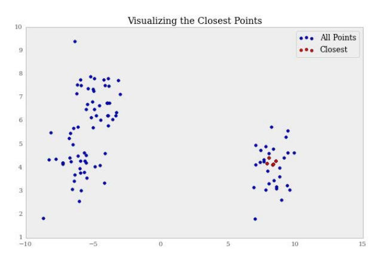
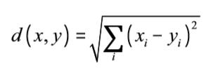
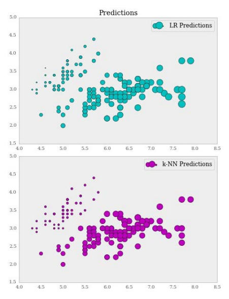

# 第三章 使用距离向量构建模型

> 作者：Trent Hauck

> 译者：[飞龙](https://github.com/wizardforcel)

> 协议：[CC BY-NC-SA 4.0](http://creativecommons.org/licenses/by-nc-sa/4.0/)

这一章中，我们会涉及到聚类。聚类通常和非监督技巧组合到一起。这些技巧假设我们不知道结果变量。这会使结果模糊，以及实践客观。但是，聚类十分有用。我们会看到，我们可以使用聚类，将我们的估计在监督设置中“本地化”。这可能就是聚类非常高效的原因。它可以处理很大范围的情况，通常，结果也不怎么正常。

这一章中我们会浏览大量应用，从图像处理到回归以及离群点检测。通过这些应用，我们会看到聚类通常可以通过概率或者优化结构来观察。不同的解释会导致不同的权衡。我们会看到，如何训练模型，以便让工具尝试不同模型，在面对聚类问题的时候。

## 3.1 使用 KMeans 对数据聚类

聚类是个非常实用的技巧。通常，我们在采取行动时需要分治。考虑公司的潜在客户列表。公司可能需要将客户按类型分组，之后为这些分组划分职责。聚类可以使这个过程变得容易。

KMeans 可能是最知名的聚类算法之一，并且也是最知名的无监督学习技巧之一。

### 准备

首先，让我们看一个非常简单的聚类，之后我们再讨论 KMeans 如何工作。

```py
>>> from sklearn.datasets import make_blobs 
>>> blobs, classes = make_blobs(500, centers=3)
```

同样，由于我们绘制一些图表，导入`matplotlib`，像这样：

```py
>>> import matplotlib.pyplot as plt
```

### 操作步骤

我们打算浏览一个简单的例子，它对伪造数据进行聚类。之后我们会稍微谈论一下，KMeans 如何工作，来寻找最优的块数量。

看一看我们的数据块，我们可以看到，有三个不同的簇。

```
>>> f, ax = plt.subplots(figsize=(7.5, 7.5)) 
>>> ax.scatter(blobs[:, 0], blobs[:, 1], color=rgb[classes]) 
>>> rgb = np.array(['r', 'g', 'b']) 
>>> ax.set_title("Blobs")
```

输出如下：


现在我们可以使用 KMeans 来寻找这些簇的形心。第一个例子中，我们假装知道有三个形心。

```
>>> from sklearn.cluster import KMeans 
>>> kmean = KMeans(n_clusters=3) 
>>> kmean.fit(blobs) 
KMeans(copy_x=True, init='k-means++', max_iter=300, n_clusters=3,
       n_init=10, n_jobs=1, precompute_distances=True,
       random_state=None, tol=0.0001, verbose=0)

>>> kmean.cluster_centers_ array([[ 0.47819567,  1.80819197],

[ 0.08627847,  8.24102715], 
[ 5.2026125 ,  7.86881767]])

>>> f, ax = plt.subplots(figsize=(7.5, 7.5)) 
>>> ax.scatter(blobs[:, 0], blobs[:, 1], color=rgb[classes]) 
>>> ax.scatter(kmean.cluster_centers_[:, 0],
               kmean.cluster_centers_[:, 1], marker='*', s=250,
               color='black', label='Centers')
>>> ax.set_title("Blobs") 
>>> ax.legend(loc='best')
```

下面的截图展示了输出：


其它属性也很实用。例如，`labels_`属性会产生每个点的预期标签。

```py
>>> kmean.labels_[:5] 
array([1, 1, 2, 2, 1], dtype=int32) 
```

我们可以检查，例如，`labels_`是否和类别相同，但是由于 KMeans 不知道类别是什么，它不能给两个类别分配相同的索引值：

```
>>> classes[:5] 
array([0, 0, 2, 2, 0])
```

将类别中的`1`变成`0`来查看是否与`labels_`匹配。

`transform`函数十分有用，它会输出每个点到形心的距离。

```py
>>> kmean.transform(blobs)[:5] 
array([[ 6.47297373,  1.39043536,  6.4936008 ],
       [ 6.78947843,  1.51914705,  3.67659072],
       [ 7.24414567,  5.42840092,  0.76940367],
       [ 8.56306214,  5.78156881,  0.89062961],
       [ 7.32149254,  0.89737788,  5.12246797]])

```

### 工作原理

KMeans 实际上是个非常简单的算法，它使簇中的点到均值的距离的平方和最小。

首先它会设置一个预定义的簇数量`K`，之后执行这些事情：

+   将每个数据点分配到最近的簇中。
+   通过计算初中每个数据点的均值，更新每个形心。

直到满足特定条件。

## 3.2 优化形心数量

形心难以解释，并且也难以判断是否数量正确。理解你的数据是否是未分类的十分重要，因为这会直接影响我们可用的评估手段。

### 准备

为无监督学习评估模型表现是个挑战。所以，在了解真实情况的时候，`sklearn`拥有多种方式来评估聚类，但在不了解时就很少。

我们会以一个简单的簇模型开始，并评估它的相似性。这更多是出于机制的目的，因为测量一个簇的相似性在寻找簇数量的真实情况时显然没有用。

### 操作步骤

为了开始，我们会创建多个数据块，它们可用于模拟数据簇。

```py
>>> from sklearn.datasets import make_blobs 
>>> import numpy as np 
>>> blobs, classes = make_blobs(500, centers=3)

>>> from sklearn.cluster import KMeans 
>>> kmean = KMeans(n_clusters=3) 
>>> kmean.fit(blobs) 
KMeans(copy_x=True, init='k-means++', max_iter=300, n_clusters=3,
       n_init=10, n_jobs=1, precompute_distances=True,
       random_state=None, tol=0.0001, verbose=0) 
```

首先，我们查看轮廓（Silhouette）距离。轮廓距离是簇内不相似性、最近的簇间不相似性、以及这两个值最大值的比值。它可以看做簇间分离程度的度量。

让我们看一看数据点到形心的距离分布，理解轮廓距离非常有用。

```py
>>> from sklearn import metrics 
>>> silhouette_samples = metrics.silhouette_samples(blobs,
                         kmean.labels_) 
>>> np.column_stack((classes[:5], silhouette_samples[:5]))

array([[ 1.,  0.87617292],
       [ 1.,  0.89082363],
       [ 1.,  0.88544994],
       [ 1.,  0.91478369],
       [ 1.,  0.91308287]]) 
>>> f, ax = plt.subplots(figsize=(10, 5))

>>> ax.set_title("Hist of Silhouette Samples") 
>>> ax.hist(silhouette_samples) 
```

输出如下：


要注意，通常接近 1 的系数越高，分数就越高。

### 工作原理

轮廓系数的均值通常用于描述整个模型的拟合度。

```py
>>> silhouette_samples.mean() 
0.57130462953339578
```

这十分普遍，事实上，`metrics`模块提供了一个函数来获得刚才的值。

现在，让我们训练多个簇的模型，并看看平均得分是什么样：

```py
# first new ground truth 
>>> blobs, classes = make_blobs(500, centers=10) 
>>> sillhouette_avgs = []
# this could take a while 
>>> for k in range(2, 60):
       kmean = KMeans(n_clusters=k).fit(blobs)
       sillhouette_avgs.append(metrics.silhouette_score(blobs,
                               kmean.labels_))
>>> f, ax = plt.subplots(figsize=(7, 5)) 
>>> ax.plot(sillhouette_avgs) 
```

下面是输出：


这个绘图表明，轮廓均值随着形心数量的变化情况。我们可以看到最优的数量是 3，根据所生成的数据。但是最优的数量看起来是 6 或者 7。这就是聚类的实际情况，十分普遍，我们不能获得正确的簇数量，我们只能估计簇数量的近似值。

## 3.3 评估聚类的正确性

我们之前讨论了不知道真实情况的条件下的聚类评估。但是，我们还没有讨论簇已知条件下的 KMeans 评估。在许多情况下，这都是不可知的，但是如果存在外部的标注，我们就会知道真实情况，或者至少是代理。

### 准备

所以，让我们假设有一个世界，其中我们有一些外部代理，向我们提供了真实情况。

我们会创建一个简单的数据集，使用多种方式评估相对于真实庆康的正确性。之后讨论它们。

### 操作步骤

在我们开始度量之前，让我们先查看数据集：


```py
>>> f, ax = plt.subplots(figsize=(7, 5))

>>> colors = ['r', 'g', 'b']

>>> for i in range(3):
       p = blobs[ground_truth == i]
       ax.scatter(p[:,0], p[:,1], c=colors[i],
       label="Cluster {}".format(i))
       
>>> ax.set_title("Cluster With Ground Truth") 
>>> ax.legend()

>>> f.savefig("9485OS_03-16")

```

下面是输出：


既然我们已经训练了模型，让我们看看簇的形心：

```py
>>> f, ax = plt.subplots(figsize=(7, 5))

>>> colors = ['r', 'g', 'b']

>>> for i in range(3):
       p = blobs[ground_truth == i]
       ax.scatter(p[:,0], p[:,1], c=colors[i],        label="Cluster {}".format(i))
>>> ax.scatter(kmeans.cluster_centers_[:, 0],
               kmeans.cluster_centers_[:, 1], s=100,
               color='black',
               label='Centers') 
>>> ax.set_title("Cluster With Ground Truth") 
>>> ax.legend()
>>> f.savefig("9485OS_03-17") 
```

下面是输出：


既然我们能够将聚类表现看做分类练习，在其语境中有用的方法在这里也有用：


```py
>>> for i in range(3):
       print (kmeans.labels_ == ground_truth)[ground_truth == i]
       .astype(int).mean()
       
0.0778443113772 
0.990990990991 
0.0570570570571
```

很显然我们有一些错乱的簇。所以让我们将其捋直，之后我们查看准确度。

```py
>>> new_ground_truth = ground_truth.copy()
>>> new_ground_truth[ground_truth == 0] = 2 
>>> new_ground_truth[ground_truth == 2] = 0

>>> for i in range(3):
       print (kmeans.labels_ == new_ground_truth)[ground_truth == i]
       .astype(int).mean()
       
0.919161676647 
0.990990990991 
0.90990990991
```

所以我们 90% 的情况下都是正确的。第二个相似性度量是互信息（ mutual information score）得分。

```py
>>> from sklearn import metrics

>>> metrics.normalized_mutual_info_score(ground_truth, kmeans.labels_)

0.78533737204433651
```

分数靠近 0，就说明标签的分配可能不是按照相似过程生成的。但是分数靠近 1，就说明两个标签有很强的一致性。

例如，让我们看一看互信息分数自身的情况：

```
>>> metrics.normalized_mutual_info_score(ground_truth, ground_truth)

1.0 
```

通过名称，我们可以分辨出可能存在未规范化的` mutual_info_score`：

```py
>>> metrics.mutual_info_score(ground_truth, kmeans.labels_)

0.78945287371677486 
```

这非常接近了。但是，规范化的互信息是互信息除以每个真实值和标签的熵的乘积的平方根。

### 更多

有一个度量方式我们尚未讨论，并且不依赖于真实情况，就是惯性（inertia）度量。当前，它作为一种度量并没有详细记录。但是，它是 KMeans 中最简单的度量。

惯性是每个数据点和它所分配的簇的平方差之和。我们可以稍微使用 NumPy 来计算它：

```py
>>> kmeans.inertia_ 
```

## 3.4 使用 MiniBatch KMeans 处理更多数据

KMeans 是一个不错的方法，但是不适用于大量数据。这是因为 KMenas 的复杂度。也就是说，我们可以使用更低的算法复杂度来获得近似解。

### 准备

MiniBatch Kmeans 是 KMeans 的更快实现。KMeans 的计算量非常大，问题是 NPH 的。

但是，使用 MiniBatch KMeans，我们可以将 KMeans 加速几个数量级。这通过处理多个子样本来完成，它们叫做 MiniBatch。如果子样本是收敛的，并且拥有良好的初始条件，就得到了常规 KMeans 的近似解。

### 操作步骤

让我们对 MiniBatch 聚类做一个概要的性能分析。首先，我们观察总体的速度差异，之后我们会观察估计中的误差。

```py
>>> from sklearn.datasets import make_blobs 
>>> blobs, labels = make_blobs(int(1e6), 3)

>>> from sklearn.cluster import KMeans, MiniBatchKMeans

>>> kmeans = KMeans(n_clusters=3) >>> minibatch = MiniBatchKMeans(n_clusters=3)

```

> 要理解这些度量的目的是暴露问题。所以，需要多加小心，来确保跑分的高精度性。这个话题还有大量可用的信息。如果你真的希望了解，MiniBatch KMeans 为何在粒度上更具优势，最好还是要阅读它们。

既然准备已经完成，我们可以测量时间差异：

```
>>> %time kmeans.fit(blobs) #IPython Magic CPU times: user 8.17 s, sys: 881 ms, total: 9.05 s Wall time: 9.97 s

>>> %time minibatch.fit(blobs) CPU times: user 4.04 s, sys: 90.1 ms, total: 4.13 s Wall time: 4.69 s 
```

CPU 时间上有很大差异。聚类性能上的差异在下面展示：

```py
>>> kmeans.cluster_centers_[0] array([ 1.10522173, -5.59610761, -8.35565134])

>>> minibatch.cluster_centers_[0] array([ 1.12071187, -5.61215116, -8.32015587]) 
```

我们可能要问的下一个问题就是，两个形心距离多远。

```py
>>> from sklearn.metrics import pairwise 
>>> pairwise.pairwise_distances(kmeans.cluster_centers_[0],
                                 minibatch.cluster_centers_[0])
array([[ 0.03305309]]) 
```

看起来十分接近了。对角线包含形心的差异：

```py
>>> np.diag(pairwise.pairwise_distances(kmeans.cluster_centers_,
             minibatch.cluster_centers_)) 
array([ 0.04191979, 0.03133651,  0.04342707])

```

### 工作原理

这里的批次就是关键。批次被迭代来寻找批次均值。对于下一次迭代来说，前一个批次的均值根据当前迭代来更新。有多种选项，用于控制 KMeans 的通用行为，和决定 MiniBatch KMeans 的参数。

` batch_size`参数决定批次应为多大。只是玩玩的话，我们可以运行  MiniBatch，但是，此时我们将批次数量设置为和数据集大小相同。

```py
>>> minibatch = MiniBatchKMeans(batch_size=len(blobs)) 
>>> %time minibatch.fit(blobs) 
CPU times: user 34.6 s, sys: 3.17 s, total: 37.8 s Wall time: 44.6 s 
```

显然，这就违背了问题的核心，但是这的确展示了重要东西。选择差劲的初始条件可能影响我们的模型，特别是聚类模型的收敛。使用 MiniBatch KMeans，全局最优是否能达到，是不一定的。

## 3.5 使用 KMeans 聚类来量化图像

图像处理是个重要的话题，其中聚类有一些应用。值得指出的是，Python 中有几种非常不错的图像处理库。Scikit-image 是 Scikit-learn 的“姐妹”项目。如果你打算做任何复杂的事情，都值得看一看它。

### 准备

我们在这篇秘籍中会有一些乐趣。目标是使用聚类来把图像变模糊。

首先，我们要利用 SciPy 来读取图像。图像翻译为三维数组，`x`和`y`坐标描述了高度和宽度，第三个维度表示每个图像的 RGB 值。

```
# in your terminal 
$ wget http://blog.trenthauck.com/assets/headshot.jpg
```

### 操作步骤

现在，让我们在 Python 中读取图像：

```py
>>> from scipy import ndimage 
>>> img = ndimage.imread("headshot.jpg") 
>>> plt.imshow(img)
```

下面就是图像：


嘿，这就是（年轻时期的）作者。

既然我们已经有了图像，让我们检查它的维度：


```py
>>> img.shape 
(420, 420, 3) 
```

为了实际量化图像，我们需要将其转换为二维数组，长为`420x420`，宽为 RGB 值。思考它的更好的方法，是拥有一堆三维空间中的数据点，并且对点进行聚类来降低图像中的不同颜色的数量 -- 这是一个简单的量化方式。

首先，让我们使数组变形，它是个 NumPy 数组，所以非常简单：

```py
>>> x, y, z = img.shape 
>>> long_img = img.reshape(x*y, z) 
>>> long_img.shape (176400, 3) 
```

现在我们开始聚类过程。首先，让我们导入聚类模块，并创建 KMeans 对象。我们传入`n_clusters=5`，使我们拥有 5 个簇，或者实际上是 5 个不同颜色。

这是个不错的秘籍，我们使用前面提到的轮廓距离：

```py
>>> from sklearn import cluster 
>>> k_means = cluster.KMeans(n_clusters=5) 
>>> k_means.fit(long_img)
```

既然我们已经训练了 KMeans 对象，让我们看看我们的眼色：

```py
>>> centers = k_means.cluster_centers_ 
>>> centers 
array([[ 142.58775848, 206.12712986,  226.04416873],
       [  86.29356543,  68.86312505,   54.04770507],
       [ 194.36182899,  172.19845258,  149.65603813],
       [  24.67768412,   20.45778933,   16.19698314],
       [ 149.27801776,  132.19850659,  115.32729167]])
```

### 工作原理

既然我们拥有了形心，我们需要的下一个东西就是标签。它会告诉我们，哪个点关联哪个簇。

```py
>>> labels = k_means.labels_ 
>>> labels[:5] array([1, 1, 1, 1, 1], dtype=int32)
```

这个时候，我们需要最简的 NumPy 操作，之后是一个变形，我们就拥有的新的图像：

```py
>>> plt.imshow(centers[labels].reshape(x, y, z)) 
```

下面就是产生的图像：


## 3.6 寻找特征空间中的最接近对象

有时，最简单的事情就是求出两个对象之间的距离。我们刚好需要寻找一些距离的度量，计算成对（Pairwise）距离，并将结果与我们的预期比较。

### 准备

Scikit-learn 中，有个叫做`sklearn.metrics.pairwise`的底层工具。它包含一些服务函数，计算矩阵`X`中向量之间的距离，或者`X`和`Y`中的向量距离。

这对于信息检索来说很实用。例如，提供一组客户信息，带有属性`X`，我们可能希望选取有个客户代表，并找到与这个客户最接近的客户。实际上，我们可能希望将客户按照相似性度量的概念，使用距离函数来排序。相似性的质量取决于特征空间选取，以及我们在空间上所做的任何变换。

### 操作步骤

我们会使用`pairwise_distances`函数来判断对象的接近程度。要记住，接近程度就像我们用于聚类/分类的距离函数。

首先，让我们从`metric`模块导入`pairwise_distances`函数，并创建用于操作的数据集：

```py
>>> from sklearn.metrics import pairwise 
>>> from sklearn.datasets import make_blobs 
>>> points, labels = make_blobs() 
```

用于检查距离的最简单方式是`pairwise_distances`：

```py
>>> distances = pairwise.pairwise_distances(points) 
```

`distances`是个 `NxN`的矩阵，对角线为 0。在最简单的情况中，让我们先看看每个点到第一个点的距离：

```py
>>> np.diag(distances) [:5] 
array([ 0.,  0.,  0.,  0.,  0.])
```

现在我们可以查找最接近于第一个点的点：

```py
>>> distances[0][:5] 
array([  0., 11.82643041,1.23751545, 1.17612135, 14.61927874])
```

将点按照接近程度排序，很容易使用`np.argsort`做到：

```py
>>> ranks = np.argsort(distances[0]) 
>>> ranks[:5] 
array([ 0, 27, 98, 23, 67]) 
```

`argsort`的好处是，现在我们可以排序我们的`points`矩阵，来获得真实的点。

```py
>>> points[ranks][:5] 
array([[ 8.96147382, -1.90405304],
       [ 8.75417014, -1.76289919],
       [ 8.78902665, -2.27859923],
       [ 8.59694131, -2.10057667],
       [ 8.70949958, -2.30040991]]) 
```

观察接近的点是什么样子，可能十分有用。结果在意料之中：



### 工作原理

给定一些距离函数，每个点都以成对函数来度量。通常为欧几里得距离，它是：



详细来说，它计算了两个向量每个分量的差，计算它们的平方，求和，之后计算它的平方根。这看起来很熟悉，因为在计算均方误差的时候，我们使用的东西很相似。如果我们计算了平方根，就一样了。实际上，经常使用的度量是均方根误差（RMSE），它就是距离函数的应用。

在 Python 中，这看起来是：

```py
>>> def euclid_distances(x, y):
       return np.power(np.power(x - y, 2).sum(), .5) 
>>> euclid_distances(points[0], points[1])
11.826430406213145 
```

Scikit-learn 中存在一些其他函数，但是 Scikit-learn 也会使用 SciPy 的距离函数。在本书编写之时，Scikit-learn 距离函数支持稀疏矩阵。距离函数的更多信息请查看 SciPy 文档。

+   `cityblock`
+   `cosine`
+   `euclidean`
+   `l1`
+   `l2`
+   `manhattan`

我们现在可以解决问题了。例如，如果我们站在原点处的格子上，并且线是街道，为了到达点`(5,5)`，我们需要走多远呢？

```py
>>> pairwise.pairwise_distances([[0, 0], [5, 5]], metric='cityblock')[0] 
array([  0.,  10.])
```

### 更多

使用成对距离，我们可以发现位向量之间的相似性。这是汉明距离的事情，它定义为：


使用下列命令：

```py
>>> X = np.random.binomial(1, .5, size=(2, 4)).astype(np.bool) 
>>> X 
array([[False,  True, False, False],
       [False, False, False,  True]], dtype=bool)
>>> pairwise.pairwise_distances(X, metric='hamming') 
array([[ 0. ,  0.25],
       [ 0.25,  0. ]]) 
```

## 3.7 使用高斯混合模型的概率聚类

在 KMeans 中，我们假设簇的方差是相等的。这会导致空间的细分，这决定了簇如何被分配。但是，如果有一种场景，其中方差不是相等的，并且每个簇中的点拥有一个与之相关的概率，会怎么样？

### 准备

有一种更加概率化的方式，用于查看 KMeans 聚类。KMeans 聚类相当于将协方差矩阵`S`应用于高斯混合模型，这个矩阵可以分解为单位矩阵成误差。对于每个簇，协方差结构是相同的。这就产生了球形聚类。

但是，如果我们允许`S`变化，就可以估计 GMM，并将其用于预测。我们会以单变量的角度看到它的原理，之后扩展为多个维度。

### 操作步骤

首先，我们需要创建一些数据。例如，让我们模拟女性和男性的身高。我们会在整个秘籍中使用这个例子。这是个简单的例子，但是会展示出我们在 N 维空间中想要完成的东西，这比较易于可视化：

```py
>>> import numpy as np 
>>> N = 1000

>>> in_m = 72 
>>> in_w = 66

>>> s_m = 2 
>>> s_w = s_m

>>> m = np.random.normal(in_m, s_m, N) 
>>> w = np.random.normal(in_w, s_w, N) 
>>> from matplotlib import pyplot as plt 
>>> f, ax = plt.subplots(figsize=(7, 5))

>>> ax.set_title("Histogram of Heights") 
>>> ax.hist(m, alpha=.5, label="Men"); 
>>> ax.hist(w, alpha=.5, label="Women"); 
>>> ax.legend() 
```

下面是输出：


下面，我们的兴趣是，对分组二次抽样，训练分布，之后预测剩余分组。

```py
>>> random_sample = np.random.choice([True, False], size=m.size) 
>>> m_test = m[random_sample] 
>>> m_train = m[~random_sample]

>>> w_test = w[random_sample] 
>>> w_train = w[~random_sample] 
```

现在我们需要获得男性和女性高度的经验分布，基于训练集：

```py
>>> from scipy import stats 
>>> m_pdf = stats.norm(m_train.mean(), m_train.std()) 
>>> w_pdf = stats.norm(w_train.mean(), w_train.std())
```

对于测试集，我们要计算，基于数据点从每个分布中生成的概率，并且最可能的分布会分配合适的标签。当然，我们会看到有多么准确。

```py
>>> m_pdf.pdf(m[0]) 
0.043532673457165431
>>> w_pdf.pdf(m[0]) 
9.2341848872766183e-07 
```

要注意概率中的差异。

假设当男性的概率更高时，我们会猜测，但是如果女性的概率更高，我们会覆盖它。

```py
>>> guesses_m = np.ones_like(m_test) 
>>> guesses_m[m_pdf.pdf(m_test) < w_pdf.pdf(m_test)] = 0
```

显然，问题就是我们有多么准确。由于正确情况下`guesses_m`为 1，否则为 0，我们计算向量的均值来获取准确度。

```py
>>> guesses_m.mean() 
0.93775100401606426 
```

不是太糟。现在，来看看我们在女性的分组中做的有多好，使用下面的命令：

```py
>>> guesses_w = np.ones_like(w_test) 
>>> guesses_w[m_pdf.pdf(w_test) > w_pdf.pdf(w_test)] = 0 
>>> guesses_w.mean() 0.93172690763052213
```

让我们允许两组间的方差不同。首先，创建一些新的数组：

```py
>>> s_m = 1 
>>> s_w = 4

>>> m = np.random.normal(in_m, s_m, N) 
>>> w = np.random.normal(in_w, s_w, N) 
```

之后，创建训练集：

```py
>>> m_test = m[random_sample] 
>>> m_train = m[~random_sample]

>>> w_test = w[random_sample] 
>>> w_train = w[~random_sample] 
>>> f, ax = plt.subplots(figsize=(7, 5)) 
>>> ax.set_title("Histogram of Heights") 
>>> ax.hist(m_train, alpha=.5, label="Men"); 
>>> ax.hist(w_train, alpha=.5, label="Women"); 
>>> ax.legend() 
```

让我们看看男性和女性之间的方差差异：


现在我们可以创建相同的 PDF：

```py
>>> m_pdf = stats.norm(m_train.mean(), m_train.std()) 
>>> w_pdf = stats.norm(w_train.mean(), w_train.std()) 
```

下面是输出：


你可以在多维空间中想象他：

```py
>>> class_A = np.random.normal(0, 1, size=(100, 2)) 
>>> class_B = np.random.normal(4, 1.5, size=(100, 2)) 
>>> f, ax = plt.subplots(figsize=(7, 5))

>>> ax.scatter(class_A[:,0], class_A[:,1], label='A', c='r')
>>> ax.scatter(class_B[:,0], class_B[:,1], label='B')

```

下面是输出：


### 工作原理

好的，所以既然我们看过了，我们基于分布对点分类的方式，让我们看看如何在 Scikit 中首先：

```py
>>> from sklearn.mixture import GMM 
>>> gmm = GMM(n_components=2) 
>>> X = np.row_stack((class_A, class_B)) 
>>> y = np.hstack((np.ones(100), np.zeros(100)))
```

由于我们是小巧的数据科学家，我们创建训练集：

```py
>>> train = np.random.choice([True, False], 200) 
>>> gmm.fit(X[train]) GMM(covariance_type='diag', init_params='wmc', min_covar=0.001,
     n_components=2, n_init=1, n_iter=100, params='wmc',
     random_state=None,   thresh=0.01)

```

训练和预测的完成方式，和 Scikit-learn 的其它对象相同。

```py
>>> gmm.fit(X[train])
>>> gmm.predict(X[train])[:5] 
array([0, 0, 0, 0, 0]) 
```

既然模型已经训练了，有一些值得一看的其它方法。

例如，使用`score_examples`，我们实际上可以为每个标签获得每个样例的可能性。

## 3.8 将 KMeans 用于离群点检测

这一章中，我们会查看 Kmeans 离群点检测的机制和正义。它对于隔离一些类型的错误很实用，但是使用时应多加小心。

### 准备

这个秘籍中，我们会使用 KMeans，对簇中的点执行离群点检测。要注意，提及离群点和离群点检测时有很多“阵营”。以便面，我们可能通过移除离群点，来移除由数据生成过程生成的点。另一方面，离群点可能来源于测量误差或一些其它外部因素。

这就是争议的重点。这篇秘籍的剩余部分有关于寻找离群点。我们的假设是，我们移除离群点的选择是合理的。

离群点检测的操作是，查找簇的形心，之后通过点到形心的距离来识别潜在的离群点。

### 操作步骤

首先，我们会生成 100 个点的单个数据块，之后我们会识别 5 个离形心最远的点。它们就是潜在的离群点。

```py
>>> from sklearn.datasets import make_blobs 
>>> X, labels = make_blobs(100, centers=1) 
>>> import numpy as np 
```

非常重要的是，Kmeans 聚类只有一个形心。这个想法类似于用于离群点检测的单类 SVM。

```py
>>> from sklearn.cluster import KMeans 
>>> kmeans = KMeans(n_clusters=1) 
>>> kmeans.fit(X)

```

现在，让我们观察绘图。对于那些远离中心的点，尝试猜测哪个点会识别为五个离群点之一：

```py
>>> f, ax = plt.subplots(figsize=(7, 5)) 
>>> ax.set_title("Blob") 
>>> ax.scatter(X[:, 0], X[:, 1], label='Points') 
>>> ax.scatter(kmeans.cluster_centers_[:, 0],
                kmeans.cluster_centers_[:, 1],
                label='Centroid',
                color='r') 
>>> ax.legend()
```

下面就是输出：


现在，让我们识别五个最接近的点：

```py
>>> distances = kmeans.transform(X) 
# argsort returns an array of indexes which will sort the array in ascending order 
# so we reverse it via [::-1] and take the top five with [:5] 
>>> sorted_idx = np.argsort(distances.ravel())[::-1][:5]

```

现在，让我们看看哪个点离得最远：

```py
>>> f, ax = plt.subplots(figsize=(7, 5)) 
>>> ax.set_title("Single Cluster") 
>>> ax.scatter(X[:, 0], X[:, 1], label='Points') 
>>> ax.scatter(kmeans.cluster_centers_[:, 0],
                kmeans.cluster_centers_[:, 1],
                label='Centroid', color='r') 
>>> ax.scatter(X[sorted_idx][:, 0], X[sorted_idx][:, 1],
                label='Extreme Value', edgecolors='g',
                facecolors='none', s=100) 
>>> ax.legend(loc='best') 
```

下面是输出：


如果我们喜欢的话，移除这些点很容易。

```py
>>> new_X = np.delete(X, sorted_idx, axis=0)
```

同样，移除这些点之后，形心明显变化了。

```py
>>> new_kmeans = KMeans(n_clusters=1) 
>>> new_kmeans.fit(new_X) 
```

让我们将旧的和新的形心可视化：

```py
>>> f, ax = plt.subplots(figsize=(7, 5)) 
>>> ax.set_title("Extreme Values Removed") 
>>> ax.scatter(new_X[:, 0], new_X[:, 1], label='Pruned Points') 
>>> ax.scatter(kmeans.cluster_centers_[:, 0],
               kmeans.cluster_centers_[:, 1], label='Old Centroid',
               color='r', s=80, alpha=.5) 
>>> ax.scatter(new_kmeans.cluster_centers_[:, 0],
               new_kmeans.cluster_centers_[:, 1], label='New Centroid',
               color='m', s=80, alpha=.5) 
>>> ax.legend(loc='best') 
```

下面是输出：


显然，形心没有移动多少，仅仅移除五个极端点时，我们的预期就是这样。这个过程可以重复，知道我们对数据表示满意。

### 工作原理

我们已经看到，高斯分布和 KMeans 聚类之间有本质联系。让我们基于形心和样本的协方差矩阵创建一个经验高斯分布，并且查看每个点的概率 -- 理论上是我们溢出的五个点。这刚好展示了，我们实际上溢出了拥有最低可能性的值。距离和可能性之间的概念十分重要，并且在你的机器学习训练中会经常出现。

使用下列命令来创建经验高斯分布：

```py
>>> from scipy import stats 
>>> emp_dist = stats.multivariate_normal(
               kmeans.cluster_centers_.ravel()) 
>>> lowest_prob_idx = np.argsort(emp_dist.pdf(X))[:5] 
>>> np.all(X[sorted_idx] == X[lowest_prob_idx]) True 
```

## 3.9 将 KNN 用于回归

回归在这本书的其它地方有所设计，但是我们可能打算在特征空间的“口袋”中运行回归。我们可以认为，我们的数据集要经过多道数据处理工序。如果是这样，只训练相似数据点是个不错的想法。

### 准备

我们的老朋友，回归，可以用于聚类的上下文中。回归显然是个监督学习技巧，所以我们使用 KNN 而不是 KMeans。

对于 KNN 回归来说，我们使用特征空间中的 K 个最近点，来构建回归，而不像常规回归那样使用整个特征空间。

### 操作步骤

对于这个秘籍，我们使用`iris`数据集。如果我们打算预测一些东西，例如每朵花的花瓣宽度，根据`iris`物种来聚类可能会给我们更好的结果。KNN 回归不会根据物种来聚类，但我们的假设是，相同物种的 X 会接近，或者这个案例中，是花瓣长度。

对于这个秘籍，我们使用`iris`数据集：

```py
>>> from sklearn import datasets 
>>> iris = datasets.load_iris() 
>>> iris.feature_names ['sepal length (cm)', 'sepal width (cm)', 'petal length (cm)',  'petal width (cm)'] 
```

我们尝试基于萼片长度和宽度来预测花瓣长度。我们同时训练一个线性回归，来对比观察 KNN 回归有多好。

```py
>>> from sklearn.linear_model import LinearRegression 
>>> lr = LinearRegression() 
>>> lr.fit(X, y) 
>>> print "The MSE is: {:.2}".format(np.power(y - lr.predict(X),
           2).mean()) 
The MSE is: 0.15 
```

现在，对于 KNN 回归，使用下列代码：

```py
>>> from sklearn.neighbors import KNeighborsRegressor 
>>> knnr = KNeighborsRegressor(n_neighbors=10) 
>>> knnr.fit(X, y) 
>>> print "The MSE is: {:.2}".format(np.power(y - knnr.predict(X),
           2).mean()) 
The MSE is: 0.069
```

让我们看看，当我们让它使用最接近的 10 个点用于回归时，KNN 回归会做什么？

```py
>>> f, ax = plt.subplots(nrows=2, figsize=(7, 10))
>>> ax[0].set_title("Predictions")
>>> ax[0].scatter(X[:, 0], X[:, 1], s=lr.predict(X)*80, label='LR
    Predictions', color='c', edgecolors='black') 
>>> ax[1].scatter(X[:, 0], X[:, 1], s=knnr.predict(X)*80, label='k-NN
    Predictions', color='m', edgecolors='black')
>>> ax[0].legend() 
>>> ax[1].legend() 
```

输出如下：



很显然，预测大部分都是接近的。但是让我们与实际情况相比，看看 Setosa 物种的预测：

```py
>>> setosa_idx = np.where(iris.target_names=='setosa') 
>>> setosa_mask = iris.target == setosa_idx[0] 
>>> y[setosa_mask][:5] array([ 0.2,  0.2,  0.2,  0.2,  0.2]) 
>>> knnr.predict(X)[setosa_mask][:5] 
array([ 0.28,  0.17,  0.21,  0.2 ,  0.31])
>>> lr.predict(X)[setosa_mask][:5] 
array([ 0.44636645, 0.53893889, 0.29846368, 0.27338255, 0.32612885]) 
```

再次观察绘图，Setosa 物种（左上方的簇）被线性回归估计过高，但是 KNN 非常接近真实值。

### 工作原理

KNN 回归非常简单，它计算被测试点的 K 个最接近点的均值。

让我们手动预测单个点：

```py
>>> example_point = X[0
```

现在，我们需要获取离我们的`our_example_point`最近的 10 个点：

```py
>>> from sklearn.metrics import pairwise 
>>> distances_to_example = pairwise.pairwise_distances(X)[0] 
>>> ten_closest_points = X[np.argsort(distances_to_example)][:10] 
>>> ten_closest_y = y[np.argsort(distances_to_example)][:10]
>>> ten_closest_y.mean() 
0.28000 
```

我们可以看到它非常接近预期。
