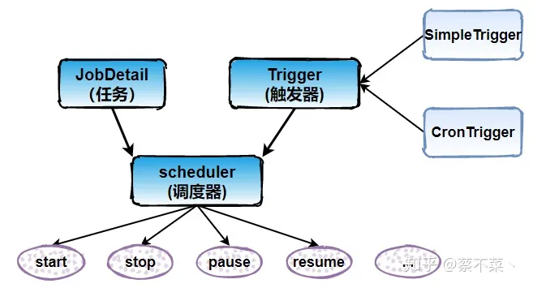
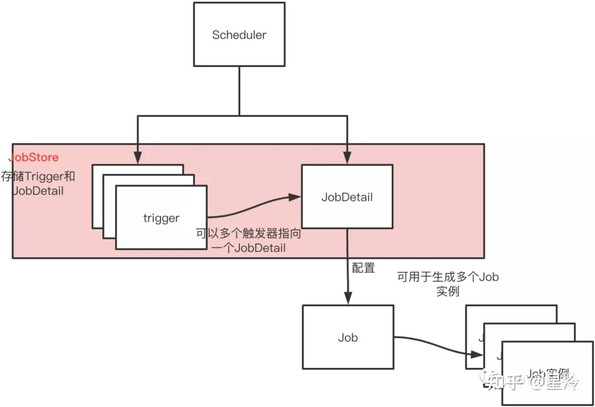
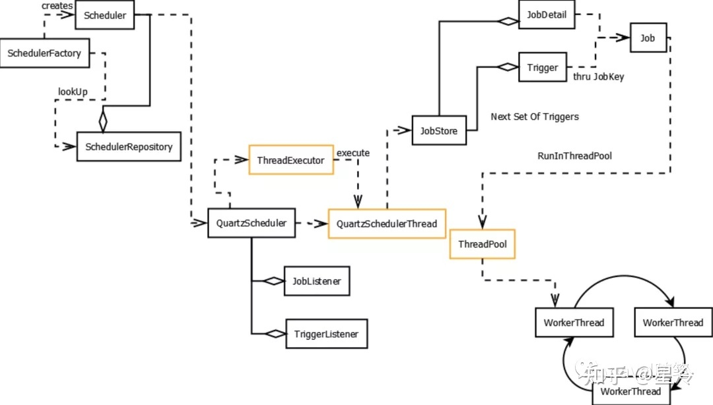

# 概述
> 一篇就够了： https://zhuanlan.zhihu.com/p/306591082
## 1 概述
### 什么是Quartz

Quartz是一个完全由Java编写的开源作业调度框架，为在Java应用程序中进行作业调度提供了简单却强大的机制。Quartz允许开发人员根据时间间隔来调度作业。它实现了作业和触发器的多对多的关系，还能把多个作业与不同的触发器关联。简单地创建一个org.quarz.Job接口的Java类，Job接口包含唯一的方法：

```
    public void execute(JobExecutionContext context) throws JobExecutionException;
```
在Job接口实现类里面，添加需要的逻辑到execute()方法中。配置好Job实现类并设定好调度时间表，Quartz就会自动在设定的时间调度作业执行execute()。
 
整合了Quartz的应用程序可以重用不同事件的作业，还可以为一个事件组合多个作业。Quartz通过属性文件来配置JDBC事务的数据源、全局作业、触发器侦听器、插件、线程池等等。

### 核心概念

* Job 表示一个工作，要执行的具体内容。此接口中只有一个方法，如下：
```
void execute(JobExecutionContext context) 
```
* JobDetail 表示一个具体的可执行的调度程序，Job 是这个可执行程调度程序所要执行的内容，另外 JobDetail 还包含了这个任务调度的方案和策略。
* Trigger 代表一个调度参数的配置，什么时候去调。
* Scheduler 代表一个调度容器，一个调度容器中可以注册多个 JobDetail 和 Trigger。当 Trigger 与 JobDetail 组合，就可以被 Scheduler 容器调度了。




### 基本原理
* JobDetail，定时任务中的“任务”；Job接口是真正需要执行的任务。JobDetail接口相当于将Job接口包装了一下，Trigger和Scheduler实际用到的都是JobDetail。
* Trigger，定时任务中的“定时”；通过cron表达式或是SimpleScheduleBuilder等类，指定任务执行的周期。
* Scheduler，定时任务的调度器(组装器)；Quartz通过调度器来注册、暂停、删除Trigger和JobDetail。





## 2 Quartz的使用
> 创建任务类 ——> 创建JobDetail ——> 创建Trigger
### 相关依赖引入

将quartz.jar包和lib/下的几个jar包、以及相关依赖的jar包放在工程的classpath中

### 配置属性文件

quartz使用名为quartz.properties的配置文件。刚开始时该配置文件不是必须的，但是为了使用最基本的配置，该文件必须位于classpath下。

```
org.quartz.scheduler.instanceName = MyScheduler
org.quartz.threadPool.threadCount = 3
org.quartz.jobStore.class = org.quartz.simpl.RAMJobStore
```

* org.quartz.scheduler.instanceName - 此调度程序的名称将为“MyScheduler”。
* org.quartz.threadPool.threadCount - 线程池中有3个线程，这意味着最多可以同时运行3个job。
* org.quartz.jobStore.class quartz的所有数据，包括job和trigger的配置，都会存储在内存中（而不是数据库里）


### Quartz实例
先来看一个简单的Quartz应用，让它每隔5s打印"Hello, Quartz"，打印10次。

```java
代码清单1：创建任务
import java.util.Date;
import org.quartz.Job;
import org.quartz.JobExecutionContext;
import org.quartz.JobExecutionException;

public class HelloQuartzJob implements Job {

     public void execute(JobExecutionContext context) 
             throws JobExecutionException {
        System.out.println( "Hello, Quartz! - executing its JOB at " + 
             new Date() + " by " + context.getTrigger().getName());
    }
}
```
 
为了调度此任务执行，需要先得到一个Schedule实例，然后创建一个包含任务信息的JobDetail，最后创建一个Trigger管理任务的执行。
```java
代码清单2：调度任务
import java.sql.Date; 
import org.quartz.JobDetail;
import org.quartz.Scheduler;
import org.quartz.SchedulerException;
import org.quartz.SchedulerFactory;
import org.quartz.SimpleTrigger;
import org.quartz.impl.StdSchedulerFactory;


public class HelloQuartzScheduling {

     public static void main(String[] args) throws SchedulerException {

        SchedulerFactory schedulerFactory = new StdSchedulerFactory();
        Scheduler scheduler = schedulerFactory.getScheduler();

        JobDetail jobDetail = new JobDetail( "helloQuartzJob", 
                Scheduler.DEFAULT_GROUP, HelloQuartzJob. class);

        SimpleTrigger simpleTrigger = new SimpleTrigger( "simpleTrigger", 
                Scheduler.DEFAULT_GROUP);

        simpleTrigger.setStartTime( new Date(System.currentTimeMillis()));
        simpleTrigger.setRepeatInterval( 5000);
        simpleTrigger.setRepeatCount( 10);

        scheduler.scheduleJob(jobDetail, simpleTrigger);

        scheduler.start();
    }

}
```

```java
新版本的调度任务实现
public class TestScheduler {
    public static void main(String[] args) throws Exception {
        // 获取任务调度的实例
        Scheduler scheduler = StdSchedulerFactory.getDefaultScheduler();
        // 定义任务调度实例, 并与TestJob绑定
        JobDetail job = JobBuilder.newJob(TestJob.class)
            .withIdentity("testJob", "testJobGroup")
            .build();
        // 定义触发器, 会马上执行一次, 接着5秒执行一次
        Trigger trigger = TriggerBuilder.newTrigger()
            .withIdentity("testTrigger", "testTriggerGroup")
            .startNow()
            .withSchedule(SimpleScheduleBuilder.repeatSecondlyForever(5))
            .build();
        // 使用触发器调度任务的执行
        scheduler.scheduleJob(job, trigger);
        // 开启任务
        scheduler.start();
    }
}
/** OUTPUT:
START DATA BACKUP, current time ：2020-11-17 21:48:30
START DATA BACKUP, current time ：2020-11-17 21:48:35
START DATA BACKUP, current time ：2020-11-17 21:48:40
START DATA BACKUP, current time ：2020-11-17 21:48:45
**/
```

 
* Job接口包含唯一方法execute()，将任务逻辑添加到该方法中。
* StdSchedulerFactory.getScheduler()返回一个可运行的实例，然后创建调度任务的JobDetail实例，并传递3个参数给构造方法。第一个参数是任务名，用于引用该任务。第二个参数是任务组名，这里使用默认名，任务组名用于引用集合起来的一组任务，如可以使用Scheduler.pauseJobGroup()来暂停一组任务，每个组中的任务名是唯一的。第三个参数是实现特定任务的类。
* 创建JobDetail实例后，需要创建一个Trigger，这里使用的是SimpleTrigger类，它提供了JDK Timer风格的触发器行为。传递给SimpleTrigger构造方法的两个参数分别是触发器名和任务组名，触发器名在它所在的任务组中必须是唯一的。
* 接下来是设置触发器的一些属性，setStartTime()是设置启动时间，setRepeatInterval()是设置重复间隔，setRepeatCount()是设置重复次数。最后，scheduler.start()启动调度，终止调度可以用stop()方法。
 
 


## 4 关键对象的创建

### Job


### JobDetail
```java
		Map<String,String> jobData = new HashMap<>();
		String jobName = "schedulerJob";
		String jobGroup = "schedulerGroup";
		jobData.put("key00", "value00");
        JobDetail jobDetail = JobBuilder.newJob(SchedulerJob.class)
                .withIdentity(jobName, jobGroup)
                .usingJobData("key01", "value01")
                .usingJobData(jobData)
                .storeDurably()
                .build();

```

### Trigger

```java
	//SimpleScheduleBuilder
	String triggerName = "schedulerJob";
	String triggerGroup = "schedulerGroup";
	Trigger trigger = TriggerBuilder
	    .newTrigger()
	    .withIdentity(triggerName, triggerGroup)
	    .withSchedule(SimpleScheduleBuilder)
	    .repeatSecondlyForever(1)
	    .withIntervalInSeconds(0)
	    .withRepeatCount(0))
	    .startNow()
	    .build();
	
	//CronScheduleBuilder
	String triggerName2 = "schedulerJob2";
	String triggerGroup2 = "schedulerGroup2";
	String jobTime = "0 0 * * * ?";
	Trigger trigger2 = TriggerBuilder
		.newTrigger()
		.withIdentity(triggerName2, triggerGroup2)
		.startAt(DateBuilder.futureDate(1, IntervalUnit.SECOND))
		.withSchedule(CronScheduleBuilder.cronSchedule(jobTime))
		.startNow()
		.build();
```
### Scheduler

```java

```


## 补充SPI&API

1.什么是SPI
     SPI全称Service Provider Interface，是Java提供的一套用来被第三方实现或者扩展的接口，它可以用来启用框架扩展和替换组件。 SPI的作用就是为这些被扩展的API寻找服务实现。

2.SPI和API的使用场景
    API （Application Programming Interface）在大多数情况下，都是实现方制定接口并完成对接口的实现，调用方仅仅依赖接口调用，且无权选择不同实现。 从使用人员上来说，API 直接被应用开发人员使用。

    SPI （Service Provider Interface）是调用方来制定接口规范，提供给外部来实现，调用方在调用时则选择自己需要的外部实现。  从使用人员上来说，SPI 被框架扩展人员使用。