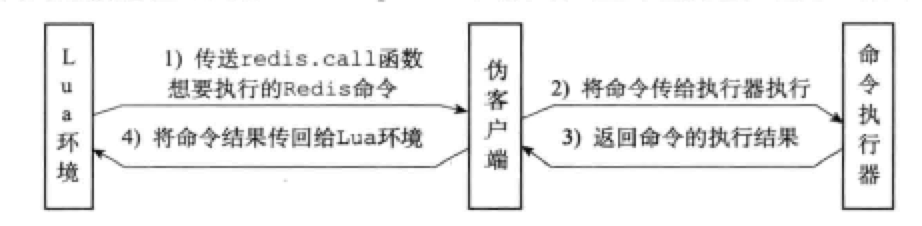

Redis从2.6版本开始引入对Lua脚本的支持，通过在服务器中嵌入Lua环境，Redis客户端可以使用Lua脚本，直接在服务器原子地执行多个Redis命令。

`EVAL`命令可以直接对输入的脚本进行求值：

> EVAL "return 'hello world'" 0
>
> "hello world"

`EVALSHA`命令可以根据脚本的SHA1校验和来对脚本进行求值，但这个命令要求校验和对应的脚本至少被`EVAL`命令执行过一次，或者被`SCRIPT LOAD`命令载入过。

# 20.1 创建并修改Lua环境

Redis服务器创建并修改Lua环境的整个过程有以下步骤：

1. 创建一个基础的Lua环境
2. 载入多个函数库到Lua环境
3. 创建全局表格`redis`，表格包含了对Redis进行操作的函数，如`redis.call`
4. 使用Redis自制的随机函数来替换Lua原有的带有副作用的随机函数
5. 创建排序辅助函数
6. 创建`redis.pcall`函数的错误报告辅助函数，这个函数可以提供更详细的出错信息
7. 对Lua环境中的全局变量进行保护，防止用户在执行Lua脚本时添加额外的全局变量
8. 将完成修改的Lua环境保存到服务器状态的`lua`属性中，等待服务器传来的Lua脚本

## 创建Lua环境

服务器调用Lua的C API函数`lua_open`，创建一个新的Lua环境。

## 载入函数库

- 基础库（base library）：包含Lua的核心函数，如`assert`、`error`等。为了防止用户从外部文件引入不安全的代码，`loadfile`函数被删除。
- 表格库（table library）
- 字符串库（string library）
- 数学库（math library）
- 调试库（debug library）
- Lua CJSON库
- Struct库：用于Lua值和C结构的转换
- Lua cmsgpack库：处理MessagePack格式的数据

## 创建redis全局表格

`redis`表格包含以下函数：

- 用于执行Redis命令的`redis.call`和`redis.pcall`
- 用于记录日志的`redis.log`
- 用于计算SHA1校验和的`redis.sha1hex`
- 用于返回错误信息的`redis.error_repyl`和`redis.status_reply`

## 使用Redis自制的随机函数来替换Lua原有的随机函数

Redis服务器要求传入的Lua脚本都是纯函数（pure function）。

Redis用自制的随机函数替换了原有的`math.random`和`math.randomseed`函数，自制函数有如下特征：

- 对于相同的seed，`math.random`总是相同的随机数序列。
- 对除非在脚本中使用`math.randsomseed`显式修改seed，否则每次运行脚本时，Lua环境都是用固定的`math.randomseed(0)`来初始化seed。

## 创建排序辅助函数

当Lua脚本执行完一个不确定性的命令后，会使用`__redis__compare_helper`函数作为对比函数，自动调用`table.sort`函数对命令的返回值排序，以保证相同的数据集总是产生相同是输出。

## 创建 redis.pcall 函数的错误报告辅助函数

Redis服务器为Lua环境创建一个名为`__redis__err__handler`的错误处理函数。当脚本调用`redis.pcall`执行Redis命令，且执行的命令出现错误，`__redis__err__handler`函数会打印出错代码的来源和行数。

## 保护Lua的全局环境

确保传入服务器的脚本不会因为忘记使用`local`关键字而将额外的全局变量添加到Lua环境。

## 将Lua环境保存到服务器状态的`lua`属性中

这一步，服务器将Lua环境与服务器状态的`lua`属性关联起来。

因为Redis使用串行化的方式来执行命令，所以任意时刻，最多只会有一个脚本能够被放入Lua环境执行。因此，整个Redis服务器只需要一个Lua环境即可。

# 20.2 Lua环境协作组件

除了创建并修改Lua环境之外，Redis服务器还创建了两个用于与Lua环境写作的组件：

- 负责执行Lua脚本中的Redis命令的伪客户端。
- 用于保存Lua脚本的`lua_scripts`字典。

## 伪客户端

Lua脚本使用`redis.call`或`redis.pcall`执行命令，需要以下几个步骤：

- Lua环境将`redis.call`或`redis.pcall`函数想要执行的命令传送给伪客户端。
- 伪客户端将命令传送给命令执行器。
- 命令执行器执行命令，并将结果返回给伪客户端。
- 伪客户端接收到结果，将结果返回Lua环境。
- Lua环境接收到命令结果后，将结果返回给`redis.call`或`redis.pcall`函数。
- 接收到结果的`redis.call`或`redis.pcall`函数将结果作为函数返回值返回给脚本的调用者。



## `lua_sripts`字典

`lua_scripts`字典的键为某个Lua脚本的SHA1校验和，值是SHA1校验和对应的Lua脚本。

```c
struct redisServer {
	dict *lua_scripts;
};
```

Redis服务器会将所有被`EVAL`执行过的Lua脚本，和所有被`SCRIPT LOAD`再如果的Lua脚本都保存到`lua_scripts`字典中。

# 20.3 `EVAL` 命令的实现

`EVAL`命令执行过程分为三分步骤：

1. 根据客户端给定的Lua脚本，在Lua环境中定义一个Lua函数。
2. 将客户端给定的脚本保存到`lua_scripts`字典中。
3. 执行刚刚在Lua环境中定义的函数。

## 定义脚本函数

函数名字由`f_`前缀加上脚本的SHA1校验和组成，函数体则是脚本本身。使用函数来保存客户端传入的脚本有以下好处：

- 执行脚本的步骤很简单，只要调用与脚本对应的函数即可。
- 通过函数的局部性让Lua环境保持清洁，减少垃圾回收，避免使用全局变量。
- 如果某脚本使用的函数在Lua环境中被定义过一次，那么只要记得这个脚本的校验和，服务器就可以直接调用Lua函数来执行脚本。这就是`EVALSHA`的实现原理。

## 将脚本保存到`lua_scripts`字典

服务器在`lua_scripts`字典中新添加一个键值对。

## 执行脚本函数

`lua_scripts`字典中保存脚本之后，服务器还需要一些准备工作，才能开始执行脚本：

1. 将`EVAL`命令传入的键名参数和脚本参数分别保存到`KEYS`数组和`ARGV`数组，然后将这两个数组作为全局变量传入Lua环境。
2. 为Lua环境装载超时处理钩子（hook），在脚本出现超时后，hook可以让客户端执行`SCRIPT SKILL`函数停止脚本，或`SHUTDOWN`命令关闭服务器。
3. 执行脚本函数。
4. 移除之前装载的超时钩子。
5. 将执行脚本函数的结果保存到客户端状态的输入缓冲区。
6. 对Lua环境执行垃圾回收操作。

# 20.4 `EVALSHA`命令的实现

```python
def EVALSHA(sha1):
    # 拼接函数的名字
    func_name = "f_" + sha1
    
    # 查看这个函数是否在Lua环境中
    if function_exits_in_lua_env(func_name):
        execute_lua_funciton(func_name)
    else:
    	send_script_error("SCRIPT NOT FOUND")        
```

# 20.5 脚本管理命令的实现

## `SCRIPT FLUSH`

`SCRIPT FLUSH`命令用于清除服务器中所有与Lua脚本有关的信息，它会释放并重建`lua_scripts`字典，关闭现有的Lua环境并重建一个新的Lua环境。

## `SCRIPT EXISTS`

 `SCRIPT EXISTS`命令根据输入的SHA1校验和，检查其对应的脚本是否存在于服务器中。它是通过检查`lua_scripts`字典实现的。

## `SCRIPT LOAD`

`SCRIPT LOAD`命令所做的事情和`EVAL`的前两步一样：

- 在Lua环境中为脚本创建相应的函数
- 将脚本保存到`lua_scripts`字典中。

## `SCRIPT KILL`

如果服务器设置了`lua-time-limit`选项，那么每次执行Lua脚本前，服务器都会在Lua环境中设置一个超时钩子。

一旦钩子发现脚本的运行超时，那么将会定期在脚本执行期间的间隙，检查是否有`SCRIPT KILL`或`SHUTDOWN`命令到达服务器。

如果超时的脚本从未执行过写入操作，那么客户端可以通过`SCRIPT KILL`命令来停止执行脚本，并向客户端返回一个错误回复。

如果超时的脚本执行过写入操作，那么客户单只能用`SHUTDOWN nosave`命令来停止服务器，防止被不合法的数据写入。

# 20.6 脚本复制

服务器运行在复制模式下，具有写性质的脚本也会被复制到slave，如`EVAL`、`EVALSHA`、`SCRIPT FLUSH`、`SCRIPT LOAD`。

## 复制`EVAL`、`SCRIPT FLUSH`、`SCRIPT LOAD`

Redis复制`EVAL`、`SCRIPT FLUSH`、`SCRIPT LOAD`的方法和其他普通命令一样。master执行完上述命令后，会将其传播到所有slave。

## 复制`EVALSHA`

因为主从服务器载入Lua脚本的情况不同，`EVALSHA`命令不能直接传播给slave。

Redis要求master在传播`EVALSHA`命令的时候，必须确保`EVALSHA`要执行的脚本已经在slave中载入过。如果不能保证，那么master会将`EVALSHA`替换为等价的`EVAL`命令传播给slave。

### 1. 判断`EVALSHA`命令是否安全

master使用服务器状态的`repl_scriptcache_dict`字典记录自己已经将哪些脚本传播给了所有slave。

```c
struct redisServer {
  dict *repl_scriptcache_dict;
};
```

`repl_scriptcache_dict`的键是一个Lua脚本的SHA1校验和，值全部是NULL。

如果一个脚本的SHA1出现在`lua_scripts`字典，却没有出现在`repl_scriptcache_dict`字典，说明对应的的Lua脚本已被master载入，却没有传播给所有slave。

### 2. 清空`repl_scriptcache_dict`字典

每当master添加一个新的slave时，都会清空自己的`repl_scriptcache_dict`字典。

### 3. `EVALSHA`命令换成`EVAL`

通过`EVALSHA`指定的SHA1校验和，以及`lua_scripts`字典保存的Lua脚本，服务器总可以将 `EVALSHA`命令换成`EVAL`命令。

### 4. 传播`EVALSHA`命令

当master在本机执行完一个`EVALSHA`命令后，根据其SHA1校验和是否存在于`repl_scriptcache_dict`字典，决定是向所有slave传播`EVALSHA`还是`EVAL`命令。

# 导航

[目录](README.md)

上一章：[19. 事务](ch19.md)

下一章：[21. 排序](ch21.md)
