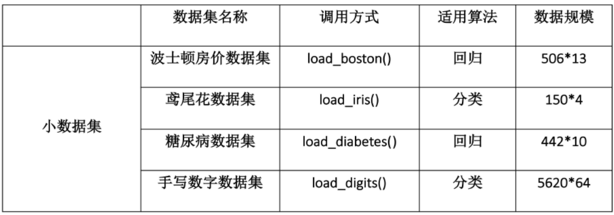
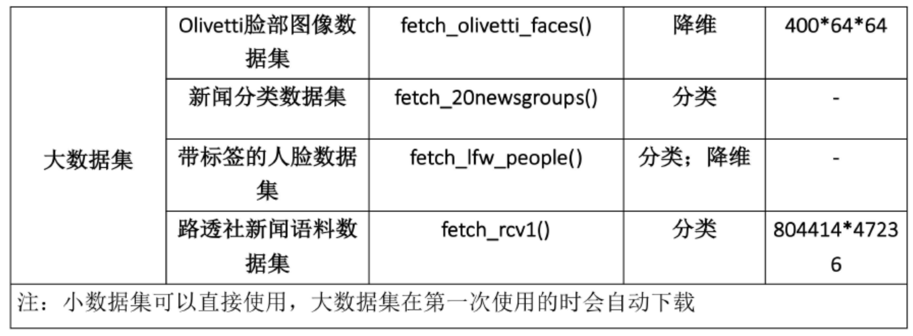
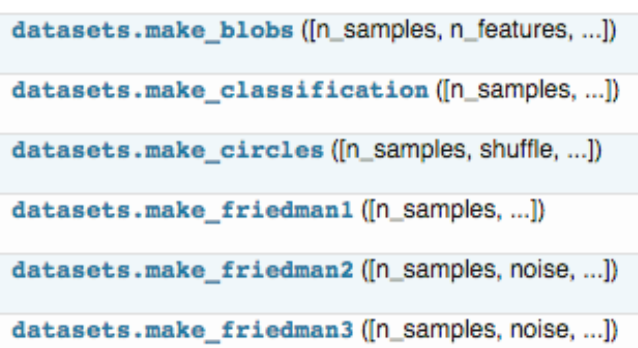
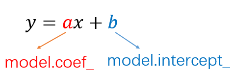

# sklearn 概述

### 参考文献
* [快速入门教程](https://blog.csdn.net/yuanshuaipeng/article/details/80399863)
* [python-sklearn使用教程](https://www.jianshu.com/p/6ada34655862)

### 机器学习的一般流程


1. 获取数据 
1. 处理数据 
1. 训练模型 
1. 评估模型 
1. 使用模型

本文我们将依据传统机器学习的流程，看看在每一步流程中都有哪些常用的函数以及它们的用法是怎么样的。希望你看完这篇文章可以最为快速的开始你的学习任务。

## 1 获取数据

## 1.1 导入sklearn数据集


* sklearn中包含了大量的优质的数据集，在你学习机器学习的过程中，你可以通过使用这些数据集实现出不同的模型，从而提高你的动手实践能力，同时这个过程也可以加深你对理论知识的理解和把握。（这一步我也亟需加强，一起加油！^-^）

* 首先呢，要想使用sklearn中的数据集，必须导入datasets模块：
```
from sklearn import datasets
```
* 然后加载并使用数据集
```
iris = datasets.load_iris() # 导入数据集
X = iris.data # 获得其特征向量
y = iris.target # 获得样本label
```

* 下面是toy Dataset



* 下面是realword Dataset



## 1.2 创建数据集

你除了可以使用sklearn自带的数据集，还可以自己去创建训练样本，具体用法参见《Dataset loading utilities》，这里我们简单介绍一些，sklearn中的samples generator包含的大量创建样本数据的方法



```
from sklearn.datasets.samples_generator import make_classification

X, y = make_classification(n_samples=6, n_features=5, n_informative=2, 
    n_redundant=2, n_classes=2, n_clusters_per_class=2, scale=1.0, 
    random_state=20)

# n_samples：指定样本数
# n_features：指定特征数
# n_classes：指定几分类
# random_state：随机种子，使得随机状可重
>>> for x_,y_ in zip(X,y):
    print(y_,end=': ')
    print(x_)

    
0: [-0.6600737  -0.0558978   0.82286793  1.1003977  -0.93493796]
1: [ 0.4113583   0.06249216 -0.90760075 -1.41296696  2.059838  ]
1: [ 1.52452016 -0.01867812  0.20900899  1.34422289 -1.61299022]
0: [-1.25725859  0.02347952 -0.28764782 -1.32091378 -0.88549315]
0: [-3.28323172  0.03899168 -0.43251277 -2.86249859 -1.10457948]
1: [ 1.68841011  0.06754955 -1.02805579 -0.83132182  0.93286635]
```

## 2 处理数据

* 数据预处理阶段是机器学习中不可缺少的一环，它会使得数据更加有效的被模型或者评估器识别。下面我们来看一下sklearn中有哪些平时我们常用的函数：
```
from sklearn import preprocessing
```
## 2.1 数据归一化
* 为了使得训练数据的标准化规则与测试数据的标准化规则同步,preprocessing中提供了很多Scaler：
```
data = [[0, 0], [0, 0], [1, 1], [1, 1]]
# 1. 基于mean和std的标准化
scaler = preprocessing.StandardScaler().fit(train_data)
scaler.transform(train_data)
scaler.transform(test_data)

# 2. 将每个特征值归一化到一个固定范围
scaler = preprocessing.MinMaxScaler(feature_range=(0, 1)).fit(train_data)
scaler.transform(train_data)
scaler.transform(test_data)
#feature_range: 定义归一化范围，注用（）括起来
```
## 2.2 正则化（normalize）

* 当你想要计算两个样本的相似度时必不可少的一个操作，就是正则化。其思想是：首先求出样本的p-范数，然后该样本的所有元素都要除以该范数，这样最终使得每个样本的范数都为1。
```
>>> X = [[ 1., -1.,  2.],
...      [ 2.,  0.,  0.],
...      [ 0.,  1., -1.]]
>>> X_normalized = preprocessing.normalize(X, norm='l2')

>>> X_normalized                                      
array([[ 0.40..., -0.40...,  0.81...],
       [ 1.  ...,  0.  ...,  0.  ...],
       [ 0.  ...,  0.70..., -0.70...]])
```

## 2.3 one-hot编码
* one-hot编码是一种对离散特征值的编码方式，在LR模型中常用到，用于给线性模型增加非线性能力。
```
data = [[0, 0, 3], [1, 1, 0], [0, 2, 1], [1, 0, 2]]
encoder = preprocessing.OneHotEncoder().fit(data)
enc.transform(data).toarray()
```
## 3 数据集拆分
* 在得到训练数据集时，通常我们经常会把训练数据集进一步拆分成训练集和验证集，这样有助于我们模型参数的选取。
```py
# 作用：将数据集划分为 训练集和测试集
# 格式：train_test_split(*arrays, **options)
from sklearn.mode_selection import train_test_split

X_train, X_test, y_train, y_test = train_test_split(X, y, test_size=0.3, random_state=42)
"""
参数
---
arrays：样本数组，包含特征向量和标签

test_size：
　　float-获得多大比重的测试样本 （默认：0.25）
　　int - 获得多少个测试样本

train_size: 同test_size

random_state:
　　int - 随机种子（种子固定，实验可复现）
　　
shuffle - 是否在分割之前对数据进行洗牌（默认True）

返回
---
分割后的列表，长度=2*len(arrays), 
　　(train-test split)
"""
```

## 4 定义模型
* 在这一步我们首先要分析自己数据的类型，搞清出你要用什么模型来做，然后我们就可以在sklearn中定义模型了。sklearn为所有模型提供了非常相似的接口，这样使得我们可以更加快速的熟悉所有模型的用法。在这之前我们先来看看模型的常用属性和功能：

```py
# 拟合模型
model.fit(X_train, y_train)
# 模型预测
model.predict(X_test)
# 获得这个模型的参数
model.get_params()
# 为模型进行打分
model.score(data_X, data_y) # 线性回归：R square； 分类问题： acc
```

## 4.1 线性回归

```py
from sklearn.linear_model import LinearRegression
# 定义线性回归模型
model = LinearRegression(fit_intercept=True, normalize=False, 
    copy_X=True, n_jobs=1)
"""
参数
    fit_intercept：是否计算截距。False-模型没有截距
    normalize： 当fit_intercept设置为False时，该参数将被忽略。 如果为真，则回归前的回归系数X将通过减去平均值并除以l2-范数而归一化。
     n_jobs：指定线程数
"""
```

## 4.2 逻辑回归LR
```py
from sklearn.linear_model import LogisticRegression
# 定义逻辑回归模型
model = LogisticRegression(penalty=’l2’, dual=False, tol=0.0001, C=1.0, 
    fit_intercept=True, intercept_scaling=1, class_weight=None, 
    random_state=None, solver=’liblinear’, max_iter=100, multi_class=’ovr’, 
    verbose=0, warm_start=False, n_jobs=1)

"""参数
---
    penalty：使用指定正则化项（默认：l2）
    dual: n_samples > n_features取False（默认）
    C：正则化强度的反，值越小正则化强度越大
    n_jobs: 指定线程数
    random_state：随机数生成器
    fit_intercept: 是否需要常量
"""
```
## 4.3 朴素贝叶斯算法NB
```py
from sklearn import naive_bayes
model = naive_bayes.GaussianNB() # 高斯贝叶斯
model = naive_bayes.MultinomialNB(alpha=1.0, fit_prior=True, class_prior=None)
model = naive_bayes.BernoulliNB(alpha=1.0, binarize=0.0, fit_prior=True, class_prior=None)
"""
文本分类问题常用MultinomialNB
参数
---
    alpha：平滑参数
    fit_prior：是否要学习类的先验概率；false-使用统一的先验概率
    class_prior: 是否指定类的先验概率；若指定则不能根据参数调整
    binarize: 二值化的阈值，若为None，则假设输入由二进制向量组成
```

## 4.4 决策树DT
```py
from  sklearn  import  tree 
model = tree.DecisionTreeClassifier(criterion=’gini’, max_depth=None, 
    min_samples_split=2, min_samples_leaf=1, min_weight_fraction_leaf=0.0, 
    max_features=None, random_state=None, max_leaf_nodes=None, 
    min_impurity_decrease=0.0, min_impurity_split=None,
     class_weight=None, presort=False)
"""参数
---
    criterion ：特征选择准则gini/entropy
    max_depth：树的最大深度，None-尽量下分
    min_samples_split：分裂内部节点，所需要的最小样本树
    min_samples_leaf：叶子节点所需要的最小样本数
    max_features: 寻找最优分割点时的最大特征数
    max_leaf_nodes：优先增长到最大叶子节点数
    min_impurity_decrease：如果这种分离导致杂质的减少大于或等于这个值，则节点将被拆分。
"""
```

## 4.5 支持向量机SVM
```py
from sklearn.svm import SVC
model = SVC(C=1.0, kernel=’rbf’, gamma=’auto’)
"""参数
---
    C：误差项的惩罚参数C
    gamma: 核相关系数。浮点数，If gamma is ‘auto’ then 1/n_features will be used instead.
"""
```
## 4.6 k近邻算法KNN
```py
from sklearn import neighbors
#定义kNN分类模型
model = neighbors.KNeighborsClassifier(n_neighbors=5, n_jobs=1) # 分类
model = neighbors.KNeighborsRegressor(n_neighbors=5, n_jobs=1) # 回归
"""参数
---
    n_neighbors： 使用邻居的数目
    n_jobs：并行任务数
"""
```
## 4.7 多层感知机（神经网络）
```py
from sklearn.neural_network import MLPClassifier
# 定义多层感知机分类算法
model = MLPClassifier(activation='relu', solver='adam', alpha=0.0001)
"""参数
---
    hidden_layer_sizes: 元祖
    activation：激活函数
    solver ：优化算法{‘lbfgs’, ‘sgd’, ‘adam’}
    alpha：L2惩罚(正则化项)参数。
"""
```

## 5 模型评估与选择篇
## 5.1 交叉验证
```
from sklearn.model_selection import cross_val_score
cross_val_score(model, X, y=None, scoring=None, cv=None, n_jobs=1)
"""参数
---
    model：拟合数据的模型
    cv ： k-fold
    scoring: 打分参数-‘accuracy’、‘f1’、‘precision’、‘recall’ 、‘roc_auc’、'neg_log_loss'等等
"""
```
## 5.2 检验曲线

* 使用检验曲线，我们可以更加方便的改变模型参数，获取模型表现。

```
from sklearn.model_selection import validation_curve
train_score, test_score = validation_curve(model, X, y, param_name, param_range, cv=None, scoring=None, n_jobs=1)
"""参数
---
    model:用于fit和predict的对象
    X, y: 训练集的特征和标签
    param_name：将被改变的参数的名字
    param_range： 参数的改变范围
    cv：k-fold
   
返回值
---
   train_score: 训练集得分（array）
    test_score: 验证集得分（array）
"""
```

## 6保存模型

* 最后，我们可以将我们训练好的model保存到本地，或者放到线上供用户使用，那么如何保存训练好的model呢？主要有下面两种方式：

## 6.1 保存为pickle文件
```
import pickle

# 保存模型
with open('model.pickle', 'wb') as f:
    pickle.dump(model, f)

# 读取模型
with open('model.pickle', 'rb') as f:
    model = pickle.load(f)
model.predict(X_test)
```
## 6.2 sklearn自带方法joblib
```
from sklearn.externals import joblib

# 保存模型
joblib.dump(model, 'model.pickle')

#载入模型
model = joblib.load('model.pickle')
```