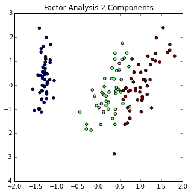
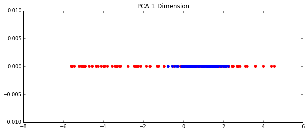
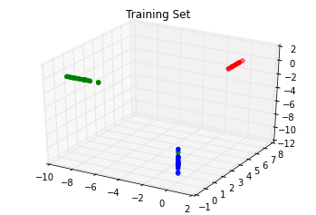
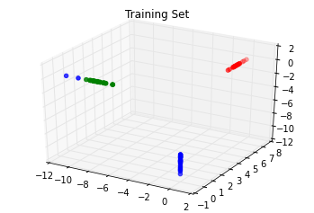



# 第一章 模型预处理

> 作者：Trent Hauck

> 译者：[muxuezi](https://muxuezi.github.io/posts/1-premodel-workflow.html)

> 协议：[CC BY-NC-SA 4.0](http://creativecommons.org/licenses/by-nc-sa/4.0/)

本章包括以下主题：

1. [从外部源获取样本数据](getting-sample-data-from-external-sources.html)
1. [创建试验样本数据](creating-sample-data-for-toy-analysis.html)
1. [把数据调整为标准正态分布](scaling-data-to-the-standard-normal.html)
1. [用阈值创建二元特征](creating-binary-features-through-thresholding.html)
1. [分类变量处理](working-with-categorical-variables.html)
1. [标签特征二元化](binarizing-label-features.html)
1. [处理缺失值](imputing-missing-values-through-various-strategies.html)
1. [用管线命令处理多个步骤](using-pipelines-for-multiple-preprocessing-steps.html)
1. [用主成分分析降维](reducing-dimensionality-with-pca.html)
1. [用因子分析降维](using-factor-analytics-for-decomposition.html)
1. [用核PCA实现非线性降维](kernel-pca-for-nonlinear-dimensionality-reduction.html)
1. [用截断奇异值分解降维](using-truncated-svd-to-reduce-dimensionality.html)
1. [用字典学习分解法分类](decomposition-to-classify-with-dictionarylearning.html)
1. [用管线命令连接多个转换方法](putting-it-all-together-with-pipelines.html)
1. [用正态随机过程处理回归](using-gaussian-processes-for-regression.html)
1. [直接定义一个正态随机过程对象](defining-the-gaussian-process-object-directly.html)
1. [用随机梯度下降处理回归](using-stochastic-gradient-descent-for-regression.html)

<!-- TEASER_END -->

##  简介

本章介绍数据获取（setting data），数据整理（preparing data）和建模前的降维（premodel dimensionality reduction）工作。这些内容并非机器学习（machine learning，ML）最核心的部分，但是它们往往决定模型的成败。

本章主要分三部分。首先，我们介绍如何创建模拟数据（fake data），这看着微不足道，但是创建模拟数据并用模型进行拟合是模型测试的重要步骤。更重要的是，当我们从零开始一行一行代码实现一个算法时，我们想知道算法功能是否达到预期，这时手上可能没有数据，我们可以创建模拟数据来测试。之后，我们将介绍一些数据预处理变换的方法，包括缺失数据填补（data imputation），分类变量编码（categorical variable encoding）。最后，我们介绍一些降维方法，如主成分分析，因子分析，以及正态随机过程等。

本章，尤其是前半部分与后面的章节衔接紧密。后面使用scikit-learn时，数据都源自本章内容。前两节介绍数据获取；紧接着介绍数据清洗。

> 本书使用scikit-learn 0.15，NumPy 1.9和pandas 0.13，兼容Python2.7和Python3.4。还会用到其他的Python库，建议参考对应的官方安装指令。


#  1.1 从外部源获取样本数据

如果条件允许，学本书内容时尽量用你熟悉的数据集；方便起见，我们用scikit-learn的内置数据库。这些内置数据库可用于测试不同的建模技术，如回归和分类。而且这些内置数据库都是非常著名的数据库。这对不同领域的学术论文的作者们来说是很用的，他们可以用这些内置数据库将他们的模型与其他模型进行比较。

> 推荐使用IPython来运行文中的指令。大内存很重要，这样可以让普通的命令正常运行。如果用IPython Notebook就更好了。如果你用Notebook，记得用`%matplotlib inline`指令，这样图象就会出现在Notebook里面，而不是一个新窗口里。

<!-- TEASER_END -->

## Getting ready

scikit-learn的内置数据库在`datasets`模块里。用如下命令导入：


```python
from sklearn import datasets
import numpy as np
```

在IPython里面运行`datasets.*?`就会看到`datasets`模块的指令列表。

## How to do it…

`datasets`模块主要有两种数据类型。较小的测试数据集在`sklearn`包里面，可以通过`datasets.load_*?`查看。较大的数据集可以根据需要下载。后者默认情况下不在`sklearn`包里面；但是，有时这些大数据集可以更好的测试模型和算法，因为比较复杂足以模拟现实情形。

默认在`sklearn`包里面的数据集可以通过`datasets.load_*?`查看。另外一些数据集需要通过`datasets.fetch_*?`下载，这些数据集更大，没有被自动安装。经常用于测试那些解决实际问题的算法。

首先，加载`boston`数据集看看：


```python
boston = datasets.load_boston()
print(boston.DESCR)
```

    Boston House Prices dataset
    
    Notes
    ------
    Data Set Characteristics:  
    
        :Number of Instances: 506 
    
        :Number of Attributes: 13 numeric/categorical predictive
        
        :Median Value (attribute 14) is usually the target
    
        :Attribute Information (in order):
            - CRIM     per capita crime rate by town
            - ZN       proportion of residential land zoned for lots over 25,000 sq.ft.
            - INDUS    proportion of non-retail business acres per town
            - CHAS     Charles River dummy variable (= 1 if tract bounds river; 0 otherwise)
            - NOX      nitric oxides concentration (parts per 10 million)
            - RM       average number of rooms per dwelling
            - AGE      proportion of owner-occupied units built prior to 1940
            - DIS      weighted distances to five Boston employment centres
            - RAD      index of accessibility to radial highways
            - TAX      full-value property-tax rate per $10,000
            - PTRATIO  pupil-teacher ratio by town
            - B        1000(Bk - 0.63)^2 where Bk is the proportion of blacks by town
            - LSTAT    % lower status of the population
            - MEDV     Median value of owner-occupied homes in $1000's
    
        :Missing Attribute Values: None
    
        :Creator: Harrison, D. and Rubinfeld, D.L.
    
    This is a copy of UCI ML housing dataset.
    http://archive.ics.uci.edu/ml/datasets/Housing
    
    
    This dataset was taken from the StatLib library which is maintained at Carnegie Mellon University.
    
    The Boston house-price data of Harrison, D. and Rubinfeld, D.L. 'Hedonic
    prices and the demand for clean air', J. Environ. Economics & Management,
    vol.5, 81-102, 1978.   Used in Belsley, Kuh & Welsch, 'Regression diagnostics
    ...', Wiley, 1980.   N.B. Various transformations are used in the table on
    pages 244-261 of the latter.
    
    The Boston house-price data has been used in many machine learning papers that address regression
    problems.   
         
    **References**
    
       - Belsley, Kuh & Welsch, 'Regression diagnostics: Identifying Influential Data and Sources of Collinearity', Wiley, 1980. 244-261.
       - Quinlan,R. (1993). Combining Instance-Based and Model-Based Learning. In Proceedings on the Tenth International Conference of Machine Learning, 236-243, University of Massachusetts, Amherst. Morgan Kaufmann.
       - many more! (see http://archive.ics.uci.edu/ml/datasets/Housing)
    
    

`DESCR`将列出数据集的一些概况。下面我们来下载一个数据集：


```python
housing = datasets.fetch_california_housing()
print(housing.DESCR)
```

    downloading Cal. housing from http://lib.stat.cmu.edu/modules.php?op=modload&name=Downloads&file=index&req=getit&lid=83 to C:\Users\tj2\scikit_learn_data
    California housing dataset.
    
    The original database is available from StatLib
    
        http://lib.stat.cmu.edu/
    
    The data contains 20,640 observations on 9 variables.
    
    This dataset contains the average house value as target variable
    and the following input variables (features): average income,
    housing average age, average rooms, average bedrooms, population,
    average occupation, latitude, and longitude in that order.
    
    References
    ----------
    
    Pace, R. Kelley and Ronald Barry, Sparse Spatial Autoregressions,
    Statistics and Probability Letters, 33 (1997) 291-297.
    
    
    

## How it works…

当这些数据集被加载时，它们并不是直接转换成Numpy数组。它们是`Bunch`类型。**Bunch**是Python常用的数据结构。基本可以看成是一个词典，它的键被实例对象作为属性使用。

用`data`属性连接数据中包含自变量的Numpy数组，用`target`属性连接数据中的因变量。


```python
X, y = boston.data, boston.target
```

网络上`Bunch`对象有不同的实现；自己写一个也不难。scikit-learn用[基本模块](https://github.com/scikit-learn/scikit-learn/blob/master/sklearn/datasets/base.py)定义`Bunch`。

## There's more…

让你从外部源获取数据集时，它默认会被当前文件夹的`scikit_learn_data/`放在里面，可以通过两种方式进行配置：

- 设置`SCIKIT_LEARN_DATA`环境变量指定下载位置
- `fetch_*?`方法的第一个参数是`data_home`，可以知道下载位置

通过`datasets.get_data_home()`很容易检查默认下载位置。

## See also

UCI机器学习库（UCI Machine Learning Repository）是找简单数据集的好地方。很多scikit-learn的数据集都在那里，那里还有更多的数据集。其他数据源还是著名的KDD和Kaggle。


#  1.2 创建试验样本数据

希望你在学习本书时用自己的数据来试验，如果实在没有数据，下面就介绍如何用scikit-learn创建一些试验用的样本数据（toy data）。

<!-- TEASER_END -->

## Getting ready

与前面获取内置数据集，获取新数据集的过程类似，创建样本数据集，用`make_数据集名称`函数。这些数据集都是人造的：


```python
from sklearn import datasets

datasets.make_*?
```

```
datasets.make_biclusters
datasets.make_blobs
datasets.make_checkerboard
datasets.make_circles
datasets.make_classification
datasets.make_friedman1
datasets.make_friedman2
datasets.make_friedman3
datasets.make_gaussian_quantiles
datasets.make_hastie_10_2
datasets.make_low_rank_matrix
datasets.make_moons
datasets.make_multilabel_classification
datasets.make_regression
datasets.make_s_curve
datasets.make_sparse_coded_signal
datasets.make_sparse_spd_matrix
datasets.make_sparse_uncorrelated
datasets.make_spd_matrix
datasets.make_swiss_roll
```

为了简便，下面我们用`d`表示`datasets`，`np`表示`numpy`：


```python
import sklearn.datasets as d
import numpy as np
```

## How to do it...

这一节将带你创建几个数据集；在后面的*How it works...*一节，我们会检验这些数据集的特性。除了样本数据集，后面还会创建一些具有特定属性的数据集来显示算法的特点。

首先，我们创建回归（regression）数据集：


```python
reg_data = d.make_regression()
reg_data[0].shape,reg_data[1].shape
```


    ((100, 100), (100,))


`reg_data`默认是一个元组，第一个元素是$100\times100$的矩阵——100个样本，每个样本10个特征（自变量），第二个元素是1个因变量，对应自变量的样本数量，也是100个样本。然而，默认情况下，只有10个特征与因变量的相关（参数`n_informative`默认值是10），其他90个特征都与。

可以自定义更复杂的数据集。比如，创建一个$1000\times10$的矩阵，5个特征与因变量相关，误差系数0.2，两个因变量。代码如下所示：


```python
complex_reg_data = d.make_regression(1000, 10, 5, 2, 1.0)
complex_reg_data[0].shape,complex_reg_data[1].shape
```


    ((1000, 10), (1000, 2))


分类数据集也很容易创建。很容易创建一个基本均衡分类集，但是这种情况现实中几乎不可能发生——大多数用户不会改变消费习惯，大多数交易都不是虚假的，等等。因此，创建一个非均衡数据集更有意义：


```python
classification_set = d.make_classification(weights=[0.1])
np.bincount(classification_set[1])
```


    array([10, 90], dtype=int64)


聚类数据集也可以创建。有一些函数可以为不同聚类算法创建对应的数据集。例如，`blobs`函数可以轻松创建K-Means聚类数据集：


```python
%matplotlib inline
import sklearn.datasets as d
from matplotlib import pyplot as plt
import numpy as np

blobs = d.make_blobs(200)

f = plt.figure(figsize=(8, 4))

ax = f.add_subplot(111)
ax.set_title("A blob with 3 centers")

colors = np.array(['r', 'g', 'b'])
ax.scatter(blobs[0][:, 0], blobs[0][:, 1], color=colors[blobs[1].astype(int)], alpha=0.75)
```


    <matplotlib.collections.PathCollection at 0x88e44e0>


## How it works...

下面让我们从源代码看看scikit-learn是如何生成回归数据集的。下面任何未重新定义的参数都使用`make_regression`函数的默认值。

其实非常简单。首先，函数调用时生成一个指定维度的随机数组。


```python
X = np.random.randn(n_samples, n_features)
```

对于基本均衡数据集，其目标数据集生成方法是：


```python
ground_truth = np.zeroes((np_samples, n_target))
ground_truth[:n_informative, :] = 100*np.random.rand(n_informative,
n_targets)
```

然后`X`和`ground_truth`点积加上`bias`就得到了`y`：


```python
y = np.dot(X, ground_truth) + bias
```

> 点积是一种基本的矩阵运算$A_{m \times n} \cdot B_{n \times s} = C_{m \times s}$。因此，`y`数据集里面样本数量是`n_samples`，即数据集的行数，因变量数量是`n_target`。

由于Numpy的传播操作（broadcasting），`bias`虽然是标量，也会被增加到矩阵的每个元素上。增加噪声和数据混洗都很简单。这样试验用的回归数据集就完美了。


#  1.3 把数据调整为标准正态分布

经常需要将数据标准化调整（scaling）为标准正态分布（standard normal）。标准正态分布算得上是统计学中最重要的分布了。如果你学过统计，Z值表（z-scores）应该不陌生。实际上，Z值表的作用就是把服从某种分布的特征转换成标准正态分布的Z值。

<!-- TEASER_END -->

## Getting ready

数据标准化调整是非常有用的。许多机器学习算法在具有不同范围特征的数据中呈现不同的学习效果。例如，SVM（Support Vector Machine，支持向量机）在没有标准化调整过的数据中表现很差，因为可能一个变量的范围是0-10000，而另一个变量的范围是0-1。`preprocessing`模块提供了一些函数可以将特征调整为标准形：


```python
from sklearn import preprocessing
import numpy as np
```

## How to do it...

还用`boston`数据集运行下面的代码：


```python
from sklearn import datasets
boston = datasets.load_boston()
X, y = boston.data, boston.target
```


```python
X[:, :3].mean(axis=0) #前三个特征的均值
```


    array([  3.59376071,  11.36363636,  11.13677866])


```python
X[:, :3].std(axis=0) #前三个特征的标准差
```


    array([  8.58828355,  23.29939569,   6.85357058])


这里看出很多信息。首先，第一个特征的均值是三个特征中最小的，而其标准差却比第三个特征的标准差大。第二个特征的均值和标准差都是最大的——说明它的值很分散，我们通过`preprocessing`对它们标准化：


```python
X_2 = preprocessing.scale(X[:, :3])
```


```python
X_2.mean(axis=0)
```


    array([  6.34099712e-17,  -6.34319123e-16,  -2.68291099e-15])


```python
X_2.std(axis=0)
```


    array([ 1.,  1.,  1.])


## How it works...

中心化与标准化函数很简单，就是减去均值后除以标准差，公式如下所示：

$$x= \frac {x- \bar x} \sigma$$

除了这个函数，还有一个中心化与标准化类，与管线命令（Pipeline）联合处理大数据集时很有用。单独使用一个中心化与标准化类实例也是有用处的：


```python
my_scaler = preprocessing.StandardScaler()
my_scaler.fit(X[:, :3])
my_scaler.transform(X[:, :3]).mean(axis=0)
```


    array([  6.34099712e-17,  -6.34319123e-16,  -2.68291099e-15])


把特征的样本均值变成`0`，标准差变成`1`，这种标准化处理并不是唯一的方法。`preprocessing`还有`MinMaxScaler`类，将样本数据根据最大值和最小值调整到一个区间内：


```python
my_minmax_scaler = preprocessing.MinMaxScaler()
my_minmax_scaler.fit(X[:, :3])
my_minmax_scaler.transform(X[:, :3]).max(axis=0)
```


    array([ 1.,  1.,  1.])


通过`MinMaxScaler`类可以很容易将默认的区间`0`到`1`修改为需要的区间：


```python
my_odd_scaler = preprocessing.MinMaxScaler(feature_range=(-3.14, 3.14))
my_odd_scaler.fit(X[:, :3])
my_odd_scaler.transform(X[:, :3]).max(axis=0)
```


    array([ 3.14,  3.14,  3.14])


还有一种方法是正态化（normalization）。它会将每个样本长度标准化为1。这种方法和前面介绍的不同，它的特征值是标量。正态化代码如下：


```python
normalized_X = preprocessing.normalize(X[:, :3])
```

乍看好像没什么用，但是在求欧式距离（相似度度量指标）时就很必要了。例如三个样本分别是向量`(1,1,0)`，`(3,3,0)`，`(1,-1,0)`。样本1与样本3的距离比样本1与样本2的距离短，尽管样本1与样本3是轴对称，而样本1与样本2只是比例不同而已。由于距离常用于相似度检测，因此建模之前如果不对数据进行正态化很可能会造成失误。

## There's more...

数据填补（data imputation）是一个内涵丰富的主题，在使用scikit-learn的数据填补功能时需要注意以下两点。

### 创建幂等标准化（idempotent scaler）对象

有时可能需要标准化`StandardScaler`实例的均值和/或方差。例如，可能（尽管没用）会经过一系列变化创建出一个与原来完全相同的`StandardScaler`：


```python
my_useless_scaler = preprocessing.StandardScaler(with_mean=False, with_std=False)
transformed_sd = my_useless_scaler.fit_transform(X[:, :3]).std(axis=0)
original_sd = X[:, :3].std(axis=0)
np.array_equal(transformed_sd, original_sd)
```


    True


### 处理稀疏数据填补

在标准化处理时，稀疏矩阵的处理方式与正常矩阵没太大不同。这是因为数据经过中心化处理后，原来的`0`值会变成非`0`值，这样稀疏矩阵经过处理就不再稀疏了：


```python
import scipy
matrix = scipy.sparse.eye(1000)
preprocessing.scale(matrix)
```


    ---------------------------------------------------------------------------

    ValueError                                Traceback (most recent call last)

    <ipython-input-45-466df6030461> in <module>()
          1 import scipy
          2 matrix = scipy.sparse.eye(1000)
    ----> 3 preprocessing.scale(matrix)
    

    d:\programfiles\Miniconda3\lib\site-packages\sklearn\preprocessing\data.py in scale(X, axis, with_mean, with_std, copy)
        120         if with_mean:
        121             raise ValueError(
    --> 122                 "Cannot center sparse matrices: pass `with_mean=False` instead"
        123                 " See docstring for motivation and alternatives.")
        124         if axis != 0:
    

    ValueError: Cannot center sparse matrices: pass `with_mean=False` instead See docstring for motivation and alternatives.


这个错误表面，标准化一个稀疏矩阵不能带`with_mean`，只要`with_std`：


```python
preprocessing.scale(matrix, with_mean=False)
```


    <1000x1000 sparse matrix of type '<class 'numpy.float64'>'
    	with 1000 stored elements in Compressed Sparse Row format>


另一个方法是直接处理`matrix.todense()`。但是，这个方法很危险，因为矩阵已经是稀疏的了，这么做可能出现内存异常。


#  1.4 用阈值创建二元特征

在前一个主题，我们介绍了数据转换成标准正态分布的方法。现在，我们看看另一种完全不同的转换方法。

当不需要呈标准化分布的数据时，我们可以不处理它们直接使用；但是，如果有足够理由，直接使用也许是聪明的做法。通常，尤其是处理连续数据时，可以通过建立二元特征来分割数据。

<!-- TEASER_END -->

## Getting ready

通常建立二元特征是非常有用的方法，不过要格外小心。我们还是用`boston`数据集来学习如何创建二元特征。

首先，加载`boston`数据集：


```python
from sklearn import datasets
boston = datasets.load_boston()
import numpy as np
```

## How to do it...

与标准化处理类似，scikit-learn有两种方法二元特征：

- `preprocessing.binarize`（一个函数）
- `preprocessing.Binarizer`（一个类）

`boston`数据集的因变量是房子的价格中位数（单位：千美元）。这个数据集适合测试回归和其他连续型预测算法，但是假如现在我们想预测一座房子的价格是否高于总体均值。要解决这个问题，我们需要创建一个均值的阈值。如果一个值比均值大，则为`1`；否则，则为`0`：


```python
from sklearn import preprocessing
new_target = preprocessing.binarize(boston.target, threshold=boston.target.mean())
new_target[0,:5]
```


    array([ 1.,  0.,  1.,  1.,  1.])


很容易，让我们检查一下：


```python
(boston.target[:5] > boston.target.mean()).astype(int)
```


    array([1, 0, 1, 1, 1])


既然Numpy已经很简单了，为什么还要用scikit-learn的函数呢？管道命令，将在*用管道命令联接多个预处理步骤*一节中介绍，会解释这个问题；要用管道命令就要用`Binarizer`类：


```python
bin = preprocessing.Binarizer(boston.target.mean())
new_target = bin.fit_transform(boston.target)
new_target[0,:5]
```


    array([ 1.,  0.,  1.,  1.,  1.])


## How it works...

方法看着非常简单；其实scikit-learn在底层创建一个检测层，如果被监测的值比阈值大就返回`Ture`。然后把满足条件的值更新为`1`，不满足条件的更新为`0`。

## There's more...

让我们再介绍一些稀疏矩阵和`fit`方法的知识。

### 稀疏矩阵

稀疏矩阵的`0`是不被存储的；这样可以节省很多空间。这就为`binarizer`造成了问题，需要指定阈值参数`threshold`不小于`0`来解决，如果`threshold`小于`0`就会出现错误：


```python
from scipy.sparse import coo
spar = coo.coo_matrix(np.random.binomial(1, .25, 100))
preprocessing.binarize(spar, threshold=-1)
```


    ---------------------------------------------------------------------------

    ValueError                                Traceback (most recent call last)

    <ipython-input-31-c9b5156c63ab> in <module>()
          1 from scipy.sparse import coo
          2 spar = coo.coo_matrix(np.random.binomial(1, .25, 100))
    ----> 3 preprocessing.binarize(spar, threshold=-1)
    

    d:\programfiles\Miniconda3\lib\site-packages\sklearn\preprocessing\data.py in binarize(X, threshold, copy)
        718     if sparse.issparse(X):
        719         if threshold < 0:
    --> 720             raise ValueError('Cannot binarize a sparse matrix with threshold '
        721                              '< 0')
        722         cond = X.data > threshold
    

    ValueError: Cannot binarize a sparse matrix with threshold < 0


### `fit`方法

`binarizer`类里面有`fit`方法，但是它只是通用接口，并没有实际的拟合操作，仅返回对象。


#  1.5 分类变量处理

分类变量是经常遇到的问题。一方面它们提供了信息；另一方面，它们可能是文本形式——纯文字或者与文字相关的整数——就像表格的索引一样。

因此，我们在建模的时候往往需要将这些变量量化，但是仅仅用简单的`id`或者原来的形式是不行的。因为我们也需要避免在上一节里*通过阈值创建二元特征*遇到的问题。如果我们把数据看成是连续的，那么也必须解释成连续的。

<!-- TEASER_END -->

## Getting ready

这里`boston`数据集不适合演示。虽然它适合演示二元特征，但是用来创建分类变量不太合适。因此，这里用`iris`数据集演示。

解决问题之前先把问题描述清楚。假设有一个问题，其目标是预测花萼的宽度；那么花的种类就可能是一个有用的特征。

首先，让我们导入数据：


```python
from sklearn import datasets
iris = datasets.load_iris()
X = iris.data
y = iris.target
```

现在`X`和`y`都获得了对应的值，我们把它们放到一起：


```python
import numpy as np
d = np.column_stack((X, y))
```

## How to do it...

下面我们把花类型`y`对应那一列转换成分类特征：


```python
from sklearn import preprocessing
text_encoder = preprocessing.OneHotEncoder()
text_encoder.fit_transform(d[:, -1:]).toarray()[:5]
```


    array([[ 1.,  0.,  0.],
           [ 1.,  0.,  0.],
           [ 1.,  0.,  0.],
           [ 1.,  0.,  0.],
           [ 1.,  0.,  0.]])


## How it works...

这里，编码器为每个分类变量创建了额外的特征，转变成一个稀疏矩阵。矩阵是这样定义的：每一行由0和1构成，对应的分类特征是1，其他都是0。用稀疏矩阵存储数据很合理。

`text_encoder`是一个标准的scikit-learn模型，可以重复使用：


```python
text_encoder.transform(np.ones((3, 1))).toarray()
```


    array([[ 0.,  1.,  0.],
           [ 0.,  1.,  0.],
           [ 0.,  1.,  0.]])


## There's more...

在scikit-learn和Python库中，还有一些方法可以创建分类变量。如果你更倾向于用scikit-learn，而且分类编码原则很简单，可以试试`DictVectorizer`。如果你需要处理更复杂的分类编码原则，`patsy`是很好的选择。

### DictVectorizer

`DictVectorizer`可以将字符串转换成分类特征：


```python
from sklearn.feature_extraction import DictVectorizer
dv = DictVectorizer()
my_dict = [{'species': iris.target_names[i]} for i in y]
dv.fit_transform(my_dict).toarray()[:5]
```


    array([[ 1.,  0.,  0.],
           [ 1.,  0.,  0.],
           [ 1.,  0.,  0.],
           [ 1.,  0.,  0.],
           [ 1.,  0.,  0.]])


> Python的词典可以看成是一个稀疏矩阵，它们只包含非0值。

### Pasty

`patsy`是另一个分类变量编码的包。经常和`StatsModels`一起用，`patsy`可以把一组字符串转换成一个矩阵。

> 这部分内容与 scikit-learn关系不大，跳过去也没关系。

例如，如果`x`和`y`都是字符串，`dm = patsy.design_matrix("x + y")`将创建适当的列。如果不是，`C(x)`将生成一个分类变量。

例如，初看`iris.target`，可以把它当做是一个连续变量。因此，用下面的命令处理：


```python
import patsy
patsy.dmatrix("0 + C(species)", {'species': iris.target})
```


    DesignMatrix with shape (150, 3)
      C(species)[0]  C(species)[1]  C(species)[2]
                  1              0              0
                  1              0              0
                  1              0              0
                  1              0              0
                  1              0              0
                  1              0              0
                  1              0              0
                  1              0              0
                  1              0              0
                  1              0              0
                  1              0              0
                  1              0              0
                  1              0              0
                  1              0              0
                  1              0              0
                  1              0              0
                  1              0              0
                  1              0              0
                  1              0              0
                  1              0              0
                  1              0              0
                  1              0              0
                  1              0              0
                  1              0              0
                  1              0              0
                  1              0              0
                  1              0              0
                  1              0              0
                  1              0              0
                  1              0              0
      [120 rows omitted]
      Terms:
        'C(species)' (columns 0:3)
      (to view full data, use np.asarray(this_obj))


#  1.6 标签特征二元化

在这个主题中，我们将用另一种方式来演示分类变量。有些时候只有一两个分类特征是重要的，这时就要避免多余的维度，如果有多个分类变量就有可能会出现这些多余的维度。

<!-- TEASER_END -->

## Getting ready

处理分类变量还有另一种方法，不需要通过`OneHotEncoder`，我们可以用`LabelBinarizer`。这是一个阈值与分类变量组合的方法。演示其用法之前，让我们加载`iris`数据集：


```python
from sklearn import datasets as d
iris = d.load_iris()
target = iris.target
```

## How to do it...

导入`LabelBinarizer()`创建一个对象：


```python
from sklearn.preprocessing import LabelBinarizer
label_binarizer = LabelBinarizer()
```

现在，将因变量的值转换成一个新的特征向量：


```python
new_target = label_binarizer.fit_transform(target)
```

让我们看看`new_target`和`label_binarizer`对象的结果：


```python
new_target.shape
```


    (150, 3)


```python
new_target[:5]
```


    array([[1, 0, 0],
           [1, 0, 0],
           [1, 0, 0],
           [1, 0, 0],
           [1, 0, 0]])


```python
new_target[-5:]
```


    array([[0, 0, 1],
           [0, 0, 1],
           [0, 0, 1],
           [0, 0, 1],
           [0, 0, 1]])


```python
label_binarizer.classes_
```


    array([0, 1, 2])


## How it works...

`iris`的因变量基数为`3`，就是说有三种值。当`LabelBinarizer`将$N \times 1$向量转换成$N \times C$矩阵时，$C$就是$N \times 1$向量的基数。需要注意的是，当`label_binarizer`处理因变量之后，再转换基数以外的值都是`[0,0,0]`：


```python
label_binarizer.transform([4])
```


    array([[0, 0, 0]])


## There's more...

0和1并不一定都是表示因变量中的阳性和阴性实例。例如，如果我们需要用`1000`表示阳性值，用`-1000`表示阴性值，我们可以用`label_binarizer`处理：


```python
label_binarizer = LabelBinarizer(neg_label=-1000, pos_label=1000)
label_binarizer.fit_transform(target)[:5]
```


    array([[ 1000, -1000, -1000],
           [ 1000, -1000, -1000],
           [ 1000, -1000, -1000],
           [ 1000, -1000, -1000],
           [ 1000, -1000, -1000]])


> 阳性和阴性值的唯一限制是，它们必须为整数。


#  1.7 处理缺失值

实践中数值计算不可或缺，好在有很多方法可用，这个主题将介绍其中一些。不过，这些方法未必能解决你的问题。

scikit-learn有一些常见的计算方法，它可以对现有数据进行变换填补`NA`值。但是，如果数据集中的缺失值是有意而为之的——例如，服务器响应时间超过100ms——那么更合适的方法是用其他包解决，像处理贝叶斯问题的PyMC，处理风险模型的lifelines，或者自己设计一套方法。

<!-- TEASER_END -->

## Getting ready

处理缺失值的第一步是创建缺失值。Numpy可以很方便的实现：


```python
from sklearn import datasets
import numpy as np
iris = datasets.load_iris()
iris_X = iris.data
masking_array = np.random.binomial(1, .25, iris_X.shape).astype(bool)
iris_X[masking_array] = np.nan
```

让我们看看这几行代码，Numpy和平时用法不太一样，这里是在数组中用了一个数组作为索引。为了创建了随机的缺失值，先创建一个随机布尔值数组，其形状和`iris_X`数据集的维度相同。然后，根据布尔值数组分配缺失值。因为每次运行都是随机数据，所以`masking_array`每次都会不同。


```python
masking_array[:5]
```


    array([[False,  True, False, False],
           [False,  True, False, False],
           [False, False, False, False],
           [ True, False, False,  True],
           [False, False,  True, False]], dtype=bool)


```python
iris_X[:5]
```


    array([[ 5.1,  nan,  1.4,  0.2],
           [ 4.9,  nan,  1.4,  0.2],
           [ 4.7,  3.2,  1.3,  0.2],
           [ nan,  3.1,  1.5,  nan],
           [ 5. ,  3.6,  nan,  0.2]])


## How to do it...

本书贯穿始终的一条原则（由于scikit-learn的存在）就是那些拟合与转换数据集的类都是可用的，可以在其他数据集中继续使用。具体演示如下所示：


```python
from sklearn import preprocessing
impute = preprocessing.Imputer()
iris_X_prime = impute.fit_transform(iris_X)
iris_X_prime[:5]
```


    array([[ 5.1       ,  3.05221239,  1.4       ,  0.2       ],
           [ 4.9       ,  3.05221239,  1.4       ,  0.2       ],
           [ 4.7       ,  3.2       ,  1.3       ,  0.2       ],
           [ 5.86306306,  3.1       ,  1.5       ,  1.21388889],
           [ 5.        ,  3.6       ,  3.82685185,  0.2       ]])


注意`[3,0]`位置的不同：


```python
iris_X_prime[3,0]
```


    5.8630630630630645


```python
iris_X[3,0]
```


    nan


## How it works...

上面的计算可以通过不同的方法实现。默认是均值`mean`，一共是三种：

- 均值`mean`（默认方法）
- 中位数`median`
- 众数`most_frequent`

scikit-learn会用指定的方法计算数据集中的每个缺失值，然后把它们填充好。

例如，用`median`方法重新计算`iris_X`，重新初始化`impute`即可：


```python
impute = preprocessing.Imputer(strategy='median')
iris_X_prime = impute.fit_transform(iris_X)
iris_X_prime[:5]
```


    array([[ 5.1 ,  3.  ,  1.4 ,  0.2 ],
           [ 4.9 ,  3.  ,  1.4 ,  0.2 ],
           [ 4.7 ,  3.2 ,  1.3 ,  0.2 ],
           [ 5.8 ,  3.1 ,  1.5 ,  1.3 ],
           [ 5.  ,  3.6 ,  4.45,  0.2 ]])


如果数据有缺失值，后面计算过程中可能会出问题。例如，在*How to do it...*一节里面，`np.nan`作为默认缺失值，但是缺失值有很多表现形式。有时用`-1`表示。为了处理这些缺失值，可以在方法中指定那些值是缺失值。方法默认缺失值表现形式是`Nan`，就是`np.nan`的值。

假设我们将`iris_X`的缺失值都用`-1`表示。看着很奇怪，但是`iris`数据集的度量值不可能是负数，因此用`-1`表示缺失值完全合理：


```python
iris_X[np.isnan(iris_X)] = -1
iris_X[:5]
```


    array([[ 5.1, -1. ,  1.4,  0.2],
           [ 4.9, -1. ,  1.4,  0.2],
           [ 4.7,  3.2,  1.3,  0.2],
           [-1. ,  3.1,  1.5, -1. ],
           [ 5. ,  3.6, -1. ,  0.2]])


填充这些缺失值也很简单：


```python
impute = preprocessing.Imputer(missing_values=-1)
iris_X_prime = impute.fit_transform(iris_X)
iris_X_prime[:5]
```


    array([[ 5.1       ,  3.05221239,  1.4       ,  0.2       ],
           [ 4.9       ,  3.05221239,  1.4       ,  0.2       ],
           [ 4.7       ,  3.2       ,  1.3       ,  0.2       ],
           [ 5.86306306,  3.1       ,  1.5       ,  1.21388889],
           [ 5.        ,  3.6       ,  3.82685185,  0.2       ]])


## There's more...

pandas库也可以处理缺失值，而且更加灵活，但是重用性较弱：


```python
import pandas as pd
iris_X[masking_array] = np.nan
iris_df = pd.DataFrame(iris_X, columns=iris.feature_names)
iris_df.fillna(iris_df.mean())['sepal length (cm)'].head(5)
```


    0    5.100000
    1    4.900000
    2    4.700000
    3    5.863063
    4    5.000000
    Name: sepal length (cm), dtype: float64


其灵活性在于，`fillna`可以填充任意统计参数值：


```python
iris_df.fillna(iris_df.max())['sepal length (cm)'].head(5)
```


    0    5.1
    1    4.9
    2    4.7
    3    7.9
    4    5.0
    Name: sepal length (cm), dtype: float64


    

#  1.8 用管线命令处理多个步骤

管线命令不经常用，但是很有用。它们可以把多个步骤组合成一个对象执行。这样可以更方便灵活地调节和控制整个模型的配置，而不只是一个一个步骤调节。

<!-- TEASER_END -->

## Getting ready

这是我们把多个数据处理步骤组合成一个对象的第一部分。在scikit-learn里称为`pipeline`。这里我们首先通过计算处理缺失值；然后将数据集调整为均值为0，标准差为1的标准形。

让我们创建一个有缺失值的数据集，然后再演示`pipeline`的用法：


```python
from sklearn import datasets
import numpy as np
mat = datasets.make_spd_matrix(10)
masking_array = np.random.binomial(1, .1, mat.shape).astype(bool)
mat[masking_array] = np.nan
mat[:4, :4]
```


    array([[ 1.05419595,  1.42287309,  0.02368264, -0.8505244 ],
           [ 1.42287309,  5.09704588,         nan, -2.46408728],
           [ 0.02368264,  0.03614203,  0.63317494,  0.09792298],
           [-0.8505244 , -2.46408728,  0.09792298,  2.04110849]])


## How to do it...

如果不用管线命令，我们可能会这样实现：


```python
from sklearn import preprocessing
impute = preprocessing.Imputer()
scaler = preprocessing.StandardScaler()
mat_imputed = impute.fit_transform(mat)
mat_imputed[:4, :4]
```


    array([[ 1.05419595,  1.42287309,  0.02368264, -0.8505244 ],
           [ 1.42287309,  5.09704588,  0.09560571, -2.46408728],
           [ 0.02368264,  0.03614203,  0.63317494,  0.09792298],
           [-0.8505244 , -2.46408728,  0.09792298,  2.04110849]])


```python
mat_imp_and_scaled = scaler.fit_transform(mat_imputed)
mat_imp_and_scaled[:4, :4]
```


    array([[  1.09907483e+00,   2.62635324e-01,  -3.88958755e-01,
             -4.80451718e-01],
           [  1.63825210e+00,   2.01707858e+00,  -7.50508486e-17,
             -1.80311396e+00],
           [ -4.08014393e-01,  -3.99538476e-01,   2.90716556e+00,
              2.97005140e-01],
           [ -1.68651124e+00,  -1.59341549e+00,   1.25317595e-02,
              1.88986410e+00]])


现在我们用`pipeline`来演示：


```python
from sklearn import pipeline
pipe = pipeline.Pipeline([('impute', impute), ('scaler', scaler)])
```

我们看看`pipe`的内容。和前面介绍一致，管线命令定义了处理步骤：


```python
pipe
```


    Pipeline(steps=[('impute', Imputer(axis=0, copy=True, missing_values='NaN', strategy='mean', verbose=0)), ('scaler', StandardScaler(copy=True, with_mean=True, with_std=True))])


然后在调用`pipe`的`fit_transform`方法，就可以把多个步骤组合成一个对象了：


```python
new_mat = pipe.fit_transform(mat)
new_mat[:4, :4]
```


    array([[  1.09907483e+00,   2.62635324e-01,  -3.88958755e-01,
             -4.80451718e-01],
           [  1.63825210e+00,   2.01707858e+00,  -7.50508486e-17,
             -1.80311396e+00],
           [ -4.08014393e-01,  -3.99538476e-01,   2.90716556e+00,
              2.97005140e-01],
           [ -1.68651124e+00,  -1.59341549e+00,   1.25317595e-02,
              1.88986410e+00]])


可以用Numpy验证一下结果：


```python
np.array_equal(new_mat, mat_imp_and_scaled)
```


    True


完全正确！本书后面的主题中，我们会进一步展示管线命令的威力。不仅可以用于预处理步骤中，在降维、算法拟合中也可以很方便的使用。

## How it works...

前面曾经提到过，每个scikit-learn的算法接口都类似。`pipeline`最重要的函数也不外乎下面三个：

- `fit`
- `transform`
- `fit_transform`

具体来说，如果管线命令有`N`个对象，前`N-1`个对象必须实现`fit`和`transform`，第`N`个对象至少实现`fit`。否则就会出现错误。

如果这些条件满足，管线命令就会运行，但是不一定每个方法都可以。例如，`pipe`有个`inverse_transform`方法就是这样。因为由于计算步骤没有`inverse_transform`方法，一运行就有错误：


```python
pipe.inverse_transform(new_mat)
```


    ---------------------------------------------------------------------------

    AttributeError                            Traceback (most recent call last)

    <ipython-input-12-62edd2667cae> in <module>()
    ----> 1 pipe.inverse_transform(new_mat)
    

    d:\programfiles\Miniconda3\lib\site-packages\sklearn\utils\metaestimators.py in <lambda>(*args, **kwargs)
         35             self.get_attribute(obj)
         36         # lambda, but not partial, allows help() to work with update_wrapper
    ---> 37         out = lambda *args, **kwargs: self.fn(obj, *args, **kwargs)
         38         # update the docstring of the returned function
         39         update_wrapper(out, self.fn)
    

    d:\programfiles\Miniconda3\lib\site-packages\sklearn\pipeline.py in inverse_transform(self, X)
        265         Xt = X
        266         for name, step in self.steps[::-1]:
    --> 267             Xt = step.inverse_transform(Xt)
        268         return Xt
        269 
    

    AttributeError: 'Imputer' object has no attribute 'inverse_transform'


但是，`scalar`对象可以正常运行：


```python
scaler.inverse_transform(new_mat)[:4, :4]
```


    array([[ 1.05419595,  1.42287309,  0.02368264, -0.8505244 ],
           [ 1.42287309,  5.09704588,  0.09560571, -2.46408728],
           [ 0.02368264,  0.03614203,  0.63317494,  0.09792298],
           [-0.8505244 , -2.46408728,  0.09792298,  2.04110849]])


只要把管线命令设置好，它就会如愿运行。它就是一组`for`循环，对每个步骤执行`fit`和`transform`，然后把结果传递到下一个变换操作中。

使用管线命令的理由主要有两点：

- 首先是方便。代码会简洁一些，不需要重复调用`fit`和`transform`。
- 其次，也是更重要的作用，就是使用交叉验证。模型可以变得很复杂。如果管线命令中的一个步骤调整了参数，那么它们必然需要重新测试；测试一个步骤参数的代码管理成本是很低的。但是，如果测试5个步骤的全部参数会变都很复杂。管线命令可以缓解这些负担。


#  1.9 用主成分分析降维

现在是时候升一级了！主成分分析（Principal component analysis，PCA）是本书介绍的第一个高级技术。到目前为止都是些简单的统计学知识，而PCA将统计学和线性代数组合起来实现降维，堪称简单模型的杀手锏。

<!-- TEASER_END -->

## Getting ready

PCA是scikit-learn的一个分解模块。还有一些分解模块后面会介绍。让我们用`iris`数据集演示一下，你也可以用自己的数据集：


```python
from sklearn import datasets
iris = datasets.load_iris()
iris_X = iris.data
```

## How to do it...

首先导入分解模块：


```python
from sklearn import decomposition
```

然后，初始化一个PCA对象：


```python
pca = decomposition.PCA()
pca
```


    PCA(copy=True, n_components=None, whiten=False)


和scikit-learn其他对象相比，PCA的参数很少。这样PCA对象就创建了，下面用`fit_transform`处理`iris_X`数据：


```python
iris_pca = pca.fit_transform(iris_X)
iris_pca[:5]
```


    array([[ -2.68420713e+00,  -3.26607315e-01,   2.15118370e-02,
              1.00615724e-03],
           [ -2.71539062e+00,   1.69556848e-01,   2.03521425e-01,
              9.96024240e-02],
           [ -2.88981954e+00,   1.37345610e-01,  -2.47092410e-02,
              1.93045428e-02],
           [ -2.74643720e+00,   3.11124316e-01,  -3.76719753e-02,
             -7.59552741e-02],
           [ -2.72859298e+00,  -3.33924564e-01,  -9.62296998e-02,
             -6.31287327e-02]])


这样PCA就完成了，我们可以看看降维的效果：


```python
pca.explained_variance_ratio_
```


    array([ 0.92461621,  0.05301557,  0.01718514,  0.00518309])


## How it works...

PCA是在数据分析中有一般性的数学定义和具体的应用场景。PCA用正交向量集表示原始数据集。

通常，PCA将原始数据集映射到新的空间中，里面每个列向量都是彼此正交的。从数据分析的视角看，PCA将数据集的协方差矩阵变换成若干能够“解释”一定比例变量的列向量。例如，在`iris`数据集中，92.5%的变量可以由第一个主成份表示。

数据分析里面维度多会导致维度灾难，因此降维至关重要。通常算法处理高维训练集时会出现拟合过度（overfit）的情况，于是难以把握测试集的一般性特征。如果数据集的真实结构可以用更少的维度表示，那么通常都值得一试。

为了演示这点，我们用PCA将`iris`数据集转换成二维数据。`iris`数据集用全部的维度通常可以很好的分类：


```python
pca = decomposition.PCA(n_components=2)
iris_X_prime = pca.fit_transform(iris_X)
iris_X_prime.shape
```


    (150, 2)


我们的矩阵现在是$150 \times 2$，不是$150 \times 4$了。二维变量更容易可视化：


```python
%matplotlib inline
from matplotlib import pyplot as plt
f = plt.figure(figsize=(5, 5))
ax = f.add_subplot(111)
ax.scatter(iris_X_prime[:,0], iris_X_prime[:, 1], c=iris.target)
ax.set_title("PCA 2 Components")
```


    <matplotlib.text.Text at 0x84571d0>


把数据集降成二维之后还是分离特征依然保留。我们可以查看这二维数据保留了多少变量信息：


```python
pca.explained_variance_ratio_.sum()
```


    0.97763177502480336


## There's more...

PCA对象还可以一开始设置解释变量的比例。例如，如果我们想介绍98%的变量，PCA对象就可以这样创建：


```python
pca = decomposition.PCA(n_components=.98)
iris_X_prime = pca.fit_transform(iris_X)
pca.explained_variance_ratio_.sum()
```


    0.99481691454981014


```python
iris_X_prime.shape
```


    (150, 3)


由于我们想比二维主成份解释更多的变量，第三维就需要了。


#  1.10 用因子分析降维

因子分析（factor analysis）是另一种降维方法。与PCA不同的是，因子分析有假设而PCA没有假设。因子分析的基本假设是有一些隐藏特征与数据集的特征相关。

这个主题将浓缩（boil down）样本数据集的显性特征，尝试像理解因变量一样地理解自变量之间的隐藏特征。

<!-- TEASER_END -->

## Getting ready

让我们再用`iris`数据集来比较PCA与因子分析，首先加载因子分析类：


```python
from sklearn import datasets
iris = datasets.load_iris()
from sklearn.decomposition import FactorAnalysis
```

## How to do it...

从编程角度看，两种方法没啥区别：


```python
fa = FactorAnalysis(n_components=2)
iris_two_dim = fa.fit_transform(iris.data)
iris_two_dim[:5]
```


    array([[-1.33125848,  0.55846779],
           [-1.33914102, -0.00509715],
           [-1.40258715, -0.307983  ],
           [-1.29839497, -0.71854288],
           [-1.33587575,  0.36533259]])


```python
%matplotlib inline
from matplotlib import pyplot as plt
f = plt.figure(figsize=(5, 5))
ax = f.add_subplot(111)
ax.scatter(iris_two_dim[:,0], iris_two_dim[:, 1], c=iris.target)
ax.set_title("Factor Analysis 2 Components")
```


    <matplotlib.text.Text at 0x8875ba8>





由于因子分析是一种概率性的转换方法，我们可以通过不同的角度来观察，例如模型观测值的对数似然估计值，通过模型比较对数似然估计值会更好。

因子分析也有不足之处。由于你不是通过拟合模型直接预测结果，拟合模型只是一个中间步骤。这本身并非坏事，但是训练实际模型时误差就会产生。

## How it works...

因子分析与前面介绍的PCA类似。但两者有一个不同之处。PCA是通过对数据进行线性变换获取一个能够解释数据变量的主成分向量空间，这个空间中的每个主成分向量都是正交的。你可以把PCA看成是$N$维数据集降维成$M$维，其中$M \lt N$。

而因子分析的基本假设是，有$M$个重要特征和它们的线性组合（加噪声），能够构成原始的$N$维数据集。也就是说，你不需要指定结果变量（就是最终生成$N$维），而是要指定数据模型的因子数量（$M$个因子）。


#  1.11 用核PCA实现非线性降维

由于大多数统计方法最开始都是线性的，所以，想解决非线性问题，就需要做一些调整。PCA也是一种线性变换。本主题将首先介绍它的非线性形式，然后介绍如何降维。

<!-- TEASER_END -->

## Getting ready

如果数据都是线性的，生活得多容易啊，可惜现实并非如此。核主成分分析（Kernel PCA）可以处理非线性问题。数据先通过核函数（kernel function）转换成一个新空间，然后再用PCA处理。

要理解核函数之前，建议先尝试如何生成一个能够通过核PCA里的核函数线性分割的数据集。下面我们用余弦核（cosine kernel）演示。这个主题比前面的主题多一些理论。

## How to do it...

余弦核可以用来比例样本空间中两个样本向量的夹角。当向量的大小（magnitude）用传统的距离度量不合适的时候，余弦核就有用了。

向量夹角的余弦公式如下：

$$cos(\theta)=\frac {A \cdot B} 
{{\begin{Vmatrix}
A
\end{Vmatrix}}
{\begin{Vmatrix}
B
\end{Vmatrix}}}
$$

向量$A$和$B$夹角的余弦是两向量点积除以两个向量各自的L2范数。向量$A$和$B$的大小不会影响余弦值。

让我们生成一些数据来演示一下用法。首先，我们假设有两个不同的过程数据（process），称为$A$和$B$：


```python
import numpy as np
A1_mean = [1, 1]
A1_cov = [[2, .99], [1, 1]]
A1 = np.random.multivariate_normal(A1_mean, A1_cov, 50)
A2_mean = [5, 5]
A2_cov = [[2, .99], [1, 1]]
A2 = np.random.multivariate_normal(A2_mean, A2_cov, 50)
A = np.vstack((A1, A2))
B_mean = [5, 0]
B_cov = [[.5, -1], [.9, -.5]]
B = np.random.multivariate_normal(B_mean, B_cov, 100)
```


```python
import matplotlib.pyplot as plt
%matplotlib inline
f = plt.figure(figsize=(10, 10))
ax = f.add_subplot(111)
ax.set_title("$A$ and $B$ processes")
ax.scatter(A[:, 0], A[:, 1], color='r')
ax.scatter(A2[:, 0], A2[:, 1], color='r')
ax.scatter(B[:, 0], B[:, 1], color='b')
```


    <matplotlib.collections.PathCollection at 0x73cd128>


上图看起来明显是两个不同的过程数据，但是用一超平面分割它们很难。因此，我们用前面介绍带余弦核的核PCA来处理：


```python
from sklearn.decomposition import KernelPCA
kpca = KernelPCA(kernel='cosine', n_components=1)
AB = np.vstack((A, B))
AB_transformed = kpca.fit_transform(AB)
```


```python
A_color = np.array(['r']*len(B))
B_color = np.array(['b']*len(B))
colors = np.hstack((A_color, B_color))
f = plt.figure(figsize=(10, 4))
ax = f.add_subplot(111)
ax.set_title("Cosine KPCA 1 Dimension")
ax.scatter(AB_transformed, np.zeros_like(AB_transformed), color=colors);
```


用带余弦核的核PCA处理后，数据集变成了一维。如果用PCA处理就是这样：


```python
from sklearn.decomposition import PCA
pca = PCA(1)
AB_transformed_Reg = pca.fit_transform(AB)
f = plt.figure(figsize=(10, 4))
ax = f.add_subplot(111)
ax.set_title("PCA 1 Dimension")
ax.scatter(AB_transformed_Reg, np.zeros_like(AB_transformed_Reg), color=colors)
```


    <matplotlib.collections.PathCollection at 0x7c764a8>





很明显，核PCA降维效果更好。

## How it works...

scikit-learn提供了几种像余弦核那样的核函数，也可以写自己的核函数。默认的函数有：

- 线性函数（linear）（默认值）
- 多项式函数（poly）
- 径向基函数（rbf，radial basis function）
- S形函数（sigmoid）
- 余弦函数（cosine）
- 用户自定义函数（precomputed）

还有一些因素会影响核函数的选择。例如，`degree`参数可以设置`poly`，`rbf`和`sigmoid `核函数的角度；而`gamma`会影响`rbf`和`poly`核，更多详情请查看[`KernelPCA`文档](http://scikit-learn.org/stable/modules/generated/sklearn.decomposition.KernelPCA.html)。

后面关于支持向量机（SVM）的主题中将会进一步介绍`rbf`核函数。

需要注意的是：核函数处理非线性分离效果很好，但是一不小心就可能导致拟合过度。


#  1.12 用截断奇异值分解降维

截断奇异值分解（Truncated singular value decomposition，TSVD）是一种矩阵因式分解（factorization）技术，将矩阵$M$分解成$U$，$\Sigma$和$V$。它与PCA很像，只是SVD分解是在数据矩阵上进行，而PCA是在数据的协方差矩阵上进行。通常，SVD用于发现矩阵的主成份。

<!-- TEASER_END -->

## Getting ready

TSVD与一般SVD不同的是它可以产生一个指定维度的分解矩阵。例如，有一个$n \times n$矩阵，通过SVD分解后仍然是一个$n \times n$矩阵，而TSVD可以生成指定维度的矩阵。这样就可以实现降维了。

这里我们还用`iris`数据集来演示TSVD：


```python
from sklearn.datasets import load_iris
iris = load_iris()
iris_data = iris.data
```

## How to do it...

TSVD对象的用法和其他对象类似。首先导入需要的类，初始化，然后拟合：


```python
from sklearn.decomposition import TruncatedSVD
```


```python
svd = TruncatedSVD(2)
iris_transformed = svd.fit_transform(iris_data)
iris_data[:5]
```


    array([[ 5.1,  3.5,  1.4,  0.2],
           [ 4.9,  3. ,  1.4,  0.2],
           [ 4.7,  3.2,  1.3,  0.2],
           [ 4.6,  3.1,  1.5,  0.2],
           [ 5. ,  3.6,  1.4,  0.2]])


```python
iris_transformed[:5]
```


    array([[ 5.91220352, -2.30344211],
           [ 5.57207573, -1.97383104],
           [ 5.4464847 , -2.09653267],
           [ 5.43601924, -1.87168085],
           [ 5.87506555, -2.32934799]])


最终结果如下图所示：


```python
%matplotlib inline
import matplotlib.pyplot as plt
f = plt.figure(figsize=(5, 5))
ax = f.add_subplot(111)

ax.scatter(iris_transformed[:, 0], iris_transformed[:, 1], c=iris.target)
ax.set_title("Truncated SVD, 2 Components")
```


    <matplotlib.text.Text at 0x8600be0>


## How it works...

现在我们演示了scikit-learn的`TruncatedSVD`模块，让我们看看只用`scipy`学习一些细节。

首先，我们用`scipy`的`linalg`处理SVD：


```python
import numpy as np
from scipy.linalg import svd
D = np.array([[1, 2], [1, 3], [1, 4]])
D
```


    array([[1, 2],
           [1, 3],
           [1, 4]])


```python
U, S, V = svd(D, full_matrices=False)
U.shape, S.shape, V.shape
```


    ((3, 2), (2,), (2, 2))


我们可以根据SVD的定义，用$U$，$S$和$V$还原矩阵$D$：


```python
np.diag(S)
```


    array([[ 5.64015854,  0.        ],
           [ 0.        ,  0.43429448]])


```python
np.dot(U.dot(np.diag(S)), V)
```


    array([[ 1.,  2.],
           [ 1.,  3.],
           [ 1.,  4.]])


`TruncatedSVD`返回的矩阵是$U$和$S$的点积。如果我们想模拟TSVD，我们就去掉最新奇异值和对于$U$的列向量。例如，我们想要一个主成份，可以这样：


```python
new_S = S[0]
new_U = U[:, 0]
new_U.dot(new_S)
```


    array([-2.20719466, -3.16170819, -4.11622173])


一般情况下，如果我们想要截断维度$t$，那么我们就去掉$N-t$个奇异值。

## There's more...

`TruncatedSVD`还有一些细节需要注意。

### 符号翻转（Sign flipping）

`TruncatedSVD`有个“陷阱”。随着随机数生成器状态的变化，`TruncatedSVD`连续地拟合会改变输出的符合。为了避免这个问题，建议只用`TruncatedSVD`拟合一次，然后用其他变换。这正是管线命令的另一个用处。

要避免这种情况，可以这样：


```python
tsvd = TruncatedSVD(2)
tsvd.fit(iris_data)
tsvd.transform(iris_data)[:5]
```


    array([[ 5.91220352, -2.30344211],
           [ 5.57207573, -1.97383104],
           [ 5.4464847 , -2.09653267],
           [ 5.43601924, -1.87168085],
           [ 5.87506555, -2.32934799]])


### 稀疏矩阵

`TruncatedSVD`相比PDA的一个优势是`TruncatedSVD`可以操作PDA处理不了的矩阵。这是因为PCA必须计算协方差矩阵，需要在整个矩阵上操作，如果矩阵太大，计算资源可能会不够用。


#  1.13 用字典学习分解法分类

在这个主题中，我们将介绍一种可以用于分类的分解方法——字典学习（Dictionary Learning），将数据集转换成一个稀疏的形式。

<!-- TEASER_END -->

## Getting ready

`DictionaryLearning`方法的思想是把特征看作构成数据集的基础。首先我们导入`iris`数据集：


```python
%matplotlib inline
import matplotlib.pyplot as plt
import numpy as np
```


```python
from sklearn.datasets import load_iris
iris = load_iris()
iris_data = iris.data
iris_target = iris.target
```

## How to do it...

首先，导入`DictionaryLearning`：


```python
from sklearn.decomposition import DictionaryLearning
```

然后用三个成分表示`iris`数据集中花的类型：


```python
dl = DictionaryLearning(3)
```

再用`fit_transform`转换其他数据，这样我们就可以对比训练前后的数据了：


```python
transformed = dl.fit_transform(iris_data[::2])
transformed[:5]
```


    array([[ 0.        ,  6.34476574,  0.        ],
           [ 0.        ,  5.83576461,  0.        ],
           [ 0.        ,  6.32038375,  0.        ],
           [ 0.        ,  5.89318572,  0.        ],
           [ 0.        ,  5.45222715,  0.        ]])


我们可以可视化这个结果。注意，每个成分的值分别平行$x$，$y$和$z$三个轴，其他坐标都是0；这就是稀疏性。


```python
from mpl_toolkits.mplot3d import Axes3D
colors = np.array(list('rgb'))
f = plt.figure()
ax = f.add_subplot(111, projection='3d')
ax.set_title("Training Set")
ax.scatter(transformed[:, 0], transformed[:, 1], transformed[:, 2], color=colors[iris.target[::2]]);
```





如果你细心看，还是会发现一些误差。有一个样本分错了类型，虽然一个错误并不是很严重。

下面，让我们用`fit`而不用`fit_transform`来训练数据集：


```python
transformed = dl.transform(iris_data[1::2])
```


```python
colors = np.array(list('rgb'))
f = plt.figure()
ax = f.add_subplot(111, projection='3d')
ax.set_title("Training Set")
ax.scatter(transformed[:, 0], transformed[:, 1], transformed[:, 2], color=colors[iris.target[1::2]]);
```





还是有一些分类错误的样本。如果你看看之前降维主题中的图，会发现绿色和蓝色两类数据有交叉部分。

## How it works...

`DictionaryLearning`具有信号处理和神经学领域的背景知识。其理念是某一时刻只有少数特征可以实现。因此，`DictionaryLearning`在假设大多数特征都是0的情况下，尝试发现一个适当的数据表现形式。


#  1.14 用管线命令连接多个转换方法

下面，让我们用管线命令连接多个转换方法，来演示一个复杂点儿的例子。

<!-- TEASER_END -->

## Getting ready

本主题将再度释放管线命令的光芒。之前我们用它处理缺失数据，只是牛刀小试罢了。下面我们用管线命令把多个预处理步骤连接起来处理，会非常方便。

首先，我们加载带缺失值的`iris`数据集：


```python
from sklearn.datasets import load_iris
import numpy as np

iris = load_iris()
iris_data = iris.data

mask = np.random.binomial(1, .25, iris_data.shape).astype(bool)
iris_data[mask] = np.nan

iris_data[:5]
```


    array([[ nan,  3.5,  1.4,  0.2],
           [ 4.9,  3. ,  1.4,  0.2],
           [ 4.7,  3.2,  1.3,  0.2],
           [ 4.6,  nan,  1.5,  nan],
           [ 5. ,  3.6,  1.4,  0.2]])


## How to do it...

本主题的目标是首先补全`iris_data`的缺失值，然后对补全的数据集用PCA。可以看出这个流程需要一个训练数据集和一个对照集（holdout set）；管线命令会让事情更简单，不过之前我们做一些准备工作。

首先加载需要的模块：


```python
from sklearn import pipeline, preprocessing, decomposition
```

然后，建立`Imputer`和`PCA`类：


```python
pca = decomposition.PCA()
imputer = preprocessing.Imputer()
```

有了两个类之后，我们就可以用管线命令处理：


```python
pipe = pipeline.Pipeline([('imputer', imputer), ('pca', pca)])
np.set_printoptions(2)
iris_data_transformed = pipe.fit_transform(iris_data)
iris_data_transformed[:5]
```


    array([[-2.44, -0.79, -0.12, -0.1 ],
           [-2.67,  0.2 , -0.21,  0.15],
           [-2.83,  0.31, -0.19, -0.08],
           [-2.35,  0.66,  0.67, -0.06],
           [-2.68, -0.06, -0.2 , -0.4 ]])


如果我们用单独的步骤分别处理，每个步骤都要用一次`fit_transform`，而这里只需要用一次，而且只需要一个对象。

## How it works...

管线命令的每个步骤都是用一个元组表示，元组的第一个元素是对象的名称，第二个元素是对象。

本质上，这些步骤都是在管线命令调用时依次执行`fit_transform`方法。还有一种快速但不太简洁的管线命令建立方法，就像我们快速建立标准化调整模型一样，只不过用`StandardScaler`会获得更多功能。`pipeline`函数将自动创建管线命令的名称：


```python
pipe2 = pipeline.make_pipeline(imputer, pca)
pipe2.steps
```


    [('imputer',
      Imputer(axis=0, copy=True, missing_values='NaN', strategy='mean', verbose=0)),
     ('pca', PCA(copy=True, n_components=None, whiten=False))]


这和前面的模型结果一样：


```python
iris_data_transformed2 = pipe2.fit_transform(iris_data)
iris_data_transformed2[:5]
```


    array([[-2.44, -0.79, -0.12, -0.1 ],
           [-2.67,  0.2 , -0.21,  0.15],
           [-2.83,  0.31, -0.19, -0.08],
           [-2.35,  0.66,  0.67, -0.06],
           [-2.68, -0.06, -0.2 , -0.4 ]])


## There's more...

管线命令连接内部每个对象的属性是通过`set_params`方法实现，其参数用`<对象名称>__<对象参数>`表示。例如，我们设置PCA的主成份数量为2：


```python
pipe2.set_params(pca__n_components=2)
```


    Pipeline(steps=[('imputer', Imputer(axis=0, copy=True, missing_values='NaN', strategy='mean', verbose=0)), ('pca', PCA(copy=True, n_components=2, whiten=False))])


> `__`标识在Python社区读作**dunder**。

这里`n_components=2`是`pca`本身的参数。我们再演示一下，输出将是一个$N \times 2$维矩阵：


```python
iris_data_transformed3 = pipe2.fit_transform(iris_data)
iris_data_transformed3[:5]
```


    array([[-2.44, -0.79],
           [-2.67,  0.2 ],
           [-2.83,  0.31],
           [-2.35,  0.66],
           [-2.68, -0.06]])


#  1.15 用正态随机过程处理回归

这个主题将介绍如何用正态随机过程（Gaussian process，GP）处理回归问题。在线性模型部分，我们曾经见过在变量间可能存在相关性时，如何用贝叶斯岭回归(Bayesian Ridge Regression)表示先验概率分布（prior）信息。

正态分布过程关心的是方程而不是均值。但是，如果我们假设一个正态分布的均值为0，那么我们需要确定协方差。

这样处理就与线性回归问题中先验概率分布可以用相关系数表示的情况类似。用GP处理的先验就可以用数据、样本数据间协方差构成函数表示，因此必须从数据中拟合得出。具体内容参考[The Gaussian Processes Web Site](http://www.gaussianprocess.org/)。

<!-- TEASER_END -->

## Getting ready

首先要我们用一些数据来演示用scikit-learn处理GP：


```python
import numpy as np
from sklearn.datasets import load_boston
boston = load_boston()
boston_X = boston.data
boston_y = boston.target
train_set = np.random.choice([True, False], len(boston_y), p=[.75, .25])
```

## How to do it...

有了数据之后，我们就创建scikit-learn的`GaussianProcess`对象。默认情况下，它使用一个常系数回归方程（constant regression function）和平方指数相关函数（ squared exponential correlation），是最主流的选择之一：


```python
from sklearn.gaussian_process import GaussianProcess
gp = GaussianProcess()
gp.fit(boston_X[train_set], boston_y[train_set])
```


    GaussianProcess(beta0=None,
            corr=<function squared_exponential at 0x0000000006F1C950>,
            normalize=True, nugget=array(2.220446049250313e-15),
            optimizer='fmin_cobyla', random_start=1,
            random_state=<mtrand.RandomState object at 0x00000000052A4BA8>,
            regr=<function constant at 0x0000000006F15950>,
            storage_mode='full', theta0=array([[ 0.1]]), thetaL=None,
            thetaU=None, verbose=False)


其中，

- `beta0`：回归权重。默认是用MLE（最大似然估计，Maximum Likelihood Estimation）方法进行估计。
- `corr`：相关系数方程。提供了若干种方程，后面会介绍。
- `normalize`：默认是`True`，中性化调整样本值，方便应用MLE进行估计。
- `nugget`：正则化参数，是可选的，默认是一个很小的值。你可以将这个参数用于每个样本值（参数是一个数值），也可以对样本值使用不同的参数（参数是一个数组，与样本值个数相等）。
- `regr`：默认是常系数回归方程。

现在让我们拟合对象看看测试效果：


```python
test_preds = gp.predict(boston_X[~train_set])
```

让我们把预测值和实际值画出来比较一下。因为我们做了回归，还可以看看残差散点图和残差直方图。


```python
%matplotlib inline
from matplotlib import pyplot as plt
f, ax = plt.subplots(figsize=(10, 7), nrows=3)
f.tight_layout()
ax[0].plot(range(len(test_preds)), test_preds, label='Predicted Values');
ax[0].plot(range(len(test_preds)), boston_y[~train_set], label='Actual Values');
ax[0].set_title("Predicted vs Actuals")
ax[0].legend(loc='best')
ax[1].plot(range(len(test_preds)),
test_preds - boston_y[~train_set]);
ax[1].set_title("Plotted Residuals")
ax[2].hist(test_preds - boston_y[~train_set]);
ax[2].set_title("Histogram of Residuals");
```


## How it works...

上面我们快速演示了一下，现在让我们看看这些参数，看看如何优化它们。首先，我们看看`corr`函数的类型。这个函数描述了不同组`X`之间的相关性。scikit-learn提供了5种函数类型：

- 绝对值指数函数（absolute_exponential）
- 平方指数函数（squared_exponential）
- 广义指数函数（generalized_exponential）
- 立方项函数（cubic）
- 线性函数（linear）

例如，平方指数函数公式如下：

$$K= \exp {-\frac {|d|^2}{2l^2}}$$

另外，线性函数就是两个点的点积：

$$K=x^T{x'}$$

另一个参数是`theta0`，表示参数估计的起始点。

一旦我们有了$K$和均值的估计值，过程就完全确定了，因为它是一个GP；之所以用正态分布，是因为在机器学习中它一直很受欢迎。

下面我们换个`regr`函数类型和`theta0`参数，看看结果会如何变化：


```python
gp = GaussianProcess(regr='linear', theta0=5e-1)
gp.fit(boston_X[train_set], boston_y[train_set]);
linear_preds = gp.predict(boston_X[~train_set])
```


```python
f, ax = plt.subplots(figsize=(7, 5))
f.tight_layout()
ax.hist(test_preds - boston_y[~train_set],label='Residuals Original', color='b', alpha=.5);
ax.hist(linear_preds - boston_y[~train_set],label='Residuals Linear', color='r', alpha=.5);
ax.set_title("Residuals")
ax.legend(loc='best');
```


很明显，第二个模型的预测效果大部分区间要更好。如果我们把残差汇总起来，我们可以看看MSE预测的结果：


```python
np.power(test_preds - boston_y[~train_set], 2).mean()
```


    17.456331927446904


```python
np.power(linear_preds - boston_y[~train_set], 2).mean()
```


    9.320038747573518


## There's more...

我们可能还想掌握估计的不确定性。在我们预测的时候，如果我们`eval_MSE`设置为`True`，我们就获得MSE的值，这时预测返回的是预测值与MSE估计值的元组。


```python
test_preds, MSE = gp.predict(boston_X[~train_set], eval_MSE=True)
MSE[:5]
```


    array([ 5.14026315,  5.30852052,  0.91152632,  2.87148688,  2.55714482])


这样我们就可以计算估计的误差了。让我们画出来看看准确率：


```python
f, ax = plt.subplots(figsize=(7, 5))
n = 120
rng = range(n)
ax.scatter(rng, test_preds[:n])
ax.errorbar(rng, test_preds[:n], yerr=1.96*MSE[:n])
ax.set_title("Predictions with Error Bars")
ax.set_xlim((-20, 140));
```


你会看到，许多点的估计都有些变化。但是，前面的数据显示，总体误差不是特别大。


#  1.16 直接定义一个正态随机过程对象

前面我们只触及了正态随机过程的表面。在本主题中，我们将介绍直接创建一个具有指定相关函数的正态随机过程。

<!-- TEASER_END -->

## Getting ready

`gaussian_process`模块可以直接连接不同的相关函数与回归方程。这样就可以不创建`GaussianProcess`对象，直接通过函数创建需要的对象。如果你更熟悉面向对象的编程方法，这里只算是模块级的一个类方法而已。

在本主题中，我们将使用大部分函数，并把他们的结果用几个例子显示出来。如果你想真正掌握这些相关函数的特点，不要仅仅停留在这些例子上。这里不再介绍新的数学理论，让我们直接演示如何做。

## How to do it...

首先，我们导入要回归的数据：


```python
from sklearn.datasets import make_regression
X, y = make_regression(1000, 1, 1)
from sklearn.gaussian_process import regression_models
```

第一个相关函数是常系数相关函数。它有若干常数构成：


```python
regression_models.constant(X)[:5]
```


    array([[ 1.],
           [ 1.],
           [ 1.],
           [ 1.],
           [ 1.]])


还有线性相关函数与平方指数相关函数，它们也是`GaussianProcess`类的默认值：


```python
regression_models.linear(X)[:1]
```


    array([[ 1.        , -1.29786999]])


```python
regression_models.quadratic(X)[:1]
```


    array([[ 1.        , -1.29786999,  1.68446652]])


## How it works...

这样我们就可以得到回归函数了，可以直接用`GaussianProcess`对象来处理它们。默认值是常系数相关函数，但我们也可以把轻松的把线性模型和平方指数模型传递进去。


#  1.17 用随机梯度下降处理回归

本主题将介绍随机梯度下降法（Stochastic Gradient Descent，SGD），我们将用它解决回归问题，后面我们还用它处理分类问题。

<!-- TEASER_END -->

## Getting ready

SGD是机器学习中的无名英雄（unsung hero），许多算法的底层都有SGD的身影。之所以受欢迎是因为其简便与快速——处理大量数据时这些都是好事儿。

SGD成为许多机器学习算法的核心的另一个原因是它很容易描述过程。在本章的最后，我们对数据作一些变换，然后用模型的损失函数（loss function）拟合数据。

## How to do it...

如果SGD适合处理大数据集，我们就用大点儿的数据集来演示：


```python
from sklearn import datasets
X, y = datasets.make_regression(int(1e6))
print("{:,}".format(int(1e6)))
```

    1,000,000
    

值得进一步了解数据对象的构成和规模信息。还在我们用的是NumPy数组，所以我们可以获得`nbytes`。Python本身没有获取NumPy数组大小的方法。输出结果与系统有关，你的结果和下面的数据可能不同：


```python
print("{:,}".format(X.nbytes))
```

    800,000,000
    

我们把字节码`nbytes`转换成MB（megabytes），看着更直观：


```python
X.nbytes / 1e6
```


    800.0


因此，每个数据点的字节数就是：


```python
X.nbytes / (X.shape[0] * X.shape[1])
```


    8.0


这些信息和我们的目标没多大关系，不过了解数据对象的构成和规模信息还是值得的。

现在，我们有了数据，就用`SGDRegressor`来拟合：


```python
import numpy as np
from sklearn import linear_model
sgd = linear_model.SGDRegressor()
train = np.random.choice([True, False], size=len(y), p=[.75, .25])
sgd.fit(X[train], y[train])
```


    SGDRegressor(alpha=0.0001, average=False, epsilon=0.1, eta0=0.01,
           fit_intercept=True, l1_ratio=0.15, learning_rate='invscaling',
           loss='squared_loss', n_iter=5, penalty='l2', power_t=0.25,
           random_state=None, shuffle=True, verbose=0, warm_start=False)


这里又出现一个“充实的（beefy）”对象。重点需要了解我们的损失函数是`squared_loss`，与线性回归里的残差平方和是一样的。还需要注意`shuffle`会对数据产生随机搅动（shuffle），这在解决伪相关问题时很有用。scikit-learn用`fit_intercept`方法可以自动加一列1。如果想从拟合结果中看到很多输出，就把`verbose`设为1。用scikit-learn的API预测，我们可以统计残差的分布情况：


```python
linear_preds = sgd.predict(X[~train])
```


```python
%matplotlib inline
from matplotlib import pyplot as plt
f, ax = plt.subplots(figsize=(7, 5))
f.tight_layout()
ax.hist(linear_preds - y[~train],label='Residuals Linear', color='b', alpha=.5);
ax.set_title("Residuals")
ax.legend(loc='best');
```


拟合的效果非常好。异常值很少，直方图也呈现出完美的正态分布钟形图。

## How it works...

当然这里我们用的是虚拟数据集，但是你也可以用更大的数据集合。例如，如果你在华尔街工作，有可能每天一个市场都有20亿条交易数据。现在如果有一周或一年的数据，用SGD算法就可能无法运行了。很难处理这么大的数据量，因为标准的梯度下降法每一步都要计算梯度，计算量非常庞大。

标准的梯度下降法的思想是在每次迭代计算一个新的相关系数矩阵，然后用学习速率（learning rate）和目标函数（objective function）的梯度调整它，直到相关系数矩阵收敛为止。如果用伪代码写就是这样：

```
while not_converged:
    w = w – learning_rate * gradient(cost(w))
```

这里涉及的变量包括：

- `w`：相关系数矩阵
- `learning_rate`：每次迭代时前进的长度。如果收敛效果不好，调整这个参数很重要
- `gradient`：导数矩阵
- `cost`：回归的残差平方和。后面我们会介绍，不同的分类方法中损失函数定义不同，具有可变性也是SGD应用广泛的理由之一。

除了梯度函数有点复杂之外，这个方法还是可以的。随着相关系数向量的增加，梯度的计算也会变得越来越慢。每次更新之前，我们都需要对每个数据点计算新权重。

SGD的工作方式稍有不同；每次迭代不是批量更新梯度，而是只更新新数据点的参数。这些数据点是随机选择的，因此称为随机梯度下降法。

