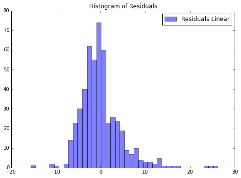
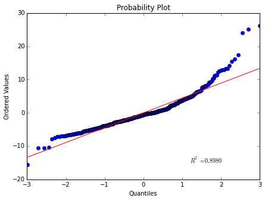
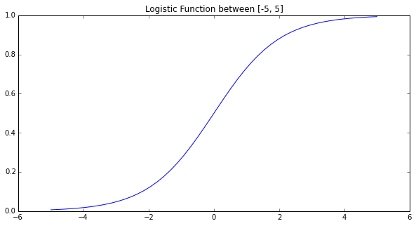
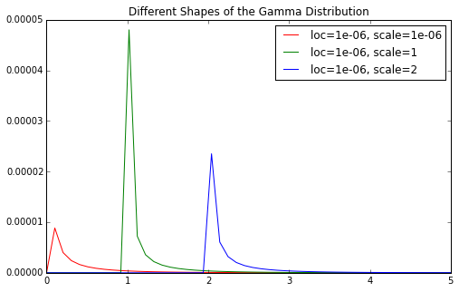
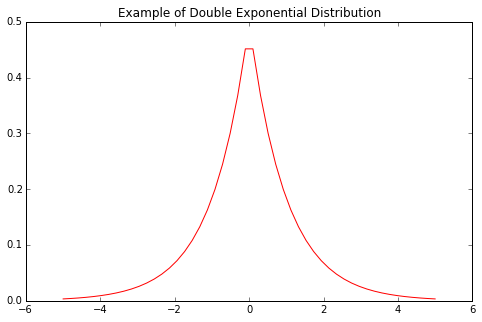
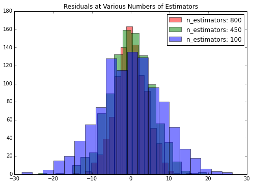

# 第二章 处理线性模型

> 作者：Trent Hauck

> 译者：[muxuezi](https://muxuezi.github.io/posts/2-working-with-linear-models.html)

> 协议：[CC BY-NC-SA 4.0](http://creativecommons.org/licenses/by-nc-sa/4.0/)


本章包括以下主题：
1. [线性回归模型](fitting-a-line-through-data.html)
1. [评估线性回归模型](evaluating-the-linear-regression-model.html)
1. [用岭回归弥补线性回归的不足](using-ridge-regression-to-overcome-linear-regression-shortfalls.html)
1. [优化岭回归参数](optimizing-the-ridge-regression-parameter.html)
1. [LASSO正则化](using-sparsity-to-regularize-models.html)
1. [LARS正则化](taking-a-more-fundamental-approach-to-regularization-with-lars.html)
1. [用线性方法处理分类问题——逻辑回归](using-linear-methods-for-classification-logistic-regression.html)
1. [贝叶斯岭回归](directly-applying-bayesian-ridge-regression.html)
1. [用梯度提升回归从误差中学习](using-boosting-to-learn-from-errors.html)

<!-- TEASER_END -->

##  简介

线性模型是统计学和机器学习的基础。很多方法都利用变量的线性组合描述数据之间的关系。通常都要花费很大精力做各种变换，目的就是为了让数据可以描述成一种线性组合形式。

本章，我们将从最简单的数据直线拟合模型到分类模型，最后介绍贝叶斯岭回归。

#  2.1 线性回归模型

现在，我们来做一些建模！我们从最简单的线性回归（Linear regression）开始。线性回归是最早的也是最基本的模型——把数据拟合成一条直线。

<!-- TEASER_END -->

## Getting ready

`boston`数据集很适合用来演示线性回归。`boston`数据集包含了波士顿地区的房屋价格中位数。还有一些可能会影响房价的因素，比如犯罪率（crime rate）。

首先，让我们加载数据：


```python
from sklearn import datasets
boston = datasets.load_boston()
```

## How to do it...

实际上，用scikit-learn的线性回归非常简单，其API和前面介绍的模型一样。

首先，导入`LinearRegression`类创建一个对象：


```python
from sklearn.linear_model import LinearRegression
lr = LinearRegression()
```

现在，再把自变量和因变量传给`LinearRegression`的`fit`方法：


```python
lr.fit(boston.data, boston.target)
```


    LinearRegression(copy_X=True, fit_intercept=True, n_jobs=1, normalize=False)

    

#  2.2 评估线性回归模型

 在这个主题中，我们将介绍回归模型拟合数据的效果。上一个主题我们拟合了数据，但是并没太关注拟合的效果。每当拟合工作做完之后，我们应该问的第一个问题就是“拟合的效果如何？”本主题将回答这个问题。

<!-- TEASER_END -->

## Getting ready

我们还用上一主题里的`lr`对象和`boston`数据集。`lr`对象已经拟合过数据，现在有许多方法可以用。


```python
from sklearn import datasets
boston = datasets.load_boston()
from sklearn.linear_model import LinearRegression
lr = LinearRegression()
lr.fit(boston.data, boston.target)
```


    LinearRegression(copy_X=True, fit_intercept=True, n_jobs=1, normalize=False)


```python
predictions = lr.predict(boston.data)
```

## How to do it...

我们可以看到一些简单的量度（metris）和图形。让我们看看上一章的残差图：


```python
%matplotlib inline
from matplotlib import pyplot as plt
f, ax = plt.subplots(figsize=(7, 5))
f.tight_layout()
ax.hist(boston.target - predictions,bins=40, label='Residuals Linear', color='b', alpha=.5);
ax.set_title("Histogram of Residuals")
ax.legend(loc='best');
```





如果你用IPython Notebook，就用`%matplotlib inline`命令在网页中显示matplotlib图形。如果你不用，就用`f.savefig('myfig.png')`保存图形，以备使用。

> 画图的库是[matplotlib](http://matplotlib.org/)，并非本书重点，但是可视化效果非常好。

和之前介绍的一样，误差项服从均值为0的正态分布。残差就是误差，所以这个图也应噶近似正态分布。看起来拟合挺好的，只是有点偏。我们计算一下残差的均值，应该很接近0：


```python
import numpy as np
np.mean(boston.target - predictions)
```


    6.0382090193051989e-16


另一个值得看的图是**Q-Q图（分位数概率分布）**，我们用Scipy来实现图形，因为它内置这个概率分布图的方法：


```python
from scipy.stats import probplot
f = plt.figure(figsize=(7, 5))
ax = f.add_subplot(111)
probplot(boston.target - predictions, plot=ax);
```





这个图里面倾斜的数据比之前看的要更清楚一些。

我们还可以观察拟合其他量度，最常用的还有均方误差（mean squared error，MSE），平均绝对误差（mean absolute deviation，MAD）。让我们用Python实现这两个量度。后面我们用scikit-learn内置的量度来评估回归模型的效果：


```python
def MSE(target, predictions):
    squared_deviation = np.power(target - predictions, 2)
    return np.mean(squared_deviation)
```


```python
MSE(boston.target, predictions)
```


    21.897779217687496


```python
def MAD(target, predictions):
    absolute_deviation = np.abs(target - predictions)
    return np.mean(absolute_deviation)
```


```python
MAD(boston.target, predictions)
```


    3.2729446379969396


## How it works...

MSE的计算公式是：

$$E(\hat y_t - y_i)^2$$

计算预测值与实际值的差，平方之后再求平均值。这其实就是我们寻找最佳相关系数时是目标。高斯－马尔可夫定理（Gauss-Markov theorem）实际上已经证明了线性回归的回归系数的最佳线性无偏估计（BLUE）就是最小均方误差的无偏估计（条件是误差变量不相关，0均值，同方差）。在**用岭回归弥补线性回归的不足**主题中，我们会看到，当我们的相关系数是有偏估计时会发生什么。

MAD是平均绝对误差，计算公式为：

$$E|\hat y_t - y_i|$$

线性回归的时候MAD通常不用，但是值得一看。为什么呢？可以看到每个量度的情况，还可以判断哪个量度更重要。例如，用MSE，较大的误差会获得更大的惩罚，因为平方把它放大。

### There's more...

还有一点需要说明，那就是相关系数是随机变量，因此它们是有分布的。让我们用bootstrapping（重复试验）来看看犯罪率的相关系数的分布情况。bootstrapping是一种学习参数估计不确定性的常用手段：


```python
n_bootstraps = 1000
len_boston = len(boston.target)
subsample_size = np.int(0.5*len_boston)
subsample = lambda: np.random.choice(np.arange(0, len_boston),size=subsample_size)
coefs = np.ones(n_bootstraps) #相关系数初始值设为1
for i in range(n_bootstraps):
    subsample_idx = subsample()
    subsample_X = boston.data[subsample_idx]
    subsample_y = boston.target[subsample_idx]
    lr.fit(subsample_X, subsample_y)
    coefs[i] = lr.coef_[0]
```

我们可以看到这个相关系数的分布直方图：


```python
f = plt.figure(figsize=(7, 5))
ax = f.add_subplot(111)
ax.hist(coefs, bins=50, color='b', alpha=.5)
ax.set_title("Histogram of the lr.coef_[0].");
```


我们还想看看重复试验后的置信区间：


```python
np.percentile(coefs, [2.5, 97.5])
```


    array([-0.18030624,  0.03816062])


置信区间的范围表面犯罪率其实不影响房价，因为0在置信区间里面，表面犯罪率可能与房价无关。

值得一提的是，bootstrapping可以获得更好的相关系数估计值，因为使用bootstrapping方法的均值，会比普通估计方法更快地**收敛（converge）**到真实均值。


#  2.3 用岭回归弥补线性回归的不足

本主题将介绍岭回归。和线性回归不同，它引入了正则化参数来“缩减”相关系数。当数据集中存在共线因素时，岭回归会很有用。

<!-- TEASER_END -->

## Getting ready

让我们加载一个不满秩（low effective rank）数据集来比较岭回归和线性回归。秩是矩阵线性无关组的数量，满秩是指一个$m \times n$矩阵中行向量或列向量中现行无关组的数量等于$min(m,n)$。

## How to do it...

首先我们用`make_regression`建一个有3个自变量的数据集，但是其秩为2，因此3个自变量中有两个自变量存在相关性。


```python
from sklearn.datasets import make_regression
reg_data, reg_target = make_regression(n_samples=2000, n_features=3, effective_rank=2, noise=10)
```

首先，我们用普通的线性回归拟合：


```python
import numpy as np
from sklearn.linear_model import LinearRegression
lr = LinearRegression()

def fit_2_regression(lr):
    n_bootstraps = 1000
    coefs = np.ones((n_bootstraps, 3))
    len_data = len(reg_data)
    subsample_size = np.int(0.75*len_data)
    subsample = lambda: np.random.choice(np.arange(0, len_data), size=subsample_size)

    for i in range(n_bootstraps):
        subsample_idx = subsample()
        subsample_X = reg_data[subsample_idx]
        subsample_y = reg_target[subsample_idx]
        lr.fit(subsample_X, subsample_y)
        coefs[i][0] = lr.coef_[0]
        coefs[i][1] = lr.coef_[1]
        coefs[i][2] = lr.coef_[2]
    %matplotlib inline
    import matplotlib.pyplot as plt
    f, axes = plt.subplots(nrows=3, sharey=True, sharex=True, figsize=(7, 5))
    f.tight_layout()

    for i, ax in enumerate(axes):
        ax.hist(coefs[:, i], color='b', alpha=.5)
        ax.set_title("Coef {}".format(i))
    return coefs

coefs = fit_2_regression(lr)
```


我们再用`Ridge`来拟合数据，对比结果：


```python
from sklearn.linear_model import Ridge
coefs_r = fit_2_regression(Ridge())
```


两个回归算法的结果看着好像差不多，其实不然。岭回归的系数更接近0。让我们看看两者系数的差异：


```python
np.mean(coefs - coefs_r, axis=0)
```


    array([ 30.54319761,  25.1726559 ,   7.40345307])


从均值上看，线性回归比岭回归的系数要大很多。均值显示的差异其实是线性回归的系数隐含的偏差。那么，岭回归究竟有什么好处呢？让我们再看看系数的方差：


```python
np.var(coefs, axis=0)
```


    array([ 302.16242654,  177.36842779,  179.33610289])


```python
np.var(coefs_r, axis=0)
```


    array([ 19.60727206,  25.4807605 ,  22.74202917])


岭回归的系数方差也会小很多。这就是机器学习里著名的偏差-方差均衡(Bias-Variance Trade-off)。下一个主题我们将介绍如何调整岭回归的参数正则化，那是偏差-方差均衡的核心内容。

## How it works...

介绍参数正则化之前，我们总结一下岭回归与线性回归的不同。前面介绍过，线性回归的目标是最小化
$
{\begin{Vmatrix}
\hat y - X \beta
\end{Vmatrix}}^2
$。

岭回归的目标是最小化
$
{\begin{Vmatrix}
\hat y - X \beta
\end{Vmatrix}}^2
+
{\begin{Vmatrix}
\Gamma X
\end{Vmatrix}}^2
$。

其中，$\Gamma$就是岭回归`Ridge`的`alpha`参数，指单位矩阵的倍数。上面的例子用的是默认值。我们可以看看岭回归参数：


```python
Ridge()
```


    Ridge(alpha=1.0, copy_X=True, fit_intercept=True, max_iter=None,
       normalize=False, solver='auto', tol=0.001)


岭回归系数的解是：
$$\beta = {(X^TX + \Gamma ^ T \Gamma)}^{-1}X \hat y$$

前面的一半和线性回归的系数的解是一样的，多了$\Gamma ^ T \Gamma)$一项。矩阵$A$的$AA^T$的结果是对称矩阵，且是半正定矩阵（对任意非0向量$x$，有$x^TAx \ge 0$）。相当于在线性回归的目标函数分母部分增加了一个很大的数。这样就把系数挤向0了。这样的解释比较粗糙，要深入了解，建议你看看SVD（矩阵奇异值分解）与岭回归的关系。


#  2.4 优化岭回归参数

当你使用岭回归模型进行建模时，需要考虑`Ridge`的`alpha`参数。

例如，用OLS（普通最小二乘法）做回归也许可以显示两个变量之间的某些关系；但是，当`alpha`参数正则化之后，那些关系就会消失。做决策时，这些关系是否需要考虑就显得很重要了。

<!-- TEASER_END -->

## Getting ready

这是我们第一个进行模型参数优化的主题，通常用交叉检验（cross validation）完成。在后面的主题中，还会有更简便的方式实现这些，但是这里我们一步一步来实现岭回归的优化。

在scikit-learn里面，岭回归的$\Gamma$参数就是`RidgeRegression`的`alpha`参数；因此，问题就是最优的`alpha`参数是什么。首先我们建立回归数据集：


```python
from sklearn.datasets import make_regression
reg_data, reg_target = make_regression(n_samples=100, n_features=2, effective_rank=1, noise=10)
```

## How to do it...

在`linear_models`模块中，有一个对象叫`RidgeCV`，表示**岭回归交叉检验（ridge cross-validation）**。这个交叉检验类似于**留一交叉验证法（leave-one-out cross-validation，LOOCV）**。这种方法是指训练数据时留一个样本，测试的时候用这个未被训练过的样本：


```python
import numpy as np
from sklearn.linear_model import RidgeCV
rcv = RidgeCV(alphas=np.array([.1, .2, .3, .4]))
rcv.fit(reg_data, reg_target)
```


    RidgeCV(alphas=array([ 0.1,  0.2,  0.3,  0.4]), cv=None, fit_intercept=True,
        gcv_mode=None, normalize=False, scoring=None, store_cv_values=False)


拟合模型之后，`alpha`参数就是最优参数：


```python
rcv.alpha_
```


    0.10000000000000001


这里，`0.1`是最优参数，我们还想看到`0.1`附近更精确的值：


```python
rcv = RidgeCV(alphas=np.array([.08, .09, .1, .11, .12]))
rcv.fit(reg_data, reg_target)
```


    RidgeCV(alphas=array([ 0.08,  0.09,  0.1 ,  0.11,  0.12]), cv=None,
        fit_intercept=True, gcv_mode=None, normalize=False, scoring=None,
        store_cv_values=False)


```python
rcv.alpha_
```


    0.080000000000000002


可以按照这个思路一直优化下去，这里只做演示，后面还是介绍更好的方法。

## How it works...

上面的演示很直接，但是我们介绍一下为什么这么做，以及哪个值才是最优的。在交叉检验的每一步里，模型的拟合效果都是用测试样本的误差表示。默认情况使用平方误差。更多细节见`There's more...`一节。

我们可以让`RidgeCV`储存交叉检验的数据，这样就可以可视化整个过程：


```python
alphas_to_test = np.linspace(0.0001, 0.05)
rcv3 = RidgeCV(alphas=alphas_to_test, store_cv_values=True)
rcv3.fit(reg_data, reg_target)
```


    RidgeCV(alphas=array([ 0.0001 ,  0.00112,  0.00214,  0.00316,  0.00417,  0.00519,
            0.00621,  0.00723,  0.00825,  0.00927,  0.01028,  0.0113 ,
            0.01232,  0.01334,  0.01436,  0.01538,  0.01639,  0.01741,
            0.01843,  0.01945,  0.02047,  0.02149,  0.0225 ,  0.02352,
            0.02454,  0.02556...4185,
            0.04287,  0.04389,  0.04491,  0.04593,  0.04694,  0.04796,
            0.04898,  0.05   ]),
        cv=None, fit_intercept=True, gcv_mode=None, normalize=False,
        scoring=None, store_cv_values=True)


你会看到，我们测试了0.0001到0.05区间中的50个点。由于我们把`store_cv_values`设置成`true`，我们可以看到每一个值对应的拟合效果：


```python
rcv3.cv_values_.shape
```


    (100, 50)


通过100个样本的回归数据集，我们获得了50个不同的`alpha`值。我们可以看到50个误差值，最小的均值误差对应最优的`alpha`值：


```python
smallest_idx = rcv3.cv_values_.mean(axis=0).argmin()
alphas_to_test[smallest_idx]
```


    0.014357142857142857


此时问题转化成了“RidgeCV认可我们的选择吗？”可以再用下面的命令获取`alpha`值：


```python
rcv3.alpha_
```


    0.014357142857142857


通过可视化图形可以更直观的显示出来。我们画出50个测试`alpha`值的图：


```python
%matplotlib inline
import matplotlib.pyplot as plt
f, ax = plt.subplots(figsize=(7, 5))
ax.set_title(r"Various values of $\alpha$")

xy = (alphas_to_test[smallest_idx], rcv3.cv_values_.mean(axis=0)[smallest_idx])
xytext = (xy[0] + .01, xy[1] + .1)

ax.annotate(r'Chosen $\alpha$', xy=xy, xytext=xytext,
            arrowprops=dict(facecolor='black', shrink=0, width=0)
            )
ax.plot(alphas_to_test, rcv3.cv_values_.mean(axis=0));
```


## There's more...

如果我们想用其他误差自定义评分函数，也是可以实现的。前面我们介绍过MAD误差，我们可以用它来评分。首先我们需要定义损失函数：


```python
def MAD(target, prediction):
    absolute_deviation = np.abs(target - prediction)
    return absolute_deviation.mean()
```

定义损失函数之后，我们用`sklearn`量度中的`make_scorer`函数来处理。这样做可以标准化自定义的函数，让scikit-learn对象可以使用它。另外，由于这是一个损失函数不是一个评分函数，是越低越好，所以要用`sklearn`来把最小化问题转化成最大化问题：


```python
import sklearn
MAD = sklearn.metrics.make_scorer(MAD, greater_is_better=False)
rcv4 = RidgeCV(alphas=alphas_to_test, store_cv_values=True, scoring=MAD)
rcv4.fit(reg_data, reg_target)
smallest_idx = rcv4.cv_values_.mean(axis=0).argmin()
alphas_to_test[smallest_idx]
```


    0.050000000000000003


    

#  2.5 LASSO正则化

LASSO（ least absolute shrinkage and selection operator，最小绝对值收缩和选择算子）方法与岭回归和LARS（least angle regression，最小角回归）很类似。与岭回归类似，它也是通过增加惩罚函数来判断、消除特征间的共线性。与LARS相似的是它也可以用作参数选择，通常得出一个相关系数的稀疏向量。

<!-- TEASER_END -->

## Getting ready

岭回归也不是万能药。有时就需要用LASSO回归来建模。本主题将用不同的损失函数，因此就要用对应的效果评估方法。

## How to do it...

首先，我们还是用`make_regression`函数来建立数据集：


```python
from sklearn.datasets import make_regression
reg_data, reg_target = make_regression(n_samples=200, n_features=500, n_informative=5, noise=5)
```

之后，我们导入`lasso`对象：


```python
from sklearn.linear_model import Lasso
lasso = Lasso()
```

`lasso`包含很多参数，但是最意思的参数是`alpha`，用来调整` lasso`的惩罚项，在**How it works...**会具体介绍。现在我们用默认值`1`。另外，和岭回归类似，如果设置为`0`，那么`lasso`就是线性回归：


```python
lasso.fit(reg_data, reg_target)
```


    Lasso(alpha=1.0, copy_X=True, fit_intercept=True, max_iter=1000,
       normalize=False, positive=False, precompute=False, random_state=None,
       selection='cyclic', tol=0.0001, warm_start=False)


再让我们看看还有多少相关系数非零：


```python
import numpy as np
np.sum(lasso.coef_ != 0)
```


    9


```python
lasso_0 = Lasso(0)
lasso_0.fit(reg_data, reg_target)
np.sum(lasso_0.coef_ != 0)
```

    d:\programfiles\Miniconda3\lib\site-packages\IPython\kernel\__main__.py:2: UserWarning: With alpha=0, this algorithm does not converge well. You are advised to use the LinearRegression estimator
      from IPython.kernel.zmq import kernelapp as app
    d:\programfiles\Miniconda3\lib\site-packages\sklearn\linear_model\coordinate_descent.py:432: UserWarning: Coordinate descent with alpha=0 may lead to unexpected results and is discouraged.
      positive)
    


    500


和我们设想的一样，如果用线性回归，没有一个相关系数变成0。而且，如果你这么运行代码，scikit-learn会给出建议，就像上面显示的那样。

## How it works...

对线性回归来说，我们是最小化残差平方和。而LASSO回归里，我们还是最小化残差平方和，但是加了一个惩罚项会导致稀疏。如下所示：

$$\sum {e_i + \lambda \
{\begin{Vmatrix}
\beta 
\end{Vmatrix}}_1}
$$

最小化残差平方和的另一种表达方式是：

$$ RSS(\beta),其中
{\begin{Vmatrix}
\beta 
\end{Vmatrix}}_1
\lt \beta
$$

这个约束会让数据稀疏。LASSO回归的约束创建了围绕原点的超立方体（相关系数是轴），也就意味着大多数点都在各个顶点上，那里相关系数为0。而岭回归创建的是超平面，因为其约束是L2范数，少一个约束，但是即使有限制相关系数也不会变成0。

### LASSO交叉检验

上面的公式中，选择适当的$\lambda$（在scikit-learn的`Lasso`里面是`alpha`，但是书上都是$\lambda$）参数是关键。我们可以自己设置，也可以通过交叉检验来获取最优参数：


```python
from sklearn.linear_model import LassoCV
lassocv = LassoCV()
lassocv.fit(reg_data, reg_target)
```


    LassoCV(alphas=None, copy_X=True, cv=None, eps=0.001, fit_intercept=True,
        max_iter=1000, n_alphas=100, n_jobs=1, normalize=False, positive=False,
        precompute='auto', random_state=None, selection='cyclic', tol=0.0001,
        verbose=False)


`lassocv`有一个属性就是确定最合适的$\lambda$：


```python
lassocv.alpha_
```


    0.58535963603062136


计算的相关系数也可以看到：


```python
lassocv.coef_[:5]
```


    array([ 0.       , -0.       ,  0.       ,  0.0192606, -0.       ])


用最近的参数拟合后，`lassocv`的非零相关系数有29个：


```python
np.sum(lassocv.coef_ != 0)
```


    29


### LASSO特征选择

LASSO通常用来为其他方法所特征选择。例如，你可能会用LASSO回归获取适当的特征变量，然后在其他算法中使用。

要获取想要的特征，需要创建一个非零相关系数的列向量，然后再其他算法拟合：


```python
mask = lassocv.coef_ != 0
new_reg_data = reg_data[:, mask]
new_reg_data.shape
```


    (200, 29)


#  2.6 LARS正则化

如果斯坦福大学的Bradley Efron, Trevor Hastie, Iain Johnstone和Robert Tibshirani没有发现它的话[1]，LARS(Least Angle Regression，最小角回归)可能有一天会被你想出来，它借用了[威廉·吉尔伯特·斯特朗（William Gilbert Strang）](https://en.wikipedia.org/wiki/Gilbert_Strang)介绍过的高斯消元法（Gaussian elimination）的灵感。

<!-- TEASER_END -->

##  Getting ready

LARS是一种回归手段，适用于解决高维问题，也就是$p >> n$的情况，其中$p$表示列或者特征变量，$n$表示样本数量。

##  How to do it...

首先让我们导入必要的对象。这里我们用的数据集是200个数据，500个特征。我们还设置了一个低噪声，和少量提供信息的（informative）特征：


```python
import numpy as np
from sklearn.datasets import make_regression
reg_data, reg_target = make_regression(n_samples=200,n_features=500, n_informative=10, noise=2)
```

由于我们用了10个信息特征，因此我们还要为LARS设置10个非0的相关系数。我们事先可能不知道信息特征的准确数量，但是出于试验的目的是可行的：


```python
from sklearn.linear_model import Lars
lars = Lars(n_nonzero_coefs=10)
lars.fit(reg_data, reg_target)
```


    Lars(copy_X=True, eps=2.2204460492503131e-16, fit_intercept=True,
       fit_path=True, n_nonzero_coefs=10, normalize=True, precompute='auto',
       verbose=False)


我们可以检验一下看看LARS的非0相关系数的和：


```python
np.sum(lars.coef_ != 0)
```


    10


问题在于为什么少量的特征反而变得更加有效。要证明这一点，让我们用一半数量来训练两个LARS模型，一个用12个非零相关系数，另一个非零相关系数用默认值。这里用12个是因为我们对重要特征的数量有个估计，但是可能无法确定准确的数量：


```python
train_n = 100
lars_12 = Lars(n_nonzero_coefs=12)
lars_12.fit(reg_data[:train_n], reg_target[:train_n])
```


    Lars(copy_X=True, eps=2.2204460492503131e-16, fit_intercept=True,
       fit_path=True, n_nonzero_coefs=12, normalize=True, precompute='auto',
       verbose=False)


```python
lars_500 = Lars() #默认就是500
lars_500.fit(reg_data[:train_n], reg_target[:train_n])
```


    Lars(copy_X=True, eps=2.2204460492503131e-16, fit_intercept=True,
       fit_path=True, n_nonzero_coefs=500, normalize=True, precompute='auto',
       verbose=False)


现在，让我们看看拟合数据的效果如何，如下所示：


```python
np.mean(np.power(reg_target[train_n:] - lars.predict(reg_data[train_n:]), 2))
```


    18.607806437043894


```python
np.mean(np.power(reg_target[train_n:] - lars_12.predict(reg_data[train_n:]), 2))
```


    529.97993250189643


```python
np.mean(np.power(reg_target[train_n:] - lars_500.predict(reg_data[train_n:]), 2))
```


    2.3236770314162846e+34


仔细看看这组结果；测试集的误差明显高很多。高维数据集问题就在于此；通常面对大量的特征时，想找出一个对训练集拟合很好的模型并不难，但是拟合过度却是更大的问题。

##  How it works...

LARS通过重复选择与残存变化相关的特征。从图上看，相关性实际上就是特征与残差之间的最小角度；这就是LARS名称的由来。

选择第一个特征之后，LARS会继续沿着最小角的方向移动，直到另一个特征与残差有同样数量的相关性。然后，LARS会沿着两个特征组合的角度移动。如下图所示：


```python
%matplotlib inline
import matplotlib.pyplot as plt
def unit(*args):
    squared = map(lambda x: x**2, args)
    distance = sum(squared) ** (.5)
    return map(lambda x: x / distance, args)

f, ax = plt.subplots(nrows=3, figsize=(5, 10))
plt.tight_layout()
ax[0].set_ylim(0, 1.1)
ax[0].set_xlim(0, 1.1)

x, y = unit(1, 0.02)
ax[0].arrow(0, 0, x, y, edgecolor='black', facecolor='black')
ax[0].text(x + .05, y + .05, r"$x_1$")

x, y = unit(.5, 1)
ax[0].arrow(0, 0, x, y, edgecolor='black', facecolor='black')
ax[0].text(x + .05, y + .05, r"$x_2$")

x, y = unit(1, .45)
ax[0].arrow(0, 0, x, y, edgecolor='black', facecolor='black')
ax[0].text(x + .05, y + .05, r"$y$")

ax[0].set_title("No steps")

# step 1
ax[1].set_title("Step 1")
ax[1].set_ylim(0, 1.1)
ax[1].set_xlim(0, 1.1)

x, y = unit(1, 0.02)
ax[1].arrow(0, 0, x, y, edgecolor='black', facecolor='black')
ax[1].text(x + .05, y + .05, r"$x_1$")

x, y = unit(.5, 1)
ax[1].arrow(0, 0, x, y, edgecolor='black', facecolor='black')
ax[1].text(x + .05, y + .05, r"$x_2$")

x, y = unit(.5, 1)
ax[1].arrow(.5, 0.01, x, y, ls='dashed', edgecolor='black', facecolor='black')
ax[1].text(x + .5 + .05, y + .01 + .05, r"$x_2$")

ax[1].arrow(0, 0, .47, .01, width=.0015, edgecolor='black', facecolor='black')
ax[1].text(.47-.15, .01 + .03, "Step 1")

x, y = unit(1, .45)
ax[1].arrow(0, 0, x, y, edgecolor='black', facecolor='black')
ax[1].text(x + .05, y + .05, r"$y$")

# step 2
ax[2].set_title("Step 2")
ax[2].set_ylim(0, 1.1)
ax[2].set_xlim(0, 1.1)

x, y = unit(1, 0.02)
ax[2].arrow(0, 0, x, y, edgecolor='black', facecolor='black')
ax[2].text(x + .05, y + .05, r"$x_1$")

x, y = unit(.5, 1)
ax[2].arrow(0, 0, x, y, edgecolor='black', facecolor='black')
ax[2].text(x + .05, y + .05, r"$x_2$")

x, y = unit(.5, 1)
ax[2].arrow(.5, 0.01, x, y, ls='dashed', edgecolor='black', facecolor='black')
ax[2].text(x + .5 + .05, y + .01 + .05, r"$x_2$")

ax[2].arrow(0, 0, .47, .01, width=.0015, edgecolor='black', facecolor='black')
ax[2].text(.47-.15, .01 + .03, "Step 1")

##  step 2
x, y = unit(1, .45)
ax[2].arrow(.5, .02, .4, .35, width=.0015, edgecolor='black', facecolor='black')
ax[2].text(x, y - .1, "Step 2")

x, y = unit(1, .45)
ax[2].arrow(0, 0, x, y, edgecolor='black', facecolor='black')
ax[2].text(x + .05, y + .05, r"$y$");
```


具体过程是，我们把$x2$沿着$x1$方向移动到一个位置：$x1$与$y$的点积与$x1$与$y$的点积相同。到了这个位置之后，我们再沿着$x1$和$x2$夹角的一半的方向移动。

##  There's more...

和我们前面用交叉检验来优化领回归模型一样，我们可以对LARS做交叉检验：


```python
from sklearn.linear_model import LarsCV
lcv = LarsCV()
lcv.fit(reg_data, reg_target)
```

    d:\Miniconda3\lib\site-packages\sklearn\linear_model\least_angle.py:285: ConvergenceWarning: Regressors in active set degenerate. Dropping a regressor, after 168 iterations, i.e. alpha=2.278e-02, with an active set of 132 regressors, and the smallest cholesky pivot element being 6.144e-08
      ConvergenceWarning)
    d:\Miniconda3\lib\site-packages\sklearn\linear_model\least_angle.py:285: ConvergenceWarning: Regressors in active set degenerate. Dropping a regressor, after 168 iterations, i.e. alpha=2.105e-02, with an active set of 132 regressors, and the smallest cholesky pivot element being 9.771e-08
      ConvergenceWarning)
    


    LarsCV(copy_X=True, cv=None, eps=2.2204460492503131e-16, fit_intercept=True,
        max_iter=500, max_n_alphas=1000, n_jobs=1, normalize=True,
        precompute='auto', verbose=False)


用交叉检验可以帮助我们确定需要使用的非零相关系数的最佳数量。验证如下所示：


```python
np.sum(lcv.coef_ != 0)
```


    43


说实话，LARS的精髓还没有领会，抽空会把原文译出来，看各种解释不如看原文。

[1] Efron, Bradley; Hastie, Trevor; Johnstone, Iain and Tibshirani, Robert(2004). "[Least Angle Regression](https://www.google.com/url?sa=t&rct=j&q=&esrc=s&source=web&cd=1&cad=rja&uact=8&ved=0CB4QFjAAahUKEwjJ3I3ljbDHAhWJlYgKHU2iApA&url=http%3A%2F%2Fweb.stanford.edu%2F~hastie%2FPapers%2FLARS%2FLeastAngle_2002.pdf&ei=ItLRVcnDEImrogTNxIqACQ&usg=AFQjCNFDP4Zjp-cPndzpNhq_8WOwrrui7g&sig2=eNxVG-ZIjnsme93zOTFROw&bvm=bv.99804247,d.cGU)". Annals of Statistics 32(2): pp. 407–499.doi:10.1214/009053604000000067. MR 2060166.


#  2.7 用线性方法处理分类问题——逻辑回归

实际上线性模型也可以用于分类任务。方法是把一个线性模型拟合成某个类型的概率分布，然后用一个函数建立阈值来确定结果属于哪一类。

<!-- TEASER_END -->

##  Getting ready

这里用的函数是经典的逻辑函数。一个非常简单的函数：

$$f(x)= \frac 1 {1+e^{-t}}$$

它的图形如下图所示：


```python
import numpy as np
%matplotlib inline
import matplotlib.pyplot as plt
f, ax = plt.subplots(figsize=(10, 5))
rng = np.linspace(-5, 5)
log_f = np.apply_along_axis(lambda x:1 / (1 + np.exp(-x)), 0, rng)
ax.set_title("Logistic Function between [-5, 5]")
ax.plot(rng, log_f);
```





让我们用`make_classification`方法创建一个数据集来进行分类：


```python
from sklearn.datasets import make_classification
X, y = make_classification(n_samples=1000, n_features=4)
```

##  How to do it...

`LogisticRegression`对象和其他线性模型的用法一样：


```python
from sklearn.linear_model import LogisticRegression
lr = LogisticRegression()
```

我们将把前面200个数据作为训练集，最后200个数据作为测试集。因为这是随机数据集，所以用最后200个数据没问题。但是如果处理具有某种结构的数据，就不能这么做了（例如，你的数据集是时间序列数据）：


```python
X_train = X[:-200]
X_test = X[-200:]
y_train = y[:-200]
y_test = y[-200:]
```

在本书后面的内容里，我们将详细介绍交叉检验。这里，我们需要的只是用逻辑回归拟合模型。我们会关注训练集的预测结果，就像测试集预测结果一样。经常对比两个数据集预测正确率是个好做法。通常，你在训练集获得的结果更好；模型在测试集上预测失败的比例也至关重要：


```python
lr.fit(X_train, y_train)
y_train_predictions = lr.predict(X_train)
y_test_predictions = lr.predict(X_test)
```

现在我们有了预测值，让我们看看预测的效果。这里，我们只简单看看预测正确的比例；后面，我们会详细的介绍分类模型效果的评估方法。

计算很简单，就是用预测正确的数量除以总样本数：


```python
(y_train_predictions == y_train).sum().astype(float) / y_train.shape[0]
```


    0.89375000000000004


测试集的效果是：


```python
(y_test_predictions == y_test).sum().astype(float) / y_test.shape[0]
```


    0.90500000000000003


可以看到，测试集的正确率和训练集的结果差不多。但是实际中通常差别很大。

现在问题变成，怎么把逻辑函数转换成分类方法。

首先，线性回归希望找到一个线性方程拟合出给定自变量$X$条件下因变量$Y$的期望值，就是$E(Y|X)=x \beta$。这里$Y$的值是某个类型发生的概率。因此，我们要解决的分类问题就是$E(p|X)=x \beta$。然后，只要阈值确定，就会有$Logit(p) = X \beta$。这个理念的扩展形式可以构成许多形式的回归行为，例如，泊松过程（Poisson）。

##  There's more...

下面的内容你以后肯定会遇到。一种情况是一个类型与其他类型的权重不同；例如，一个能可能权重很大，99%。这种情况在分类工作中经常遇到。经典案例就是信用卡虚假交易检测，大多数交易都不是虚假交易，但是不同类型误判的成本相差很大。

让我们建立一个分类问题，类型$y$的不平衡权重95%，我们看看基本的逻辑回归模型如何处理这类问题：


```python
X, y = make_classification(n_samples=5000, n_features=4, weights=[.95])
sum(y) / (len(y)*1.) #检查不平衡的类型
```


    0.0562


建立训练集和测试集，然后用逻辑回归拟合：


```python
X_train = X[:-500]
X_test = X[-500:]
y_train = y[:-500]
y_test = y[-500:]

lr.fit(X_train, y_train)
y_train_predictions = lr.predict(X_train)
y_test_predictions = lr.predict(X_test)
```

现在我们在看看模型拟合的情况：


```python
(y_train_predictions == y_train).sum().astype(float) / y_train.shape[0]
```


    0.96711111111111114


```python
(y_test_predictions == y_test).sum().astype(float) / y_test.shape[0]
```


    0.96799999999999997


结果看着还不错，但这是说如果我们把一个交易预测成正常交易（或者称为类型0），那么我们有95%左右的可能猜对。如果我们想看看模型对类型1的预测情况，可能就不是那么好了：


```python
(y_test[y_test==1] == y_test_predictions[y_test==1]).sum().astype(float) / y_test[y_test==1].shape[0]
```


    0.5


如果相比正常交易，我们更关心虚假交易；那么这是由商业规则决定的，我们可能会改变预测正确和预测错误的权重。

通常情况下，虚假交易与正常交易的权重与训练集的类型权重的倒数一致。但是，因为我们更关心虚假交易，所有让我们用多重采样（oversample）方法来表示虚假交易与正常交易的权重。


```python
lr = LogisticRegression(class_weight={0: .15, 1: .85})
lr.fit(X_train, y_train)
```


    LogisticRegression(C=1.0, class_weight={0: 0.15, 1: 0.85}, dual=False,
              fit_intercept=True, intercept_scaling=1, max_iter=100,
              multi_class='ovr', penalty='l2', random_state=None,
              solver='liblinear', tol=0.0001, verbose=0)


让我们再预测一下结果：


```python
y_train_predictions = lr.predict(X_train)
y_test_predictions = lr.predict(X_test)
```


```python
(y_test[y_test==1] == y_test_predictions[y_test==1]).sum().astype(float) / y_test[y_test==1].shape[0]
```


    0.70833333333333337


但是，这么做需要付出什么代价？让我们看看：


```python
(y_test_predictions == y_test).sum().astype(float) / y_test.shape[0]
```


    0.93999999999999995


可以看到，准确率降低了3%。这样是否合适由你的问题决定。如果与虚假交易相关的评估成本非常高，那么它就能抵消追踪虚假交易付出的成本。


#  2.8 贝叶斯岭回归

在*用岭回归弥补线性回归的不足*主题中，我们介绍了岭回归优化的限制条件。我们还介绍了相关系数的先验概率分布的贝叶斯解释，将很大程度地影响着先验概率分布，先验概率分布通常均值是0。

因此，现在我们就来演示如何scikit-learn来应用这种解释。

<!-- TEASER_END -->

## Getting ready

岭回归和套索回归（lasso regression）用贝叶斯观点来解释，与频率优化观点解释相反。scikit-learn只实现了贝叶斯岭回归，但是在*How it works...*一节，我们将对比两种回归算法。

首先，我们创建一个回归数据集：


```python
from sklearn.datasets import make_regression
X, y = make_regression(1000, 10, n_informative=2, noise=20)
```

## How to do it...

我们可以把岭回归加载进来拟合模型：


```python
from sklearn.linear_model import BayesianRidge
br = BayesianRidge()
```

有两组相关系数，分别是`alpha_1 / alpha_2`和`lambda_1 / lambda_2`。其中，`alpha_*`是先验概率分布的$\alpha$超参数，`lambda_*`是先验概率分布的$\lambda$超参数。

首先，让我们不调整参数直接拟合模型：


```python
br.fit(X, y)
br.coef_
```


    array([ -1.39241213,   0.14671513,  -0.08150797,  37.50250891,
             0.21850082,  -0.78482779,  -0.26717555,  -0.71319956,
             0.7926308 ,   5.74658302])


现在，我们来调整超参数，注意观察相关系数的变化：


```python
br_alphas = BayesianRidge(alpha_1=10, lambda_1=10)
br_alphas.fit(X, y)
br_alphas.coef_
```


    array([ -1.38807423,   0.14050794,  -0.08309391,  37.3032803 ,
             0.2254332 ,  -0.77031801,  -0.27005478,  -0.71632657,
             0.78501276,   5.71928608])


## How it works...

因为是贝叶斯岭回归，我们假设先验概率分布带有误差和$\alpha$参数，先验概率分布都服从$\Gamma$分布。

$\Gamma$分布是一种极具灵活性的分布。不同的形状参数和尺度参数的$\Gamma$分布形状有差异。**1e-06**是 scikit-learn里面`BayesianRidge`形状参数的默认参数值。


```python
import matplotlib.pyplot as plt
%matplotlib inline

from scipy.stats import gamma
import numpy as np

form = lambda x, y: "loc={}, scale={}".format(x, y)
g = lambda x, y=1e-06, z=1e-06: gamma.pdf(x, y, z)
g2 = lambda x, y=1e-06, z=1: gamma.pdf(x, y, z)
g3 = lambda x, y=1e-06, z=2: gamma.pdf(x, y, z)
rng = np.linspace(0, 5)
f, ax = plt.subplots(figsize=(8, 5))

ax.plot(rng, list(map(g, rng)), label=form(1e-06, 1e-06), color='r')
ax.plot(rng, list(map(g2, rng)), label=form(1e-06, 1), color='g')
ax.plot(rng, list(map(g3, rng)), label=form(1e-06, 2), color='b')
ax.set_title("Different Shapes of the Gamma Distribution")
ax.legend();
```





你会看到，相关系数最终都会收缩到0，尤其当形状参数特别小的时候。

### There's more...

就像我前面介绍的，还有一种套索回归的贝叶斯解释。我们把先验概率分布看出是相关系数的函数；它们本身都是随机数。对于套索回归，我们选择一个可以产生0的分布，比如双指数分布（Double Exponential Distribution，也叫Laplace distribution）。


```python
from scipy.stats import laplace
form = lambda x, y: "loc={}, scale={}".format(x, y)
g = lambda x: laplace.pdf(x)
rng = np.linspace(-5, 5)
f, ax = plt.subplots(figsize=(8, 5))

ax.plot(rng, list(map(g, rng)), color='r')
ax.set_title("Example of Double Exponential Distribution");
```





留意看x轴为0处的顶点。这将会使套索回归的相关系数为0。通过调整超参数，还有可能创建出相关系数为0的情况，这由问题的具体情况决定。


#  2.9 用梯度提升回归从误差中学习

梯度提升回归（Gradient boosting regression，GBR）是一种从它的错误中进行学习的技术。它本质上就是集思广益，集成一堆较差的学习算法进行学习。有两点需要注意：
- 每个学习算法准备率都不高，但是它们集成起来可以获得很好的准确率。
- 这些学习算法依次应用，也就是说每个学习算法都是在前一个学习算法的错误中学习

<!-- TEASER_END -->

## Getting ready

我们还是用基本的回归数据来演示GBR：


```python
import numpy as np
from sklearn.datasets import make_regression
X, y = make_regression(1000, 2, noise=10)
```

## How to do it...

GBR算是一种集成模型因为它是一个集成学习算法。这种称谓的含义是指GBR用许多较差的学习算法组成了一个更强大的学习算法：


```python
from sklearn.ensemble import GradientBoostingRegressor as GBR
gbr = GBR()
gbr.fit(X, y)
gbr_preds = gbr.predict(X)
```

很明显，这里应该不止一个模型，但是这种模式现在很简明。现在，让我们用基本回归算法来拟合数据当作参照：


```python
from sklearn.linear_model import LinearRegression
lr = LinearRegression()
lr.fit(X, y)
lr_preds = lr.predict(X)
```

有了参照之后，让我们看看GBR算法与线性回归算法效果的对比情况。图像生成可以参照第一章正态随机过程的相关主题，首先需要下面的计算：


```python
gbr_residuals = y - gbr_preds
lr_residuals = y - lr_preds
```


```python
%matplotlib inline
from matplotlib import pyplot as plt
```


```python
f, ax = plt.subplots(figsize=(7, 5))
f.tight_layout()
ax.hist(gbr_residuals,bins=20,label='GBR Residuals', color='b', alpha=.5);
ax.hist(lr_residuals,bins=20,label='LR Residuals', color='r', alpha=.5);
ax.set_title("GBR Residuals vs LR Residuals")
ax.legend(loc='best');
```


看起来好像GBR拟合的更好，但是并不明显。让我们用95%置信区间（Confidence interval,CI）对比一下：


```python
np.percentile(gbr_residuals, [2.5, 97.5])
```


    array([-16.73937398,  15.96258406])


```python
np.percentile(lr_residuals, [2.5, 97.5])
```


    array([-19.03378242,  19.45950191])


GBR的置信区间更小，数据更集中，因此其拟合效果更好；我们还可以对GBR算法进行一些调整来改善效果。我用下面的例子演示一下，然后在下一节介绍优化方法：


```python
n_estimators = np.arange(100, 1100, 350)
gbrs = [GBR(n_estimators=n_estimator) for n_estimator in n_estimators]
residuals = {}
for i, gbr in enumerate(gbrs):
    gbr.fit(X, y)
    residuals[gbr.n_estimators] = y - gbr.predict(X)
```


```python
f, ax = plt.subplots(figsize=(7, 5))
f.tight_layout()
colors = {800:'r', 450:'g', 100:'b'}
for k, v in residuals.items():
    ax.hist(v,bins=20,label='n_estimators: %d' % k, color=colors[k], alpha=.5);
ax.set_title("Residuals at Various Numbers of Estimators")
ax.legend(loc='best');
```





图像看着有点混乱，但是依然可以看出随着估计器数据的增加，误差在减少。不过，这并不是一成不变的。首先，我们没有交叉检验过，其次，随着估计器数量的增加，训练时间也会变长。现在我们用数据比较小没什么关系，但是如果数据再放大一两倍问题就出来了。

## How it works...

上面例子中GBR的第一个参数是`n_estimators`，指GBR使用的学习算法的数量。通常，如果你的设备性能更好，可以把`n_estimators`设置的更大，效果也会更好。还有另外几个参数要说明一下。

你应该在优化其他参数之前先调整`max_depth`参数。因为每个学习算法都是一颗决策树，`max_depth`决定了树生成的节点数。选择合适的节点数量可以更好的拟合数据，而更多的节点数可能造成拟合过度。

`loss`参数决定损失函数，也直接影响误差。`ls`是默认值，表示最小二乘法（least squares）。还有最小绝对值差值，Huber损失和分位数损失（quantiles）等等。
