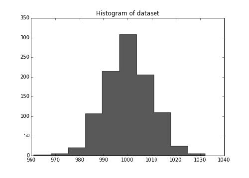
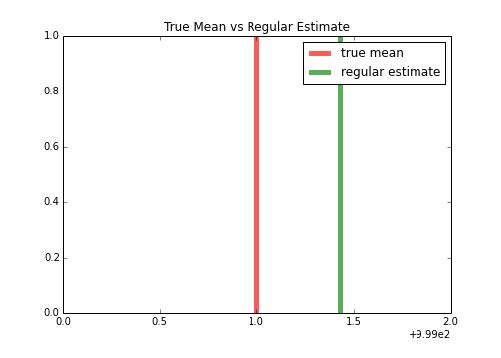
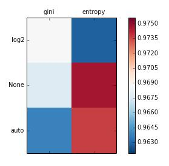
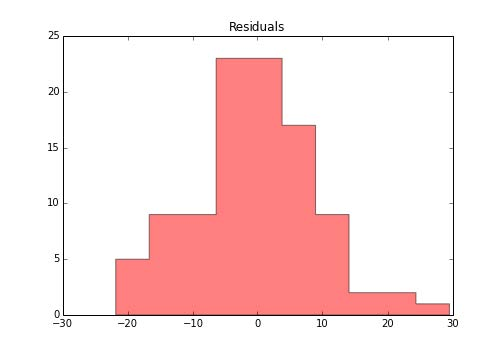

# 第五章 模型后处理

> 作者：Trent Hauck

> 译者：[飞龙](https://github.com/wizardforcel)

> 协议：[CC BY-NC-SA 4.0](http://creativecommons.org/licenses/by-nc-sa/4.0/)

## 5.1 K-fold 交叉验证

这个秘籍中，我们会创建交叉验证，它可能是最重要的模型后处理验证练习。我们会在这个秘籍中讨论 k-fold 交叉验证。有几种交叉验证的种类，每个都有不同的随机化模式。K-fold 可能是一种最熟知的随机化模式。

### 准备

我们会创建一些数据集，之后在不同的在不同的折叠上面训练分类器。值得注意的是，如果你可以保留一部分数据，那是最好的。例如，我们拥有`N = 1000`的数据集，如果我们保留 200 个数据点，之后使用其他 800 个数据点之间的交叉验证，来判断最佳参数。

### 工作原理

首先，我们会创建一些伪造数据，之后测试参数，最后，我们会看看结果数据集的大小。

```py
>>> N = 1000  
>>> holdout = 200
>>> from sklearn.datasets import make_regression 
>>> X, y = make_regression(1000, shuffle=True) 
```

既然我们拥有了数据，让我们保留 200 个点，之后处理折叠模式。


```py
>>> X_h, y_h = X[:holdout], y[:holdout] 
>>> X_t, y_t = X[holdout:], y[holdout:]
>>> from sklearn.cross_validation import KFold 
```

K-fold 给了我们一些选项，来选择我们想要多少个折叠，是否让值为下标或者布尔值，是否打算打乱数据集，最后是随机状态（主要出于再现性）。下标实际上会在之后的版本中溢出。假设它为`True`。

让我们创建交叉验证对象：


```py
>>> kfold = KFold(len(y_t), n_folds=4) 
```

现在，我们可以迭代 k-fold 对象：

```py
>>> output_string = "Fold: {}, N_train: {}, N_test: {}"

>>> for i, (train, test) in enumerate(kfold):
        print output_string.format(i, len(y_t[train]), len(y_t[test]))
        
Fold: 0, N_train: 600, N_test: 200 
Fold: 1, N_train: 600, N_test: 200 
Fold: 2, N_train: 600, N_test: 200 
Fold: 3, N_train: 600, N_test: 200
```

每个迭代都应该返回相同的分割大小。

### 工作原理

可能很清楚，但是 k-fold 的原理是迭代折叠，并保留` 1/n_folds * N`个数据，其中`N`是我们的`len(y_t)`。

从 Python 的角度看，交叉验证对象拥有一个迭代器，可以通过`in`运算符来访问。通常，对于编写交叉验证对象的包装器来说比较实用，它会迭代数据的子集。例如我们可能拥有一个数据集，它拥有数据点的重复度量，或者我们可能拥有一个病人的数据集，每个病人都拥有度量。

我们打算将它们组合起来，并对其使用 Pandas。

```py
>>> import numpy as np 
>>> import pandas as pd

>>> patients = np.repeat(np.arange(0, 100, dtype=np.int8), 8)

>>> measurements = pd.DataFrame({'patient_id': patients,
                   'ys': np.random.normal(0, 1, 800)}) 
```
既然我们拥有了数据，我们仅仅打算保留特定的顾客，而不是数据点。

```
>>> custids = np.unique(measurements.patient_id) 
>>> customer_kfold = KFold(custids.size, n_folds=4)

>>> output_string = "Fold: {}, N_train: {}, N_test: {}"

>>> for i, (train, test) in enumerate(customer_kfold):
        train_cust_ids = custids[train]
        training = measurements[measurements.patient_id.isin(
                   train_cust_ids)]
        testing = measurements[~measurements.patient_id.isin(
                   train_cust_ids)]

        print output_string.format(i, len(training), len(testing))

Fold: 0, N_train: 600, N_test: 200 
Fold: 1, N_train: 600, N_test: 200 
Fold: 2, N_train: 600, N_test: 200 
Fold: 3, N_train: 600, N_test: 200 
```

## 5.2 自动化交叉验证

我们会查看如何使用 Sklearn 自带的交叉验证，但是我们也可以使用一个辅助函数，来自动化执行交叉验证。这类似于 Sklearn 中其它对象，如何被辅助函数和流水线包装。

### 准备

首先，我们需要创建样例分类器，它可以是任何东西，决策树、随机森林，以及其他。对我们来说，它是随机森林。我们之后会创建数据集，并使用交叉验证函数。

### 工作原理

首先导入`ensemble `模块来开始：

```py
>>> from sklearn import ensemble 
>>> rf = ensemble.RandomForestRegressor(max_features='auto')
```

好的，所以现在，让我们创建一些回归数据：

```py
>>> from sklearn import datasets 
>>> X, y = datasets.make_regression(10000, 10)
```

既然我们拥有了数据，我们可以导入`cross_validation`模块，并获取我们将要使用的函数：

```py
>>> from sklearn import cross_validation

>>> scores = cross_validation.cross_val_score(rf, X, y)

>>> print scores
[ 0.86823874  0.86763225  0.86986129]
```

## 工作原理

很大程度上，它会委托给交叉验证对象。一个不错的事情是，函数会并行处理交叉验证。

我们可开启详细模式：

```py
>>> scores = cross_validation.cross_val_score(rf, X, y, verbose=3,
             cv=4)
             
[CV] no parameters to be set 
[CV] no parameters to be set, score=0.872866 -   0.7s 
[CV] no parameters to be set 
[CV] no parameters to be set, score=0.873679 -   0.6s 
[CV] no parameters to be set 
[CV] no parameters to be set, score=0.878018 -   0.7s 
[CV] no parameters to be set 
[CV] no parameters to be set, score=0.871598 -   0.6s

[Parallel(n_jobs=1)]: Done   1 jobs       | elapsed:    0.7s 
[Parallel(n_jobs=1)]: Done   4 out of   4 | elapsed:    2.6s finished 
```

我们可以看到，在每次迭代中，我们都调用函数来获得得分。我们也知道了模型如何运行。

同样值得了解是的，我们可以对我们尝试拟合的模型，获取预测得分。我们也会讨论如何创建你自己的评分函数。

## 5.3 使用 ShuffleSplit 交叉验证

`ShuffleSplit`是最简单的交叉验证技巧之一。这个交叉验证技巧只是将数据的样本用于指定的迭代数量。

### 准备

`ShuffleSplit`是另一个简单的交叉验证技巧。我们会指定数据集中的总元素，并且它会考虑剩余部分。我们会浏览一个例子，估计单变量数据集的均值。这有点类似于重采样，但是它说明了一个原因，为什么我们在展示交叉验证的时候使用交叉验证。

### 操作步骤

首先，我们需要创建数据集。我们使用 NumPy 来创建数据集，其中我们知道底层的均值。我们会对半个数据集采样，来估计均值，并看看它和底层的均值有多接近。

```py
>>> import numpy as np

>>> true_loc = 1000 
>>> true_scale = 10 
>>> N = 1000

>>> dataset = np.random.normal(true_loc, true_scale, N)

>>> import matplotlib.pyplot as plt

>>> f, ax = plt.subplots(figsize=(7, 5))

>>> ax.hist(dataset, color='k', alpha=.65, histtype='stepfilled'); 
>>> ax.set_title("Histogram of dataset");

>>> f.savefig("978-1-78398-948-5_06_06.png") 
```

NumPy 输出如下：



现在，让我们截取前一半数据集，并猜测均值：

```py
>>> from sklearn import cross_validation

>>> holdout_set = dataset[:500] 
>>> fitting_set = dataset[500:]

>>> estimate = fitting_set[:N/2].mean()

>>> import matplotlib.pyplot as plt

>>> f, ax = plt.subplots(figsize=(7, 5))

>>> ax.set_title("True Mean vs Regular Estimate")

>>> ax.vlines(true_loc, 0, 1, color='r', linestyles='-', lw=5,
              alpha=.65, label='true mean') 
>>> ax.vlines(estimate, 0, 1, color='g', linestyles='-', lw=5,
              alpha=.65, label='regular estimate')

>>> ax.set_xlim(999, 1001)

>>> ax.legend()

>>> f.savefig("978-1-78398-948-5_06_07.png") 
```

输出如下：



现在，我们可以使用`ShuffleSplit `在多个相似的数据集上拟合估计值。

```py

>>> from sklearn.cross_validation import ShuffleSplit

>>> shuffle_split = ShuffleSplit(len(fitting_set))

>>> mean_p = []

>>> for train, _ in shuffle_split:
        mean_p.append(fitting_set[train].mean())
        shuf_estimate = np.mean(mean_p)

>>> import matplotlib.pyplot as plt

>>> f, ax = plt.subplots(figsize=(7, 5))

>>> ax.vlines(true_loc, 0, 1, color='r', linestyles='-', lw=5,
              alpha=.65, label='true mean') 
>>> ax.vlines(estimate, 0, 1, color='g', linestyles='-', lw=5,
              alpha=.65, label='regular estimate') 
>>> ax.vlines(shuf_estimate, 0, 1, color='b', linestyles='-', lw=5,
              alpha=.65, label='shufflesplit estimate')

>>> ax.set_title("All Estimates") 
>>> ax.set_xlim(999, 1001)

>>> ax.legend(loc=3)
```

输出如下：


我们可以看到，我们得到了类似于预期的估计值，但是我们可能使用多个样本来获取该值。

## 5.4 分层的 k-fold

这个秘籍中，我们会快速查看分层的 k-fold 估值。我们会浏览不同的秘籍，其中分类的表示在某种程度上是不平衡的。分层的 k-fold 非常不错，因为他的模式特地为维持分类的比例而设计。

### 准备

我们打算创建一个小型的数据集。这个数据集中，我们随后会使用分层的 k-fold 验证。我们想让它尽可能小，以便我们查看变化。对于更大的样本，可能并不是特别好。

我们之后会绘制每一步的分类比例，来展示如何维护分类比例。

```py
>>> from sklearn import datasets 
>>> X, y = datasets.make_classification(n_samples=int(1e3),
           weights=[1./11])

```

让我们检查分类的总体权重分布：

```py
>>> y.mean()
0.90300000000000002
```

90.5% 的样本都是 1，其余为 0。

### 操作步骤

让我们创建分层 k-fold 对象，并通过每个折叠来迭代。我们会度量为 1 的`verse `比例。之后，我们会通过分割数字来绘制分类比例，来看看是否以及如何发生变化。这个代码展示了为什么它非常好。我们也会对基本的`ShuffleSplit`绘制这个代码。

```py
>>> from sklearn import cross_validation

>>> n_folds = 50

>>> strat_kfold = cross_validation.StratifiedKFold(y,
                  n_folds=n_folds) 
>>> shuff_split = cross_validation.ShuffleSplit(n=len(y),
                  n_iter=n_folds)

>>> kfold_y_props = [] 
>>> shuff_y_props = []

>>> for (k_train, k_test), (s_train, s_test) in zip(strat_kfold,  
>>> shuff_split):         
        kfold_y_props.append(y[k_train].mean())       
        shuff_y_props.append(y[s_train].mean()) 
```

现在，让我们绘制每个折叠上的比例：

```py

>>> import matplotlib.pyplot as plt

>>> f, ax = plt.subplots(figsize=(7, 5))

>>> ax.plot(range(n_folds), shuff_y_props, label="ShuffleSplit",
            color='k') 
>>> ax.plot(range(n_folds), kfold_y_props, label="Stratified",
            color='k', ls='--') 
>>> ax.set_title("Comparing class proportions.")

>>> ax.legend(loc='best')

```

输出如下：


我们可以看到，分层的 k-fold 的每个折叠的比例，在每个折叠之间是稳定的。

### 工作原理

分层 k-fold 的原理是选取`y`值。首先，获取所有分类的比例，之后将训练集和测试集按比例划分。这可以推广到多个标签：

```py

>>> import numpy as np

>>> three_classes = np.random.choice([1,2,3], p=[.1, .4, .5],
                    size=1000)

>>> import itertools as it

>>> for train, test in cross_validation.StratifiedKFold(three_classes, 5):
        print np.bincount(three_classes[train])
        
[  0  90 314 395] 
[  0  90 314 395]
[  0  90 314 395] 
[  0  91 315 395] 
[  0  91 315 396]
```

我们可以看到，我们得到了每个分类的样例大小，正好是训练集合测试集的比例。

## 5.5 菜鸟的网格搜索

这个秘籍中，我们打算使用 Python 来介绍基本的网格搜索，并且使用 Sklearn 来处理模型，以及 Matplotlib 来可视化。

### 准备

这个秘籍中，我们会执行下面这些东西：

+   在参数空间中设计基本的搜索网格。

+   迭代网格并检查数据集的参数空间中的每个点的损失或评分函数。

+   选取参数空阿基那种的点，它使评分函数最大或者最小。

同样，我们训练的模型是个基本的决策树分类器。我们的参数空间是 2 维的，有助于我们可视化。

```
criteria = {gini, entropy}
max_features = {auto, log2, None}
```

参数空间是`criteria`和`max_features`的笛卡尔积。

我们会了解如何使用`itertools`来迭代这个空间。

让我们创建数据集来开始：

```py
>>> from sklearn import datasets 
>>> X, y = datasets.make_classification(n_samples=2000, n_features=10)
```

### 操作步骤

之前我们说，我们使用网格搜索来调整两个参数 -- `criteria`和`max_features``criteria`和`max_features`。我们需要将其表示为 Python 集合，之后使用`itertools.product`来迭代它们。

不错，所以既然我们拥有了参数空间，让我们迭代它并检查每个模型的准确率，它们由参数指定。之后，我们保存这个准确率，便于比较不同的参数空间。我们也会使用以`50, 50`划分的测试和训练集。

```py
import numpy as np 
train_set = np.random.choice([True, False], size=len(y)) 
from sklearn.tree import DecisionTreeClassifier 
accuracies = {} 
for criterion, max_feature in parameter_space:
    dt = DecisionTreeClassifier(criterion=criterion,                
         max_features=max_feature)
    dt.fit(X[train_set], y[train_set])
    accuracies[(criterion, max_feature)] = (dt.predict(X[~train_set])
                                         == y[~train_set]).mean() 
>>> accuracies 
{('entropy', None): 0.974609375, ('entropy', 'auto'): 0.9736328125, ('entropy', 'log2'): 0.962890625, ('gini', None): 0.9677734375, ('gini', 'auto'): 0.9638671875, ('gini', 'log2'): 0.96875}
```

所以现在我们拥有了准确率和它的表现。让我们可视化它的表现。

```py
>>> from matplotlib import pyplot as plt 
>>> from matplotlib import cm 
>>> cmap = cm.RdBu_r 
>>> f, ax = plt.subplots(figsize=(7, 4)) 
>>> ax.set_xticklabels([''] + list(criteria)) 
>>> ax.set_yticklabels([''] + list(max_features)) 
>>> plot_array = [] 
>>> for max_feature in max_features:
        m = [] 
>>> for criterion in criteria:       
        m.append(accuracies[(criterion, max_feature)])       
        plot_array.append(m) 
>>> colors = ax.matshow(plot_array, vmin=np.min(accuracies.values()) -
             0.001, vmax=np.max(accuracies.values()) + 0.001, cmap=cmap) 
>>> f.colorbar(colors) 
```

输出如下：



很容易看到哪个表现最好。单元你可以使用爆破方式看到它如何进一步处理。

### 工作原理

原理很简单，我们只需要执行下列步骤：

1.  选取一系列参数
2.  迭代它们并求得每一步的准确率
3.  通过可视化来寻找最佳的表现

## 5.6 爆破网格搜索

这个秘籍中，我们会使用 Sklearn 做一个详细的网格搜索。这基本和上一章的事情相同，但是我们使用内建方法。

我们也会浏览一个执行随机化优化的示例。这是个用于爆破搜索的替代方案。本质上，我们花费一些计算周期，来确保搜索了整个空间。我们在上一个秘籍中比较冷静，但是，你可以想想拥有多个步骤的模型，首先对缺失数据进行估算，之后使用 PCA 降低维度来分类。你的参数空间可能非常大，非常块，因此，搜索一部分空间是有利的。

### 准备

我们需要下列步骤来开始：

1.  创建一些数据集

2.  之后创建`LogisticRegression `对象，训练我们的模型

3.  之后，我们创建搜索对象，`GridSearch `和`RandomizedSearchCV`

### 工作原理

执行下列代码来创建一些分类数据


```py
>>> from sklearn.datasets import make_classification
>>> X, y = make_classification(1000, n_features=5)
```

现在，我们创建逻辑回归对象：

```py
>>> from sklearn.linear_model import LogisticRegression
>>> lr = LogisticRegression(class_weight='auto') 
```

我们需要指定打算搜索的参数。对于`GridSearch`，我们可以指定所关心的范围，但是对于`RandomizedSearchCV`，我们实际上需要指定相同空间上的分布：

```py
>>> lr.fit(X, y)

LogisticRegression(C=1.0, class_weight={0: 0.25, 1: 0.75}, dual=False, 
                   fit_intercept=True, intercept_scaling=1,
                   penalty='l2', random_state=None, tol=0.0001)

>>> grid_search_params = {'penalty': ['l1', 'l2'],
                          'C': [1, 2, 3, 4]}
```

我们需要做的唯一一个修改，就是将`C`参数描述为概率分布。我们现在使其保持简单，虽然我们使用`scipy`来描述这个分布。

```py
>>> import scipy.stats as st >>> import numpy as np
>>> random_search_params = {'penalty': ['l1', 'l2'],
                            'C': st.randint(1, 4)}

```

## 工作原理

现在，我们要训练分类器了。原理是将`lr`作为参数传给搜索对象。

```py
>>> from sklearn.grid_search import GridSearchCV, RandomizedSearchCV
>>> gs = GridSearchCV(lr, grid_search_params)
```

`GridSearchCV `实现了和其他方法相同的 API：

```py
>>> gs.fit(X, y)

GridSearchCV(cv=None, estimator=LogisticRegression(C=1.0,
            class_weight='auto', dual=False, fit_intercept=True,
            intercept_scaling=1, penalty='l2', random_state=None,
            tol=0.0001), fit_params={}, iid=True, loss_func=None,
            n_jobs=1, param_grid={'penalty': ['l1', 'l2'],
            'C': [1, 2, 3, 4]}, pre_dispatch='2*n_jobs', refit=True,
            score_func=None, scoring=None, verbose=0) 
```

我们可以看到，` param_grid`参数中的`penalty `和`C`都是数组。

为了评估得分，我们可以使用网格搜索的`grid_scores_ `属性。我们也打算寻找参数的最优集合。我们也可以查看网格搜索的边际表现。

```py
>>> gs.grid_scores_
[mean: 0.90300, std: 0.01192, params: {'penalty': 'l1', 'C': 1}, 
 mean: 0.90100, std: 0.01258, params: {'penalty': 'l2', 'C': 1}, 
 mean: 0.90200, std: 0.01117, params: {'penalty': 'l1', 'C': 2}, 
 mean: 0.90100, std: 0.01258, params: {'penalty': 'l2', 'C': 2}, 
 mean: 0.90200, std: 0.01117, params: {'penalty': 'l1', 'C': 3}, 
 mean: 0.90100, std: 0.01258, params: {'penalty': 'l2', 'C': 3}, 
 mean: 0.90100, std: 0.01258, params: {'penalty': 'l1', 'C': 4}, 
 mean: 0.90100, std: 0.01258, params: {'penalty': 'l2', 'C': 4}] 
```

我们可能打算获取最大得分：

```py
>>> gs.grid_scores_[1][1]
0.90100000000000002

>>> max(gs.grid_scores_, key=lambda x: x[1])
mean: 0.90300, std: 0.01192, params: {'penalty': 'l1', 'C': 1}
```

获取的参数就是我们的逻辑回归的最佳选择。

## 5.7 使用伪造的估计器来比较结果

这个秘籍关于创建伪造的估计其。这并不是一个漂亮或有趣的东西，但是我们值得为最后构建的模型创建一个参照点。

### 准备

这个秘籍中，我们会执行下列任务：

1.   创建一些随机数据

2.  训练多种伪造的估计器

我们会对回归数据和分类数据来执行这两个步骤。

### 操作步骤

首先，我们创建随机数据：

```py
>>> X, y = make_regression()

>>> from sklearn import dummy

>>> dumdum = dummy.DummyRegressor()

>>> dumdum.fit(X, y)

DummyRegressor(constant=None, strategy='mean')
```

通常，估计器仅仅使用数据的均值来做预测。

```py
>>> dumdum.predict(X)[:5]

array([ 2.23297907,  2.23297907,  2.23297907,  2.23297907,         2.23297907])
```

我们可以尝试另外两种策略。我们可以提供常数来做预测（就是上面命令中的`constant=None`），也可以使用中位值来预测。

如果策略是`constant`，才会使用提供的常数。

让我们看一看：


```py
>>> predictors = [("mean", None),
                  ("median", None),
                  ("constant", 10)]
                  
>>> for strategy, constant in predictors:
        dumdum = dummy.DummyRegressor(strategy=strategy,
                 constant=constant) 

>>> dumdum.fit(X, y)    

>>> print "strategy: {}".format(strategy), ",".join(map(str,
          dumdum.predict(X)[:5]))
          
strategy: mean 2.23297906733,2.23297906733,2.23297906733,2.23297906733,2 .23297906733
strategy: median 20.38535248,20.38535248,20.38535248,20.38535248,20.38535 248 
strategy: constant 10.0,10.0,10.0,10.0,10.0 
```

我们实际上有四种分类器的选项。这些策略类似于连续情况，但是适用于分类问题：

```py
>>> predictors = [("constant", 0),
                  ("stratified", None),
                  ("uniform", None),
                  ("most_frequent", None)] 
```

我们也需要创建一些分类数据：

```py
>>> X, y = make_classification()
>>> for strategy, constant in predictors:
        dumdum = dummy.DummyClassifier(strategy=strategy,
                 constant=constant)
        dumdum.fit(X, y)
        print "strategy: {}".format(strategy), ",".join(map(str,
              dumdum.predict(X)[:5]))
strategy: constant 0,0,0,0,0 
strategy: stratified 1,0,0,1,0 
strategy: uniform 0,0,0,1,1 
strategy: most_frequent 1,1,1,1,1
```

### 工作原理

最好在最简单的模型上测试你的模型，这就是伪造的估计器的作用。例如，在一个模型中，5% 的数据是伪造的。所以，我们可能能够训练出一个漂亮的模型，而不需要猜测任何伪造。

我们可以通过使用分层（`stratified`）策略来床架买模型，使用下面的命令。我们也可以获取一个不错的示例，关于为什么分类的不均等会导致问题：

```py
>>> X, y = make_classification(20000, weights=[.95, .05])

>>> dumdum = dummy.DummyClassifier(strategy='most_frequent')

>>> dumdum.fit(X, y)
DummyClassifier(constant=None, random_state=None, strategy='most_ frequent')

>>> from sklearn.metrics import accuracy_score

>>> print accuracy_score(y, dumdum.predict(X))

0.94575
```

我们实际上经常是正确的，但关键不是这个。关键是，这就是我们的基线。如果我们不能为伪造数据创建模型，并且比这个更准确，它就不值得我们花时间。

## 5.8 回归模型评估

我们已经学过了如何量化分类中的误差，现在我们讨论连续问题中的误差。例如，我们尝试预测年龄而不是性别。

### 准备

像分类一样，我们伪造一些数据，之后绘制变化。我们开始会很简单，之后逐步变复杂。数据是模拟的线性模型。

```py
m = 2
b = 1
y = lambda x: m * x + b
```

同时，导入我们的模块：

```py
>>> import numpy as np 
>>> import matplotlib.pyplot as plt 
>>> from sklearn import metrics
```

### 操作步骤

我们会执行下列操作：

1.  使用`y`来生成`y_actual`

2.  使用`y_actual`加上一些`err`生成`y_prediction'`

3.  绘制差异

4.  遍历不同的度量并绘制它们

让我们同时关注步骤 1 和 2，并且创建一个函数来帮助我们。这与我们刚刚看的相同，但是我们添加一些功能来指定误差（如果是个常量则为偏差）。

```py
>>> def data(x, m=2, b=1, e=None, s=10):
        """         
        Args:           
            x: The x value           
            m: Slope           
            b: Intercept           
            e: Error, optional, True will give random error       
        """           
        
        if e is None:
            e_i = 0       
        elif e is True:
            e_i = np.random.normal(0, s, len(xs))
        else:
            e_i = e

        return x * m + b + e_i 
```

既然我们已经拥有了函数，让我们定义`y_hat`和`y_actual`。我们会以便利的方法来实现：

```py
>>> from functools import partial

>>> N = 100 
>>> xs = np.sort(np.random.rand(N)*100)

>>> y_pred_gen = partial(data, x=xs, e=True) 
>>> y_true_gen = partial(data, x=xs)

>>> y_pred = y_pred_gen() 
>>> y_true = y_true_gen()

>>> f, ax = plt.subplots(figsize=(7, 5))

>>> ax.set_title("Plotting the fit vs the underlying process.") 
>>> ax.scatter(xs, y_pred, label=r'$\hat{y}$')

>>> ax.plot(xs, y_true, label=r'$y$')

>>> ax.legend(loc='best') 
```

输出如下：


仅仅为了验证输出，我们要计算经典的残差。

```py
>>> e_hat = y_pred - y_true

>>> f, ax = plt.subplots(figsize=(7, 5))

>>> ax.set_title("Residuals") 
>>> ax.hist(e_hat, color='r', alpha=.5, histtype='stepfilled')
```

输出如下：



看起来不错。

### 工作原理

现在让我们看看度量。

首先，一种度量就是均方误差。

```
MSE(y_trus, y_pred) = E((y_trus - y_pred)^2)
```

```py
mse = ((y_trus - y_pred) ** 2).mean()
```

你可以使用下面的代码来计算均方误差值：

```py
>>> metrics.mean_squared_error(y_true, y_pred)

93.342352628475368 
```

要注意，这个代码会惩罚更大误差。要注意，我们这里所做的是，将模型的可能的损失函数应用于测试数据。

另一个萱萱个就是平均绝对差。我们需要计算差异的绝对值。如果我们不这么做，我们的值就可能接近于零，也就是分布的均值：

```
MAD(y_trus, y_pred) = E(|y_trus - y_pred|)
```

```py
mad = np.abs(y_trus - y_pred).mean()
```

最终的选项是 R 平方，它是 1 减去拟合模型的均方误差，与整体均值的军方误差的比值。随着比值接近于 0，R 平方接近于 1。

```py
rsq = 1 - ((y_trus - y_pred) ** 2).sum() / ((y_trus - y_trus.mean()) ** 2).sum()
```

```py
>>> metrics.r2_score(y_true, y_pred)

0.9729312117010761
```

R 平方是描述性的，它不提供模型准确性的清晰感觉。

## 5.9 特征选取

这个秘籍以及后面那个都关于自动特征选取。我喜欢将其看做参数调整的特征替换。就像我们做交叉验证来寻找合适的通用参数，我们可以寻找合适的特征通用子集。这涉及到几种不同方式。

最简单的想法就是到那边了选取。其它方法涉及到处理特征的组合。

特征选取的一个额外好处就是，它可以减轻数据收集的负担。想象你已经在一个很小的数据子集上构建了模型。如果一切都很好，你可能打算扩展来预测数据的整个子集。如果是这样，你可以减少数据收集的工作量。

### 准备

在单变量选取中，评分函数又出现了。这次，它们会定义比较度量，我们可以用它来去掉一些特征。

这个秘籍中，我们会训练带有 10000 个特征的回归模型，但是只有 1000 个点。我们会浏览多种单变量特征选取方式。

```py
>>> from sklearn import datasets 
>>> X, y = datasets.make_regression(1000, 10000)
```

既然我们拥有了数据，我们会使用多种方式来比较特征。当你进行文本分析，或者一些生物信息学分析时，这是个非常常见的情况。

### 操作步骤

首先，我们需要导入`feature_selection`模块。

```py
>>> from sklearn import feature_selection 
>>> f, p = feature_selection.f_regression(X, y) 
```

这里，`f`就是和每个线性模型的特征之一相关的 f 分数。我们之后可以比较这些特征，并基于这个比较，我们可以筛选特征。`p`是`f`值对应的 p 值。

在统计学中，`p`值是一个值的概率，它比检验统计量的当前值更极端。这里`f`值检验统计量。

```py
>>> f[:5] 
array([  1.06271357e-03, 2.91136869e+00, 1.01886922e+00,
         2.22483130e+00, 4.67624756e-01]) 
>>> p[:5] 
array([ 0.97400066, 0.08826831, 0.31303204, 0.1361235, 0.49424067]) 
```

我们可以看到，许多`p`值都太大了。我们更想让`p`值变小。所以我们可以将 NumPy 从工具箱中取出来，并且选取小于`.05`的`p`值。这些就是我们用于分析的特征。

```py
>>> import numpy as np 
>>> idx = np.arange(0, X.shape[1]) 
>>> features_to_keep = idx[p < .05] 
>>> len(features_to_keep)
501
```

你可以看到，我们实际上保留了相当大的特征总量。取决于模型的上下文，我们可以减少`p`至。这会减少保留的特征数量。

另一个选择是使用`VarianceThreshold `对象。我们已经了解一些了。但是重要的是理解，我们训练模型的能力，基本上是基于特征所产生的变化。如果没有变化，我们的特征就不能描述独立变量的变化。根据文档，良好的特征可以用于非监督案例，因为它并不是结果变量。

我们需要设置起始值来筛选特征。为此，我们选取并提供特征方差的中位值。

```py
>>> var_threshold = feature_selection.VarianceThreshold(np.median(np.
                    var(X, axis=1)))

>>> var_threshold.fit_transform(X).shape

(1000, 4835)
```

我们可以看到，我们筛选了几乎一半的特征，或多或少就是我们的预期。

### 工作原理

通常，所有这些方式的原理都是使用单个特征来训练基本的模型。取决于它是分类问题还是回归问题，我们可以使用合适的评分函数。

让我们观察一个更小的问题，并可视化特征选取如何筛选特定的特征。我们使用第一个示例的相同评分函数，但是仅仅有 20 个特征。

```py
>>> X, y = datasets.make_regression(10000, 20)

>>> f, p = feature_selection.f_regression(X, y)
```

现在，让我们绘制特征的`p`值，我们可以看到筛选和保留哪个特征：

```py
>>> from matplotlib import pyplot as plt

>>> f, ax = plt.subplots(figsize=(7, 5))

>>> ax.bar(np.arange(20), p, color='k') 
>>> ax.set_title("Feature p values")
```

输出如下：


我们可以看到，许多特征没有保留，但是保留了一些特征。

## 5.10 L1 范数上的特征选取

我们打算实现一些相似的理念，我们在套索回归的秘籍中见过他们。在那个米几种，我们查看了含有 0 系数的特征数量。

现在我们打算更进一步，并使用 L1 范数来预处理特征。

### 准备

我们要使用糖尿病数据集来拟合回归。首先，我们要使用`ShuffleSplit `交叉验证来训练基本的`LinearRegression `模型，之后，我们使用`LassoRegression `来寻找 L1 惩罚为 0 的系数。我们希望它能帮助我们避免过拟合，也就是说这个模型非常特定于所训练的数据。换句话说，如果过拟合的话，模型并不能推广到外围的数据。

我们打算执行下列步骤：

1.  加载数据集

2.  训练基本的线性回归模型

3.  使用特征选取来移除不提供信息的特征

4.  重新训练线性回归，并与特征完整的模型相比，它拟合得多好。

### 操作步骤

首先加载数据集：

```py
>>> import sklearn.datasets as ds 
>>> diabetes = ds.load_diabetes()
```

让我们导入度量模块的`mean_squared_error`函数，以及`cross_validation`模块的` ShuffleSplit`交叉验证函数。

```py
>>> from sklearn import metrics 
>>> from sklearn import cross_validation

>>> shuff = cross_validation.ShuffleSplit(diabetes.target.size
```

现在训练模型，我们会跟踪`ShuffleSplit`每次迭代中的均方误差。

```py
>>> mses = [] 
>>> for train, test in shuff:
        train_X = diabetes.data[train]
        train_y = diabetes.target[train]
        
        test_X = diabetes.data[~train]
        test_y = diabetes.target[~train]
        
        lr.fit(train_X, train_y)   
        mses.append(metrics.mean_squared_error(test_y,               
                    lr.predict(test_X)))

>>> np.mean(mses)
2856.366626198198
```

所以既然我们做了常规拟合，让我们在筛选系数为 0 的特征之后再检查它。让我们训练套索回归：

```py
>>> from sklearn import feature_selection 
>>> from sklearn import cross_validation

>>> cv = linear_model.LassoCV() 
>>> cv.fit(diabetes.data, diabetes.target) 
>>> cv.coef_

array([ -0. , -226.2375274 ,  526.85738059,  314.44026013,
        -196.92164002, 1.48742026, -151.78054083, 106.52846989,
        530.58541123, 64.50588257])
```

我们会移除第一个特征。我使用 NumPy 数组来表示模块中包含的列。


```py
>>> import numpy as np 
>>> columns = np.arange(diabetes.data.shape[1])[cv.coef_ != 0] 
>>> columns array([1, 2, 3 4, 5, 6, 7, 8, 9])
```

好的，所以现在我们使用特定的特征来训练模型（请见下面代码中的列）：

```py
>>> l1mses = []
>>> for train, test in shuff:
        train_X = diabetes.data[train][:, columns]
        train_y = diabetes.target[train]
        
        test_X = diabetes.data[~train][:, columns]
        test_y = diabetes.target[~train]
        
        lr.fit(train_X, train_y)           l1mses.append(metrics.mean_squared_error(test_y,            
                      lr.predict(test_X)))
                      
>>> np.mean(l1mses) 
2861.0763924492171 
>>> np.mean(l1mses) - np.mean(mses) 
4.7097662510191185
```

我们可以看到，即使我们移除了不提供信息的特征，模型依然不怎么样。这种情况不是始终发生。下一部分中，我们会比较模型间的拟合，其中有很多不提供信息的特征。

### 工作原理

首先，我们打算创建回归数据集，带有很多不提供信息的特征：


```py
>>> X, y = ds.make_regression(noise=5) 
```

让我们训练普通的回归：

```py
>>> mses = []

>>> shuff = cross_validation.ShuffleSplit(y.size)

>>> for train, test in shuff:
        train_X = X[train]
        train_y = y[train]

        test_X = X[~train]
        test_y = y[~train]

        lr.fit(train_X, train_y)           mses.append(metrics.mean_squared_error(test_y,              
                    lr.predict(test_X))) 
                    
>>> np.mean(mses)
879.75447864034209 
```

现在我们可以以相同个过程来使用套索回归：

```py
>>> cv.fit(X, y)

LassoCV(alphas=None, copy_X=True, cv=None, eps=0.001,
        fit_intercept=True, max_iter=1000, n_alphas=100,
        n_jobs=1, normalize=False, positive=False, precompute='auto',
        tol=0.0001, verbose=False) 
```

我们会再次创建列。这是个很好的模式，让我们能够制定要包含的列。

```py
>>> import numpy as np 
>>> columns = np.arange(X.shape[1])[cv.coef_ != 0] 
>>> columns[:5] array([11, 15, 17, 20, 21,])
>>> mses = []

>>> shuff = cross_validation.ShuffleSplit(y.size)
>>> for train, test in shuff:
        train_X = X[train][:, columns]
        train_y = y[train]
        
        test_X = X[~train][:, columns]
        test_y = y[~train]
        
        lr.fit(train_X, train_y) 
        mses.append(metrics.mean_squared_error(test_y,              
                    lr.predict(test_X)))    
                    
>>> np.mean(mses)
15.755403220117708 
```

我们可以看到，我们在模型的训练中获得了极大的提升。这刚好解释了，我们需要承认，不是所有特征都需要或者应该放进模型中。

## 5.11 使用 joblib 保存模型

这个秘籍中，我们打算展示如何保存模型，便于以后使用。例如，你可能打算实际使用模型来预测结果，并自动做出决策。

### 准备

这个秘籍中，我们会执行下列任务：

1.  训练我们要保存的模型

2.  导入 joblib 并保存模型

### 操作步骤

为了使用 joblib 保存我们的模型，可以使用下面的代码：

```py
>>> from sklearn import datasets, tree
>>> X, y = datasets.make_classification()

>>> dt = tree.DecisionTreeClassifier() 
>>> dt.fit(X, y)

DecisionTreeClassifier(compute_importances=None, criterion='gini',
                       max_depth=None, max_features=None,
                       max_leaf_nodes=None, min_density=None,
                       min_samples_leaf=1, min_samples_split=2,
                       random_state=None, splitter='best')
                       
>>> from sklearn.externals import joblib
>>> joblib.dump(dt, "dtree.clf")
['dtree.clf', 
 'dtree.clf_01.npy',
 'dtree.clf_02.npy',
 'dtree.clf_03.npy',
 'dtree.clf_04.npy']
```

### 工作原理

上面的下面的原理是，保存对象状态，可以重新加载进 Sklearn 对象。要注意，对于不同的模型类型，模型的状态拥有不同的复杂度级别。

出于简单的因素，将我们要保存的东西看做一种方式，我们提供出入来预测结果。对于回归来说很简单，简单的线性代数就足以。但是，对于像是随机森林的模型，我们可能拥有很多颗树。这些树可能拥有不同的复杂度级别，比较困难。

### 更多

我们可以简单随机森林模型的大小：

```py
>>> from sklearn import ensemble

>>> rf = ensemble.RandomForestClassifier() 
>>> rf.fit(X, y)

RandomForestClassifier(bootstrap=True, compute_importances=None,
                        criterion='gini', max_depth=None,
                        max_features='auto', max_leaf_nodes=None,
                        min_density=None, min_samples_leaf=1,
                        min_samples_split=2, n_estimators=10,
                        n_jobs=1, oob_score=False,
                        random_state=None, verbose=0)
```

我打算省略输出，但是总之，我的机器上一共有 52 个输出文件。

```py
>>> joblib.dump(rf, "rf.clf") 
['rf.clf', 
 'rf.clf_01.npy', 
 'rf.clf_02.npy', 
 'rf.clf_03.npy', 
 'rf.clf_04.npy', 
 'rf.clf_05.npy', 
 'rf.clf_06.npy',
 ...             ]
```
