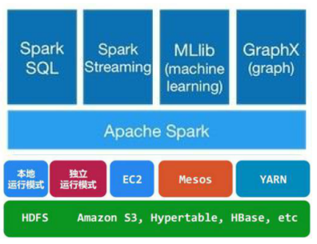
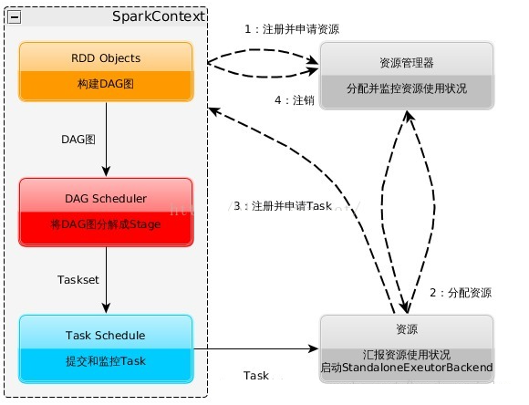
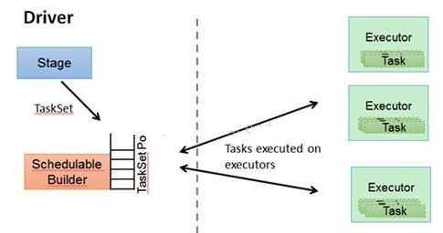
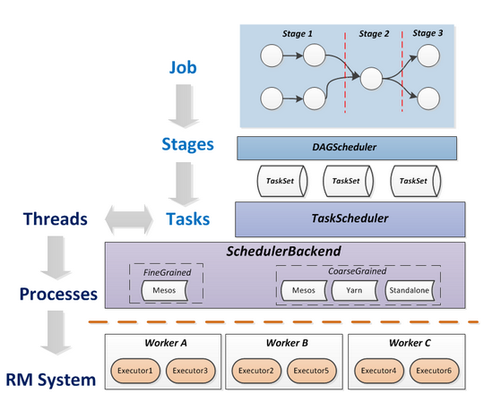
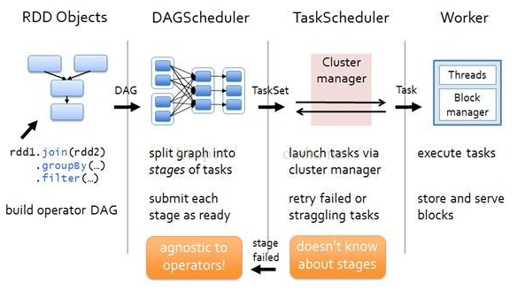
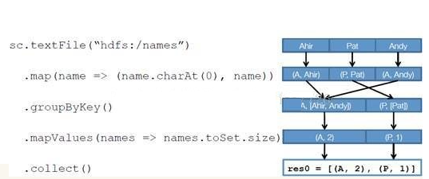

# Spark
> 参考文献
> * [原理介绍](https://www.cnblogs.com/cxxjohnson/p/8909578.html)

## 1 简介

Apache Spark是一个围绕速度、易用性和复杂分析构建的大数据处理框架，Spark提供了一个全面、统一的框架用于管理各种有着不同性质（文本数据、图表数据等）的数据集和数据源（批量数据或实时的流数据）的大数据处理的需求

Spark是一个计算引擎、计算框架，与TensorFlow很像。但是不提供数据存储功能。大数据存储功能由Hadoop等专门的解决方案提供。

## 2 架构生态

通常当需要处理的数据量超过了单机尺度(比如我们的计算机有4GB的内存，而我们需要处理100GB以上的数据)这时我们可以选择spark集群进行计算，有时我们可能需要处理的数据量并不大，但是计算很复杂，需要大量的时间，这时我们也可以选择利用spark集群强大的计算资源，并行化地计算，其架构示意图如下：

* Spark Core：包含Spark的基本功能；尤其是定义RDD的API、操作以及这两者上的动作。其他Spark的库都是构建在RDD和Spark Core之上的
* Spark SQL：提供通过Apache Hive的SQL变体Hive查询语言（HiveQL）与Spark进行交互的API。每个数据库表被当做一个RDD，Spark SQL查询被转换为Spark操作。
* Spark Streaming：对实时数据流进行处理和控制。Spark Streaming允许程序能够像普通RDD一样处理实时数据
* MLlib：一个常用机器学习算法库，算法被实现为对RDD的Spark操作。这个库包含可扩展的学习算法，比如分类、回归等需要对大量数据集进行迭代的操作。
* GraphX：控制图、并行图操作和计算的一组算法和工具的集合。GraphX扩展了RDD API，包含控制图、创建子图、访问路径上所有顶点的操作

## 3 Spark&Hadoop

* Hadoop有两个核心模块，分布式存储模块HDFS和分布式计算模块Mapreduce
* spark本身并没有提供分布式文件系统，因此spark的分析大多依赖于Hadoop的分布式文件系统HDFS
* Hadoop的Mapreduce与spark都可以进行数据计算，而相比于Mapreduce，spark的速度更快并且提供的功能更加丰富

## 4 运行流程及特点

1. 构建Spark Application的运行环境，启动SparkContext
2. SparkContext向资源管理器（可以是Standalone，Mesos，Yarn）申请运行Executor资源，并启动StandaloneExecutorbackend，
3. Executor向SparkContext申请Task
4. SparkContext将应用程序分发给Executor
5. SparkContext构建成DAG图，将DAG图分解成Stage、将Taskset发送给Task Scheduler，最后由Task Scheduler将Task发送给Executor运行
6. Task在Executor上运行，运行完释放所有资源

Spark运行特点：

* 每个Application获取专属的executor进程，该进程在Application期间一直驻留，并以多线程方式运行Task。这种Application隔离机制是有优势的，无论是从调度角度看（每个Driver调度他自己的任务），还是从运行角度看（来自不同Application的Task运行在不同JVM中），当然这样意味着Spark Application不能跨应用程序共享数据，除非将数据写入外部存储系统
* Spark与资源管理器无关，只要能够获取executor进程，并能保持相互通信就可以了
* 提交SparkContext的Client应该靠近Worker节点（运行Executor的节点），最好是在同一个Rack里，因为Spark Application运行过程中SparkContext和Executor之间有大量的信息交换
* Task采用了数据本地性和推测执行的优化机制

## 5 常用术语

* Application: Appliction都是指用户编写的Spark应用程序，其中包括一个Driver功能的代码和分布在集群中多个节点上运行的Executor代码
* Driver:  Spark中的Driver即运行上述Application的main函数并创建SparkContext，创建SparkContext的目的是为了准备Spark应用程序的运行环境，在Spark中有SparkContext负责与ClusterManager通信，进行资源申请、任务的分配和监控等，当Executor部分运行完毕后，Driver同时负责将SparkContext关闭，通常用SparkContext代表Driver
* Executor:  某个Application运行在worker节点上的一个进程，  该进程负责运行某些Task， 并且负责将数据存到内存或磁盘上，每个Application都有各自独立的一批Executor， 在Spark on Yarn模式下，其进程名称为CoarseGrainedExecutor Backend。一个CoarseGrainedExecutor Backend有且仅有一个Executor对象， 负责将Task包装成taskRunner,并从线程池中抽取一个空闲线程运行Task， 这个每一个oarseGrainedExecutor Backend能并行运行Task的数量取决与分配给它的cpu个数
* Cluter Manager：指的是在集群上获取资源的外部服务。目前有三种类型
  * Standalon : spark原生的资源管理，由Master负责资源的分配
  * Apache Mesos:与hadoop MR兼容性良好的一种资源调度框架
  * Hadoop Yarn: 主要是指Yarn中的ResourceManager
* Worker: 集群中任何可以运行Application代码的节点，在Standalone模式中指的是通过slave文件配置的Worker节点，在Spark on Yarn模式下就是NoteManager节点
* Task: 被送到某个Executor上的工作单元，但hadoopMR中的MapTask和ReduceTask概念一样，是运行Application的基本单位，多个Task组成一个Stage，而Task的调度和管理等是由TaskScheduler负责
* Job: 包含多个Task组成的并行计算，往往由Spark Action触发生成， 一个Application中往往会产生多个Job
* Stage: 每个Job会被拆分成多组Task， 作为一个TaskSet， 其名称为Stage，Stage的划分和调度是有DAGScheduler来负责的，Stage有非最终的Stage（Shuffle Map Stage）和最终的Stage（Result Stage）两种，Stage的边界就是发生shuffle的地方

* DAGScheduler: 根据Job构建基于Stage的DAG（Directed Acyclic Graph有向无环图)，并提交Stage给TASkScheduler。 其划分Stage的依据是RDD之间的依赖的关系找出开销最小的调度方法，如下图
* TASKSedulter: 将TaskSET提交给worker运行，每个Executor运行什么Task就是在此处分配的. TaskScheduler维护所有TaskSet，当Executor向Driver发生心跳时，TaskScheduler会根据资源剩余情况分配相应的Task。另外TaskScheduler还维护着所有Task的运行标签，重试失败的Task。下图展示了TaskScheduler的作用

在不同运行模式中任务调度器具体为：
* Spark on Standalone模式为TaskScheduler
* YARN-Client模式为YarnClientClusterScheduler
* YARN-Cluster模式为YarnClusterScheduler
将这些术语串起来的运行层次图如下：

Job=多个stage，Stage=多个同种task, Task分为ShuffleMapTask和ResultTask，Dependency分为ShuffleDependency和NarrowDependency

## 7 RDD 执行流程

RDD运行流程：

RDD在Spark中运行大概分为以下三步：
1. 创建RDD对象
2. DAGScheduler模块介入运算，计算RDD之间的依赖关系，RDD之间的依赖关系就形成了DAG
3. 每一个Job被分为多个Stage。划分Stage的一个主要依据是当前计算因子的输入是否是确定的，如果是则将其分在同一个Stage，避免多个Stage之间的消息传递开销

示例图如下：

以下面一个按 A-Z 首字母分类，查找相同首字母下不同姓名总个数的例子来看一下 RDD 是如何运行起来的

创建 RDD  上面的例子除去最后一个 collect 是个动作，不会创建 RDD 之外，前面四个转换都会创建出新的 RDD 。因此第一步就是创建好所有 RDD( 内部的五项信息 )？
创建执行计划 Spark 会尽可能地管道化，并基于是否要重新组织数据来划分 阶段 (stage) ，例如本例中的 groupBy() 转换就会将整个执行计划划分成两阶段执行。最终会产生一个 DAG(directed acyclic graph ，有向无环图 ) 作为逻辑执行计划

调度任务  将各阶段划分成不同的 任务 (task) ，每个任务都是数据和计算的合体。在进行下一阶段前，当前阶段的所有任务都要执行完成。因为下一阶段的第一个转换一定是重新组织数据的，所以必须等当前阶段所有结果数据都计算出来了才能继续