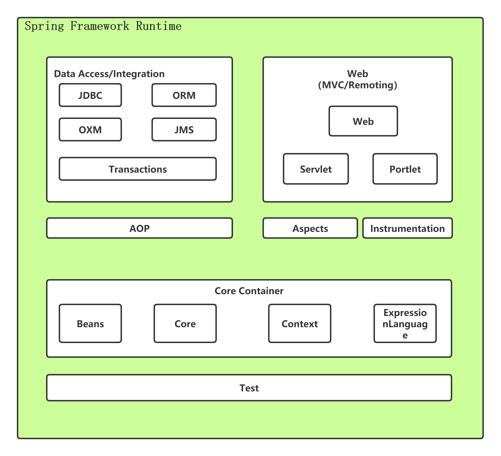

> 后续需要整理一下每一部分涉及到的注解。

## 1 概述
> 参考教程
> [尚硅谷Spring5课程]()


> 主要内容架构
> * 基本概念
> * IOC容器
> * AOP
> * Jdbc
> * 事务
> * Spring5-webflux
### 概念

* 开放源代码的JavaEE应用程序框架
* 针对bean的生命周期进行管理的轻量级容器

### 特点

* 解决应用开发的复杂性。降低JavaApi的使用
* 方便解耦，简化开发。
* AOP变成支持
* Test方便测试
* integeration方便整合集成
* 方便进行事务操作

### 核心

* IOC：控制反转，把创建对象的过程交给Spring进行挂历。
* Aop：面向切面，不修改源代码的情况下，进行功能的增强。


## 2 入门实例

1. 创建普通java工程。
2. 将jar包导入指定目录下，并添加idea以来路径。


3. 使用bean标签完成spring配置

```java
<?xml version="1.0" encoding="UTF-8"?>
<beans xmlns="http://www.springframework.org/schema/beans"
       xmlns:xsi="http://www.w3.org/2001/XMLSchema-instance"
       xsi:schemaLocation="http://www.springframework.org/schema/beans http://www.springframework.org/schema/beans/spring-beans.xsd">

<!--    配置User bean -->
    <bean id="user" class="com.ykl.User"></bean>
</beans>
```
4. spring加载xml文件，获取bean对象
   1. 最简单的使用方式，所以spring本质上是一种轻量级的框架。
   2. 将bean放到context中
   3. 从context中获取指定id的Bean。

```java
package com.ykl.testdemo;

import com.ykl.User;
import org.junit.Test;
import org.springframework.context.ApplicationContext;
import org.springframework.context.support.ClassPathXmlApplicationContext;

/**
 * @author yinkanglong
 * @version : Test01, v 0.1 2022-10-08 11:27 yinkanglong Exp $
 */
public class Test01 {
    @Test
    public void testAdd(){
//        加载spring的配置文件
        ApplicationContext context = new ClassPathXmlApplicationContext("bean01.xml");
//        获取配置创建的对象
        User user = context.getBean("user", User.class);
        System.out.println(user);
        user.add();
    }

}
```
## 3 架构

### 架构说明



* 起核心内容包括四个jar包，引入即可使用spring最基础的功能。所以说它是一个轻量级的框架。（总共大概有20个jar包）
## 包的两个作用


> 包的两种作用
> * 水平分层——层次。位于不同的层次，应该在包的某个字段体现出来。service层、view层、dao层等。
> * 垂直分割——功能。同一个功能在不同层次有不同力度的对应和实现，应该在包类的某个字段体现出来。包括book功能，sell功能等。
> 一个包类路径的命名（功能结构或者说项目架构），应该是水平分层和垂直分割方法的交替。

## 导入jar包的方法

1. 如果是普通的java工程，需要手动下载jar包。
   1. 去mvn仓库，搜索jar包，点击jar下载。
   2. 然后再工程中添加该jar包（idea以来搜索路径）

2. 如果是maven工程，直接引入pom即可
   1. maven会自动管理并下载jar包。