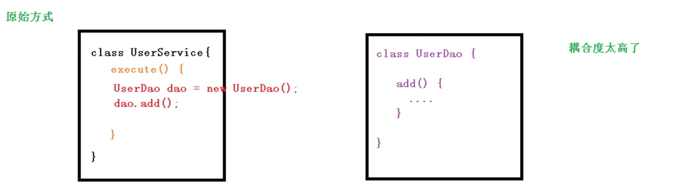
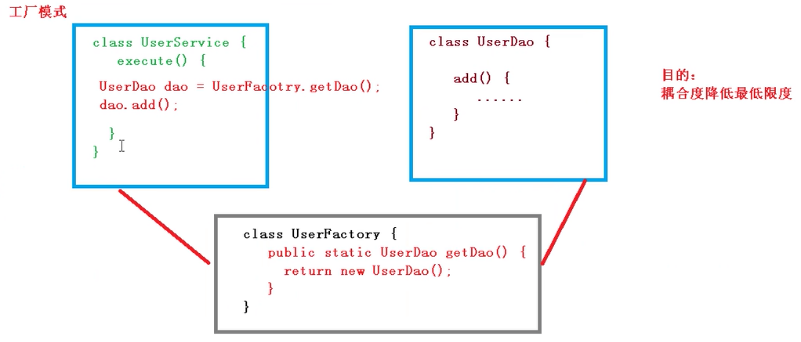
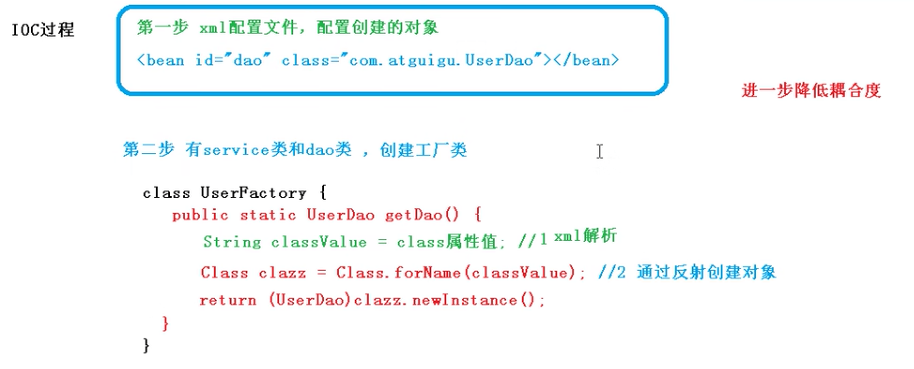
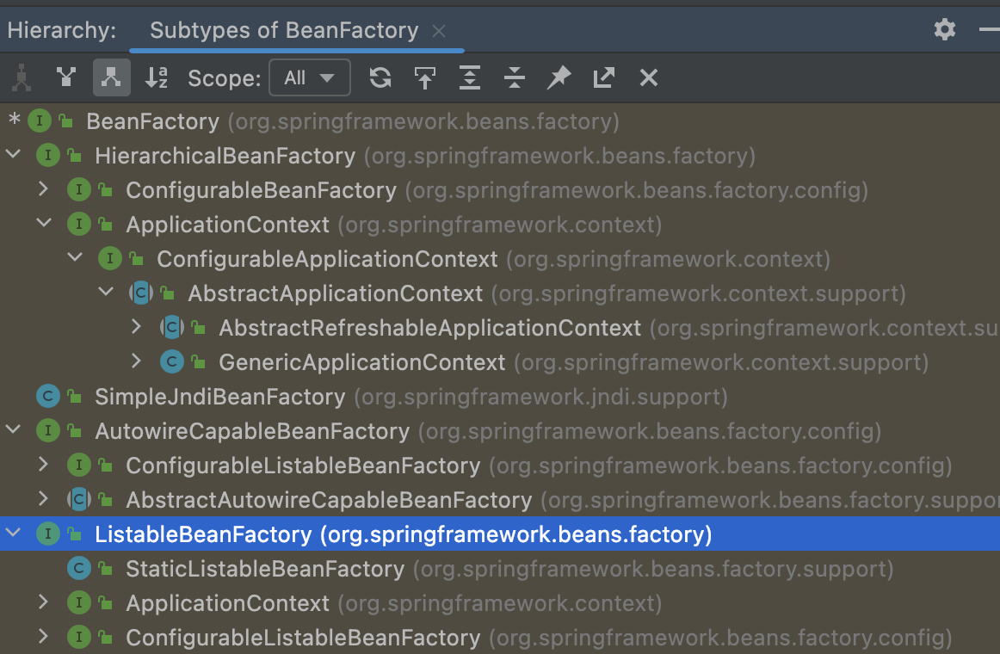
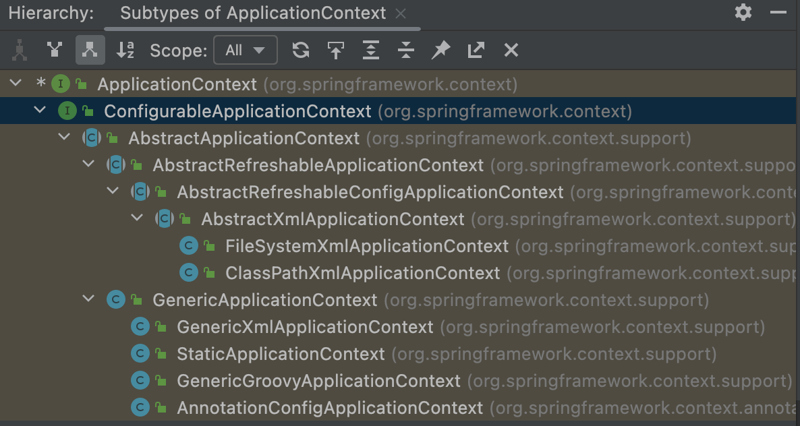

## 1 IOC容器原理
### IOC概念
* 控制反转。把对象创建和对象调用的过程，交给Spring进行管理。
* 使用IOC的目的：降低代码耦合度。


### 底层原理


* xml解析
* 工厂模式
* 反射


1. java对象调用的过程


```java
class UserDao{
    add(){

    }
}
public class UserService{
    public void execute(){
        UserDao dao = new UserDao();
        dao.add();
    }
}
```
2. 使用工厂模式

```java
class UserDao{
    add(){

    }
}
class UserFactory{
    public static UserDao getDao(){
        return new UserDao();
    }
}

class UserService{
    execute(){
        UserDao dao = UserFactory.getDao();
        dao.add();
    }
}
```

3. IOC模式实现。通过xml解析、工厂模式、反射，进一步降低耦合度。
   1. 创建xml配置文件
   2. 创建工厂类，解析xml，使用IOC机制创建对象。
   3. 降低耦合度，不依赖java对象，而是通过配置文件决定具体实例化的对象。根据id查找class.forName(className),加载字节码文件，通过Instance方法，实例化对象。值依赖一个ClassName的字符串。可以随时更改，而不用依赖具体的包名、对象名和对象中的构造方法。



```xml
<bean id="dao" class="com.ykl.UserDao"></bean>
```
```java
class UserDao{
    add(){

    }
}
class UserFactory{
    public static UserDao getDao(){
        String classValue = class属性值;//XML解析
        Class classzz = Class.forName(classValue)//通过反射创建对象。
        return (UserDao)clazz.newInstance();
    }
}

class UserService{
    execute(){
        UserDao dao = UserFactory.getDao();
        dao.add();
    }
}
```
## 2 IOC接口BeanFactory&ApplicationContext

IOC思想是基于IOC容器完成的，IOC容器底层就是对象工厂（工厂通过xml文件解析类名，通过反射机制创建对象实例）。

### 实现方法
Spring提供了IOC容器实现的两种方式。耗时耗资源的操作，尽量在初始化的时候完成，所以ApplicationContext这个接口更常使用。

* BeanFactory：IOC容器基本实现，是Spring内部的使用接口，不提供给开发人员使用。
  * 加载配置文件的时候，不会创建对象。在获取（使用）对象的时候，才去创建对象。
* ApplicationContext。BeanFactory接口的子接口，提供了更多更强大的功能，一般由开发人员进行使用。
  * 加载配置文件的时候就会把配置文件对象进行创建。

* BeanFactory
继承结构如下，有多种子接口和实现方法


* ApplicationContext

继承结构如下


* FileSystemXmlApplicationContext,存储盘下的xml路径
* ClassPathXmlApplicationContext,是src下的类路径

### IOC操作Bean的步骤和方式
主要包括两个步骤
* Spring创建对象——依赖倒置
* Spring注入属性——依赖注入

主要两种方式
* 基于XML的方式
* 基于注解的方式