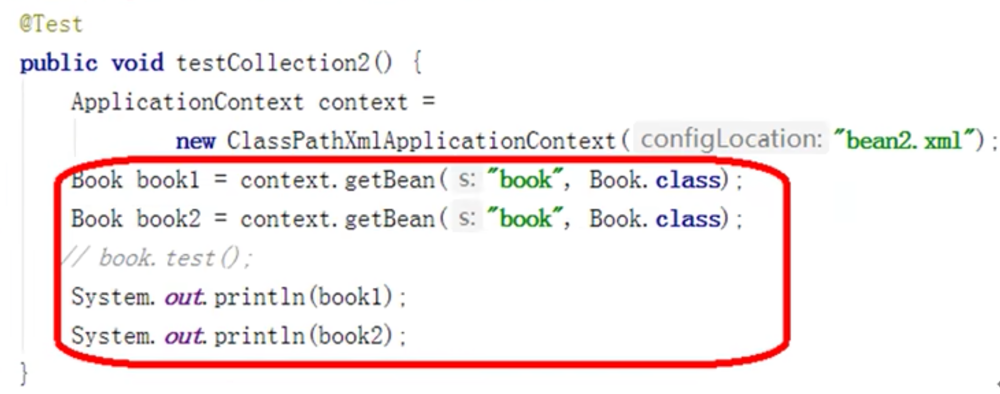

# IOCBean管理基于XML方式

## 1 基于XMl方式创建对象
```xml
<bean id="user" class="com.ykl.User"></bean>
id:对象唯一标识
class:创建对象的类全路径，包类路径
name:对象名称标识
```
* 在Spring给你配置文件中，使用bean标签，标签里添加对应属性。实现对象的创建
* bean中有很多属性
* 创建对象的时候，执行无参构造函数。


## 2 基于XML方式注入属性
> DI依赖注入，就是注入属性。

### 原始的属性注入方法


```java
/**
 * Alipay.com Inc.
 * Copyright (c) 2004-2022 All Rights Reserved.
 */
package com.ykl;

/**
 * @author yinkanglong
 * @version : Book, v 0.1 2022-10-08 14:32 yinkanglong Exp $
 */
public class Book  {
    private String name;
    
    //set方法注入
    public void setName(String name) {
        this.name = name;
    }
    
    //有参构造函数注入
    public Book(String name){
        this.name = name;
    }
    
    public Book(){
        
    }

    public static void main(String[] args) {
        //使用set方法注入
        Book book = new Book();
        book.setName("123");
        
        //使用有参构造函数注入
        Book book = new Book("abc");
    }
}
```

### 第一种方法：使用set方法进行注入.
* 创建属性和属性对应的set方法。
* 在Spring配置文件配置对象创建和属性注入。
* 加载配置文件获取指定的对象。

```xml
<?xml version="1.0" encoding="UTF-8"?>
<beans xmlns="http://www.springframework.org/schema/beans"
       xmlns:xsi="http://www.w3.org/2001/XMLSchema-instance"
       xsi:schemaLocation="http://www.springframework.org/schema/beans http://www.springframework.org/schema/beans/spring-beans.xsd">

<!--    配置User bean -->
    <bean id="user" class="com.ykl.User"></bean>

<!--    配置Book对象和属性注入-->
    <bean id="book" class="com.ykl.Book">
<!--        name:类里面属性的名称
            value:向属性注入的值
-->
        <property name="name" value="shuming"></property>
    </bean>
</beans>
```

```java
    @Test
    public void testBook(){

//        在创建对象的过程中就完成了属性的注入
        ApplicationContext context = new ClassPathXmlApplicationContext("bean01.xml");

        Book book = context.getBean("book", Book.class);

        System.out.println(book.getName());

    }
```
### 第二种方法：使用有参构造函数进行注入
* 创建类和属性，创建对应属性的有参构造方法。
```java
/**
 * Alipay.com Inc.
 * Copyright (c) 2004-2022 All Rights Reserved.
 */
package com.ykl;

/**
 * @author yinkanglong
 * @version : Order, v 0.1 2022-10-08 14:47 yinkanglong Exp $
 */
public class Order {
    private String oname;
    private String address;

    public Order(String oname, String address) {
        this.oname = oname;
        this.address = address;
    }
}
```
  * 通过有参构造方法创建对象进行依赖注入
```xml
    <bean id="order" class="com.ykl.Order">
        <constructor-arg name="oname" value="abc"></constructor-arg>
        <constructor-arg name="address" value="China"></constructor-arg>
    </bean>
constructor-arg
name 名称
value 值
index 参数列表
```
* p名称空间注入方法
  * 用于简化xml的配置方法。在beans里添加p命名空间
  * 在bean标签里添加键值对。
```xml
<beans xmlns:p="http://www.springframework.org/schema/p">

<bean id="book" class="com.ykl.Book" p:name="shuming">
</bean>
```

### xml注入其他类型的属性
* 字面值,空值null
```xml
<property name="address">
<null/>
</property>
```
* 字面值，包含特殊符号
  * 把特殊符号进行转义

```xml
<property name="address" value="&lt&lt南京&gt&gt">
</property>
```
  * 把特殊符号写到CDATA中
```xml
<property name="address">
<value>
<![CDATA[<<南京>>]]>
</value>
</property>
```
* 级联Bean——外部bean注入
  * 创建service和dao类
  * 在配置文件中配置注入操作
  * 测试类，测试是否注入成功

```java

public class UserService {

    public UserDao getUserDao() {
        return userDao;
    }

    public void setUserDao(UserDao userDao) {
        this.userDao = userDao;
    }

    UserDao userDao;


    public void add(){
        System.out.println("service add ...");

        userDao.update();
    }
}
public class UserDaoImpl implements UserDao{

    @Override
    public void update(){
        System.out.println("dao update ...");
    }
}
```
```xml
<?xml version="1.0" encoding="UTF-8"?>
<beans xmlns="http://www.springframework.org/schema/beans"
       xmlns:xsi="http://www.w3.org/2001/XMLSchema-instance"
       xsi:schemaLocation="http://www.springframework.org/schema/beans http://www.springframework.org/schema/beans/spring-beans.xsd">

<!--    配置User bean -->
    <bean id="userService" class="com.ykl.service.UserService">
        <!--
        注入userDao的对象
        name属性值：类里面的属性名称
        ref属性:创建UserDao对象bean标签的id值。
        -->
        <property name="userDao" ref="userDao"></property>

    </bean>

    <bean id="userDao" class="com.ykl.dao.UserDaoImpl"></bean>
</beans>
```
```java
public class Test02 {
    @Test
    public void testAdd(){
//        加载spring的配置文件
        ApplicationContext context = new ClassPathXmlApplicationContext("bean02.xml");

        //        获取配置创建的对象
        UserService user = context.getBean("userService", UserService.class);
        user.add();
    }
}
```
* 级联Bean——内部bean
  * 一对多关系：部门和员工。
  * 在实体类之间表示一对多的关系。
```xml
    <bean id="emp" class="com.ykl.bean.Emp">
        <!--
        普通属性
        -->
        <property name="ename" value="lucy"></property>
        <property name="gender" value="nv"></property>
        <!--
        级联对象的创建方法
        -->
        <property name="dept">
            <bean id="dept" class="com.ykl.bean.Dept">
                <property name="dname" value="security"></property>
            </bean>
        </property>
    </bean>
```
> 数据库3BNF范式的要求：
> 一对多的关系，需要在多的一方添加外键，指向一。
> 多对多的关系，需要拆分出关系类。任意一方和关系类都是一对多的关系。

* 级联赋值
  * 外部bean注入
  * 给外部bean的属性赋值
```
   <bean id="emp" class="com.ykl.bean.Emp">
        <!--
        普通属性
        -->
        <property name="ename" value="lucy"></property>
        <property name="gender" value="nv"></property>
        <!--
        级联赋值-外部bean的方式
        -->
        <property name="dept" ref="dept">
        </property>

        <property name="dept.dname" value="jishubu">
        </property>
    </bean>
    <bean id="dept" class="com.ykl.bean.Dept>
        <property name="dname" value="caiwubu"></property>
    </bean>
```

### xml注入集合属性
* 注入数组类型属性、List集合类型属性、Map集合类型属性
   1. 创建集合类型的属性。
   2. 注入集合类型的属性

```java
/**
 * Alipay.com Inc.
 * Copyright (c) 2004-2022 All Rights Reserved.
 */
package com.ykl.collectiontype;

import java.util.Arrays;
import java.util.List;
import java.util.Map;
import java.util.Set;

/**
 * @author yinkanglong
 * @version : Student, v 0.1 2022-10-08 16:01 yinkanglong Exp $
 */
public class Student {
    private String[] courses;

    private List<String> list;

    private Map<String,String> maps;

    private Set<String> sets;

    public Student() {
    }

    public void setList(List<String> list) {
        this.list = list;
    }

    public void setMaps(Map<String, String> maps) {
        this.maps = maps;
    }

    public void setSets(Set<String> sets) {
        this.sets = sets;
    }

    public void setCourses(String[] courses) {
        this.courses = courses;
    }

    @Override
    public String toString() {
        return "Student{" +
                "courses=" + Arrays.toString(courses) +
                ", list=" + list +
                ", maps=" + maps +
                ", sets=" + sets +
                '}';
    }
}
```
```xml
    <bean id="student" class="com.ykl.collectiontype.Student">
        <property name="courses" >
            <array>
                <value>java</value>
                <value>c</value>
            </array>
        </property>
            
        <property name="list" >
            <list>
                <value>zhangsan</value>
                <value>xiaosan</value>
            </list>
        </property>

        <property name="maps">
            <map>
                <entry key="java" value="java"></entry>
                <entry key="name" value="hel"></entry>
            </map>
        </property>

        <property name="sets">
            <set>
                <value>msyql</value>
                <value>redis</value>
            </set>
        </property>

    </bean>
```
*  XML注入集合中对象类型
```xml
    <bean>
    ......
        <property name="courseList">
            <list>
                <ref bean="course1"></ref>
                <ref bean="course2"></ref>
                <ref bean="course3"></ref>
            </list>
        </property>
    </bean>
<!--    创建多个course对象-->
    <bean id="course1" class="com.ykl.collectiontype.Course">
        <property name="cname" value="c1"></property>
    </bean>
    <bean id="course2" class="com.ykl.collectiontype.Course">
        <property name="cname" value="c2"></property>
    </bean>
    <bean id="course3" class="com.ykl.collectiontype.Course">
        <property name="cname" value="c3"></property>
    </bean>
```
* 使用新的命名空间进行注入
  * 在spring配置文件中引入util命名空间
  * 提取list集合类型的属性注入。
```xml
<?xml version="1.0" encoding="UTF-8"?>
<beans xmlns="http://www.springframework.org/schema/beans"
       xmlns:xsi="http://www.w3.org/2001/XMLSchema-instance"
       xmlns:util="http://www.springframework.org/schema/util"
       xsi:schemaLocation="http://www.springframework.org/schema/beans  http://www.springframework.org/schema/beans/spring-beans.xsd
       http://www.springframework.org/schema/util  http://www.springframework.org/schema/util/spring-util.xsd">

    <util:list id="bookList">
        <value>zhangsan</value>
        <value>xiaosan</value>
    </util:list>
    <bean id="book" class="com.ykl.collectiontype.Book">
        <property name="bookList" ref="bookList">
        </property>
    </bean>

</beans>
```

## 3 普通bean和工厂bean
Spring中有两种类型的bean：
* 普通bean：在配置文件中定义的Bean类型就是返回类型
* 工厂bean：在配置文件中定义的Bean类型和返回类型可以不一样。


工厂bean的实现方法
* 创建类，让这个类作为工厂bean。实现接口factoryBean
* 实现接口里面的方法，在实现的方法中定义返回bean类型。

```java

public class MyBean implements FactoryBean<Course> {

    //定义返回bea
    @Override
    public Course getObject() throws Exception {
        Course course = new Course();
        return course;
    }

    @Override
    public Class<?> getObjectType() {
        return null;
    }

    @Override
    public boolean isSingleton() {
        return FactoryBean.super.isSingleton();
    }
}

    @Test
    public void testFactoryBean(){
        ApplicationContext context = new ClassPathXmlApplicationContext("bean03.xml");
        Course myBean = context.getBean("mybean", Course.class);
        System.out.println(myBean);
    }
```
```xml
    <bean id="mybean" class="com.ykl.factorybean.MyBean"></bean>
```

## 4 Bean的作用域
* 在Spring里可以设置Bean是单实例还是多实例。
* 在Spring里，默认情况下是，bean是单实例对象。


* 在spring文件bean标签里面的属性scope用于设置是单实例还是多实例。
  * scope=singleton,表示单实例对象。
  * scope=prototype,表示多实例对象。

```xml
    <bean id="book" class="com.ykl.collectiontype.Book" scope="prototype">
    </bean>
```
* singleton在加载配置文件的时候，就会创建单实例对象。饿汉式。
* prototype在调用getBean方法的时候，才会创建对象。懒汉式。

> 这个跟之前记录的BeanFactory和ApplicationContext的区别有点像。不如就说BeanFactory默认scope为prototype，ApplicationContext默认scope为singleton。

* scope还有一下两个值。表示不同的作用域。
  * request
  * seesion

## 5 Bean的生命周期
### 基本步骤
从对象创建到对象销毁的过程。包括五个最基本的步骤。

1. 通过构造器创建bean实例。
2. 为bean的属性设置值和对其他bean的引用（调用set方法）
3. 调用bean中初始化的方法（需要进行配置）
4. bean可以使用了
5. 当容器关闭的时候，调用bean的销毁方法（需要进行配置）

```java
public class Order {
    private String oname;

    public Order(String oname) {
        this.oname = oname;
    }

    public Order() {
        System.out.println("第一步 执行无参构造函数创建bean实例");
    }


    public void setOname(String oname) {
        this.oname = oname;
        System.out.println("第二步 调用set方法设置属性值");
    }
    
    public String getOname() {
        return oname;
    }

    public void initMethod(){
        System.out.println("第三部 调用初始化方法");
    }

    public void destroyMethod(){
        System.out.println("第五步 调用销毁方法");
    }

}
    @Test
    public void testCollection(){
        ApplicationContext context = new ClassPathXmlApplicationContext("bean05.xml");
        Order order = context.getBean("order", Order.class);
        System.out.println("第四步 获取bean实例对象");
        ((ClassPathXmlApplicationContext)context).close();
    }
```

```xml
    <bean id="order" class="com.ykl.bean.Order" scope="singleton" init-method="initMethod" destroy-method="destroyMethod">
        <property name="oname" value="hello world"></property>
    </bean>
```


### Post处理器步骤
添加后置处理器后，总共有7步


1. 通过构造器创建bean实例。
2. 为bean的属性设置值和对其他bean的引用（调用set方法）
3. 把bean实例传递bean后置处理器的方法
4. 调用bean中初始化的方法（需要进行配置）
5. 把bean实例传递Bean后置处理器的方法
6. bean可以使用了
7. 当容器关闭的时候，调用bean的销毁方法（需要进行配置）


实例：后置处理器的效果演示

创建类，实现接口BeanPostProcessor，创建后置处理器


```java
public class MyBeanPost implements BeanPostProcessor {

    @Override
    public Object postProcessBeforeInitialization(Object bean, String beanName) throws BeansException {
        System.out.println("后置处理器，前置任务");;
        return bean;
    }

    @Override
    public Object postProcessAfterInitialization(Object bean, String beanName) throws BeansException {
        System.out.println("后置处理器，后置任务");
        return bean;
    }
}
```

```xml
    <bean id="order" class="com.ykl.bean.Order" scope="singleton" init-method="initMethod" destroy-method="destroyMethod">
        <property name="oname" value="hello world"></property>
    </bean>

<!--    配置后置处理器，当前配置文件中的所有bean都会添加后置处理器-->
    <bean id="mybeanpost" class="com.ykl.bean.MyBeanPost"></bean>
```

## 6 自动装配

1. 手动装配：通过property的那么和value属性。
2. 自动装配：根据指定装配规则（属性名称或者属性类型），Spring自动将匹配的属性值进行注入。

* bean标签autowire实现自动装配。autowire通常包含连个值
  * byName根据属性名称注入（bean的id和属性名称一致）
  * byType根据属性类型注入(如果该类型有多个实例会出错)

```xml
    <bean id="emp" class="com.ykl.autowire.Emp" autowire="byName"></bean>
    <bean id="dept" class="com.ykl.autowire.Dept">
        <property name="dname" value="hello"></property>
    </bean>
```


## 7 外部属性文件

### 直接配置数据信息

```xml
    <bean id="dataSource" class="com.alibaba.druid.pool.DruidDataSource">
        <property name="driverClassName" value="com.mysql.jdbc.Driver"></property>
        <property name="url" value="jdbc:mysql://localhost:3306/user"></property>
        <property name="username" value="root"></property>
        <property name="password" value="123456"></property>
    </bean>
```


### 引入外部属性文件配置数据库连接池

1. 编辑外部属性文件.properties
2. 引入外部属性文件，添加新的命名空间context

```
prop.driverClass=com.mysql.jdbc.Driver
prop.url=jdbc:mysql://localhost:3306/user
prop.username=root
prop.password=123456
```

```xml
<?xml version="1.0" encoding="UTF-8"?>
<beans xmlns="http://www.springframework.org/schema/beans"
       xmlns:xsi="http://www.w3.org/2001/XMLSchema-instance"
       xmlns:util="http://www.springframework.org/schema/context"
       xmlns:context="http://www.springframework.org/schema/util"
       xsi:schemaLocation="http://www.springframework.org/schema/beans  http://www.springframework.org/schema/beans/spring-beans.xsd
       http://www.springframework.org/schema/util  http://www.springframework.org/schema/util/spring-util.xsd
       http://www.springframework.org/schema/context  http://www.springframework.org/schema/context/spring-context.xsd">


    <bean id="dataSource" class="com.alibaba.druid.pool.DruidDataSource">
        <property name="driverClassName" value="com.mysql.jdbc.Driver"></property>
        <property name="url" value="jdbc:mysql://localhost:3306/user"></property>
        <property name="username" value="root"></property>
        <property name="password" value="123456"></property>
    </bean>

    <!--引入外部属性文件-->
    <context:property-path path="classpath:jdbc.properties"/>

    <bean id="dataSource" class="com.alibaba.druid.pool.DruidDataSource">
        <property name="driverClassName" value="${prop.driverClass}"></property>
        <property name="url" value="${prop.url}"></property>
        <property name="username" value="${prop.username}"></property>
        <property name="password" value="${prop.password}"></property>
    </bean>
</beans>
```