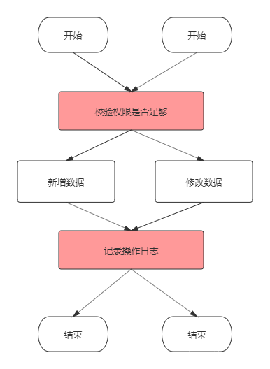
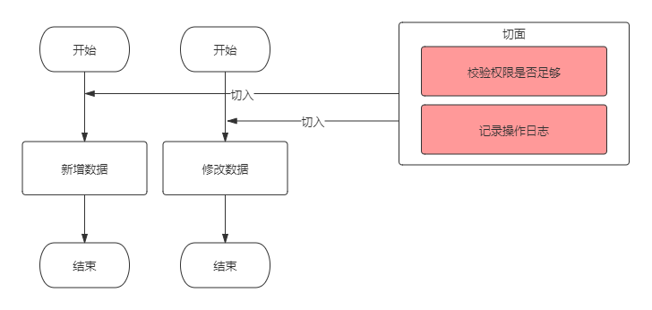
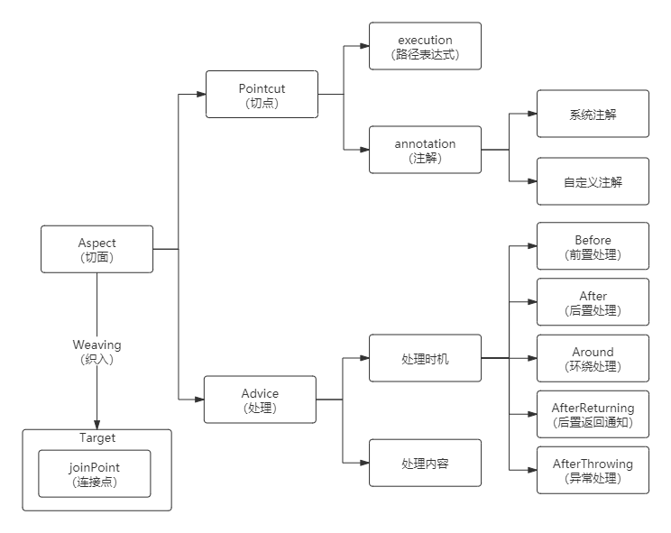
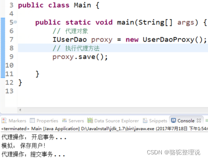
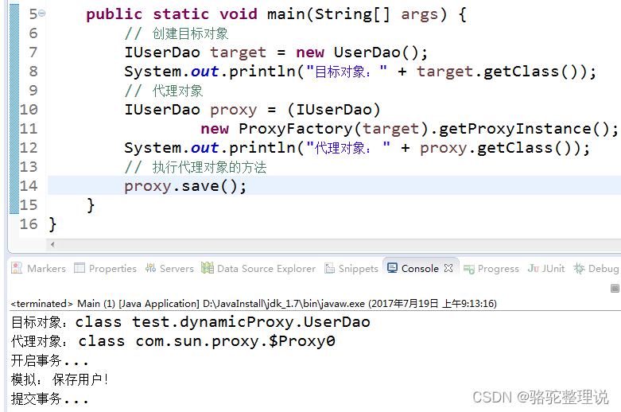

## 1 概述
### 概念

AOP(Aspect Oriented Programming)面向切面思想，是Spring的三大核心思想之一(AOP-面向切面、IOC-控制反转、DI-依赖注入）。
### 为什么AOP
* 有多少个业务操作，就要写多少重复的校验和日志记录代码，这显然是无法接受的。当然用面向对象的思想，可以把这些重复的代码抽离出来，写成公共方法，就是下面这样：


代码冗余和可维护性的问题得到了解决，但每个业务方法中依然要依次手动调用这些公共方法，也是略显繁琐。 有没有更好的方式呢？有的，那就是AOP，AOP将权限校验、日志记录等非业务代码完全提取出来，与业务代码分离，并寻找节点切入业务代码中

### AOP体系结构

AOP要做的三件事：
1. 在哪里切入，也就是权限校验等非业务操作在哪些业务代码中执行；（切入点）
2. 什么时候切入，是业务代码执行前还是执行后；（通知）
3. 切入后做什么事，比如做权限校验、日志记录等。




* Pointcut：切点，决定处理如权限校验、日志记录等在何处切入业务代码中（即织入切面）。切点分为execution方式和annotation方式。前者可以用路径表达式指定哪些类织入切面，后者可以指定被哪些注解修饰的代码织入切面。

* Advice：处理，包括处理时机和处理内容。处理内容就是要做什么事，比如校验权限和记录日志。处理时机就是在什么时机执行处理内容，分为前置处理（即业务代码执行前）、后置处理（业务代码执行后）等。

* Aspect：切面，即Pointcut和Advice。

* Joint point：连接点，是程序执行的一个点。例如，一个方法的执行或者一个异常的处理。在 Spring AOP 中，一个连接点总是代表一个方法执行。

* Weaving：织入，就是通过动态代理，在目标对象方法中执行处理内容的过程。


### 特点

面向切面编程，核心原理是使用动态代理模式在方法执行前后或出现异常时加入相关逻辑。


* AOP是基于动态代理模式。
* AOP是方法级别的。
* AOP可以分离业务代码和关注点代码（重复代码），在执行业务代码时，动态的注入关注点代码。切面就是关注点代码形成的类。

### 作用

AOP能干什么
* Spring声明式事务管理配置

* Controller层的参数校验

* 使用Spring AOP实现MySQL数据库读写分离案例分析

* 在执行方法前，判断是否具有权限。

* 对部分函数的调用进行日志记录。监控部分重要函数，若抛出指定的异常，可以以短信或邮件方式通知相关人员。

* 信息过滤，页面转发等等功能。

## 2 原理

### 代理模式
为其他对象提供一种代理以控制对这个对象的访问。比如A对象要做一件事情，在没有代理前，自己来做，在对A代理后，由A的代理类B来做。代理其实是在原实例前后加了一层处理，这也是AOP的初级轮廓。


### 静态代理模式
静态代理就是在程序运行前就已经存在代理类的字节码文件，代理类和原始类的关系在运行前就已经确定。
```java
package test.staticProxy;
// 接口
public interface IUserDao {
 void save();
 void find();
}
//目标对象
class UserDao implements IUserDao{
 @Override
 public void save() {
  System.out.println("模拟：保存用户！");
 }
 @Override
 public void find() {
  System.out.println("模拟：查询用户");
 }
}
/**
  静态代理
  特点：
    1. 目标对象必须要实现接口
    2. 代理对象，要实现与目标对象一样的接口
 */
class UserDaoProxy implements IUserDao{
 // 代理对象，需要维护一个目标对象
 private IUserDao target = new UserDao();
 @Override
 public void save() {
  System.out.println("代理操作： 开启事务...");
  target.save();   // 执行目标对象的方法
  System.out.println("代理操作：提交事务...");
 }
 @Override
 public void find() {
  target.find();
 }
}
```


静态代理虽然保证了业务类只需关注逻辑本身，代理对象的一个接口只服务于一种类型的对象，如果要代理的方法很多，势必要为每一种方法都进行代理。还有就是如果增加一个方法，除了实现类需要实现这个方法外，所有的代理类也要实现此方法。增加了代码的维护成本。那如何解决呢？使用动态代理。
### 动态代理模式
动态代理类的源码是在程序运行期间通过JVM反射等机制动态生成，代理类和委托类的关系是运行时才确定的。实例如下:
```java
  import java.lang.reflect.InvocationHandler;
  import java.lang.reflect.Method;
  import java.lang.reflect.Proxy;
  // 接口
  public interface IUserDao {
   void save();
   void find();
  }
  //目标对象
   class UserDao implements IUserDao{
   @Override
   public void save() {
    System.out.println("模拟： 保存用户！");
   }
   @Override
   public void find() {
    System.out.println("查询");
   }
  }
    /**
     * 动态代理：
     * 代理工厂，给多个目标对象生成代理对象！
     *
     */
    class ProxyFactory {
     // 接收一个目标对象
     private Object target;
     public ProxyFactory(Object target) {
      this.target = target;
     }
     // 返回对目标对象(target)代理后的对象(proxy)
     public Object getProxyInstance() {
      Object proxy = Proxy.newProxyInstance(
       target.getClass().getClassLoader()，  // 目标对象使用的类加载器
       target.getClass().getInterfaces()，   // 目标对象实现的所有接口
       new InvocationHandler() {   // 执行代理对象方法时候触发
        @Override
        public Object invoke(Object proxy， Method method， Object[] args)
          throws Throwable {
 
         // 获取当前执行的方法的方法名
         String methodName = method.getName();
         // 方法返回值
         Object result = null;
         if ("find".equals(methodName)) {
          // 直接调用目标对象方法
          result = method.invoke(target， args);
         } else {
          System.out.println("开启事务...");
          // 执行目标对象方法
          result = method.invoke(target， args);
          System.out.println("提交事务...");
         }
         return result;
        }
       }
      );
      return proxy;
     }
    }
```




在运行测试类中创建测试类对象代码中
```java
IUserDao proxy = (IUserDao)new ProxyFactory(target).getProxyInstance();
```
其实是JDK动态生成了一个类去实现接口，隐藏了这个过程:
```java
class $jdkProxy implements IUserDao{}
```
使用jdk生成的动态代理的前提是目标类必须有实现的接口。但这里又引入一个问题，如果某个类没有实现接口，就不能使用JDK动态代理，所以Cglib代理就是解决这个问题的。

Cglib是以动态生成的子类继承目标的方式实现，在运行期动态的在内存中构建一个子类，如下:
```java
public class UserDao{}
//Cglib是以动态生成的子类继承目标的方式实现，程序执行时，隐藏了下面的过程
public class $Cglib_Proxy_class  extends UserDao{}
```
Cglib使用的前提是目标类不能为final修饰。因为final修饰的类不能被继承。

## 3 实例

### 实例1 xml

* 连接点

```java
import org.aspectj.lang.ProceedingJoinPoint;
public interface IUserDao {
 void save();
}
//用于测试Cglib动态代理
class OrderDao {
 public void save() {
  //int i =1/0;用于测试异常通知
  System.out.println("保存订单...");
 }
}
//用于测试jdk动态代理
class UserDao implements IUserDao {
 public void save() {
  //int i =1/0;用于测试异常通知
  System.out.println("保存用户...");
 }
```

* 切面

```java
//切面类
class TransactionAop {
 public void beginTransaction() {
  System.out.println("[前置通知]  开启事务..");
 }
 public void commit() {
  System.out.println("[后置通知] 提交事务..");
 }
 public void afterReturing(){
  System.out.println("[返回后通知]");
 }
 public void afterThrowing(){
  System.out.println("[异常通知]");
 }
 public void arroud(ProceedingJoinPoint pjp) throws Throwable{
  System.out.println("[环绕前：]");
  pjp.proceed();          // 执行目标方法
  System.out.println("[环绕后：]");
 }
}
```

* xml配置

```xml
<?xml version="1.0" encoding="UTF-8"?>
  <beans xmlns="http://www.springframework.org/schema/beans"
      xmlns:xsi="http://www.w3.org/2001/XMLSchema-instance"
      xmlns:context="http://www.springframework.org/schema/context"
      xmlns:aop="http://www.springframework.org/schema/aop"
      xsi:schemaLocation="
          http://www.springframework.org/schema/beans
          http://www.springframework.org/schema/beans/spring-beans.xsd
          http://www.springframework.org/schema/context
          http://www.springframework.org/schema/context/spring-context.xsd
          http://www.springframework.org/schema/aop
          http://www.springframework.org/schema/aop/spring-aop.xsd">
   <!-- dao实例加入容器 -->
   <bean id="userDao" class="test.spring_aop_anno.UserDao"></bean>
 
   <!-- dao实例加入容器 -->
   <bean id="orderDao" class="test.spring_aop_anno.OrderDao"></bean>
 
   <!-- 实例化切面类 -->
   <bean id="transactionAop" class="test.spring_aop_anno.TransactionAop"></bean>
 
   <!-- Aop相关配置 -->
   <aop:config>
    <!-- 配置aop的代理 -->
<!--注意:<aop:config proxy-target-class="true"> 如果这样配置则是强制使用CGLIB方式进行代理-->
<aop:config>
<!-- 定义一个切入点，起名为myPointCut，切入点是连接点的集合 -->
<aop:pointcut expression="execution(public * com.briup.aop.service.*.*(..))" id="myPointCut"/>
<!-- 定义哪一个advice在哪一个切入点上面起作用 -->
<aop:advisor advice-ref="beforeAdvice" pointcut-ref="myPointCut" /></aop:config>
expression="execution(public * com.briup.aop.service.*.*(..))"
这个引号""里面就是用表达式的方式来定义切入点,只要是符合我们这个表达式要求的，方法就是我们的连接点,
连接点的集合就是我们要定义的切入点。表达式中从左到右的*号:第一个* 表示方法的返回类型不限。第二个* 表示包中的任意一个类
第三个* 表示类中的任意一个方法。同时方法的参数也没有限制.
    <!-- 切面配置 -->
    <aop:aspect ref="transactionAop">
     <!-- 【环绕通知】 -->
     <aop:around method="arroud" pointcut-ref="transactionPointcut"/>
     <!-- 【前置通知】 在目标方法之前执行 -->
     <aop:before method="beginTransaction" pointcut-ref="transactionPointcut" />
     <!-- 【后置通知】 -->
     <aop:after method="commit" pointcut-ref="transactionPointcut"/>
     <!-- 【返回后通知】 -->
     <aop:after-returning method="afterReturing" pointcut-ref="transactionPointcut"/>
     <!-- 异常通知 -->
     <aop:after-throwing method="afterThrowing" pointcut-ref="transactionPointcut"/>
    </aop:aspect>
   </aop:config>
</beans>
```


### 实例2 注解

* 引入AOP依赖

```xml
<dependency>
    <groupId>org.springframework.boot</groupId>
    <artifactId>spring-boot-starter-aop</artifactId>
</dependency>
```

* 切面：创建一个AOP切面类，只要在类上加个 @Aspect 注解即可。@Aspect 注解用来描述一个切面类，定义切面类的时候需要打上这个注解。@Component 注解将该类交给 Spring 来管理。在这个类里实现advice： 

```java
import org.aspectj.lang.annotation.Aspect;
import org.aspectj.lang.annotation.Before;
import org.aspectj.lang.annotation.Pointcut;
import org.springframework.stereotype.Component;
 
@Aspect
@Component
public class LogAdvice {
    // 定义一个切点：所有被GetMapping注解修饰的方法会织入advice
    @Pointcut("@annotation(org.springframework.web.bind.annotation.GetMapping)")
    private void logAdvicePointcut() {}
 
 // Before表示logAdvice将在目标方法执行前执行
    @Before("logAdvicePointcut()")
    public void logAdvice(){
     // 这里只是一个示例，你可以写任何处理逻辑
        System.out.println("get请求的advice触发了");
    }
}
```


### 实例3 注解切点

* 自定义注解
```java
@Target(ElementType.METHOD)
@Retention(RetentionPolicy.RUNTIME)
@Documented
public @interface PermissionAnnotation{
}
```

* 切面：创建第一个AOP切面类，只要在类上加个@Aspect注解即可。@Component 注解将该类交给 Spring 来管理，在这个类里实现权限校验逻辑。

```java
import com.alibaba.fastjson.JSON;
import com.alibaba.fastjson.JSONObject;
import org.aspectj.lang.ProceedingJoinPoint;
import org.aspectj.lang.annotation.Around;
import org.aspectj.lang.annotation.Aspect;
import org.aspectj.lang.annotation.Pointcut;
import org.springframework.core.annotation.Order;
import org.springframework.stereotype.Component;
 
@Aspect
@Component
@Order(1)
public class PermissionFirstAdvice {
 
 // 定义一个切面，括号内写入第1步中自定义注解的路径
    @Pointcut("@annotation(com.mu.demo.annotation.PermissionAnnotation)")
    private void permissionCheck() {
    }
 
    @Around("permissionCheck()")
    public Object permissionCheckFirst(ProceedingJoinPoint joinPoint) throws Throwable {
        System.out.println("===================第一个切面===================：" + System.currentTimeMillis());
 
        //获取请求参数，详见接口类
        Object[] objects = joinPoint.getArgs();
        Long id = ((JSONObject) objects[0]).getLong("id");
        String name = ((JSONObject) objects[0]).getString("name");
        System.out.println("id1->>>>>>>>>>>>>>>>>>>>>>" + id);
        System.out.println("name1->>>>>>>>>>>>>>>>>>>>>>" + name);
 
        // id小于0则抛出非法id的异常
        if (id < 0) {
            return JSON.parseObject("{\"message\":\"illegal id\",\"code\":403}");
        }
        return joinPoint.proceed();
    }
}
```


## 4 AOP相关注解

### @Pointcut
@Pointcut 注解，用来定义一个切点，即上文中所关注的某件事情的入口，切入点定义了事件触发时机。

* @Pointcut 注解指定一个切点，定义需要拦截的东西，这里介绍两个常用的表达式：一个是使用 execution()，另一个是使用 annotation() 

```
@Aspect
@Component
public class LogAspectHandler {
 
    /**
     * 定义一个切面，拦截 com.mutest.controller 包和子包下的所有方法
     */
    @Pointcut("execution(* com.mutest.controller..*.*(..))")
    public void pointCut() {}
}
```
### execution表达式：
以 `execution(* com.mutest.controller..*.*(..))`表达式为例：

* 第一个 * 号的位置：表示返回值类型，* 表示所有类型。

* 包名：表示需要拦截的包名，后面的两个句点表示当前包和当前包的所有子包，在本例中指 com.mutest.controller包、子包下所有类的方法。

* 第二个 * 号的位置：表示类名，* 表示所有类。

* `*(..)`：这个星号表示方法名，* 表示所有的方法，后面括弧里面表示方法的参数，两个句点表示任何参数。


### annotation() 表达式：

annotation() 方式是针对某个注解来定义切点，比如我们对具有 @PostMapping 注解的方法做切面，可以如下定义切面：
```java
@Pointcut("@annotation(org.springframework.web.bind.annotation.PostMapping)")
public void annotationPointcut() {}
```

### @Around

@Around注解用于修饰Around增强处理，Around增强处理非常强大，表现在：

* @Around可以自由选择增强动作与目标方法的执行顺序，也就是说可以在增强动作前后，甚至过程中执行目标方法。这个特性的实现在于，调用ProceedingJoinPoint参数的proceed()方法才会执行目标方法。

* @Around可以改变执行目标方法的参数值，也可以改变执行目标方法之后的返回值。

Around增强处理有以下特点：

* 当定义一个Around增强处理方法时，该方法的第一个形参必须是 ProceedingJoinPoint 类型（至少一个形参）。在增强处理方法体内，调用ProceedingJoinPoint的proceed方法才会执行目标方法：这就是@Around增强处理可以完全控制目标方法执行时机、如何执行的关键；如果程序没有调用ProceedingJoinPoint的proceed方法，则目标方法不会执行。

* 调用ProceedingJoinPoint的proceed方法时，还可以传入一个Object[ ]对象，该数组中的值将被传入目标方法作为实参——这就是Around增强处理方法可以改变目标方法参数值的关键。这就是如果传入的Object[ ]数组长度与目标方法所需要的参数个数不相等，或者Object[ ]数组元素与目标方法所需参数的类型不匹配，程序就会出现异常。

* @Around功能虽然强大，但通常需要在线程安全的环境下使用。因此，如果使用普通的Before、AfterReturning就能解决的问题，就没有必要使用Around了。如果需要目标方法执行之前和之后共享某种状态数据，则应该考虑使用Around。尤其是需要使用增强处理阻止目标的执行，或需要改变目标方法的返回值时，则只能使用Around增强处理了。

下面，在前面例子上做一些改造，来观察@Around的特点。

* 自定义注解类不变。首先，定义接口类：
```java
package com.example.demo;
 
import com.alibaba.fastjson.JSON;
import com.alibaba.fastjson.JSONObject;
import org.springframework.web.bind.annotation.*;
 
@RestController
@RequestMapping(value = "/permission")
public class TestController {
    @RequestMapping(value = "/check", method = RequestMethod.POST)
    @PermissionsAnnotation()
    public JSONObject getGroupList(@RequestBody JSONObject request) {
        return JSON.parseObject("{\"message\":\"SUCCESS\",\"code\":200,\"data\":" + request + "}");
    }
}
```
* 唯一切面类（前面案例有两个切面类，这里只需保留一个即可）：
```java
package com.example.demo;
 
import com.alibaba.fastjson.JSONObject;
import org.aspectj.lang.ProceedingJoinPoint;
import org.aspectj.lang.annotation.Around;
import org.aspectj.lang.annotation.Aspect;
import org.aspectj.lang.annotation.Pointcut;
import org.springframework.core.annotation.Order;
import org.springframework.stereotype.Component;
 
 
@Aspect
@Component
@Order(1)
public class PermissionAdvice {
 
    @Pointcut("@annotation(com.example.demo.PermissionsAnnotation)")
    private void permissionCheck() {
    }
 
 
    @Around("permissionCheck()")
    public Object permissionCheck(ProceedingJoinPoint joinPoint) throws Throwable {
        System.out.println("===================开始增强处理===================");
 
        //获取请求参数，详见接口类
        Object[] objects = joinPoint.getArgs();
        Long id = ((JSONObject) objects[0]).getLong("id");
        String name = ((JSONObject) objects[0]).getString("name");
        System.out.println("id1->>>>>>>>>>>>>>>>>>>>>>" + id);
        System.out.println("name1->>>>>>>>>>>>>>>>>>>>>>" + name);
 
  // 修改入参
        JSONObject object = new JSONObject();
        object.put("id", 8);
        object.put("name", "lisi");
        objects[0] = object;
  
  // 将修改后的参数传入
        return joinPoint.proceed(objects);
    }
}
```

### @Before

@Before 注解指定的方法在切面切入目标方法之前执行，可以做一些 Log 处理，也可以做一些信息的统计，比如获取用户的请求 URL 以及用户的 IP 地址等等，这个在做个人站点的时候都能用得到，都是常用的方法。例如下面代码：
```java
@Aspect
@Component
@Slf4j
public class LogAspectHandler {
    /**
     * 在上面定义的切面方法之前执行该方法
     * @param joinPoint jointPoint
     */
    @Before("pointCut()")
    public void doBefore(JoinPoint joinPoint) {
        log.info("====doBefore方法进入了====");
 
        // 获取签名
        Signature signature = joinPoint.getSignature();
        // 获取切入的包名
        String declaringTypeName = signature.getDeclaringTypeName();
        // 获取即将执行的方法名
        String funcName = signature.getName();
        log.info("即将执行方法为: {}，属于{}包", funcName, declaringTypeName);
 
        // 也可以用来记录一些信息，比如获取请求的 URL 和 IP
        ServletRequestAttributes attributes = (ServletRequestAttributes) RequestContextHolder.getRequestAttributes();
        HttpServletRequest request = attributes.getRequest();
        // 获取请求 URL
        String url = request.getRequestURL().toString();
        // 获取请求 IP
        String ip = request.getRemoteAddr();
        log.info("用户请求的url为：{}，ip地址为：{}", url, ip);
    }
}
```
JointPoint 对象很有用，可以用它来获取一个签名，利用签名可以获取请求的包名、方法名，包括参数（通过 joinPoint.getArgs()获取）等。


### @After

@After 注解和 @Before 注解相对应，指定的方法在切面切入目标方法之后执行，也可以做一些完成某方法之后的 Log 处理。
```java
@Aspect
@Component
@Slf4j
public class LogAspectHandler {
    /**
     * 定义一个切面，拦截 com.mutest.controller 包下的所有方法
     */
    @Pointcut("execution(* com.mutest.controller..*.*(..))")
    public void pointCut() {}
 
    /**
     * 在上面定义的切面方法之后执行该方法
     * @param joinPoint jointPoint
     */
    @After("pointCut()")
    public void doAfter(JoinPoint joinPoint) {
 
        log.info("==== doAfter 方法进入了====");
        Signature signature = joinPoint.getSignature();
        String method = signature.getName();
        log.info("方法{}已经执行完", method);
    }
}
```
到这里，我们来写个 Controller 测试一下执行结果，新建一个 AopController 如下：
```java
@RestController
@RequestMapping("/aop")
public class AopController {
 
    @GetMapping("/{name}")
    public String testAop(@PathVariable String name) {
        return "Hello " + name;
    }
}
```
启动项目，在浏览器中输入：localhost:8080/aop/csdn，观察一下控制台的输出信息：
```
====doBefore 方法进入了====  
即将执行方法为: testAop，属于com.itcodai.mutest.AopController包  
用户请求的 url 为：http://localhost:8080/aop/name，ip地址为：0:0:0:0:0:0:0:1  
==== doAfter 方法进入了====  
方法 testAop 已经执行完
```
从打印出来的 Log 中可以看出程序执行的逻辑与顺序，可以很直观的掌握 @Before 和 @After 两个注解的实际作用。


### @AfterReturning

@AfterReturning 注解和 @After 有些类似，区别在于 @AfterReturning 注解可以用来捕获切入方法执行完之后的返回值，对返回值进行业务逻辑上的增强处理，例如：
```java
@Aspect
@Component
@Slf4j
public class LogAspectHandler {
    /**
     * 在上面定义的切面方法返回后执行该方法，可以捕获返回对象或者对返回对象进行增强
     * @param joinPoint joinPoint
     * @param result result
     */
    @AfterReturning(pointcut = "pointCut()", returning = "result")
    public void doAfterReturning(JoinPoint joinPoint, Object result) {
 
        Signature signature = joinPoint.getSignature();
        String classMethod = signature.getName();
        log.info("方法{}执行完毕，返回参数为：{}", classMethod, result);
        // 实际项目中可以根据业务做具体的返回值增强
        log.info("对返回参数进行业务上的增强：{}", result + "增强版");
    }
}
```
需要注意的是，在@AfterReturning 注解 中，属性 returning 的值必须要和参数保持一致，否则会检测不到。该方法中的第二个入参就是被切方法的返回值，在 doAfterReturning 方法中可以对返回值进行增强，可以根据业务需要做相应的封装。我们重启一下服务，再测试一下：

方法 testAop 执行完毕，返回参数为：Hello CSDN

对返回参数进行业务上的增强：Hello CSDN 增强版

### @AfterThrowing

当被切方法执行过程中抛出异常时，会进入@AfterThrowing 注解的方法中执行，在该方法中可以做一些异常的处理逻辑。要注意的是 throwing 属性的值必须要和参数一致，否则会报错。该方法中的第二个入参即为抛出的异常。
```
@Aspect
@Component
@Slf4j
public class LogAspectHandler {
    /**
     * 在上面定义的切面方法执行抛异常时，执行该方法
     * @param joinPoint jointPoint
     * @param ex ex
     */
    @AfterThrowing(pointcut = "pointCut()", throwing = "ex")
    public void afterThrowing(JoinPoint joinPoint, Throwable ex) {
        Signature signature = joinPoint.getSignature();
        String method = signature.getName();
        // 处理异常的逻辑
        log.info("执行方法{}出错，异常为：{}", method, ex);
    }
}
```