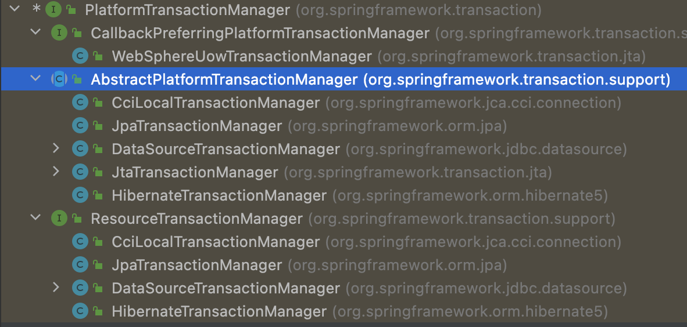
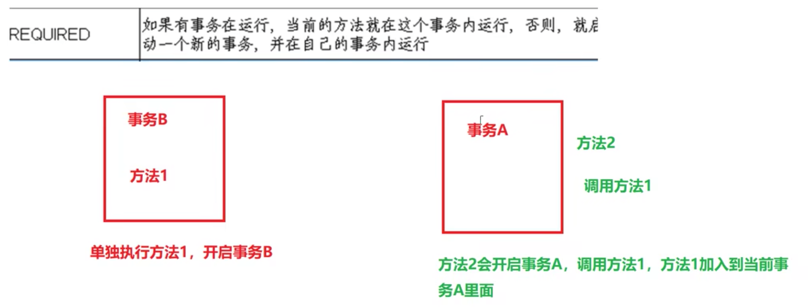
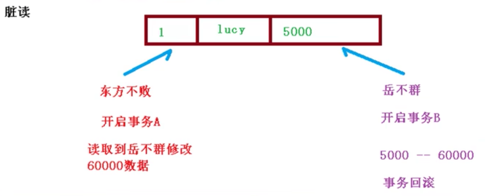
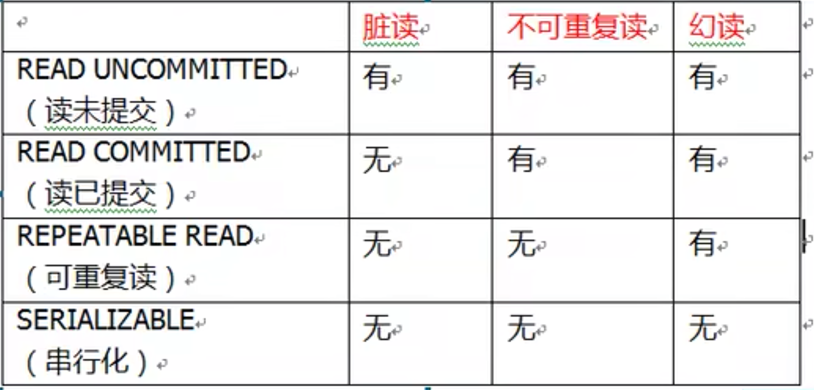

# 事务

## 1 简介

### 事务概念

事务是数据库操作最近本的单元，逻辑上一组操作，要么都成功，如果有一个失败，所有的都失败。

事务有四大特性ACID
* 原子性，不可分割
* 一致性，多个事务看到的数据是一致的
* 隔离性，多个事务不会产生影响
* 持久性，可以持久化

### 准备环境

1. 创建service和dao层的bean（设计代码架构）
2. 实现转账的业务逻辑（开发业务逻辑）
3. 撰写测试用例进行测试（测试代码）


## 2 事务步骤

### 操作步骤

1. 开启事务操作
2. 进行业务操作，并添加异常处理
3. 没有发生异常，提交事务。
4. 第四部 出现异常事务回滚


### Spring事务管理介绍

1. 事务添加到三层结构的service层
2. 在spring进行事务管理操作
   1. 声明式事务管理。通过配置实现。

   2. 编程式事务管理。需要写代码

3. 生命式事务管理
   1. 注解方式
   2. xml配置文件方式
4. 在Spring进行声明式事务管理，底层使用AOP
5. 提供一个接口，代表事务管理。针对不同的框架提供了不同的实现类。 事务管理器 



## 3 基于注解的声明式事务管理

### 步骤
1. 配置事务管理器

```
```

2. 在Spring配置文件中开启事务注解。
   1. 在spring配置文件中引入事务命名空间
   2. 开启事务管理器

```xml
<?xml version="1.0" encoding="UTF-8"?>
<beans xmlns="http://www.springframework.org/schema/beans"
       xmlns:xsi="http://www.w3.org/2001/XMLSchema-instance"
       xmlns:context="http://www.springframework.org/schema/context"
       xmlns:tx="http://www.springframework.org/schema/tx"
       xsi:schemaLocation="http://www.springframework.org/schema/beans http://www.springframework.org/schema/beans/spring-beans.xsd
       http://www.springframework.org/schema/context http://www.springframework.org/schema/context/spring-context.xsd
       http://www.springframework.org/schema/aop http://www.springframework.org/schema/aop/spring-aop.xsd
       http://www.springframework.org/schema/tx http://www.springframework.org/schema/tx/tx-context.xsd">
```
```
    <!--开启事务注解-->
    <tx:annotation-driven transaction-manager="transactionManager"></tx:annotation-driven>

```


3. 在service类上添加事务注解。或者在方法上。@Transactional.
   1. 在类上，所有的类都开启事务。
   2. 在方法上，在某个方法上开启事务。

```java
@Service
@Transactional
public class AccountService {

    @Autowired
    private AccountDao accountDao;

    public void pay(){

        accountDao.reduceMoney();
        int i= 1/0;
        accountDao.addMoney();
    }
```

## 3 声明式事务管理参数配置
### propagation传播行为
propagation 传播行为。当一个事物方法，被另一个事物调用的时候。
* Required如果有事务在运行，当前的方法就在这个事务内运行，否则就启动一个新的事物，并在自己的事务内运行。


* Required_NEW 当前方法必须启动新事物，并在他自己的事务内运行，如果有事务正在运行，应该将它挂起。(外层事务对内层事务不影响，外层事务执行失败回滚，不影响已经提交的内层事务)

* SUPPORTS 如果有事务在运行，当前的方法就在这个事务内运行，否则它可以不运行在事务中


```java
@Transactional(propagation=Propagation.REQUIRED)
```
### isolation隔离级别

事务特性：隔离性。多事务操作的时候不会产生影响。不考虑隔离性会产生一系列问题。
* 脏读，读到其他事务未提交的数据
* 不可重复读，同一个事物内读取的数据不一致，被修改
* 幻读，读到另一个数据添加的数据，例如30条数据，在后边读的时候，变成了31条。




使用不同的事务隔离级别。设置事务的隔离性，解决读的问题。



```java
@Transactional(isolation=Isolation.REPEATEABLE_READ)
```

### timeout 超时时间

* 事务需要再一定时间内进行提交，如果不提交进行回滚
* 默认超时时间为-1，设置时间以秒为单位进行计算

```java
@Transactional(isolation=Isolation.REPEATEABLE_READ)
```
### ReadOnly 是否只读
* 读：查询操作
* 写：添加、修改、删除

* 默认是false，表示可以查询，可以添加修改删除。
* 可以修改为true，只能查询。
```java
@Transactional(isolation=Isolation.REPEATEABLE_READ)
```


### rollbackFor & noRollbackFor异常回滚

* rollbackFor设置出现那些异常进行事务回滚。
* noRollbackFor设置出现哪些异常不进行回滚。


## 4 基于XML声明式事务管理

1. 在Spring配置文件中进行配置，配置事务管理器
2. 配置通知
3. 配置切入点和切面

> 能够很明显地显示事务配置的原理。xml配置的好处就是对源代码没有任何入侵。只要更改代码就可以。


```xml
<?xml version="1.0" encoding="UTF-8"?>
<beans xmlns="http://www.springframework.org/schema/beans"
       xmlns:xsi="http://www.w3.org/2001/XMLSchema-instance"
       xmlns:context="http://www.springframework.org/schema/context"
       xmlns:tx="http://www.springframework.org/schema/tx" xmlns:aop="http://www.springframework.org/schema/aop"
       xsi:schemaLocation="http://www.springframework.org/schema/beans http://www.springframework.org/schema/beans/spring-beans.xsd
       http://www.springframework.org/schema/context http://www.springframework.org/schema/context/spring-context.xsd
       http://www.springframework.org/schema/aop http://www.springframework.org/schema/aop/spring-aop.xsd
       http://www.springframework.org/schema/tx http://www.springframework.org/schema/tx/spring-tx.xsd">

    <!--开启组件扫描
        1. 如果扫描多个包，多个包之间使用逗号隔开
        2. 扫描包的上层目录-->
    <context:component-scan base-package="com.ykl"></context:component-scan>

    <!--引入外部属性文件-->
<!--    <context:property-path path="classpath:jdbc.properties"/>-->

<!--    <bean id="dataSource" class="com.alibaba.druid.pool.DruidDataSource">-->
<!--        <property name="driverClassName" value="${prop.driverClass}"></property>-->
<!--        <property name="url" value="${prop.url}"></property>-->
<!--        <property name="username" value="${prop.username}"></property>-->
<!--        <property name="password" value="${prop.password}"></property>-->
<!--    </bean>-->

    <!--引入数据库连接-->
    <bean id="dataSource" class="com.alibaba.druid.pool.DruidDataSource">
        <property name="driverClassName" value="com.mysql.jdbc.Driver"></property>
        <property name="url" value="jdbc:mysql://localhost:3310/user"></property>
        <property name="username" value="root"></property>
        <property name="password" value="123456"></property>
    </bean>

    <!--创建jdbctemplate对象-->
    <bean id="jdbcTemplate" class="org.springframework.jdbc.core.JdbcTemplate">
        <!--注入参数-->
        <property name="dataSource" ref="dataSource"></property>
    </bean>

    <!--引入事务管理器-->
    <bean id="transactionManager" class="org.springframework.jdbc.datasource.DataSourceTransactionManager">
        <property name="dataSource" ref="dataSource"></property>
    </bean>

    <!--配置通知-->
    <tx:advice id="txadvice">
        <!---->
        <tx:attributes>
            <tx:method name="pay"/>
        </tx:attributes>
    </tx:advice>

    <aop:config>
        <aop:pointcut id="pt" expression="execution(* com.ykl.*(..)))"/>
        <aop:advisor advice-ref="txadvice" pointcut-ref="pt"/>
    </aop:config>

</beans>
```


## 4 完全注解开发


1. 创建配置类，使用配置类替代xml配置文件
   1. @Configuration
   2. @Bean可以将返回值注册为bean。并且可以自动装配参数。
   3. AnnotationConfigApplicationContext(Config.class)可以加载配置类。
