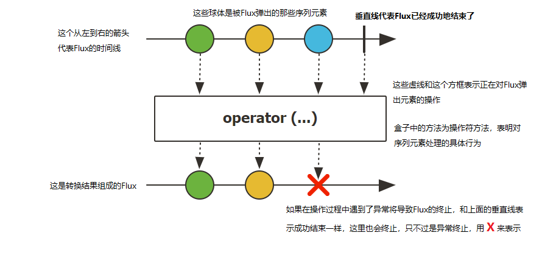

# WebFlux
> https://blog.csdn.net/crazymakercircle/article/details/124120506
> https://zhuanlan.zhihu.com/p/378136040
## 1 WebFlux简介
> 第一轮：就是看视频教程学会所有技术的原理和基本使用方法
> 第二轮：阅读官方的文档，尤其是Spring、Java、Maven等，掌握编程的细节。


### 简介
Spring5添加的新模块。用于web开发的，功能与SpringMVC类似。Webflux使用与当前比较流行的响应式编程出现的框架。

传统的Web框架，比如SpringMVC，基于Servlet容器，Webflux是一种异步非阻塞的框架。（异步非阻塞的框架在Servlet3.1后才支持）

其和虚拟式基于Reactor的相关API实现的。


### 异步非阻塞

我更喜欢反过来理解这里。同步异步是针对被调用者的，阻塞和非阻塞是针对调用者的。

* **阻塞和非阻塞针对调用者**。阻塞和非阻塞指的是调用者（程序）在等待返回结果（或输入）时的状态。阻塞时，在调用结果返回前，当前线程会被挂起，并在得到结果之后返回。非阻塞时，如果不能立刻得到结果，则该调用者不会阻塞当前线程。因此对应非阻塞的情况，调用者需要定时轮询查看处理状态。

* **异步和同步是针对被调用者**，同步： 同步就是发起一个调用后，被调用者未处理完请求之前，调用不返回。异步： 异步就是发起一个调用后，立刻得到被调用者的回应表示已接收到请求，但是被调用者并没有返回结果，此时我们可以处理其他的请求，被调用者通常依靠事件，回调等机制来通知调用者其返回结果。

### 与SpringMVC对比


* 异步非阻塞，在有限的资源下，能够处理更多的请求，提高系统地吞吐量。
* 函数式编程。（Java最基本的编程模式）。能够使用Java函数式编程的特点。
* 两个框架都可以使用注解方式运行，都可以运行在Tomcat等Servlet容器中。但SpringMVC采用命令式编程，WebFlux使用响应式编程。


### 使用场景：网关
* 需要处理大量的请求。所有客户调用网关，网关负责调用其他的组件。可以使用异步的方式。

## 2 响应式编程

### 响应式编程定义
响应式编程是一种面向数据流和变化产波的编程范式。

意味着可以在编程语言很方便地表达静态或者动态的数据流，


一个响应式编程的典型例子。D1=B1+C1。当B1的值修改后，D1的值也会修改。B1的数据变化，流向了D1。

其基本的模型如下
* 可观察对象、观察者。（观察者模式）
* 发布者、订阅者。（发布订阅机制）
* 事件、响应。（事件驱动、事件监听机制、响应式编程）

### Java8响应式编程

是要使用观察者模式，实现了响应式编程。使用响应式编程Observer,Observable实现。
```java
/**
 * Alipay.com Inc.
 * Copyright (c) 2004-2022 All Rights Reserved.
 */
package com.ykl.shangguigu08.reactor;

import java.util.Observable;

/**
 * @author yinkanglong
 * @version : ObserverDemo, v 0.1 2022-10-12 19:47 yinkanglong Exp $
 */
public class ObserverDemo extends Observable {

    /**
     * 通过Java8中的类实现响应式编程。
     * 简单来说，就是观察值模式。
     * @param args
     */
    @Test
    public void testObserver() {
        //其中observerDemo是一个可观察对象，Observer添加了匿名的观察者。
        //二者通过addObserver建立联系。
        //observable对象通过setChanged和notifyObservers，发送通知、事件。进行相应。
        ObserverDemo observerDemo = new ObserverDemo();
        observerDemo.addObserver((o,arg)->{
            System.out.println("发生变化");
        });

        observerDemo.addObserver((o,arg)->{
            System.out.println("准备改变");
        });

        observerDemo.addObserver(new Observer() {
            @Override
            public void update(Observable o, Object arg) {
                System.out.println(o);
                System.out.println(arg);
            }
        });

        observerDemo.setA(11);
        observerDemo.setChanged();
        System.out.println(observerDemo.hasChanged());
        observerDemo.notifyObservers();
        observerDemo.notifyObservers("hello world");
    }
}
```
### java9响应式编程
主要通过Flow类的sub和sub订阅消息，实现响应式编程。
> 感觉这个响应式编程和awt控件的点击相应式操作很相似。但是不是启动新的线程。

```java
   Observable<Integer> observable=Observable.create(new Observable.OnSubscribe<Integer>() {
            @Override
            public void call(Subscriber<? super Integer> subscriber) {
                for(int i=0;i<5;i++){
                    subscriber.onNext(i);
                }
                subscriber.onCompleted();
            }
        });
        //Observable.subscribe(Observer)，Observer订阅了Observable
        Subscription subscribe = observable.subscribe(new Observer<Integer>() {
            @Override
            public void onCompleted() {
                Log.e(TAG, "完成");
            }

            @Override
            public void onError(Throwable e) {
                Log.e(TAG, "异常");
            }

            @Override
            public void onNext(Integer integer) {
                Log.e(TAG, "接收Obsverable中发射的值：" + integer);
            }
        });

输出：

接收Obsverable中发射的值：0
接收Obsverable中发射的值：1
接收Obsverable中发射的值：2
接收Obsverable中发射的值：3
接收Obsverable中发射的值：4
```
### Flux&Mono响应式编程

* 响应式编程操作，Reactor是满足Reactive规范框架
* Reactor有两个核心类，Mono和Flux，这两个类实现接口Publisher，提供丰富操作符号.
  * Flux对象实现发布，返回N个元素。
  * Mono实现发布者，返回0或者1个元素。把 Mono 用于在异步任务完成时发出通知。
* Flux和Mono都是数据流的发布者。能够发出三种信号
  * 元素值
  * 完成信号。一种终止信号。订阅者数据流已经结束了。
  * 错误信号。一种终止信号。终止数据流并把错误信息传递给订阅者。


三种信号的特点
* 错误信号和完成信号都是终止信号不能共存。
* 如果没有发送任何元素值，而是直接发送错误或者完成信号，表示空数据流
* 如果没有错误信号，没有完成信号，表示无限数据流。

### 实例：Flux&Mono

引入相关的依赖
```xml
        <dependency>
            <groupId>io.projectreactor</groupId>
            <artifactId>reactor-core</artifactId>
            <version>3.1.5.RELEASE</version>
        </dependency>
```

进行发布者发布内容
* just等发布方法只是声明了数据流。只有声明了订阅者才会触发数据流，不订阅，就不会触发。
```java
package com.ykl.shangguigu08.reactor;

import reactor.core.publisher.Flux;
import reactor.core.publisher.Mono;

import java.util.ArrayList;
import java.util.Arrays;
import java.util.List;
import java.util.stream.Stream;

/**
 * @author yinkanglong
 * @version : TestReactor, v 0.1 2022-10-13 10:25 yinkanglong Exp $
 */
public class TestReactor {

    @Test
    public void testFlux(){
        //其中Flux/Mono就是一个可观察对象/发布者。Consumer是一个观察者/消费者。
        //二者通过subscriber建立联系。
        //直接发送通知。不需要调用特定的函数。
        Flux<Integer> justInteger = Flux.just(1, 2, 3, 4);
        justInteger.subscribe(System.out::println);


        Integer[] array = {1,2,3,4};
        Flux.fromArray(array).subscribe(System.out::println);

        List<Integer> list = Arrays.asList(array);
        Flux.fromIterable(list).subscribe(System.out::println);

        Stream<Integer> stream = list.stream();
        Flux.fromStream(stream).subscribe(System.out::println);

        Flux.just("hello","world").subscribe(new Consumer<String>() {
            @Override
            public void accept(String s) {
                System.out.println(s);
            }
        });

    } 
}
```
```java
public Mono<ClientUser> currentUser () {
    return isAuthenticated ? Mono.just(new ClientUser("felord.cn", "reactive"))
            : Mono.empty();
}
```


## 4 WebFlux执行流程和核心API

### Netty的基本原理
SpringWebflux基于Reactor，默认使用容器Netty，Netty是高性能的NIO框架，异步非阻塞框架。

1. BIO阻塞


2. NIO非阻塞


3. webflux




### SpringWebFlux

* SpringWebflux核心控制器DispatchHandler，实现接口WebHandler


DispatcherHandler负责请求处理。有三个核心类。


* HandlerMapping（reactor反应器）：请求查询到处理方法。
* HandlerAdapter：真正负责请求处理（processor部分）
* HandlerResultHandler：对结果进行处理

### 函数式编程
两个核心接口。
* RouterFunction 路由处理
* HandlerFunction处理函数


常用函数编程示例
* Consumer 一个输入 无输出
```java
Product product=new Product();
//类名+静态方法  一个输入T 没有输出
Consumer consumer1 = Product->Product.nameOf(product);//lambda
consumer1.accept(product);
Consumer consumer = Product::nameOf;//方法引用
consumer.accept(product);
```
* Funtion<T,R> 一个输入 一个输出
```java
//对象+方法  一个输入T 一个输出R
Function<Integer, Integer> function = product::reduceStock;
System.out.println("剩余库存：" + function.apply(10));
//带参数的构造函数
Function<Integer,Product> function1=Product::new;
System.out.println("新对象:" +function1.apply(200));
```

* Predicate 一个输入T, 一个输出 Boolean
```java
//Predicate 一个输入T 一个输出Boolean
Predicate predicate= i -> product.isEnough(i);//lambda
System.out.println("库存是否足够："+predicate.test(100));
Predicate predicate1= product::isEnough;//方法引用
System.out.println("库存是否足够："+predicate1.test(100));
```
* UnaryOperator 一元操作符 输入输出都是T
```java
//一元操作符  输入和输出T
UnaryOperator integerUnaryOperator =product::reduceStock;
System.out.println("剩余库存：" + integerUnaryOperator.apply(20));
IntUnaryOperator intUnaryOperator = product::reduceStock;
System.out.println("剩余库存：" + intUnaryOperator.applyAsInt(30));
```

* Supplier 没有输入 只有输出
```java
//无参数构造函数
Supplier supplier = Product::new;
System.out.println("创建新对象:" + supplier.get());

Supplier supplier1=()->product.getStock();
System.out.println("剩余库存:" + supplier1.get());
```

* BiFunction 二元操作符 两个输入<T,U> 一个输出

```java
//类名+方法
BiFunction<Product, Integer, Integer> binaryOperator = Product::reduceStock;
System.out.println(" 剩余库存(BiFunction)：" + binaryOperator.apply(product, 10));
```


* BinaryOperator 二元操作符 ,二个输入 一个输出
```java
//BinaryOperator binaryOperator1=(x,y)->product.reduceStock(x,y);
BinaryOperator binaryOperator1=product::reduceStock;
System.out.println(" 剩余库存(BinaryOperator)：" +binaryOperator1.apply(product.getStock(),10));
```
### 流式编程
1. 是Java新支持的一种变成方法，与面向对象编程、函数式编程等类似，流式编程以来流式编程的API，是一种编程的模式，本身并不影响代码的功能。也算是语法糖的一种。

2. Flux和Mono只是采用了流式编程思想。不是一种特殊的编程思想。
```java
public Stream<ClientUser> allUsers() {
    return  Stream.of(new ClientUser("felord.cn", "reactive"),
            new ClientUser("Felordcn", "Reactor"));
}
```

对数据流进行一道道操作，成为操作符，比如工厂流水线。
* 操作符map。将元素映射为新的元素。
* 操作符flatmap。元素映射为流。


