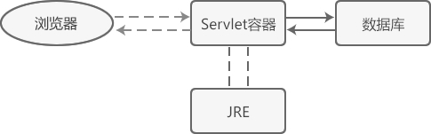

# WebFlux
> 这一块了解就行，不用掌握。
## 1 WebFlux简介
> 第一轮：就是看视频教程学会所有技术的原理和基本使用方法
> 第二轮：阅读官方的文档，尤其是Spring、Java、Maven等，掌握编程的细节。


### 简介
Spring5添加的新模块。用于web开发的，功能与SpringMVC类似。Webflux使用与当前比较流行的响应式编程出现的框架。

传统的Web框架，比如SpringMVC，基于Servlet容器，Webflux是一种异步非阻塞的框架。（异步非阻塞的框架在Servlet3.1后才支持）

其和虚拟式基于Reactor的相关API实现的。


### 异步非阻塞

* **异步和同步是针对调用者**，调用者发送请求，如果等着对方回应之后采取做其他事情就是同步，如果发送后不等着对方回应就去做其他事情就是异步。

* **阻塞和非阻塞针对被调用者**，被调用者收到一个请求之后，做完嘞请求任务之后，次啊给出返回，就阻塞，收到请求之后马上给出反馈然后再去做事情就是非阻塞。


### 与SpringMVC对比


* 异步非阻塞，在有限的资源下，能够处理更多的请求，提高系统地吞吐量。
* 函数式编程。（Java最基本的编程模式）。能够使用Java函数式编程的特点。
* 两个框架都可以使用注解方式运行，都可以运行在Tomcat等Servlet容器中。但SpringMVC采用命令式编程，WebFlux使用响应式编程。


### 使用场景：网关
* 需要处理大量的请求。所有客户调用网关，网关负责调用其他的组件。可以使用异步的方式。

## 2 网络技术栈
> [参考文档](http://c.biancheng.net/servlet2/container.html)


### web服务器

部署动态网站一般需要 Web 服务器的支持，例如：
* 运行 PHP 网站一般选择 Apache 或者 Nginx；
* 运行 ASP/ASP.NET 网站一般选择 IIS；
* 运行 Python 网站一般选择内置的 WSGI 服务器模块——wsgiref。

Web 服务器是一种对外提供 Web 服务的软件，它可以接收浏览器的 HTTP 请求，并将处理结果返回给浏览器。

在部署 Servlet 网站时，同样需要一种类似的软件，例如 Tomcat、Jboss、Jetty、WebLogic 等，但是它们通常被称为“容器”，而不是“服务器”，这究竟是为什么呢？Servlet 容器和传统意义上的服务器有什么不同呢？

我们通常所说的 Web 服务器，比如 Apache、Nginx、IIS 等，它们的功能往往都比较单一，只能提供 http(s) 服务，让用户访问静态资源（HTML 文档、图片、CSS 文件、JavaScript 文件等），它们不能执行任何编程语言，也不能访问数据库，更不能让用户注册和登录。

也就是说，如果只有 Web 服务器，那您只能部署静态网站，不能部署动态网站。要想部署动态网站，必须要有编程语言运行环境（运行时，Runtime）的和数据库管理系统的支持。

部署动态网站一般至少需要三个组件，分别是 Web 服务器、脚本语言运行时和数据库，例如，部署 PHP 网站一般选择「Apache + PHP 运行时 + MySQL」的组合。


### Web容器
> 简单来说，Web容器就是让java能够像脚本语言一样响应用户请求的工具。
Servlet 是基于 Java 语言的，运行 Servlet 必然少不了 JRE 的支持，它负责解析和执行字节码文件（.class文件）。然而 JRE 只包含了 Java 虚拟机（JVM）、Java 核心类库和一些辅助性性文件，它并不支持 Servlet 规范。要想运行 Servlet 代码，还需要一种额外的部件，该部件必须支持 Servlet 规范，实现了 Servlet 接口和一些基础类，这种部件就是 Servlet 容器。

Servlet 容器就是 Servlet 代码的运行环境（运行时），它除了实现 Servlet 规范定义的各种接口和类，为 Servlet 的运行提供底层支持，还需要管理由用户编写的 Servlet 类，比如实例化类（创建对象）、调用方法、销毁类等。

Servlet 中的容器和生活中的容器是类似的概念：生活中容器用来装水、装粮食，Servlet 中的容器用来装类，装对象。

读者可能会提出疑问，我们自己编写的 Servlet 类为什么需要 Servlet 容器来管理呢？这是因为我们编写的 Servlet 类没有 main() 函数，不能独立运行，只能作为一个模块被载入到 Servlet 容器，然后由 Servlet 容器来实例化，并调用其中的方法。

一个动态页面对应一个 Servlet 类，开发一个动态页面就是编写一个 Servlet 类，当用户请求到达时，Servlet 容器会根据配置文件（web.xml）来决定调用哪个类。


1. 您看，Web 服务器是整个动态网站的“大门”，用户的 HTTP 请求首先到达 Web 服务器，Web 服务器判断该请求是静态资源还是动态资源：如果是静态资源就直接返回，此时相当于用户下载了一个服务器上的文件；如果是动态资源将无法处理，必须将该请求转发给 Servlet 容器。
2. Servlet 容器接收到请求以后，会根据配置文件（web.xml）找到对应的 Servlet 类，将它加载并实例化，然后调用其中的方法来处理用户请求；处理结束后，Servlet 容器将处理结果再转交给 Web 服务器，由 Web 服务器将处理结果进行封装，以 HTTP 响应的形式发送给最终的用户。

常用的 Web 容器有 Tomcat、Jboss、Jetty、WebLogic 等，其中 Tomcat 由 Java 官方提供，是初学者最常使用的。

为了简化部署流程，Web 容器往往也会自带 Web 服务器模块，提供基本的 HTTP 服务，所以您可以不用再安装 Apache、IIS、Nginx 等传统意义上的服务器，只需要安装一款 Web 容器，就能部署 Servlet 网站了。正是由于这个原因，有的教材将 Tomcat 称为 Web 容器，有的教材又将 Tomcat 称为 Web 服务器，两者的概念已经非常模糊了。

将 Web 容器当做服务器使用后，上面的流程图就变成了下面的样子：




> 注意，Servlet 容器自带的 Web 服务器模块虽然没有传统的 Web 服务器强大，但是也足以应付大部分开发场景，对初学者来说是足够的。当然，您也可以将传统的 Web 服务器和 Servlet 容器组合起来，两者分工协作，各司其职，共同完成 HTTP 请求。

总结,Servlet 容器就是 Servlet 程序的运行环境，它主要包含以下几个功能：
* 实现 Servlet 规范定义的各种接口和类，为 Servlet 的运行提供底层支持；
* 管理用户编写的 Servlet 类，以及实例化以后的对象；
* 提供 HTTP 服务，相当于一个简化的服务器。


容器提供什么
* 通讯支持：利用容器提供的方法，可以轻松的让servlet与web服务器对话，无需自己建立ServerSocket、监听端口、创建流等。容器知道自己与Web服务器之间的协议。
* 生命周期的管理：控制着Servlet的生与死。
* 多线程支持：容器会自动的为其接收的每个Servlet请求创建一个新的Java线程。
* 声明方式实现安全：利用容器，可以使用XML部署描述文件来配置和修改安全性，而不必将其硬编码写入到Servlet(或其他)类代码中。
* JSP支持：将JSP翻译成Java。


## 3 响应式编程

### 响应式编程定义
响应式编程是一种面向数据流和变化产波的编程范式。

意味着可以在编程语言很方便地表达静态或者动态的数据流，


一个响应式编程的典型例子。D1=B1+C1。当B1的值修改后，D1的值也会修改。B1的数据变化，流向了D1。


### Java8响应式编程

是要使用观察者模式，实现了响应式编程。使用响应式编程Observer,Observable实现。
```java
/**
 * Alipay.com Inc.
 * Copyright (c) 2004-2022 All Rights Reserved.
 */
package com.ykl.shangguigu08.reactor;

import java.util.Observable;

/**
 * @author yinkanglong
 * @version : ObserverDemo, v 0.1 2022-10-12 19:47 yinkanglong Exp $
 */
public class ObserverDemo extends Observable {

    /**
     * 通过Java8中的类实现响应式编程。
     * 简单来说，就是观察值模式。
     * @param args
     */
    public static void main(String[] args) {
        ObserverDemo observerDemo = new ObserverDemo();

        observerDemo.addObserver((o,arg)->{
            System.out.println("发生变化");
        });

        observerDemo.addObserver((o,arg)->{
            System.out.println("准备改变");
        });

        observerDemo.setChanged();
        observerDemo.notifyObservers();
    }
}
```
### java9响应式编程
主要通过Flow类的sub和sub订阅消息，实现响应式编程。
> 感觉这个响应式编程和awt控件的点击相应式操作很相似。但是不是启动新的线程。

```
```
### 响应式编程（Reator实现）

* 响应式编程操作，Reactor是满足Reactive规范框架
* Reactor有两个核心类，Mono和Flux，这两个类实现接口Publisher，提供丰富操作符号，Flux对象实现发布，返回N个元素。Mono实现发布者，返回0或者1个元素。
* Flux和Mono都是数据流的发布者。能够发出三种信号
  * 元素值
  * 完成信号。一种终止信号。订阅者数据流已经结束了。
  * 错误信号。一种终止信号。终止数据流并把错误信息传递给订阅者。


三种信号的特点
* 错误信号和完成信号都是终止信号不能共存。
* 如果没有发送任何元素值，而是直接发送错误或者完成信号，表示空数据流
* 如果没有错误信号，没有完成信号，表示无限数据流。

### 实例：Flux&Mono

引入相关的依赖
```
        <dependency>
            <groupId>io.projectreactor</groupId>
            <artifactId>reactor-core</artifactId>
            <version>3.1.5.RELEASE</version>
        </dependency>
```

进行发布者发布内容
```java
package com.ykl.shangguigu08.reactor;

import reactor.core.publisher.Flux;
import reactor.core.publisher.Mono;

import java.util.ArrayList;
import java.util.Arrays;
import java.util.List;
import java.util.stream.Stream;

/**
 * @author yinkanglong
 * @version : TestReactor, v 0.1 2022-10-13 10:25 yinkanglong Exp $
 */
public class TestReactor {

    public static void main(String[] args) {
        //reactor中的核心语法
        Flux.just(1,2,3,4);
        Mono.just(1);

        //其他方法
        Integer[] array = {1,2,3,4};
        Flux.fromArray(array);

        List<Integer> list = Arrays.asList(array);
        Flux.fromIterable(list);
        
        Stream<Integer> stream = list.stream();
        Flux.fromStream(stream);
    }
}
```
* just等发布方法只是声明了数据流。只有声明了订阅者才会触发数据流，不订阅，就不会触发。

```
Flux.just(1,2,3,4).subscribe(System.out::print);
Mono.just(1).subscribe(System.out::print);
```
### 操作符
对数据流进行一道道操作，成为操作符，比如工厂流水线。
* 操作符map。将元素映射为新的元素。
* 操作符flatmap。元素映射为流。


## 4 WebFlux执行流程和核心API

### Netty的基本原理
SpringWebflux基于Reactor，默认使用容器Netty，Netty是高性能的NIO框架，异步非阻塞框架。

1. BIO阻塞


2. NIO非阻塞


### SpringWebFlux

* SpringWebflux核心控制器DispatchHandler，实现接口WebHandler


### 关键类
DispatcherHandler负责请求处理。有三个核心类。


* HandlerMapping（reactor反应器）：请求查询到处理方法。
* HandlerAdapter：真正负责请求处理（processor部分）
* HandlerResultHandler：对结果进行处理

### 函数式编程实现
两个核心接口。
* RouterFunction 路由处理
* HandlerFunction处理函数


## 5 WebFlux基于注解的编程的实现


### 创建WebFlux项目
1. 创建Springboot项目，引入webflux的依赖
```xml
pom.xml

<?xml version="1.0" encoding="UTF-8"?>
<project xmlns="http://maven.apache.org/POM/4.0.0" xmlns:xsi="http://www.w3.org/2001/XMLSchema-instance"
         xsi:schemaLocation="http://maven.apache.org/POM/4.0.0 https://maven.apache.org/xsd/maven-4.0.0.xsd">
    <modelVersion>4.0.0</modelVersion>
    <parent>
        <groupId>org.springframework.boot</groupId>
        <artifactId>spring-boot-starter-parent</artifactId>
        <version>2.2.1.RELEASE</version>
        <relativePath/> <!-- lookup parent from repository -->
    </parent>
    <groupId>com.example</groupId>
    <artifactId>shangguigu09</artifactId>
    <version>0.0.1-SNAPSHOT</version>
    <name>shangguigu09</name>
    <description>shangguigu09</description>
    <properties>
        <java.version>1.8</java.version>
    </properties>
    <dependencies>
        <dependency>
            <groupId>org.springframework.boot</groupId>
            <artifactId>spring-boot-starter-webflux</artifactId>
        </dependency>

        <dependency>
            <groupId>org.springframework.boot</groupId>
            <artifactId>spring-boot-starter-test</artifactId>
            <scope>test</scope>
        </dependency>
    </dependencies>

    <build>
        <plugins>
            <plugin>
                <groupId>org.springframework.boot</groupId>
                <artifactId>spring-boot-maven-plugin</artifactId>
            </plugin>
        </plugins>
    </build>

</project>
```
2. 在配置文件中，设置启动端口号8081
```yaml
server.port =8081
```
3. 从上到下设计代码：创建接口和实现类

```java
@Service
public class UserServiceImpl implements UserService {
    private final Map<Integer,User> users = new HashMap<>();

    public UserServiceImpl() {

        this.users.put(1,new User("lucy","nan",10));
        this.users.put(2,new User("mary","nv",38));
        this.users.put(3,new User("jack","nv",32));

    }

    @Override
    public Mono<User> getUserById(int id) {
        return Mono.justOrEmpty(this.users.get(id));
    }

    @Override
    public Flux<User> getAllUser() {
        return Flux.fromIterable(this.users.values());
    }

    @Override
    public Mono<Void> savaUserInfo(Mono<User> userMono) {
        return userMono.doOnNext(person->{
            int id = users.size() + 1;
            users.put(id,person);
        }).thenEmpty(Mono.empty());
    }
}
```

4. 从下到上实现代码：实现业务逻辑
```java

@RestController
public class UserController {
    @Autowired
    private UserService userService;

    //id
    @GetMapping("/user/{id}")
    public Mono<User> getUserById(@PathVariable int id){
        return userService.getUserById(id);
    }

    //all
    @GetMapping("/user")
    public Flux<User> getAllUser(){
        return userService.getAllUser();
    }
    //tianjian
    @GetMapping("/saveuser")
    public Mono<Void> saveUser(@RequestBody User user){
        Mono<User> userMono = Mono.just(user);
        return userService.savaUserInfo(userMono);
    }
}
```


### 实现说明
* SpringMVC范式，同步阻塞方式，基于SpringMVC+Servlet+Tomcat
* SpringWebflux方式，异步非阻塞方式，基于SpringMVCWebflux+Reactor+Netty


## 6 WebFlux基于函数的编程的实现

### 简要说明
> bio,nio,aio
在使用函数式编程，需要自己初始化服务器

基于函数式编程模型的时候，有两个核心接口。
* RouterFunction 实现路由功能，请求转发给对应的handler
* HandlerFunction 处理请求生成响应函数。

核心任务定义两个函数式接口的实现，并启动需要的服务器。

SpringWebFlux的请求和响应是
* ServerRequest
* ServerResponse


### 实现流程
1. 从上到下实现业务bean
2. 创建handler实现Mono方法

```java

public class UserHandler {

    private final UserService userService;
    public UserHandler(UserService userService){
        this.userService = userService;
    }

    //根据id
    public Mono<ServerResponse> getUserById(ServerRequest request){
        //获取id值
        int  userid = Integer.valueOf( request.pathVariable("id"));
        Mono<ServerResponse> notFound = ServerResponse.notFound().build();
        //调用service方法取得数据
        Mono<User> userMono = this.userService.getUserById(userid);

        //UserMono进行转换返回。Reactor操作符
        return userMono.flatMap(person->ServerResponse.ok().contentType(MediaType.APPLICATION_JSON)
                .body(fromObject(person)))
                .switchIfEmpty(notFound);

    }

    //所有用户
    public Mono<ServerResponse> getAllUsers(){
        Flux<User> users = this.userService.getAllUser();
        return ServerResponse.ok().contentType(MediaType.APPLICATION_JSON).body(users,User.class);

    }


    //添加
    public Mono<ServerResponse> saveUser(ServerRequest request){
        Mono<User> userMono = request.bodyToMono(User.class);
        return ServerResponse.ok().build(this.userService.savaUserInfo(userMono));
    }
}
```

3. 创建并初始化服务器，设置路由和handler

```java
public class Server {
    //创建路由
    public RouterFunction<ServerResponse> route(){
        UserService userService = new UserServiceImpl();
        UserHandler handler = new UserHandler(userService);

        return RouterFunctions.route(GET("/users/{id}").and(accept(MediaType.APPLICATION_JSON)),handler::getUserById);
//                .andRoute(GET("users").and(accept(MediaType.APPLICATION_JSON)),handler::getAllUsers)
//                .andRoute(GET("saveuser").and(accept(MediaType.APPLICATION_JSON)),handler::saveUser);

    }

    public void createReactorServer(){
        RouterFunction<ServerResponse> route = route();
        HttpHandler httpHandler = toHttpHandler(route);

        ReactorHttpHandlerAdapter reactorHttpHandlerAdapter = new ReactorHttpHandlerAdapter(httpHandler);

        HttpServer httpServer = HttpServer.create();
        httpServer.handle(reactorHttpHandlerAdapter).bindNow();
    }

    public static void main(String[] args) throws Exception{
        Server server = new Server();
        server.createReactorServer();
        System.out.println("enter to exit");
        System.in.read();
    }
}
```

### WebClient调用


```java
public class Client {

    public static void main(String[] args) {
        WebClient webClient = WebClient.create("http://127.0.0.1:62418");
        User userMono = webClient.get().uri("/users/{id}", "1").accept(MediaType.APPLICATION_JSON).retrieve().bodyToMono(User.class).block();
        System.out.println(userMono.getName());
    }
}

```