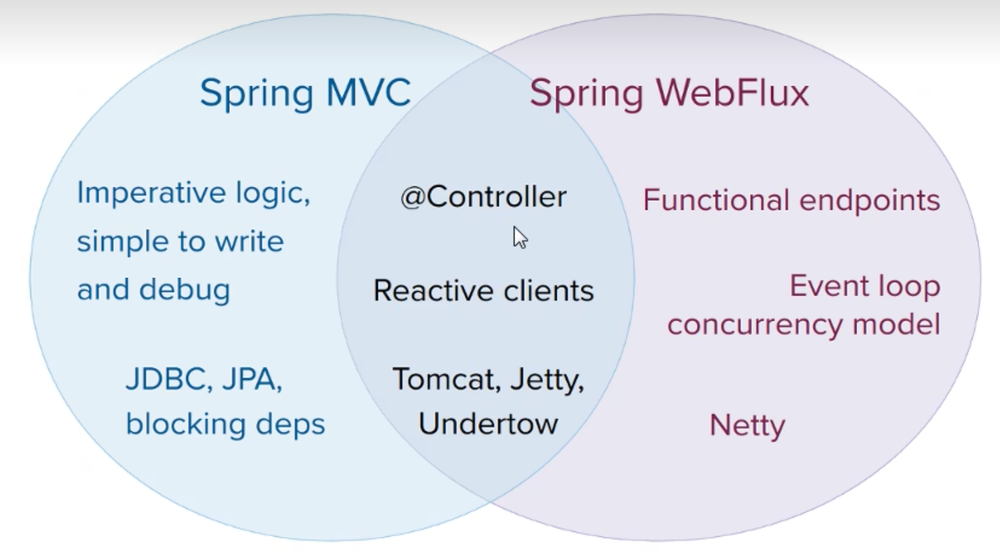
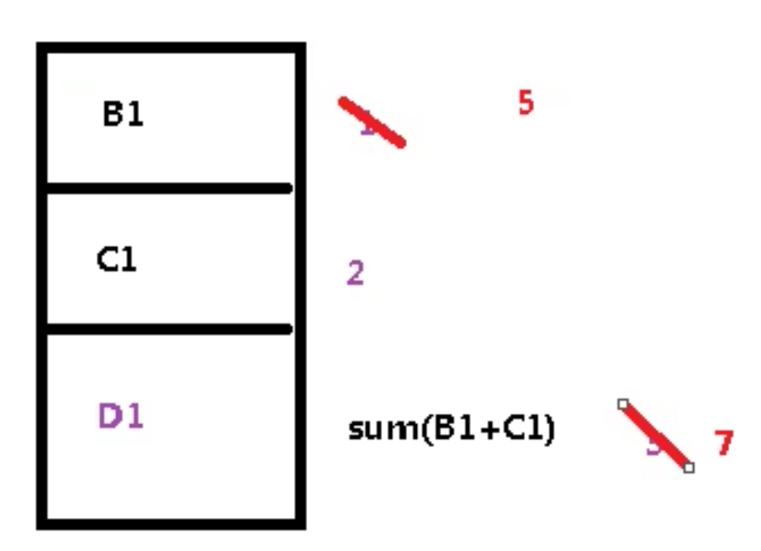
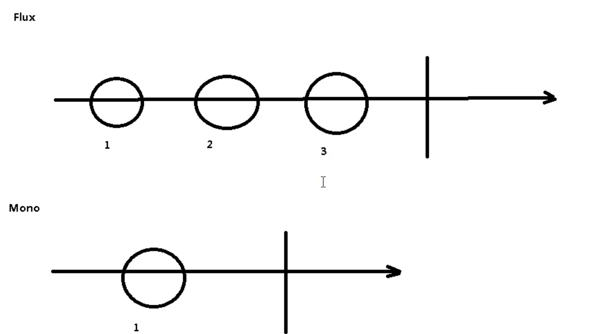
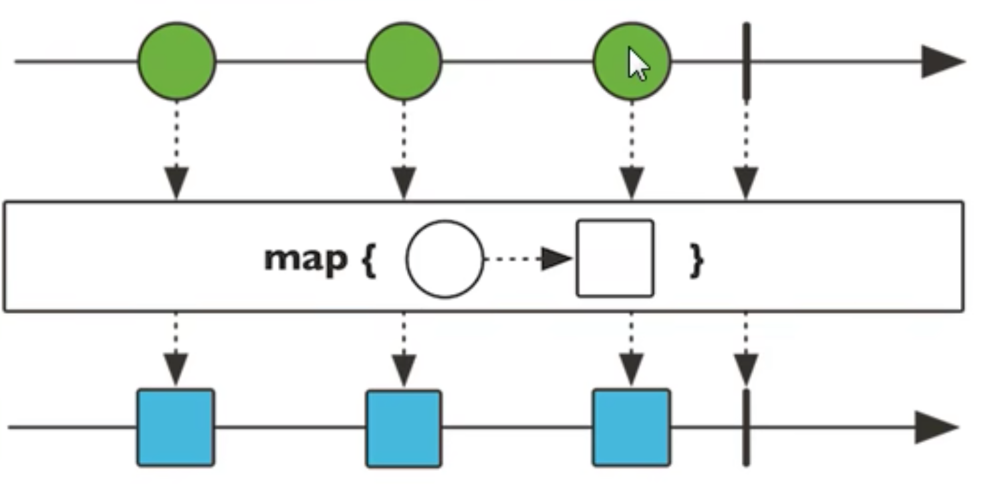
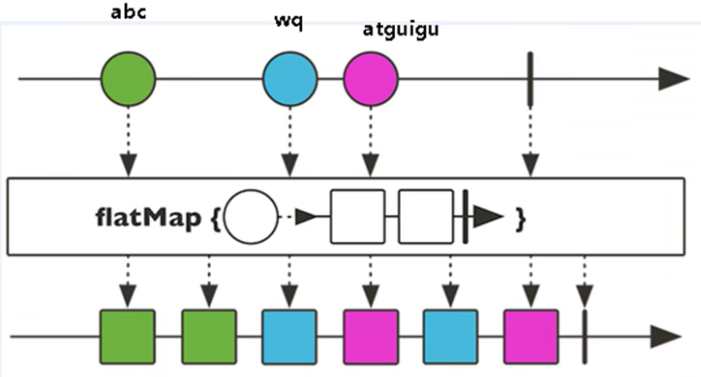
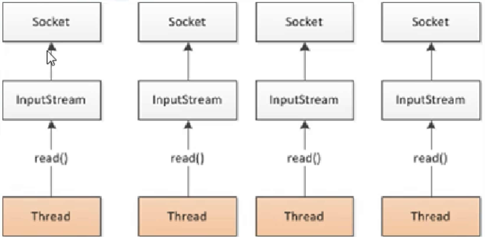
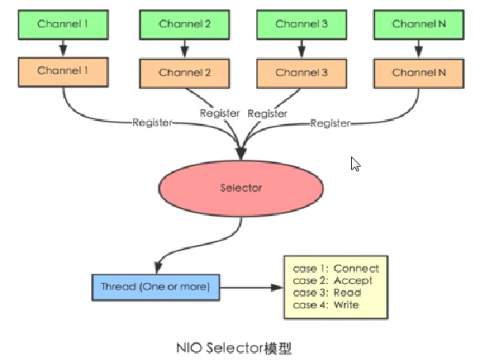
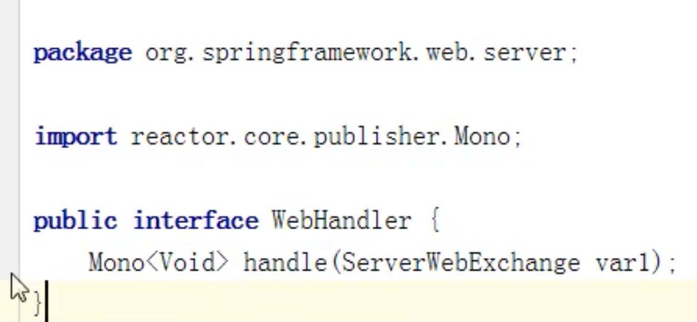
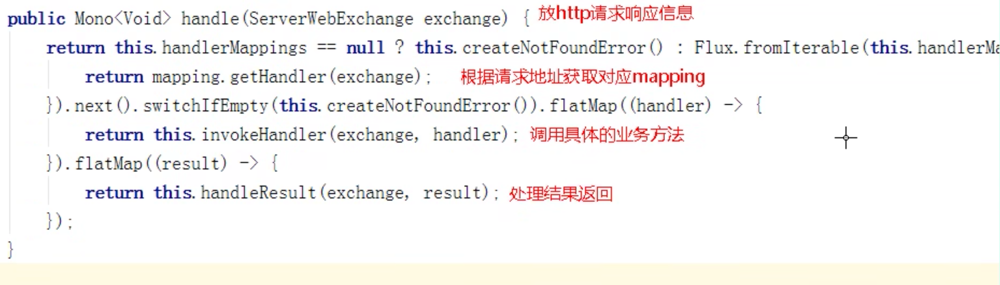

# WebFlux
> 这一块了解就行，不用掌握。
## 1 WebFlux简介
> 第一轮：就是看视频教程学会所有技术的原理和基本使用方法
> 第二轮：阅读官方的文档，尤其是Spring、Java、Maven等，掌握编程的细节。


### 简介
Spring5添加的新模块。用于web开发的，功能与SpringMVC类似。Webflux使用与当前比较流行的响应式编程出现的框架。

传统的Web框架，比如SpringMVC，基于Servlet容器，Webflux是一种异步非阻塞的框架。（异步非阻塞的框架在Servlet3.1后才支持）

其和虚拟式基于Reactor的相关API实现的。


### 异步非阻塞

我更喜欢反过来理解这里。同步异步是针对被调用者的，阻塞和非阻塞是针对调用者的。

* **阻塞和非阻塞针对调用者**。阻塞和非阻塞指的是调用者（程序）在等待返回结果（或输入）时的状态。阻塞时，在调用结果返回前，当前线程会被挂起，并在得到结果之后返回。非阻塞时，如果不能立刻得到结果，则该调用者不会阻塞当前线程。因此对应非阻塞的情况，调用者需要定时轮询查看处理状态。阻塞： 阻塞就是发起一个请求，调用者一直等待请求结果返回，也就是当前线程会被挂起，无法从事其他任务，只有当条件就绪才能继续。非阻塞： 非阻塞就是发起一个请求，调用者不用一直等着结果返回，可以先去干其他事情。。

* **异步和同步是针对被调用者**，同步： 同步就是发起一个调用后，被调用者未处理完请求之前，调用不返回。异步： 异步就是发起一个调用后，立刻得到被调用者的回应表示已接收到请求，但是被调用者并没有返回结果，此时我们可以处理其他的请求，被调用者通常依靠事件，回调等机制来通知调用者其返回结果。

### 与SpringMVC对比



* 异步非阻塞，在有限的资源下，能够处理更多的请求，提高系统地吞吐量。
* 函数式编程。（Java最基本的编程模式）。能够使用Java函数式编程的特点。
* 两个框架都可以使用注解方式运行，都可以运行在Tomcat等Servlet容器中。但SpringMVC采用命令式编程，WebFlux使用响应式编程。


### 使用场景：网关
* 需要处理大量的请求。所有客户调用网关，网关负责调用其他的组件。可以使用异步的方式。

## 2 响应式编程

### 响应式编程定义
响应式编程是一种面向数据流和变化产波的编程范式。

意味着可以在编程语言很方便地表达静态或者动态的数据流，


一个响应式编程的典型例子。D1=B1+C1。当B1的值修改后，D1的值也会修改。B1的数据变化，流向了D1。


### Java8响应式编程

是要使用观察者模式，实现了响应式编程。使用响应式编程Observer,Observable实现。
```java
/**
 * Alipay.com Inc.
 * Copyright (c) 2004-2022 All Rights Reserved.
 */
package com.ykl.shangguigu08.reactor;

import java.util.Observable;

/**
 * @author yinkanglong
 * @version : ObserverDemo, v 0.1 2022-10-12 19:47 yinkanglong Exp $
 */
public class ObserverDemo extends Observable {

    /**
     * 通过Java8中的类实现响应式编程。
     * 简单来说，就是观察值模式。
     * @param args
     */
    public static void main(String[] args) {
        ObserverDemo observerDemo = new ObserverDemo();

        observerDemo.addObserver((o,arg)->{
            System.out.println("发生变化");
        });

        observerDemo.addObserver((o,arg)->{
            System.out.println("准备改变");
        });

        observerDemo.setChanged();
        observerDemo.notifyObservers();
    }
}
```
### java9响应式编程
主要通过Flow类的sub和sub订阅消息，实现响应式编程。
> 感觉这个响应式编程和awt控件的点击相应式操作很相似。但是不是启动新的线程。

```
```
### 响应式编程（Reator实现）

* 响应式编程操作，Reactor是满足Reactive规范框架
* Reactor有两个核心类，Mono和Flux，这两个类实现接口Publisher，提供丰富操作符号，Flux对象实现发布，返回N个元素。Mono实现发布者，返回0或者1个元素。
* Flux和Mono都是数据流的发布者。能够发出三种信号
  * 元素值
  * 完成信号。一种终止信号。订阅者数据流已经结束了。
  * 错误信号。一种终止信号。终止数据流并把错误信息传递给订阅者。



三种信号的特点
* 错误信号和完成信号都是终止信号不能共存。
* 如果没有发送任何元素值，而是直接发送错误或者完成信号，表示空数据流
* 如果没有错误信号，没有完成信号，表示无限数据流。

### 实例：Flux&Mono

引入相关的依赖
```
        <dependency>
            <groupId>io.projectreactor</groupId>
            <artifactId>reactor-core</artifactId>
            <version>3.1.5.RELEASE</version>
        </dependency>
```

进行发布者发布内容
```java
package com.ykl.shangguigu08.reactor;

import reactor.core.publisher.Flux;
import reactor.core.publisher.Mono;

import java.util.ArrayList;
import java.util.Arrays;
import java.util.List;
import java.util.stream.Stream;

/**
 * @author yinkanglong
 * @version : TestReactor, v 0.1 2022-10-13 10:25 yinkanglong Exp $
 */
public class TestReactor {

    public static void main(String[] args) {
        //reactor中的核心语法
        Flux.just(1,2,3,4);
        Mono.just(1);

        //其他方法
        Integer[] array = {1,2,3,4};
        Flux.fromArray(array);

        List<Integer> list = Arrays.asList(array);
        Flux.fromIterable(list);
        
        Stream<Integer> stream = list.stream();
        Flux.fromStream(stream);
    }
}
```
* just等发布方法只是声明了数据流。只有声明了订阅者才会触发数据流，不订阅，就不会触发。

```
Flux.just(1,2,3,4).subscribe(System.out::print);
Mono.just(1).subscribe(System.out::print);
```
### 操作符
对数据流进行一道道操作，成为操作符，比如工厂流水线。
* 操作符map。将元素映射为新的元素。
* 操作符flatmap。元素映射为流。





## 4 WebFlux执行流程和核心API

### Netty的基本原理
SpringWebflux基于Reactor，默认使用容器Netty，Netty是高性能的NIO框架，异步非阻塞框架。

1. BIO阻塞



2. NIO非阻塞




### SpringWebFlux

* SpringWebflux核心控制器DispatchHandler，实现接口WebHandler



### 关键类
DispatcherHandler负责请求处理。有三个核心类。



* HandlerMapping（reactor反应器）：请求查询到处理方法。
* HandlerAdapter：真正负责请求处理（processor部分）
* HandlerResultHandler：对结果进行处理

### 函数式编程实现
两个核心接口。
* RouterFunction 路由处理
* HandlerFunction处理函数


## 5 WebFlux基于注解的编程的实现


### 创建WebFlux项目
1. 创建Springboot项目，引入webflux的依赖
```xml
pom.xml

<?xml version="1.0" encoding="UTF-8"?>
<project xmlns="http://maven.apache.org/POM/4.0.0" xmlns:xsi="http://www.w3.org/2001/XMLSchema-instance"
         xsi:schemaLocation="http://maven.apache.org/POM/4.0.0 https://maven.apache.org/xsd/maven-4.0.0.xsd">
    <modelVersion>4.0.0</modelVersion>
    <parent>
        <groupId>org.springframework.boot</groupId>
        <artifactId>spring-boot-starter-parent</artifactId>
        <version>2.2.1.RELEASE</version>
        <relativePath/> <!-- lookup parent from repository -->
    </parent>
    <groupId>com.example</groupId>
    <artifactId>shangguigu09</artifactId>
    <version>0.0.1-SNAPSHOT</version>
    <name>shangguigu09</name>
    <description>shangguigu09</description>
    <properties>
        <java.version>1.8</java.version>
    </properties>
    <dependencies>
        <dependency>
            <groupId>org.springframework.boot</groupId>
            <artifactId>spring-boot-starter-webflux</artifactId>
        </dependency>

        <dependency>
            <groupId>org.springframework.boot</groupId>
            <artifactId>spring-boot-starter-test</artifactId>
            <scope>test</scope>
        </dependency>
    </dependencies>

    <build>
        <plugins>
            <plugin>
                <groupId>org.springframework.boot</groupId>
                <artifactId>spring-boot-maven-plugin</artifactId>
            </plugin>
        </plugins>
    </build>

</project>
```
2. 在配置文件中，设置启动端口号8081
```yaml
server.port =8081
```
3. 从上到下设计代码：创建接口和实现类

```java
@Service
public class UserServiceImpl implements UserService {
    private final Map<Integer,User> users = new HashMap<>();

    public UserServiceImpl() {

        this.users.put(1,new User("lucy","nan",10));
        this.users.put(2,new User("mary","nv",38));
        this.users.put(3,new User("jack","nv",32));

    }

    @Override
    public Mono<User> getUserById(int id) {
        return Mono.justOrEmpty(this.users.get(id));
    }

    @Override
    public Flux<User> getAllUser() {
        return Flux.fromIterable(this.users.values());
    }

    @Override
    public Mono<Void> savaUserInfo(Mono<User> userMono) {
        return userMono.doOnNext(person->{
            int id = users.size() + 1;
            users.put(id,person);
        }).thenEmpty(Mono.empty());
    }
}
```

4. 从下到上实现代码：实现业务逻辑
```java

@RestController
public class UserController {
    @Autowired
    private UserService userService;

    //id
    @GetMapping("/user/{id}")
    public Mono<User> getUserById(@PathVariable int id){
        return userService.getUserById(id);
    }

    //all
    @GetMapping("/user")
    public Flux<User> getAllUser(){
        return userService.getAllUser();
    }
    //tianjian
    @GetMapping("/saveuser")
    public Mono<Void> saveUser(@RequestBody User user){
        Mono<User> userMono = Mono.just(user);
        return userService.savaUserInfo(userMono);
    }
}
```


### 实现说明
* SpringMVC范式，同步阻塞方式，基于SpringMVC+Servlet+Tomcat
* SpringWebflux方式，异步非阻塞方式，基于SpringMVCWebflux+Reactor+Netty


## 6 WebFlux基于函数的编程的实现

### 简要说明
> bio,nio,aio
在使用函数式编程，需要自己初始化服务器

基于函数式编程模型的时候，有两个核心接口。
* RouterFunction 实现路由功能，请求转发给对应的handler
* HandlerFunction 处理请求生成响应函数。

核心任务定义两个函数式接口的实现，并启动需要的服务器。

SpringWebFlux的请求和响应是
* ServerRequest
* ServerResponse


### 实现流程
1. 从上到下实现业务bean
2. 创建handler实现Mono方法

```java

public class UserHandler {

    private final UserService userService;
    public UserHandler(UserService userService){
        this.userService = userService;
    }

    //根据id
    public Mono<ServerResponse> getUserById(ServerRequest request){
        //获取id值
        int  userid = Integer.valueOf( request.pathVariable("id"));
        Mono<ServerResponse> notFound = ServerResponse.notFound().build();
        //调用service方法取得数据
        Mono<User> userMono = this.userService.getUserById(userid);

        //UserMono进行转换返回。Reactor操作符
        return userMono.flatMap(person->ServerResponse.ok().contentType(MediaType.APPLICATION_JSON)
                .body(fromObject(person)))
                .switchIfEmpty(notFound);

    }

    //所有用户
    public Mono<ServerResponse> getAllUsers(){
        Flux<User> users = this.userService.getAllUser();
        return ServerResponse.ok().contentType(MediaType.APPLICATION_JSON).body(users,User.class);

    }


    //添加
    public Mono<ServerResponse> saveUser(ServerRequest request){
        Mono<User> userMono = request.bodyToMono(User.class);
        return ServerResponse.ok().build(this.userService.savaUserInfo(userMono));
    }
}
```

3. 创建并初始化服务器，设置路由和handler

```java
public class Server {
    //创建路由
    public RouterFunction<ServerResponse> route(){
        UserService userService = new UserServiceImpl();
        UserHandler handler = new UserHandler(userService);

        return RouterFunctions.route(GET("/users/{id}").and(accept(MediaType.APPLICATION_JSON)),handler::getUserById);
//                .andRoute(GET("users").and(accept(MediaType.APPLICATION_JSON)),handler::getAllUsers)
//                .andRoute(GET("saveuser").and(accept(MediaType.APPLICATION_JSON)),handler::saveUser);

    }

    public void createReactorServer(){
        RouterFunction<ServerResponse> route = route();
        HttpHandler httpHandler = toHttpHandler(route);

        ReactorHttpHandlerAdapter reactorHttpHandlerAdapter = new ReactorHttpHandlerAdapter(httpHandler);

        HttpServer httpServer = HttpServer.create();
        httpServer.handle(reactorHttpHandlerAdapter).bindNow();
    }

    public static void main(String[] args) throws Exception{
        Server server = new Server();
        server.createReactorServer();
        System.out.println("enter to exit");
        System.in.read();
    }
}
```

### WebClient调用


```java
public class Client {

    public static void main(String[] args) {
        WebClient webClient = WebClient.create("http://127.0.0.1:62418");
        User userMono = webClient.get().uri("/users/{id}", "1").accept(MediaType.APPLICATION_JSON).retrieve().bodyToMono(User.class).block();
        System.out.println(userMono.getName());
    }
}

```