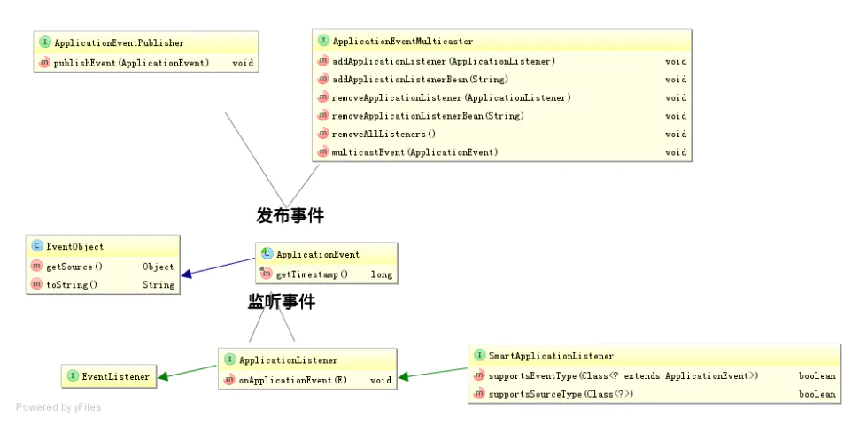
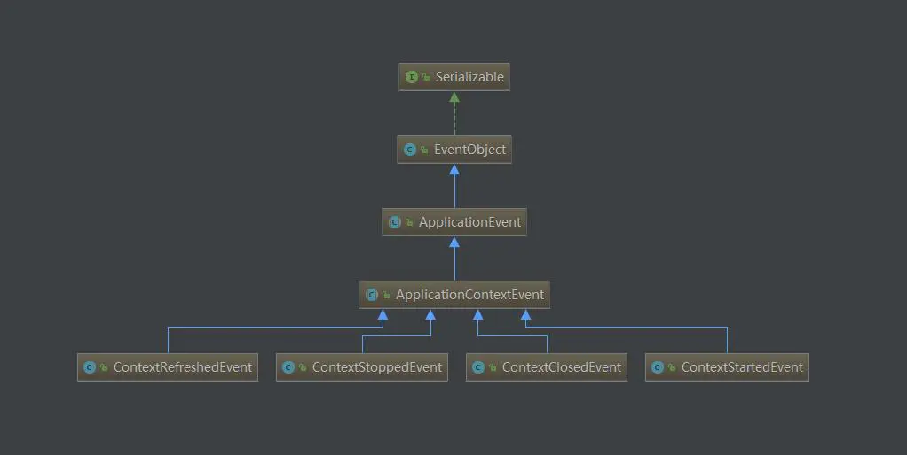
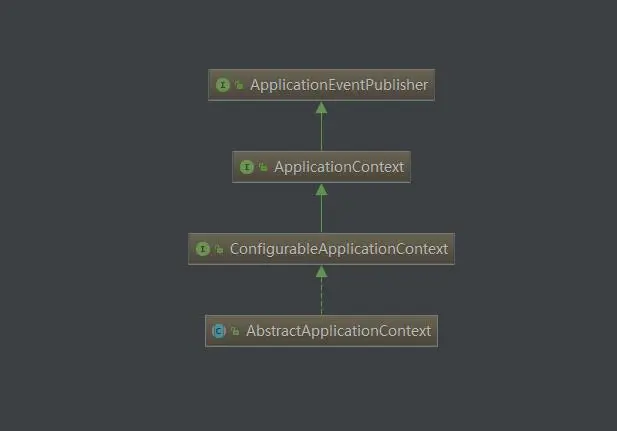
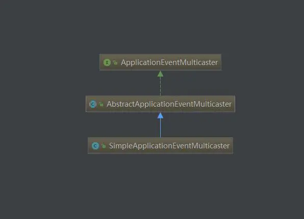

## 1 原理说明

### 事件驱动模型和观察者模式
一下名称具有相同的含义，都是观察着模式在不同场景下的实现。
* Spring的事件驱动模型
* 设计模式中的观察者模式
* jdk中的observable和observer
* ui中事件监听机制
* 注册中心和消息队列的订阅发布机制

先是一种对象间的一对多的关系；最简单的如交通信号灯，信号灯是目标（一方），行人注视着信号灯（多方）。当目标发送改变（发布），观察者（订阅者）就可以接收到改变。 观察者如何处理（如行人如何走，是快走/慢走/不走，目标不会管的）, 目标无需干涉；所以就松散耦合了它们之间的关系。

### Spring中实现

### 类图关系
* 事件

* 发布（动作）
  * ApplicationContext 接口继承了 ApplicationEventPublisher，并在 AbstractApplicationContext 实现了具体代码，实际执行是委托给ApplicationEventMulticaster（可以认为是多播）

* 监听

