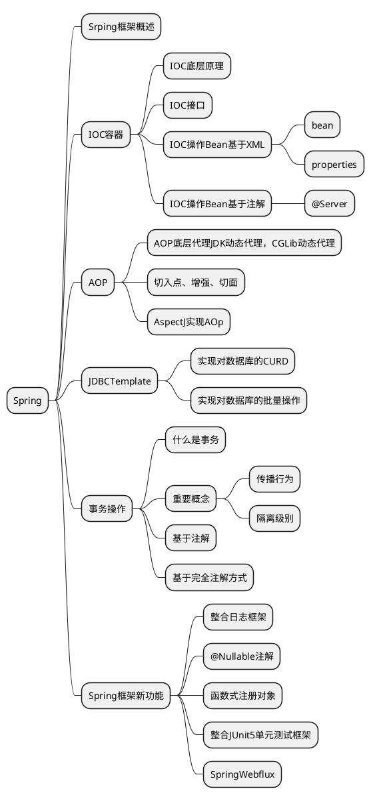

```plantuml
@startmindmap
* Spring
** Srping框架概述
** IOC容器
*** IOC底层原理
*** IOC接口
*** IOC操作Bean基于XML
**** bean
**** properties
*** IOC操作Bean基于注解
**** @Server
** AOP
*** AOP底层代理JDK动态代理，CGLib动态代理
*** 切入点、增强、切面
*** AspectJ实现AOp
** JDBCTemplate
*** 实现对数据库的CURD
*** 实现对数据库的批量操作
** 事务操作
*** 什么是事务
*** 重要概念
**** 传播行为
**** 隔离级别
*** 基于注解
*** 基于完全注解方式
** Spring框架新功能
*** 整合日志框架
*** @Nullable注解
*** 函数式注册对象
*** 整合JUnit5单元测试框架
*** SpringWebflux


@endmindmap

```