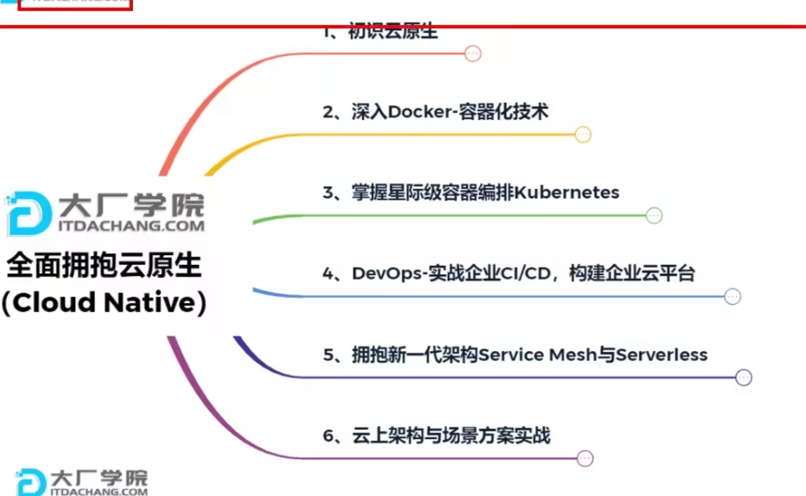

# 内容简介
> springboot本就是一个专门用来配置的框架，用来整合各种各样的配置。所以主要内容也是与配置相关。
> * 配置文件
> * web开发
> * 数据访问
> * 但愿测试
> * 指标监控
> * 核心原理
> 。。。

## 1 springboot背景
springboot + springcloud
### 微服务
1. 架构风格
2. 小型服务，灵活拆分
3. 自动部署
4. 去中心化、服务治理


### 分布式
1. 远程调用rpc——http
2. 服务发现——网关和注册中心
3. 负载均衡和任务调度
4. 服务容错——流量控制和熔断
5. 配置管理——配置中心
6. 服务监控——RMS
7. 链路追踪——log
8. 日志管理——云图log


### 云原生

1. 服务自愈
2. 弹性伸缩
3. 服务隔离
4. 自动化部署机制
5. 灰度发布，逐渐替代旧版本
6. 流量治理





## 2 springboot概述

### 基本概念
Spring Boot 是基于 Spring 框架基础上推出的一个全新的框架, 旨在让开发者可以轻松地创建一个可独立运行的，生产级别的应用程序。利用控制反转的核心特性，并通过依赖注入实现控制反转来实现管理对象生命周期容器化，利用面向切面编程进行声明式的事务管理，整合多种持久化技术管理数据访问，提供大量优秀的Web框架方便开发等等。

> [参考文献](https://www.yuque.com/atguigu/springboot/na3pfd)


### 框架优势

1. 能够轻松、方便地创建一个 Spring 应用;
2. 直接使用内嵌的 Tomcat, Jetty, Undertow 容器（无需再手动安装容器，通过部署 WAR 包的方式）;
3. 内部自动管理各种 Jar 包的版本依赖关系，再也不用为版本冲突而烦恼啦；
4. 自动化配置 Spring 相关功能，以及第三方库;
5. 提供诸如指标，健康检查, 外部化配置等功能；
6. "零配置"，再也不需要手写地狱般的 XML 配置了；
7. java8 适配器设计模式。接口有了默认实现。

#### 框架特点

* REST风格
* IOC控制反转
* AOP面向切面

## 3 Springboot的作用

### 依赖管理
* 在parent中管理版本信息
* 几乎声明了所有开发中常用的依赖的版本号,自动版本仲裁机制

```xml
依赖管理    
<parent>
        <groupId>org.springframework.boot</groupId>
        <artifactId>spring-boot-starter-parent</artifactId>
        <version>2.3.4.RELEASE</version>
</parent>

他的父项目
 <parent>
    <groupId>org.springframework.boot</groupId>
    <artifactId>spring-boot-dependencies</artifactId>
    <version>2.3.4.RELEASE</version>
  </parent>

```

### 自动配置
> 通过java代码的方式，配置好其他组件。它在自动配置领域主要做了以下事情：
> * 默认的自动配置。对于所有组件，都指定了默认的约定俗称的最优的自动配置，用户可以不了解具体的配置项，开箱即用，按照约定完成业务逻辑即可。
> * 可控的自动配置。对于所有组件，都提供了开放的自动配置接口，xxxProperties中读取并加载用户的配置属性，灵活地集成各种框架，高效快速定制化。
> * 自定义自动配置。对于用户自定义的模块和组件，springboot提供了一套自动配置的解决方案，通过springboot的自动配置注解，完成用户自己的模块的自动配置。十分方便。
> 从初阶的默认配置使用，通过配置文件定制化使用，借用springboot实现第三方模块自动配置的机制实现自定义模块自动配置，总共包括三个层次和阶段。
  

例如：能够自动引入并配置好tomcat

```xml
<dependency>
      <groupId>org.springframework.boot</groupId>
      <artifactId>spring-boot-starter-tomcat</artifactId>
      <version>2.3.4.RELEASE</version>
      <scope>compile</scope>
</dependency>
```

* 自动引入并配置好SpringMVC，引入SpringMVC的组件
* 自动配置好web常见的功能
* 默认的包结构（配置好了默认的扫描路径）

```java
@SpringBootApplication
等同于
@SpringBootConfiguration
@EnableAutoConfiguration
@ComponentScan("com.atguigu.boot")
```

* 各种配置拥有默认值
  * 默认配置最终都是映射到某个类上，如：MultipartProperties
  * 配置文件的值最终会绑定每个类上，这个类会在容器中创建对象
* 按需加载所有自动配置项
  * 非常多的starter
  * 引入了哪些场景这个场景的自动配置才会开启
  * SpringBoot所有的自动配置功能都在 spring-boot-autoconfigure 包里面
