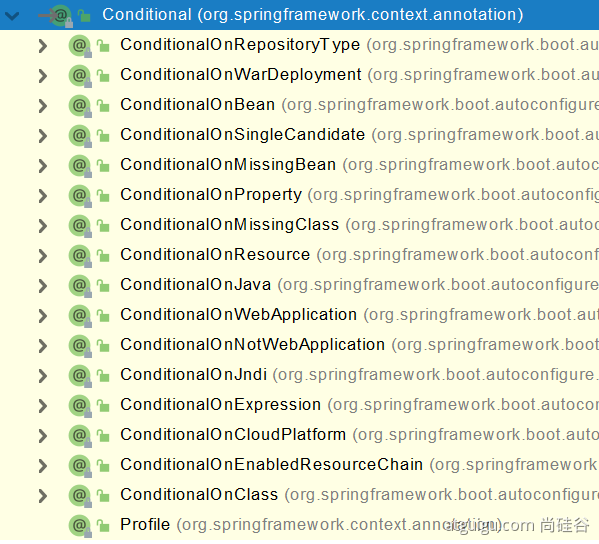

## 注解说明
注解体系
1. 元注解@Rentention @Docemented,@Inherited,@Target
2. JDK标准注解
3. Spring标准注解@Bean @Component @Serivce,@Controller,@Configuration,@Import,@Autowire
4. springboot补充注解

### @SpringbootConfiguration

```
@SpringBootConfiguration  springboot启动
@EnableAutoConfiguration  通过properties自动加载
@ComponentScan("com.atguigu.boot")扫描范围
```

springboot项目中的启动注解。

### @Configuration&@Bean
1. 配置类本身也是组件，相当于将组件注册到Spring当中。即把类的对象交给Spring管理。
2. proxybeanMethods:代理bean方法。可以解决组件间的依赖问题。如果为false，Springboot不会检查配置类中组件间的依赖，对于依赖的其他对象直接创建新的对象。true的时候每次运行都会检查配置中组件间的依赖，不会创建新的对象。
   1. full（proxyBeanMehtods=true）
   2. lite（proxyBeanMethods=false)
### @Bean
1. 配置类实用@Bean标注方法上给容器注册组件，默认也是单实例。id默认为方法名。可以通过参数指定
2. 外部类可以从Spring的容器中取出在Configuration类中注册的实例。而且都是单实例对象。

```
@Component @Controller @Service @Repository 都是以前的用法

```

### @Import

1. 将指定的组件导入到组件。给容器中自动创建指定类型的无参构造的组件。
2. 默认组件的名字是全类名。即包括包和类的名字。


### @conditional
1. 条件装配。满足Conditional指定的条件，则进行组件注入。


* @ConditionalOnBean(name="bean")当容器中存在指定名称的容器的时候，才会进行注册。

```
@ConditionalOnBean(name="")
```

### @ImportResource

1. 在一个配置类中，导入xml中的配置文件。

```
@ImportResource(classpath:"hello.xml")
```

### @ConfigurationProperties
1. 只有在容器中的组件，才会有Springboot的强大功能。
2. 从配置文件中自动加载，进行属性配置，然后使用Componet注册
```
@Component
@ConfigurationProperties(prefix="mycar",)
class Car(){

}
```

### @EnableConfigurationProperties

1. 在配置类上开启属性配置功能。开启car的属性配置功能
2. 该中方法对配置类进行修改然后装配。不需要修改类本身的代码。
```
@EnableConfigurationProperties(Car.class)
class MyConfig{

}
```
### @Autowired

1. 容器中的自动注入。
 