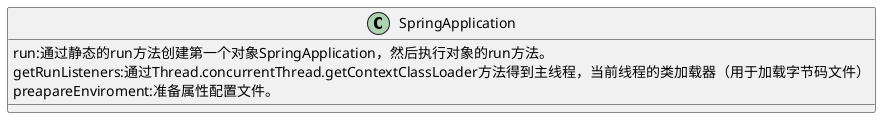

## 1 springboot的启动过程

springcontext.run到底干了什么


* SpringApplication.run该run方法可以启动一个类，也可以启动多个类

```
	public static ConfigurableApplicationContext run(Class<?> primarySource, String... args) {
		return run(new Class<?>[] { primarySource }, args);
	}

	/**
	 * Static helper that can be used to run a {@link SpringApplication} from the
	 * specified sources using default settings and user supplied arguments.
	 * @param primarySources the primary sources to load
	 * @param args the application arguments (usually passed from a Java main method)
	 * @return the running {@link ApplicationContext}
	 */
	public static ConfigurableApplicationContext run(Class<?>[] primarySources, String[] args) {
		return new SpringApplication(primarySources).run(args);
	}
```

## 2 自动配置加载的过程
### 加载过程

* @SpringBootConfiguration，就是一个@Configuration配置类。定义这是一个配置类。
* @ComponentScan指定包扫描
* @EnableAutoConfiguration
  * @AutoConfigurationPackage自动配置包。将该包下的所有配置类导入进去。
  * @Import(AutoConfigurationImportSelect.class)导入一个包。在autoconfiguration.jar包下，META_INF/spring.factories文件中，给出了全类名。


### 自动配置总结
* Spring 加载所有的自动配置类
* 每个自动配置类按照条件生效，默认会绑定配置文件指定的值。xxxProperties和属性配置文件进行绑定。
* 生效的配置类给容器中装配很多组件。
* 只要容器中有这些组件，相当于这些功能就有了
* 只要用户配置了，以用户的优先。
  * 定制化，用自己的Bean替换底层的组件
  * 用户去看这个组件获取的配置文件是什么值就去修改什么值。 


### 需要怎么使用

1. 引入场景依赖
   1. 看一下springboot官网的常见的starter场景
2. 查看自动配置了哪些类
   1. 自己分析，引入场景对应的自动配置类，自动配置一般都生效了。
   2. 配置文件中debug=true开启自动配置报告，negative\postive会显示生效和不生效的配置
3. 是否需要修改
   1. 参照文档修改配置项Properties配置绑定。参考官方的配置文档。
   2. 自定义或加入替换组件。通过@Bean替换组件
   3. 额外的自定义器。xxxCustomizer


