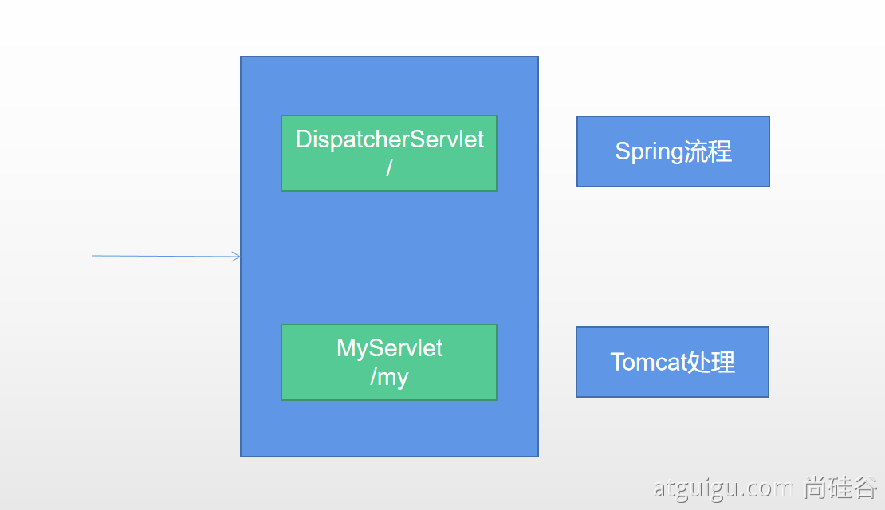

## 0 概述

使用的标准方法

```java
@ServletComponentScan(basePackages = "com.atguigu.admin") :指定原生Servlet组件都放在那里
@WebServlet(urlPatterns = "/my")：效果：直接响应，没有经过Spring的拦截器？
@WebFilter(urlPatterns={"/css/*","/images/*"})
@WebListener
```

## WebServlet

```java
@WebServlet(urlPatterns = "/path2/*")
public class MyServlet extends HttpServlet {

  @Override
  protected void doGet (HttpServletRequest req, HttpServletResponse resp)
            throws ServletException, IOException {

      PrintWriter writer = resp.getWriter();
      writer.println("response from servlet ");
  }
}
```

## WebFilter

```java
@WebFilter(urlPatterns = "/*")
public class MyFilter implements Filter{
  
  @Override
  public void init (FilterConfig filterConfig) throws ServletException {

  }

  @Override
  public void doFilter (ServletRequest request,
                        ServletResponse response, FilterChain chain)
            throws IOException, ServletException {
      String url = request instanceof HttpServletRequest ?
                ((HttpServletRequest) request).getRequestURL().toString() : "N/A";
      System.out.println("from filter, processing url: "+url);
      chain.doFilter(request, response);
  }

  @Override
  public void destroy () {

  }
}
```


## WebListener

```java
@WebListener
public class MyServletListener implements ServletContextListener{
  
  @Override
  public void contextInitialized (ServletContextEvent sce) {
      System.out.println("from ServletContextListener: " +
                                   " context initialized");

  }

  @Override
  public void contextDestroyed (ServletContextEvent sce) {

  }
}
```


### DispatcherServlet 

DispatchServlet 如何注册进来
● 容器中自动配置了  DispatcherServlet  属性绑定到 WebMvcProperties；对应的配置文件配置项是 spring.mvc。
● 通过 ServletRegistrationBean<DispatcherServlet> 把 DispatcherServlet  配置进来。
● 默认映射的是 / 路径。




### 使用RegistrationBean
ServletRegistrationBean, FilterRegistrationBean, and ServletListenerRegistrationBean

```java
@Configuration
public class MyRegistConfig {

    @Bean
    public ServletRegistrationBean myServlet(){
        MyServlet myServlet = new MyServlet();

        return new ServletRegistrationBean(myServlet,"/my","/my02");
    }


    @Bean
    public FilterRegistrationBean myFilter(){

        MyFilter myFilter = new MyFilter();
//        return new FilterRegistrationBean(myFilter,myServlet());
        FilterRegistrationBean filterRegistrationBean = new FilterRegistrationBean(myFilter);
        filterRegistrationBean.setUrlPatterns(Arrays.asList("/my","/css/*"));
        return filterRegistrationBean;
    }

    @Bean
    public ServletListenerRegistrationBean myListener(){
        MySwervletContextListener mySwervletContextListener = new MySwervletContextListener();
        return new ServletListenerRegistrationBean(mySwervletContextListener);
    }
}
```

## 2 嵌入式Servlet容器

### 方法
● 默认支持的webServer
  ○ Tomcat, Jetty, or Undertow
  ○ ServletWebServerApplicationContext 容器启动寻找ServletWebServerFactory 并引导创建服务器
● 切换服务器

```java
<dependency>
    <groupId>org.springframework.boot</groupId>
    <artifactId>spring-boot-starter-web</artifactId>
    <exclusions>
        <exclusion>
            <groupId>org.springframework.boot</groupId>
            <artifactId>spring-boot-starter-tomcat</artifactId>
        </exclusion>
    </exclusions>
</dependency>
```

### 原理

* SpringBoot应用启动发现当前是Web应用。web场景包-导入tomcat
* web应用会创建一个web版的ioc容器 ServletWebServerApplicationContext 
* ServletWebServerApplicationContext  启动的时候寻找 ServletWebServerFactory（Servlet 的web服务器工厂---> Servlet 的web服务器）  
* SpringBoot底层默认有很多的WebServer工厂；TomcatServletWebServerFactory, JettyServletWebServerFactory, or UndertowServletWebServerFactory
* 底层直接会有一个自动配置类。ServletWebServerFactoryAutoConfiguration
* ServletWebServerFactoryAutoConfiguration导入了ServletWebServerFactoryConfiguration（配置类）
* ServletWebServerFactoryConfiguration 配置类 根据动态判断系统中到底导入了那个Web服务器的包。（默认是web-starter导入tomcat包），容器中就有 TomcatServletWebServerFactory
* TomcatServletWebServerFactory 创建出Tomcat服务器并启动；TomcatWebServer 的构造器拥有初始化方法initialize---this.tomcat.start();
* 内嵌服务器，就是手动把启动服务器的代码调用（tomcat核心jar包存在）


## 3 定制Servlet容器
● 实现  WebServerFactoryCustomizer<ConfigurableServletWebServerFactory> 
  ○ 把配置文件的值和ServletWebServerFactory 进行绑定
● 修改配置文件 server.xxx
● 直接自定义 ConfigurableServletWebServerFactory 

xxxxxCustomizer：定制化器，可以改变xxxx的默认规则

```java
import org.springframework.boot.web.server.WebServerFactoryCustomizer;
import org.springframework.boot.web.servlet.server.ConfigurableServletWebServerFactory;
import org.springframework.stereotype.Component;

@Component
public class CustomizationBean implements WebServerFactoryCustomizer<ConfigurableServletWebServerFactory> {

    @Override
    public void customize(ConfigurableServletWebServerFactory server) {
        server.setPort(9000);
    }

}
```

### 定制化的常见方式 
多级定制化方式
● 修改配置文件；
● xxxxxCustomizer；
● 编写自定义的配置类   xxxConfiguration；+ @Bean替换、增加容器中默认组件；视图解析器 
● Web应用 编写一个配置类实现 WebMvcConfigurer 即可定制化web功能；+ @Bean给容器中再扩展一些组件

```java
@Configuration
public class AdminWebConfig implements WebMvcConfigurer
```

● @EnableWebMvc + WebMvcConfigurer —— @Bean  可以全面接管SpringMVC，所有规则全部自己重新配置； 实现定制和扩展功能
  ○ 原理
  ○ 1、WebMvcAutoConfiguration  默认的SpringMVC的自动配置功能类。静态资源、欢迎页.....
  ○ 2、一旦使用 @EnableWebMvc 、。会 @Import(DelegatingWebMvcConfiguration.class)
  ○ 3、DelegatingWebMvcConfiguration 的 作用，只保证SpringMVC最基本的使用
    ■ 把所有系统中的 WebMvcConfigurer 拿过来。所有功能的定制都是这些 WebMvcConfigurer  合起来一起生效
    ■ 自动配置了一些非常底层的组件。RequestMappingHandlerMapping、这些组件依赖的组件都是从容器中获取
    ■ public class DelegatingWebMvcConfiguration extends WebMvcConfigurationSupport
  ○ 4、WebMvcAutoConfiguration 里面的配置要能生效 必须  @ConditionalOnMissingBean(WebMvcConfigurationSupport.class)
  ○ 5、@EnableWebMvc  导致了 WebMvcAutoConfiguration  没有生效。