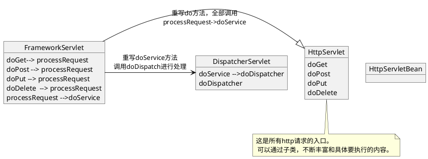

# web开发

## 概述
将springboot和springmvc结合起来的讲解

##  Springmvc的研究对象

```plantuml
@startuml

object HttpServlet{
    doGet
    doPost
    doPut
    doDelete
}
note bottom : 这是所有http请求的入口。\
\n 可以通过子类，不断丰富和具体要执行的内容。


object HttpServletBean{

}

object FrameworkServlet{
    doGet--> processRequest 
    doPost --> processRequest 
    doPut --> processRequest 
    doDelete  --> processRequest 
    processRequest -->doService 
}

object DispatcherServlet{
    doService -->doDispatcher 
    doDispatcher 
}


FrameworkServlet -|> HttpServlet : 重写do方法，全部调用\nprocessRequest->doService

FrameworkServlet -> DispatcherServlet : 重写doService方法\n调用doDispatch进行处理


@enduml
```