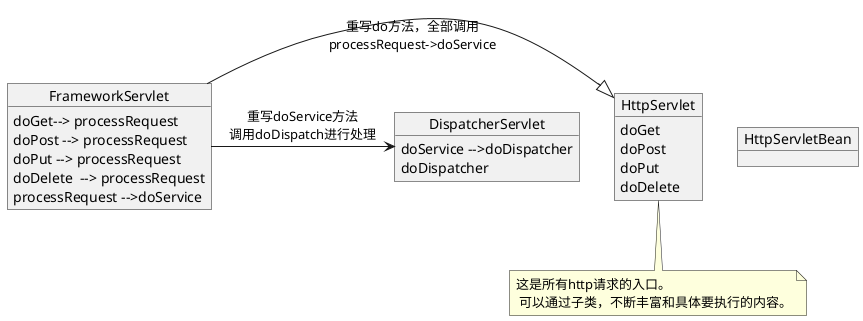

# web开发

将springboot和springmvc结合起来的讲解

关于父类和子类的作用的说明。记得在写毕设的时候，自己把父类当做工具类，子类在调用很多方法的时候，为了少写代码，就直接调用父类中的方法，然后导致父类中的流程函数，会调用子类中的方法，子类中的函数又会调用父类中的方法，非常凌乱，两个类相互冗余。当时也在思考，这些工具函数写在父类中供所有的子类调用与写一个util类有什么区别？

现在发现，应该遵循一些默认的编码规则，父类用来构建整体的流程，而子类用来完善丰富一些子流程。相当于父类在构建主流程的时候，空出一些细节实现的部分，让子类来完善。而不是写一写类似的工具函数，让子类来调用，子类能够看到更加全面丰富的流程，那么父类就没有存在的必要了，父类的作用可能就是一个接口了，只提供一些对外的方法声明。

综上所属：
* 接口：只提供对外的方法声明
* 父类：提供完整的流程，由父类调用未经实现的抽象方法完成整体流程的构建。
* 子类：提供丰富的细节实现，由子类实现抽象方法的细节。
* 工具类：提供给所有子类的通用的处理函数。

##  Springmvc的研究对象

