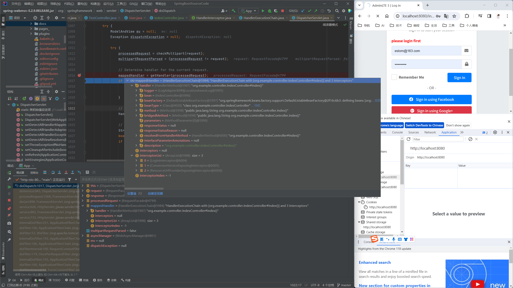
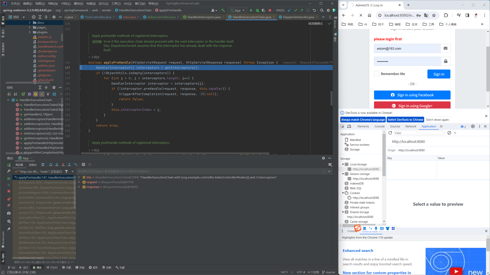
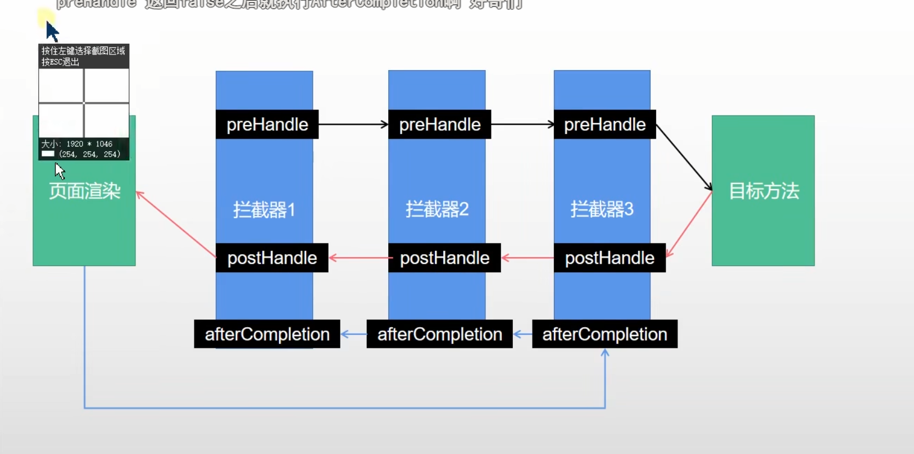

## 拦截器


## 1 Servlet中的Filter

Servlet中的过滤器Filter是实现了javax.servlet.Filter接口的服务器端程序，主要的用途是设置字符集、控制权限、控制转向、做一些业务逻辑判断等。

### Filter有如下几个用处。

* 在HttpServletRequest到达Servlet之前，拦截客户的HttpServletRequest。
* 根据需要检查HttpServletRequest，也可以修改HttpServletRequest头和数据。
* 在HttpServletResponse到达客户端之前，拦截HttpServletResponse。
* 根据需要检查HttpServletResponse，也可以修改HttpServletResponse头和数据。


### Filter有如下几个种类。

* 用户授权的Filter：Filter负责检查用户请求，根据请求过滤用户非法请求。
* 日志Filter：详细记录某些特殊的用户请求。
* 负责解码的Filter:包括对非标准编码的请求解码。
* 能改变XML内容的XSLT Filter等。
* Filter可以负责拦截多个请求或响应；一个请求或响应也可以被多个Filter拦截。

### Filter使用
创建Filter必须实现javax.servlet.Filter接口，在该接口中定义了如下三个方法。

* void init(FilterConfig config):用于完成Filter的初始化。
* void destory():用于Filter销毁前，完成某些资源的回收。
* void doFilter(ServletRequest request,ServletResponse response,FilterChain chain):实现过滤功能，该方法就是对每个请求及响应增加的额外处理。该方法可以实现对用户请求进行预处理(ServletRequest request)，也可实现对服务器响应进行后处理(ServletResponse response)—它们的分界线为是否调用了chain.doFilter(),执行该方法之前，即对用户请求进行预处理；执行该方法之后，即对服务器响应进行后处理


### Filter实例

```java
@WebFilter(filterName = "myFilter",urlPatterns = "/*")
public class MyFilter implements Filter {
    @Override
    public void init(FilterConfig filterConfig) throws ServletException {
    }
 
    @Override
    public void doFilter(ServletRequest request, ServletResponse response, FilterChain chain) {
    }
 
    @Override
    public void destroy() {
    }
}
 
@SpringBootApplication
@EnableAutoConfiguration
@EnableWebMvc
@ServletComponentScan(basePackages = "com.my.test.filter")//所扫描的包路径必须包含该Filter
public class Application {
 
    public static void main(String[] args) {
        SpringApplication.run(Application .class, args);
    }
```

## 2 Spring中的Filter

### 说明

  HandlerInterceptor 的功能跟过滤器类似，但是提供更精细的的控制能力：在request被响应之前、request被响应之后、视图渲染之前以及request全部结束之后。我们不能通过拦截器修改request内容，但是可以通过抛出异常（或者返回false）来暂停request的执行。


### 使用步骤
1. 编写一个拦截器。继承实现WebRequestInterceptor的类、实现了Spring 的HandlerInterceptor 接口

```java
package org.example.interceptor;

import lombok.extern.slf4j.Slf4j;
import org.example.bean.User;
import org.springframework.context.annotation.Bean;
import org.springframework.stereotype.Component;
import org.springframework.stereotype.Controller;
import org.springframework.web.servlet.HandlerInterceptor;
import org.springframework.web.servlet.ModelAndView;

import javax.servlet.http.HttpServletRequest;
import javax.servlet.http.HttpServletResponse;
import javax.servlet.http.HttpSession;


@Slf4j
@Component
public class LoginInterceptor implements HandlerInterceptor {

    @Override
    public boolean preHandle(HttpServletRequest request, HttpServletResponse response, Object handler) throws Exception {

        String uri = request.getRequestURI();
        log.info("preHandle intercept the uri:{}",uri);

        HttpSession session = request.getSession();
        Object user =  session.getAttribute("user");
        if (null == user){
//            request.setAttribute("msg","please login first");
            //request.getRequestDispatcher("/login").forward(request,response);
            request.getSession().setAttribute("msg","please login firse");
            response.sendRedirect("/login");
            return false;
        }
        return true;
    }

    @Override
    public void postHandle(HttpServletRequest request, HttpServletResponse response, Object handler, ModelAndView modelAndView) throws Exception {
        log.info("postHandle intercept the uri:{}",request.getRequestURI());
    }

    @Override
    public void afterCompletion(HttpServletRequest request, HttpServletResponse response, Object handler, Exception ex) throws Exception {
        log.info("afterCompletion intercept thr uri:{}",request.getRequestURI());
    }
}

```


1. 注册拦截器

```java

    @Configuration
    public class WebMvnConfig implements WebMvcConfigurer{
        @Autowired
        LoginInterceptor loginInterceptor;

        @Override
        public void addInterceptors(InterceptorRegistry registry) {
            registry.addInterceptor(loginInterceptor)
                    .addPathPatterns("/**")
                    .excludePathPatterns("/plugins/**","/dist/**","/login");
        }
    }
```

## 3 对比

### 对比

| Filter                                   | HandlerInterceptor                                      | 不同点                                                     |
|---------------------------------------------------------------|-------------------------------------------------------------------------------------------------|-----------------------------------------------------------------|
| Filter接口定义在Javax.servlet包中                                    | 接口HandlerInterceptor定义在org.springframework.web.servlet包中。                                       | 所在包不同                                                           |
| Filter在Servlet前后起作用,Filters通常将请求和相应当做黑盒，Filter通常不考虑servlet的实现 | 拦截器能够深入到方法前后、异常抛出前后等，因此拦截器的使用具有更大的弹性。允许用户介入（hook into）请求的生命周期，在请求过程中获取信息，Interceptor 通常和请求更加耦合。 | 在Spring构架的程序中，要优先使用拦截器。几乎所有 Filter 能够做的事情， interceptor 都能够轻松的实现 |
| Filter 是 Servlet 规范规定的。&nbsp;&nbsp; &nbsp;                    | 而拦截器既可以用于Web程序，也可以用于Application、Swing程序中。&nbsp;&nbsp; &nbsp;                                    | 使用范围不同                                                          |
| Filter是Servlet规范中定义的，是Servlet容器支持的&nbsp;&nbsp; &nbsp;         | 拦截器在Spring容器内，由Spring进行管理&nbsp;&nbsp; &nbsp;                                                    | 规范不同                                                            |
| Filter不能够使用Spring容器资源&nbsp;&nbsp; &nbsp;                      | 拦截器是Spring的组件，归Spring管理，配置在Spring文件中，因此可以使用Spring里的任何资源，对象等&nbsp;&nbsp; &nbsp;                  | Spring中使用Interceptor更加容易                                        |
| Filter是被Server(tomcat etc)调用&nbsp;&nbsp; &nbsp;               | Interceptor是被Spring调用&nbsp;&nbsp; &nbsp;                                                        | Filter总是优先于Intreceptor执行                                        |

### 顺序

 Filter前处理 --> Interceptor前处理 --> controller--> Interceptor后处理 --> Filter后处理


## 4 拦截器的原理 

1. 首先找到拦截器处理链。可以看到内部存储了多个拦截器。



2. 顺序执行所有拦截器的preHnadler方法
   1. 如果返回为true则顺序执行下一个拦截器
   2. 如果返回为false则逆序执行已经执行过的拦截器的afterhandler方法。则不会执行目标方法。



3. 如果目标方法执行结束，则倒序执行所有的拦截器。
4. 任何步骤出现异常，都会触发afterCompletation
5. 页面成功渲染完成后，也会倒序触发aftercompletion

