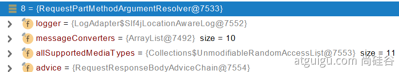

## 文件上传


1. 设置文件上传的表单
```java
<form method="post" action="/upload" enctype="multipart/form-data">
    <input type="file" name="file"><br>
    <input type="submit" value="提交">
</form>
```
2. 在服务端接收文件上传的参数。
```java
    /**
     * MultipartFile 自动封装上传过来的文件
     * @param email
     * @param username
     * @param headerImg
     * @param photos
     * @return
     */
    @PostMapping("/upload")
    public String upload(@RequestParam("email") String email,
                         @RequestParam("username") String username,
                         @RequestPart("headerImg") MultipartFile headerImg,
                         @RequestPart("photos") MultipartFile[] photos) throws IOException {

        log.info("上传的信息：email={}，username={}，headerImg={}，photos={}",
                email,username,headerImg.getSize(),photos.length);

        if(!headerImg.isEmpty()){
            //保存到文件服务器，OSS服务器
            String originalFilename = headerImg.getOriginalFilename();
            headerImg.transferTo(new File("H:\\cache\\"+originalFilename));
        }

        if(photos.length > 0){
            for (MultipartFile photo : photos) {
                if(!photo.isEmpty()){
                    String originalFilename = photo.getOriginalFilename();
                    photo.transferTo(new File("H:\\cache\\"+originalFilename));
                }
            }
        }


        return "main";
    }
```
3. 设置允许文件上传的大小。


## 文件上传原理
文件上传自动配置类-MultipartAutoConfiguration-MultipartProperties
● 自动配置好了 StandardServletMultipartResolver   【文件上传解析器】
● 原理步骤
  ○ 1、请求进来使用文件上传解析器判断（isMultipart）并封装（resolveMultipart，返回MultipartHttpServletRequest）文件上传请求
  ○ 2、参数解析器来解析请求中的文件内容封装成MultipartFile
  ○ 3、将request中文件信息封装为一个Map；MultiValueMap<String, MultipartFile>
FileCopyUtils。实现文件流的拷贝

