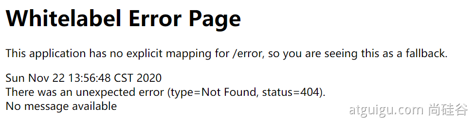
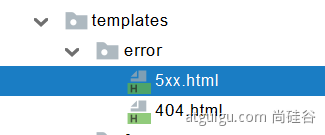
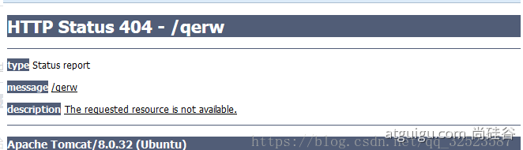
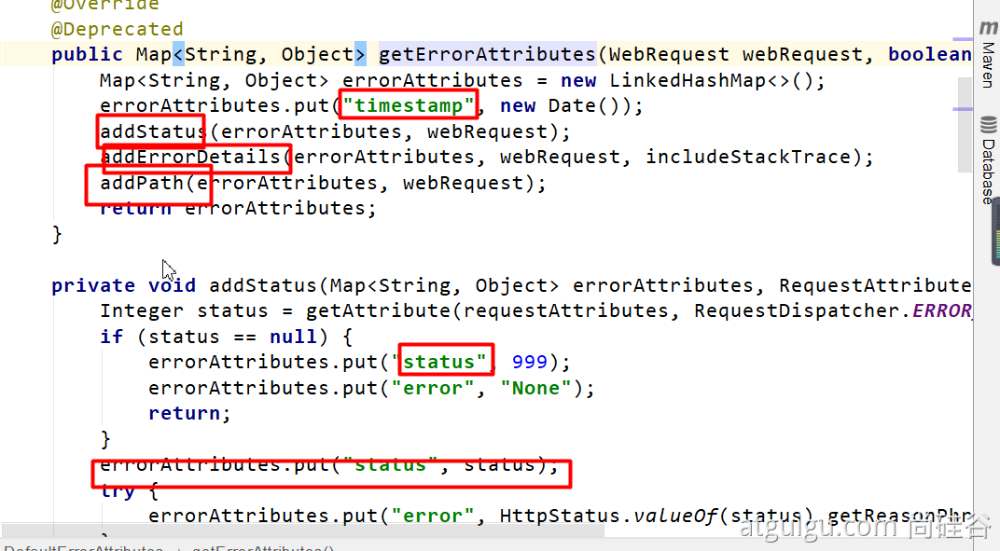
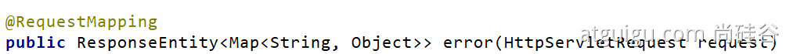
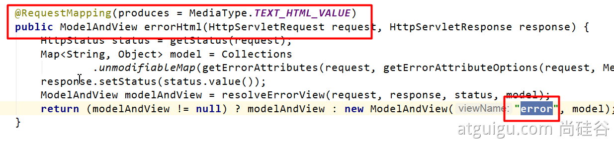
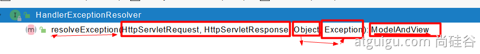
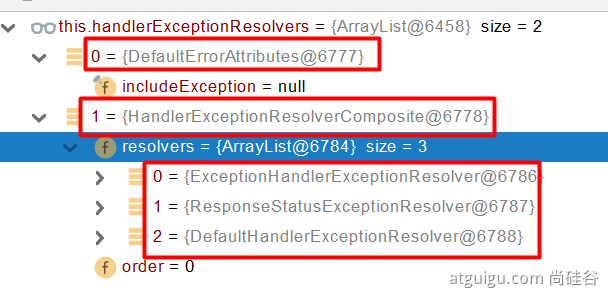

## 1 机制

### 1、默认规则
* 默认情况下，Spring Boot提供/error处理所有错误的映射
* 对于机器客户端，它将生成JSON响应，其中包含错误，HTTP状态和异常消息的详细信息。对于浏览器客户端，响应一个“ whitelabel”错误视图，以HTML格式呈现相同的数据




* 要对其进行自定义，添加View解析为error

* 要完全替换默认行为，可以实现 ErrorController 并注册该类型的Bean定义，或添加ErrorAttributes类型的组件以使用现有机制但替换其内容。
* error/下的4xx，5xx页面会被自动解析；





### 2、定制错误处理逻辑
* 自定义错误页
  * error/404.html   error/5xx.html；有精确的错误状态码页面就匹配精确，没有就找 4xx.html；如果都没有就触发白页。抛出异常给Tomcat捕获异常forward到error视图进行处理，由BasicErrorController处理（springboot底层自动注册的error视图）
  * @ControllerAdvice+@ExceptionHandler处理全局异常；底层是 ExceptionHandlerExceptionResolver 支持的
  * @ResponseStatus+自定义异常 ；底层是 ResponseStatusExceptionResolver ，把responsestatus注解的信息底层调用 response.sendError(statusCode, resolvedReason)；tomcat发送的/error
* Spring底层的异常，如 参数类型转换异常；DefaultHandlerExceptionResolver 处理框架底层的异常。
  ○ response.sendError(HttpServletResponse.SC_BAD_REQUEST, ex.getMessage()); 


● 自定义实现 HandlerExceptionResolver 处理异常；可以作为默认的全局异常处理规则


* ErrorViewResolver  实现自定义处理异常；
  * response.sendError 。error请求就会转给controller
  * 你的异常没有任何人能处理。tomcat底层 response.sendError。error请求就会转给controller
  * basicErrorController 要去的页面地址是 ErrorViewResolver  ；


### 3、异常处理自动配置原理

ErrorMvcAutoConfiguration  自动配置异常处理规则
* 容器中的组件：类型：DefaultErrorAttributes -> id：errorAttributes
  * public class DefaultErrorAttributes implements ErrorAttributes, HandlerExceptionResolver
  * DefaultErrorAttributes：定义错误页面中可以包含哪些数据。




* 容器中的组件：类型：BasicErrorController --> id：basicErrorController（json+白页 适配响应）
  * 处理默认 /error 路径的请求；页面响应 new ModelAndView("error", model)；
  * 容器中有组件 View->id是error；（响应默认错误页）
  * 容器中放组件 BeanNameViewResolver（视图解析器）；按照返回的视图名作为组件的id去容器中找View对象。
* 容器中的组件：类型：DefaultErrorViewResolver -> id：conventionErrorViewResolver
  * 如果发生错误，会以HTTP的状态码 作为视图页地址（viewName），找到真正的页面
  * error/404、5xx.html
* 如果想要返回页面；就会找error视图【StaticView】。(默认是一个白页)
  * 写出去json 
  * 错误页HTML 


### 4、异常处理步骤流程

1. 执行目标方法，目标方法运行期间有任何异常都会被catch、而且标志当前请求结束；并且用 dispatchException 
2. 进入视图解析流程（页面渲染？） 
processDispatchResult(processedRequest, response, mappedHandler, mv, dispatchException);
3. mv = processHandlerException；处理handler发生的异常，处理完成返回ModelAndView；
4. 遍历所有的 handlerExceptionResolvers，看谁能处理当前异常【HandlerExceptionResolver处理器异常解析器】
5. 系统默认的  异常解析器；
6. DefaultErrorAttributes先来处理异常。把异常信息保存到request域，并且返回null；
7. 默认没有任何人能处理异常，所以异常会被抛出
8. **如果没有任何人能处理最终底层就会发送 /error 请求**。会被底层的BasicErrorController处理
9. 解析错误视图；遍历所有的  ErrorViewResolver  看谁能解析。
10. 默认的 DefaultErrorViewResolver ,作用是把响应状态码作为错误页的地址，error/500.html 
11. 模板引擎最终响应这个页面 error/500.html 


## 5、自定义异常处理

### @ControllerAdvice + @ExceptionHandler

1. 通过@ControllerAdvice和@ExceptionHandler处理异常。
2. 有ExceptionHandlerExceptionResolver在启动的时候扫描注解，加载异常处理方法。
```java
@ControllerAdvice
public class ExceptionHandler{

  @ExceptionHandler({MessageNotFoundException.class})
  public String getMessage(Exception exception){

    return "error";
  }
}

```


### ExceptionHandlerResolver


1. 可以作为全局处理器
2. 
```java

@Orderd(value = Ordered.Highest)
@Component
public class CustomerHandlerExceptionResolver implement HanlderExcepitonResolver{


  @Override
  public ModoleAndView resovlerException(){
    //异常处理逻辑
  }
}
```