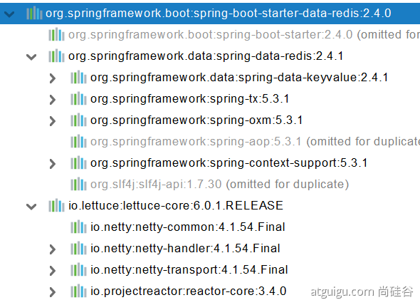

## 1 简介

### 引入
NoSQL
Redis 是一个开源（BSD许可）的，内存中的数据结构存储系统，它可以用作数据库、缓存和消息中间件。 它支持多种类型的数据结构，如 字符串（strings）， 散列（hashes）， 列表（lists）， 集合（sets）， 有序集合（sorted sets） 与范围查询， bitmaps， hyperloglogs 和 地理空间（geospatial） 索引半径查询。 Redis 内置了 复制（replication），LUA脚本（Lua scripting）， LRU驱动事件（LRU eviction），事务（transactions） 和不同级别的 磁盘持久化（persistence）， 并通过 Redis哨兵（Sentinel）和自动 分区（Cluster）提供高可用性（high availability）。

### 自动配置

```xml
<dependency>
    <groupId>org.springframework.boot</groupId>
    <artifactId>spring-boot-starter-data-redis</artifactId>
</dependency>
```




### 配置原理

自动配置：
* RedisAutoConfiguration 自动配置类。RedisProperties 属性类 --> spring.redis.xxx是对redis的配置
* 连接工厂是准备好的。LettuceConnectionConfiguration、JedisConnectionConfiguration
* 自动注入了RedisTemplate<Object, Object> ： xxxTemplate；
* 自动注入了StringRedisTemplate；k：v都是String
* key：value
* 底层只要我们使用 StringRedisTemplate、RedisTemplate就可以操作redis

### 操作

```java
    @Test
    void testRedis(){
        ValueOperations<String, String> operations = redisTemplate.opsForValue();

        operations.set("hello","world");

        String hello = operations.get("hello");
        System.out.println(hello);
    }
```

### 切换jedis

```java
        <dependency>
            <groupId>org.springframework.boot</groupId>
            <artifactId>spring-boot-starter-data-redis</artifactId>
        </dependency>

<!--        导入jedis-->
        <dependency>
            <groupId>redis.clients</groupId>
            <artifactId>jedis</artifactId>
        </dependency>
```

```yml
spring:
  redis:
      host: r-bp1nc7reqesxisgxpipd.redis.rds.aliyuncs.com
      port: 6379
      password: lfy:Lfy123456
      client-type: jedis
      jedis:
        pool:
          max-active: 10
```