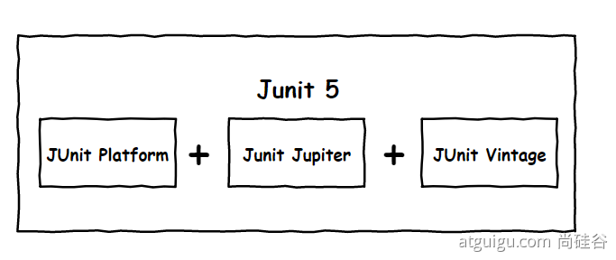
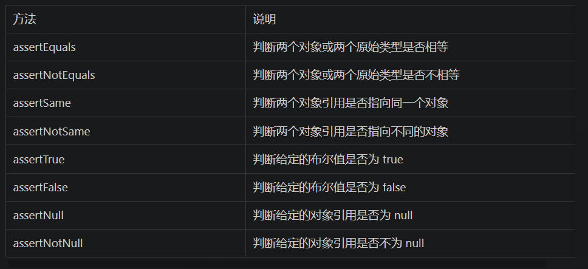

> springboot with junit4 &junit5 https://segmentfault.com/a/1190000040803747

## 1 概述

### spring-boot-starter-test
SpringBoot中有关测试的框架，主要来源于 spring-boot-starter-test。一旦依赖了spring-boot-starter-test，下面这些类库将被一同依赖进去：
* JUnit：java测试事实上的标准。
* Spring Test & Spring Boot Test：Spring的测试支持。
* AssertJ：提供了流式的断言方式。
* Hamcrest：提供了丰富的matcher。
* Mockito：mock框架，可以按类型创建mock对象，可以根据方法参数指定特定的响应，也支持对于mock调用过程的断言。
* JSONassert：为JSON提供了断言功能。
* JsonPath：为JSON提供了XPATH功能。

### 多种测试模式


* @RunWith(SpringJUnit4ClassRunner.class)启动Spring上下文环境。
* @RunWith(MockitoJUnitRunner.class)mockito方法进行测试。对底层的类进行mock，测试速度快。
* @RunWith(PowerMockRunner.class)powermock方法进行测试。对底层类进行mock，测试方法更全面。


### junit5 变化

Spring Boot 2.2.0 版本开始引入 JUnit 5 作为单元测试默认库
作为最新版本的JUnit框架，JUnit5与之前版本的Junit框架有很大的不同。由三个不同子项目的几个不同模块组成。
JUnit 5 = JUnit Platform + JUnit Jupiter + JUnit Vintage
* JUnit Platform: Junit Platform是在JVM上启动测试框架的基础，不仅支持Junit自制的测试引擎，其他测试引擎也都可以接入。
* JUnit Jupiter: JUnit Jupiter提供了JUnit5的新的编程模型，是JUnit5新特性的核心。内部 包含了一个测试引擎，用于在Junit Platform上运行。
* JUnit Vintage: 由于JUint已经发展多年，为了照顾老的项目，JUnit Vintage提供了兼容JUnit4.x,Junit3.x的测试引擎。



```java
@SpringBootTest
class Boot05WebAdminApplicationTests {


    @Test
    void contextLoads() {

    }
}

```

SpringBoot 2.4 以上版本移除了默认对 Vintage 的依赖。如果需要兼容junit4需要自行引入（不能使用junit4的功能 @Test）。JUnit 5’s Vintage Engine Removed from spring-boot-starter-test,如果需要继续兼容junit4需要自行引入vintage

```xml
<dependency>
    <groupId>org.junit.vintage</groupId>
    <artifactId>junit-vintage-engine</artifactId>
    <scope>test</scope>
    <exclusions>
        <exclusion>
            <groupId>org.hamcrest</groupId>
            <artifactId>hamcrest-core</artifactId>
        </exclusion>
    </exclusions>
</dependency>
```

以前：`@SpringBootTest + @RunWith(SpringTest.class)`。SpringBoot整合Junit以后。编写测试方法：@Test标注（注意需要使用junit5版本的注解）。Junit类具有Spring的功能，@Autowired、比如 @Transactional 标注测试方法，测试完成后自动回滚

### junit4 & junit5对比


| 功能               | JUnit4       | JUnit5       |
|------------------|--------------|--------------|
| 声明一种测试方法         | @Test        | @Test        |
| 在当前类中的所有测试方法之前执行 | @BeforeClass | @BeforeAll   |
| 在当前类中的所有测试方法之后执行 | @AfterClass  | @AfterAll    |
| 在每个测试方法之前执行      | @Before      | @BeforeEach  |
| 在每个测试方法之后执行      | @After       | @AfterEach   |
| 禁用测试方法/类         | @Ignore      | @Disabled    |
| 测试工厂进行动态测试       | NA           | @TestFactory |
| 嵌套测试             | NA           | @Nested      |
| 标记和过滤            | @Category    | @Tag         |
| 注册自定义扩展          | NA           | @ExtendWith  |


### RunWith 和 ExtendWith

在 JUnit4 版本，在测试类加 @SpringBootTest 注解时，同样要加上 @RunWith(SpringRunner.class)才生效，即:
```
@SpringBootTest
@RunWith(SpringRunner.class)
class HrServiceTest {
...
}
```
但在 JUnit5 中，官网告知 @RunWith 的功能都被 @ExtendWith 替代，即原 @RunWith(SpringRunner.class) 被同功能的 @ExtendWith(SpringExtension.class) 替代。但 JUnit5 中 @SpringBootTest 注解中已经默认包含了 @ExtendWith(SpringExtension.class)。

因此，在 JUnit5 中只需要单独使用 @SpringBootTest 注解即可。其他需要自定义拓展的再用 @ExtendWith，不要再用 @RunWith 了。


### mockito

Mockito 框架中最核心的两个概念就是 Mock 和 Stub。测试时不是真正的操作外部资源，而是通过自定义的代码进行模拟操作。我们可以对任何的依赖进行模拟，从而使测试的行为不需要任何准备工作或者不具备任何副作用。

1. 当我们在测试时，如果只关心某个操作是否执行过，而不关心这个操作的具体行为，这种技术称为 mock。比如我们测试的代码会执行发送邮件的操作，我们对这个操作进行 mock；测试的时候我们只关心是否调用了发送邮件的操作，而不关心邮件是否确实发送出去了。

2. 另一种情况，当我们关心操作的具体行为，或者操作的返回结果的时候，我们通过执行预设的操作来代替目标操作，或者返回预设的结果作为目标操作的返回结果。这种对操作的模拟行为称为 stub（打桩）。比如我们测试代码的异常处理机制是否正常，我们可以对某处代码进行 stub，让它抛出异常。再比如我们测试的代码需要向数据库插入一条数据，我们可以对插入数据的代码进行stub，让它始终返回1，表示数据插入成功。

### powermock

需要手动引入测试类。依赖mockito，注意版本的对应关系。

```xml
<dependency>
    <groupId>org.powermock</groupId>
    <artifactId>powermock-api-mockito2</artifactId>
</dependency>

<dependency>
    <groupId>org.powermock</groupId>
    <artifactId>powermock-module-junit4</artifactId>
</dependency>
```

### 断言测试


```java
@Test
@DisplayName("simple assertion")
public void simple() {
     assertEquals(3, 1 + 2, "simple math");
     assertNotEquals(3, 1 + 1);

     assertNotSame(new Object(), new Object());
     Object obj = new Object();
     assertSame(obj, obj);

     assertFalse(1 > 2);
     assertTrue(1 < 2);

     assertNull(null);
     assertNotNull(new Object());
}
```
数组断言
```java

@Test
@DisplayName("array assertion")
public void array() {
 assertArrayEquals(new int[]{1, 2}, new int[] {1, 2});
}
```
组合断言。assertAll 方法接受多个 org.junit.jupiter.api.Executable 函数式接口的实例作为要验证的断言，可以通过 lambda 表达式很容易的提供这些断言

```java
@Test
@DisplayName("assert all")
public void all() {
 assertAll("Math",
    () -> assertEquals(2, 1 + 1),
    () -> assertTrue(1 > 0)
 );
}
```
异常断言
在JUnit4时期，想要测试方法的异常情况时，需要用@Rule注解的ExpectedException变量还是比较麻烦的。而JUnit5提供了一种新的断言方式Assertions.assertThrows() ,配合函数式编程就可以进行使用。

```java
@Test
@DisplayName("异常测试")
public void exceptionTest() {
    ArithmeticException exception = Assertions.assertThrows(
           //扔出断言异常
            ArithmeticException.class, () -> System.out.println(1 % 0));

}
```

超时断言
Junit5还提供了Assertions.assertTimeout() 为测试方法设置了超时时间

```java
@Test
@DisplayName("超时测试")
public void timeoutTest() {
    //如果测试方法时间超过1s将会异常
    Assertions.assertTimeout(Duration.ofMillis(1000), () -> Thread.sleep(500));
}
```
快速失败
通过 fail 方法直接使得测试失败
```java
@Test
@DisplayName("fail")
public void shouldFail() {
 fail("This should fail");
}
```

### 前置条件（assumptions）

JUnit 5 中的前置条件（assumptions【假设】）类似于断言，不同之处在于不满足的断言会使得测试方法失败，而不满足的前置条件只会使得测试方法的执行终止。前置条件可以看成是测试方法执行的前提，当该前提不满足时，就没有继续执行的必要。
```java
@DisplayName("前置条件")
public class AssumptionsTest {
 private final String environment = "DEV";
 
 @Test
 @DisplayName("simple")
 public void simpleAssume() {
    assumeTrue(Objects.equals(this.environment, "DEV"));
    assumeFalse(() -> Objects.equals(this.environment, "PROD"));
 }
 
 @Test
 @DisplayName("assume then do")
 public void assumeThenDo() {
    assumingThat(
       Objects.equals(this.environment, "DEV"),
       () -> System.out.println("In DEV")
    );
 }
}
```

assumeTrue 和 assumFalse 确保给定的条件为 true 或 false，不满足条件会使得测试执行终止。assumingThat 的参数是表示条件的布尔值和对应的 Executable 接口的实现对象。只有条件满足时，Executable 对象才会被执行；当条件不满足时，测试执行并不会终止。


## 2 使用

### 注解

@RunWith：
1. 表示运行方式，@RunWith(JUnit4TestRunner)、@RunWith(SpringRunner.class)、@RunWith(PowerMockRunner.class) 三种运行方式，分别在不同的场景中使用。
2. 当一个类用@RunWith注释或继承一个用@RunWith注释的类时，JUnit将调用它所引用的类来运行该类中的测试而不是开发者去在junit内部去构建它。我们在开发过程中使用这个特性

@SpringBootTest：
1. 注解制定了一个测试类运行了Spring Boot环境。提供了以下一些特性：
   1. 当没有特定的ContextConfiguration#loader()（@ContextConfiguration(loader=...)）被定义那么就是SpringBootContextLoader作为默认的ContextLoader。
   2. 自动搜索到SpringBootConfiguration注解的文件。
   3. 允许自动注入Environment类读取配置文件。
   4. 提供一个webEnvironment环境，可以完整的允许一个web环境使用随机的端口或者自定义的端口。
   5. 注册了TestRestTemplate类可以去做接口调用。

2. 添加这个就能取到spring中的容器的实例，如果配置了@Autowired那么就自动将对象注入。

### 基本测试用例

Springboot整合JUnit的步骤
1. 导入测试对应的starter

2. 测试类使用@SpringBootTest修饰

3.使用自动装配的形式添加要测试的对象。

```java
@SpringBootTest(classes = {SpringbootJunitApplication.class})
class SpringbootJunitApplicationTests {
 
    @Autowired
    private UsersDao users;
 
    @Test
    void contextLoads() {
        users.save();
    }
 
}
```


### mock单元测试
因为单元测试不用启动 Spring 容器，则无需加 @SpringBootTest，因为要用到 Mockito，只需要自定义拓展 MockitoExtension.class 即可，依赖简单，运行速度更快。

可以明显看到，单元测试写的代码，怎么是被测试代码长度的好几倍？其实单元测试的代码长度比较固定，都是造数据和打桩，但如果针对越复杂逻辑的代码写单元测试，还是越划算的
```java
@ExtendWith(MockitoExtension.class)
class HrServiceTest {
    @Mock
    private OrmDepartmentDao ormDepartmentDao;
    @Mock
    private OrmUserDao ormUserDao;
    @InjectMocks
    private HrService hrService;

    @DisplayName("根据部门名称，查询用户")
    @Test
    void findUserByDeptName() {
        Long deptId = 100L;
        String deptName = "行政部";
        OrmDepartmentPO ormDepartmentPO = new OrmDepartmentPO();
        ormDepartmentPO.setId(deptId);
        ormDepartmentPO.setDepartmentName(deptName);
        OrmUserPO user1 = new OrmUserPO();
        user1.setId(1L);
        user1.setUsername("001");
        user1.setDepartmentId(deptId);
        OrmUserPO user2 = new OrmUserPO();
        user2.setId(2L);
        user2.setUsername("002");
        user2.setDepartmentId(deptId);
        List<OrmUserPO> userList = new ArrayList<>();
        userList.add(user1);
        userList.add(user2);

        Mockito.when(ormDepartmentDao.findOneByDepartmentName(deptName))
                .thenReturn(
                        Optional.ofNullable(ormDepartmentPO)
                                .filter(dept -> deptName.equals(dept.getDepartmentName()))
                );
        Mockito.doReturn(
                userList.stream()
                        .filter(user -> deptId.equals(user.getDepartmentId()))
                        .collect(Collectors.toList())
        ).when(ormUserDao).findByDepartmentId(deptId);

        List<OrmUserPO> result1 = hrService.findUserByDeptName(deptName);
        List<OrmUserPO> result2 = hrService.findUserByDeptName(deptName + "error");

        Assertions.assertEquals(userList, result1);
        Assertions.assertEquals(Collections.emptyList(), result2);
    }
```


### 集成单元测试
还是那个方法，如果使用Spring上下文，真实的调用方法依赖，可直接用下列方式
```java
@SpringBootTest
class HrServiceTest {
    @Autowired
    private HrService hrService;

    @DisplayName("根据部门名称，查询用户")
    @Test
    void findUserByDeptName() {
        List<OrmUserPO> userList = hrService.findUserByDeptName("行政部");
        Assertions.assertTrue(userList.size() > 0);
    }  
}
```


还可以使用@MockBean、@SpyBean替换Spring上下文中的对应的Bean：
```java
@SpringBootTest
class HrServiceTest {
    @Autowired
    private HrService hrService;
    @SpyBean
    private OrmDepartmentDao ormDepartmentDao;

    @DisplayName("根据部门名称，查询用户")
    @Test
    void findUserByDeptName() {
        String deptName="行政部";
        OrmDepartmentPO ormDepartmentPO = new OrmDepartmentPO();
        ormDepartmentPO.setDepartmentName(deptName);
        Mockito.when(ormDepartmentDao.findOneByDepartmentName(ArgumentMatchers.anyString()))
                .thenReturn(Optional.of(ormDepartmentPO));
        List<OrmUserPO> userList = hrService.findUserByDeptName(deptName);
        Assertions.assertTrue(userList.size() > 0);
    }
}
```

### 嵌套测试

JUnit 5 可以通过 Java 中的内部类和@Nested 注解实现嵌套测试，从而可以更好的把相关的测试方法组织在一起。在内部类中可以使用@BeforeEach 和@AfterEach 注解，而且嵌套的层次没有限制。

```java
@DisplayName("A stack")
class TestingAStackDemo {

    Stack<Object> stack;

    @Test
    @DisplayName("is instantiated with new Stack()")
    void isInstantiatedWithNew() {
        new Stack<>();
    }

    @Nested
    @DisplayName("when new")
    class WhenNew {

        @BeforeEach
        void createNewStack() {
            stack = new Stack<>();
        }

        @Test
        @DisplayName("is empty")
        void isEmpty() {
            assertTrue(stack.isEmpty());
        }

        @Test
        @DisplayName("throws EmptyStackException when popped")
        void throwsExceptionWhenPopped() {
            assertThrows(EmptyStackException.class, stack::pop);
        }

        @Test
        @DisplayName("throws EmptyStackException when peeked")
        void throwsExceptionWhenPeeked() {
            assertThrows(EmptyStackException.class, stack::peek);
        }

        @Nested
        @DisplayName("after pushing an element")
        class AfterPushing {

            String anElement = "an element";

            @BeforeEach
            void pushAnElement() {
                stack.push(anElement);
            }

            @Test
            @DisplayName("it is no longer empty")
            void isNotEmpty() {
                assertFalse(stack.isEmpty());
            }

            @Test
            @DisplayName("returns the element when popped and is empty")
            void returnElementWhenPopped() {
                assertEquals(anElement, stack.pop());
                assertTrue(stack.isEmpty());
            }

            @Test
            @DisplayName("returns the element when peeked but remains not empty")
            void returnElementWhenPeeked() {
                assertEquals(anElement, stack.peek());
                assertFalse(stack.isEmpty());
            }
        }
    }
}
```

### 参数化测试


参数化测试是JUnit5很重要的一个新特性，它使得用不同的参数多次运行测试成为了可能，也为我们的单元测试带来许多便利。

利用@ValueSource等注解，指定入参，我们将可以使用不同的参数进行多次单元测试，而不需要每新增一个参数就新增一个单元测试，省去了很多冗余代码。

@ValueSource: 为参数化测试指定入参来源，支持八大基础类以及String类型,Class类型
@NullSource: 表示为参数化测试提供一个null的入参
@EnumSource: 表示为参数化测试提供一个枚举入参
@CsvFileSource：表示读取指定CSV文件内容作为参数化测试入参
@MethodSource：表示读取指定方法的返回值作为参数化测试入参(注意方法返回需要是一个流)

当然如果参数化测试仅仅只能做到指定普通的入参还达不到让我觉得惊艳的地步。让我真正感到他的强大之处的地方在于他可以支持外部的各类入参。如:CSV,YML,JSON 文件甚至方法的返回值也可以作为入参。只需要去实现ArgumentsProvider接口，任何外部文件都可以作为它的入参。


```java
@ParameterizedTest
@ValueSource(strings = {"one", "two", "three"})
@DisplayName("参数化测试1")
public void parameterizedTest1(String string) {
    System.out.println(string);
    Assertions.assertTrue(StringUtils.isNotBlank(string));
}


@ParameterizedTest
@MethodSource("method")    //指定方法名
@DisplayName("方法来源参数")
public void testWithExplicitLocalMethodSource(String name) {
    System.out.println(name);
    Assertions.assertNotNull(name);
}

static Stream<String> method() {
    return Stream.of("apple", "banana");
}
```

### 迁移指南

在进行迁移的时候需要注意如下的变化：
● 注解在 org.junit.jupiter.api 包中，断言在 org.junit.jupiter.api.Assertions 类中，前置条件在 org.junit.jupiter.api.Assumptions 类中。
● 把@Before 和@After 替换成@BeforeEach 和@AfterEach。
● 把@BeforeClass 和@AfterClass 替换成@BeforeAll 和@AfterAll。
● 把@Ignore 替换成@Disabled。
● 把@Category 替换成@Tag。
● 把@RunWith、@Rule 和@ClassRule 替换成@ExtendWith。