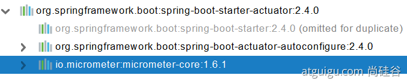

## 1 简介

### 概念
未来每一个微服务在云上部署以后，我们都需要对其进行监控、追踪、审计、控制等。SpringBoot就抽取了Actuator场景，使得我们每个微服务快速引用即可获得生产级别的应用监控、审计等功能。

### 引入

```xml
<dependency>
    <groupId>org.springframework.boot</groupId>
    <artifactId>spring-boot-starter-actuator</artifactId>
</dependency>
```


## 2 使用

### 简单使用
1. 暴露指标
```xml
management:
  endpoints:
    enabled-by-default: true #暴露所有端点信息
    web:
      exposure:
        include: '*'  #以web方式暴露
```
2. 访问界面
```
http://localhost:8080/actuator/beans
http://localhost:8080/actuator/configprops
http://localhost:8080/actuator/metrics
http://localhost:8080/actuator/metrics/jvm.gc.pause
http://localhost:8080/actuator/endpointName/detailPath
```

### 可视化


https://github.com/codecentric/spring-boot-admin


### 常用指标

| ID               | 描述                                                                                   |
|------------------|--------------------------------------------------------------------------------------|
| auditevents      | 暴露当前应用程序的审核事件信息。需要一个AuditEventRepository组件。                                          |
| beans            | 显示应用程序中所有Spring Bean的完整列表。                                                           |
| caches           | 暴露可用的缓存。                                                                             |
| conditions       | 显示自动配置的所有条件信息，包括匹配或不匹配的原因。                                                           |
| configprops      | 显示所有@ConfigurationProperties。                                                        |
| env              | 暴露Spring的属性ConfigurableEnvironment                                                   |
| flyway           | 显示已应用的所有Flyway数据库迁移。
需要一个或多个Flyway组件。                                                |
| health           | 显示应用程序运行状况信息。                                                                        |
| httptrace        | 显示HTTP跟踪信息（默认情况下，最近100个HTTP请求-响应）。需要一个HttpTraceRepository组件。                         |
| info             | 显示应用程序信息。                                                                            |
| integrationgraph | 显示Spring&nbsp;integrationgraph 。需要依赖spring-integration-core。                         |
| loggers          | 显示和修改应用程序中日志的配置。                                                                     |
| liquibase        | 显示已应用的所有Liquibase数据库迁移。需要一个或多个Liquibase组件。                                           |
| metrics          | 显示当前应用程序的“指标”信息。                                                                     |
| mappings         | 显示所有@RequestMapping路径列表。                                                             |
| scheduledtasks   | 显示应用程序中的计划任务。                                                                        |
| sessions         | 允许从Spring Session支持的会话存储中检索和删除用户会话。需要使用Spring Session的基于Servlet的Web应用程序。             |
| shutdown         | 使应用程序正常关闭。默认禁用。                                                                      |
| startup          | 显示由ApplicationStartup收集的启动步骤数据。需要使用SpringApplication进行配置BufferingApplicationStartup。 |
| threaddump       | 执行线程转储。                                                                              |


#### 最常用的Endpoint
● Health：监控状况
● Metrics：运行时指标
● Loggers：日志记录


#### Health Endpoint
健康检查端点，我们一般用于在云平台，平台会定时的检查应用的健康状况，我们就需要Health Endpoint可以为平台返回当前应用的一系列组件健康状况的集合。
重要的几点：
● health endpoint返回的结果，应该是一系列健康检查后的一个汇总报告
● 很多的健康检查默认已经自动配置好了，比如：数据库、redis等
● 可以很容易的添加自定义的健康检查机制


#### Metrics Endpoint
提供详细的、层级的、空间指标信息，这些信息可以被pull（主动推送）或者push（被动获取）方式得到；
● 通过Metrics对接多种监控系统
● 简化核心Metrics开发
● 添加自定义Metrics或者扩展已有Metrics


#### 管理Endpoints
1、开启与禁用Endpoints
● 默认所有的Endpoint除过shutdown都是开启的。
● 需要开启或者禁用某个Endpoint。配置模式为  management.endpoint.<endpointName>.enabled = true

```java
management:
  endpoint:
    beans:
      enabled: true
```

或者禁用所有的Endpoint然后手动开启指定的Endpoint

```java
management:
  endpoints:
    enabled-by-default: false
  endpoint:
    beans:
      enabled: true
    health:
      enabled: true
```


#### 支持的暴露方式
● HTTP：默认只暴露health和info Endpoint
● JMX：默认暴露所有Endpoint
● 除过health和info，剩下的Endpoint都应该进行保护访问。如果引入SpringSecurity，则会默认配置安全访问规则


## 3 自定义扩展

#### 定制 Health 信息
```java
import org.springframework.boot.actuate.health.Health;
import org.springframework.boot.actuate.health.HealthIndicator;
import org.springframework.stereotype.Component;

@Component
public class MyHealthIndicator implements HealthIndicator {

    @Override
    public Health health() {
        int errorCode = check(); // perform some specific health check
        if (errorCode != 0) {
            return Health.down().withDetail("Error Code", errorCode).build();
        }
        return Health.up().build();
    }

}

构建Health
Health build = Health.down()
                .withDetail("msg", "error service")
                .withDetail("code", "500")
                .withException(new RuntimeException())
                .build();
```

配置文件

```sh
management:
    health:
      enabled: true
      show-details: always #总是显示详细信息。可显示每个模块的状态信息
```

```java
@Component
public class MyComHealthIndicator extends AbstractHealthIndicator {

    /**
     * 真实的检查方法
     * @param builder
     * @throws Exception
     */
    @Override
    protected void doHealthCheck(Health.Builder builder) throws Exception {
        //mongodb。  获取连接进行测试
        Map<String,Object> map = new HashMap<>();
        // 检查完成
        if(1 == 2){
//            builder.up(); //健康
            builder.status(Status.UP);
            map.put("count",1);
            map.put("ms",100);
        }else {
//            builder.down();
            builder.status(Status.OUT_OF_SERVICE);
            map.put("err","连接超时");
            map.put("ms",3000);
        }


        builder.withDetail("code",100)
                .withDetails(map);

    }
}
```


### 定制info信息

编写配置文件

```
info:
  appName: boot-admin
  version: 2.0.1
  mavenProjectName: @project.artifactId@  #使用@@可以获取maven的pom文件值
  mavenProjectVersion: @project.version@
```

编写InfoContributor

```java
import java.util.Collections;

import org.springframework.boot.actuate.info.Info;
import org.springframework.boot.actuate.info.InfoContributor;
import org.springframework.stereotype.Component;

@Component
public class ExampleInfoContributor implements InfoContributor {

    @Override
    public void contribute(Info.Builder builder) {
        builder.withDetail("example",
                Collections.singletonMap("key", "value"));
    }

}
```

http://localhost:8080/actuator/info 


### 定制Metrics信息
1、SpringBoot支持自动适配的Metrics

● JVM metrics, report utilization of:
  ○ Various memory and buffer pools
  ○ Statistics related to garbage collection
  ○ Threads utilization
  ○ Number of classes loaded/unloaded
● CPU metrics
● File descriptor metrics
● Kafka consumer and producer metrics
● Log4j2 metrics: record the number of events logged to Log4j2 at each level
● Logback metrics: record the number of events logged to Logback at each level
● Uptime metrics: report a gauge for uptime and a fixed gauge representing the application’s absolute start time
● Tomcat metrics (server.tomcat.mbeanregistry.enabled must be set to true for all Tomcat metrics to be registered)
● Spring Integration metrics

2、增加定制Metrics

```java
class MyService{
    Counter counter;
    public MyService(MeterRegistry meterRegistry){
         counter = meterRegistry.counter("myservice.method.running.counter");
    }

    public void hello() {
        counter.increment();
    }
}


//也可以使用下面的方式
@Bean
MeterBinder queueSize(Queue queue) {
    return (registry) -> Gauge.builder("queueSize", queue::size).register(registry);
}
```

### 定制Endpoint

```java
@Component
@Endpoint(id = "container")
public class DockerEndpoint {


    @ReadOperation
    public Map getDockerInfo(){
        return Collections.singletonMap("info","docker started...");
    }

    @WriteOperation
    private void restartDocker(){
        System.out.println("docker restarted....");
    }

}
```

场景：开发ReadinessEndpoint来管理程序是否就绪，或者LivenessEndpoint来管理程序是否存活；
当然，这个也可以直接使用 https://docs.spring.io/spring-boot/docs/current/reference/html/production-ready-features.html#production-ready-kubernetes-probes