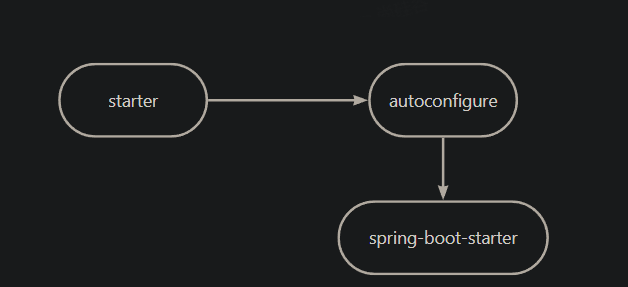

## 1 Profile

### Profile功能
为了方便多环境适配，springboot简化了profile功能。

application-profile功能
● 默认配置文件  application.yaml；任何时候都会加载
● 指定环境配置文件  application-{env}.yaml
● 激活指定环境
  ○ 配置文件激活
  ○ 命令行激活：java -jar xxx.jar --spring.profiles.active=prod  --person.name=haha
    ■ 修改配置文件的任意值，命令行优先
● 默认配置与环境配置同时生效
● 同名配置项，profile配置优先

### @Profile条件装配功能

@Configuration(proxyBeanMethods = false)
@Profile("production")
public class ProductionConfiguration {

    // ...

}

### Profile 分组功能

spring.profiles.group.production[0]=proddb
spring.profiles.group.production[1]=prodmq

使用：--spring.profiles.active=production  激活

## 2 外部化配置

### 配置文件优先级

https://docs.spring.io/spring-boot/docs/current/reference/html/spring-boot-features.html#boot-features-external-config

1. Default properties (specified by setting SpringApplication.setDefaultProperties).
2. @PropertySource annotations on your @Configuration classes. Please note that such property sources are not added to the Environment until the application context is being refreshed. This is too late to configure certain properties such as logging.* and spring.main.* which are read before refresh begins.
3. Config data (such as application.properties files)
4. A RandomValuePropertySource that has properties only in random.*.
5. OS environment variables.
6. Java System properties (System.getProperties()).
7. JNDI attributes from java:comp/env.
8. ServletContext init parameters.
9. ServletConfig init parameters.
10. Properties from SPRING_APPLICATION_JSON (inline JSON embedded in an environment variable or system property).
11. Command line arguments.
12. properties attribute on your tests. Available on @SpringBootTest and the test annotations for testing a particular slice of your application.
13. @TestPropertySource annotations on your tests.
14. Devtools global settings properties in the $HOME/.config/spring-boot directory when devtools is active.

常用：Java属性文件、YAML文件、环境变量、命令行参数；

### 配置文件的路径

(1) classpath 根路径
(2) classpath 根路径下config目录
(3) jar包当前目录
(4) jar包当前目录的config目录
(5) /config子目录的直接子目录

### 配置文件加载顺序：
1. 　当前jar包内部的application.properties和application.yml
2. 　当前jar包内部的application-{profile}.properties 和 application-{profile}.yml
3. 　引用的外部jar包的application.properties和application.yml
4. 　引用的外部jar包的application-{profile}.properties 和 application-{profile}.yml

指定环境优先，外部优先，后面的可以覆盖前面的同名配置项

## 3 自定义starter

starter-pom引入 autoconfigurer 包

● autoconfigure包中配置使用 META-INF/spring.factories 中 EnableAutoConfiguration 的值，使得项目启动加载指定的自动配置类
● 编写自动配置类 xxxAutoConfiguration -> xxxxProperties
  ○ @Configuration
  ○ @Conditional
  ○ @EnableConfigurationProperties
  ○ @Bean
  ○ ......

引入starter --- xxxAutoConfiguration --- 容器中放入组件 ---- 绑定xxxProperties ---- 配置项

自定义starter
atguigu-hello-spring-boot-starter（启动器）
atguigu-hello-spring-boot-starter-autoconfigure（自动配置包）