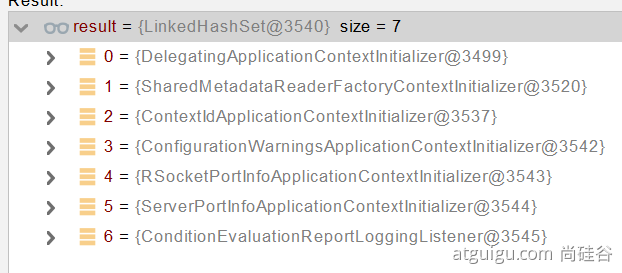
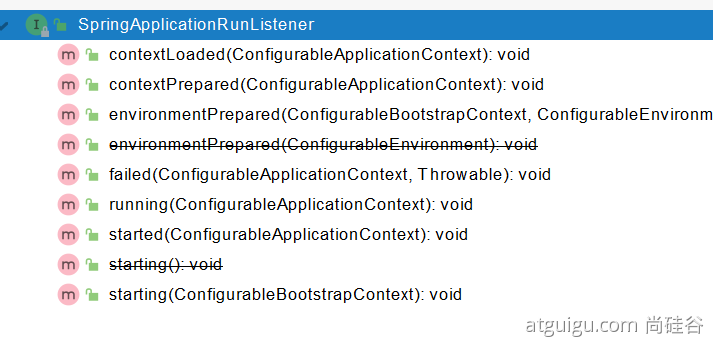
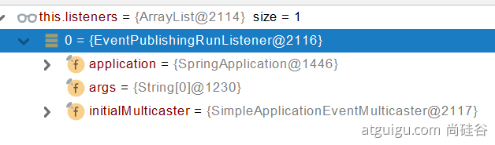

## 1 springboot的启动过程
springcontext.run到底干了什么


SpringApplication.run()到底干了什么

### 服务构建

调用SpringApplication的静态run方法。通过一系列配置创建SpringApplication类。
1. 初始化资源加载器
2. 初始化服务类型
3. 初始化spring.factories中定义的初始化类。包括Initializer和Listener
4. 找到启动类


```java
	/**
	 * Create a new {@link SpringApplication} instance. The application context will load
	 * beans from the specified primary sources (see {@link SpringApplication class-level}
	 * documentation for details). The instance can be customized before calling
	 * {@link #run(String...)}.
	 * @param resourceLoader the resource loader to use
	 * @param primarySources the primary bean sources
	 * @see #run(Class, String[])
	 * @see #setSources(Set)
	 */
	@SuppressWarnings({ "unchecked", "rawtypes" })
	public SpringApplication(ResourceLoader resourceLoader, Class<?>... primarySources) {
		this.resourceLoader = resourceLoader;
		Assert.notNull(primarySources, "PrimarySources must not be null");
		this.primarySources = new LinkedHashSet<>(Arrays.asList(primarySources));
		this.webApplicationType = WebApplicationType.deduceFromClasspath();
		this.bootstrapRegistryInitializers = new ArrayList<>(
				getSpringFactoriesInstances(BootstrapRegistryInitializer.class));
		setInitializers((Collection) getSpringFactoriesInstances(ApplicationContextInitializer.class));
		setListeners((Collection) getSpringFactoriesInstances(ApplicationListener.class));
		this.mainApplicationClass = deduceMainApplicationClass();
	}
```


### 环境准备
调用SpringApplicationContext的run方法。
1. 加载bootstrapContext上下文
2. 获取并注册监听器。
3. 加载环境变量，并发布环境变量加载完成的事件。（通过观察者模式）


```java
	/**
	 * Run the Spring application, creating and refreshing a new
	 * {@link ApplicationContext}.
	 * @param args the application arguments (usually passed from a Java main method)
	 * @return a running {@link ApplicationContext}
	 */
	public ConfigurableApplicationContext run(String... args) {
		long startTime = System.nanoTime();
		DefaultBootstrapContext bootstrapContext = createBootstrapContext();
		ConfigurableApplicationContext context = null;
		configureHeadlessProperty();
		SpringApplicationRunListeners listeners = getRunListeners(args);
		listeners.starting(bootstrapContext, this.mainApplicationClass);
		try {
			ApplicationArguments applicationArguments = new DefaultApplicationArguments(args);
			ConfigurableEnvironment environment = prepareEnvironment(listeners, bootstrapContext, applicationArguments);
			configureIgnoreBeanInfo(environment);
			Banner printedBanner = printBanner(environment);
			context = createApplicationContext();
			context.setApplicationStartup(this.applicationStartup);
			prepareContext(bootstrapContext, context, environment, listeners, applicationArguments, printedBanner);
			refreshContext(context);
			afterRefresh(context, applicationArguments);
			Duration timeTakenToStartup = Duration.ofNanos(System.nanoTime() - startTime);
			if (this.logStartupInfo) {
				new StartupInfoLogger(this.mainApplicationClass).logStarted(getApplicationLog(), timeTakenToStartup);
			}
			listeners.started(context, timeTakenToStartup);
			callRunners(context, applicationArguments);
		}
```

### 容器创建
在run方法中创建容器上下文SpringApplicationContext


1. 默认创建AnnotationConfigServletWebServerApplicationContext。在该类中调用两个注解处理方法。

```java
	public AnnotationConfigServletWebServerApplicationContext() {
		this.reader = new AnnotatedBeanDefinitionReader(this);
		this.scanner = new ClassPathBeanDefinitionScanner(this);
	}
```
2. 构建conttext。加载Initializer，注册启动参数，加载postProcess.

```java
	private void prepareContext(DefaultBootstrapContext bootstrapContext, ConfigurableApplicationContext context,
			ConfigurableEnvironment environment, SpringApplicationRunListeners listeners,
			ApplicationArguments applicationArguments, Banner printedBanner) {
		context.setEnvironment(environment);
		postProcessApplicationContext(context);
		applyInitializers(context);
		listeners.contextPrepared(context);
		bootstrapContext.close(context);
		if (this.logStartupInfo) {
			logStartupInfo(context.getParent() == null);
			logStartupProfileInfo(context);
		}
		// Add boot specific singleton beans
		ConfigurableListableBeanFactory beanFactory = context.getBeanFactory();
		beanFactory.registerSingleton("springApplicationArguments", applicationArguments);
		if (printedBanner != null) {
			beanFactory.registerSingleton("springBootBanner", printedBanner);
		}
		if (beanFactory instanceof AbstractAutowireCapableBeanFactory) {
			((AbstractAutowireCapableBeanFactory) beanFactory).setAllowCircularReferences(this.allowCircularReferences);
			if (beanFactory instanceof DefaultListableBeanFactory) {
				((DefaultListableBeanFactory) beanFactory)
						.setAllowBeanDefinitionOverriding(this.allowBeanDefinitionOverriding);
			}
		}
		if (this.lazyInitialization) {
			context.addBeanFactoryPostProcessor(new LazyInitializationBeanFactoryPostProcessor());
		}
		context.addBeanFactoryPostProcessor(new PropertySourceOrderingBeanFactoryPostProcessor(context));
		// Load the sources
		Set<Object> sources = getAllSources();
		Assert.notEmpty(sources, "Sources must not be empty");
		load(context, sources.toArray(new Object[0]));
	}
```
3. 发布资源监听事件
```java
		listeners.contextLoaded(context);

```

### 填充容器——自动装配


1. refreshContext(conext)
2. 发布启动完成事件，调用自定义实现的runner接口。


## 2 SpringBoot初始化过程
> Spring原理【Spring注解】、SpringMVC原理、自动配置原理、SpringBoot原理


### 创建 SpringApplication
1. 保存一些信息。
2. 判定当前应用的类型。ClassUtils。Servlet
3. bootstrappers：初始启动引导器（List<Bootstrapper>）：去spring.factories文件中找 org.springframework.boot.Bootstrapper
4. 找 ApplicationContextInitializer；去spring.factories找 ApplicationContextInitializer
   1. List<ApplicationContextInitializer<?>> initializers
5. 找 ApplicationListener  ；应用监听器。去spring.factories找 ApplicationListener
   1. List<ApplicationListener<?>> listeners
### 运行 SpringApplication
1. StopWatch记录应用的启动时间
2. 创建引导上下文（Context环境）createBootstrapContext()
3. 获取到所有之前的 bootstrappers 挨个执行 intitialize() 来完成对引导启动器上下文环境设置
4. 让当前应用进入headless模式。java.awt.headless
5. 获取所有 RunListener（运行监听器）【为了方便所有Listener进行事件感知】
   1. getSpringFactoriesInstances 去spring.factories找 SpringApplicationRunListener. 
6. 遍历 SpringApplicationRunListener 调用 starting 方法；
   1. 相当于通知所有感兴趣系统正在启动过程的人，项目正在 starting。
7. 保存命令行参数；ApplicationArguments
8. 准备环境 prepareEnvironment（）;
   1. 返回或者创建基础环境信息对象。StandardServletEnvironment
   2. 配置环境信息对象。
   3. 读取所有的配置源的配置属性值。
   4. 绑定环境信息
   5. 监听器调用 listener.environmentPrepared()；通知所有的监听器当前环境准备完成
9. 创建IOC容器（createApplicationContext（））
   1. 根据项目类型（Servlet）创建容器，
   2. 当前会创建 AnnotationConfigServletWebServerApplicationContext
10. 准备ApplicationContext IOC容器的基本信息   prepareContext()
    1.  保存环境信息
    2.  IOC容器的后置处理流程。
    3.  应用初始化器；applyInitializers；
        1.  遍历所有的 ApplicationContextInitializer 。调用 initialize.。来对ioc容器进行初始化扩展功能
        2.  遍历所有的 listener 调用 contextPrepared。EventPublishRunListenr；通知所有的监听器contextPrepared
    4.  所有的监听器 调用 contextLoaded。通知所有的监听器 contextLoaded；
11. 刷新IOC容器。refreshContext
    1.  创建容器中的所有组件（Spring注解）
    2.  容器刷新完成后工作？afterRefresh
12. 所有监听 器 调用 listeners.started(context); 通知所有的监听器 started
13. 调用所有runners；callRunners()
    1.  获取容器中的 ApplicationRunner 
    2.  获取容器中的  CommandLineRunner
    3.  合并所有runner并且按照@Order进行排序
    4.  遍历所有的runner。调用 run 方法
14. 如果以上有异常，调用Listener 的 failed
15. 调用所有监听器的 running 方法  listeners.running(context); 通知所有的监听器 running 
16. running如果有问题。继续通知 failed 。调用所有 Listener 的 failed；通知所有的监听器 failed


## 3 SpringBoot扩展点

### 扩展点原理
扩展点的服务发现机制
1. 利用SPI服务发现机制，完成在Context初始化之前的扩展。
2. 利用@注解和接口机制，完成IOC容器初始化之后的扩展。

扩展点观察者模式
1. 定义Lisenter。通过回调接口监听SpringBoot启动过程。

主要的扩展点如下
1. ApplicationContextInitializer
1. ApplicationListener
1. SpringApplicationRunListener
1. ApplicationRunner
1. CommandLineRunner

### 扩展点BootStrapper
```java
public interface Bootstrapper {

	/**
	 * Initialize the given {@link BootstrapRegistry} with any required registrations.
	 * @param registry the registry to initialize
	 */
	void intitialize(BootstrapRegistry registry);

}
```

### 扩展点ContextInitializer



### 扩展点RunListener




### 扩展点ApplicationRunner

```java
@FunctionalInterface
public interface ApplicationRunner {

	/**
	 * Callback used to run the bean.
	 * @param args incoming application arguments
	 * @throws Exception on error
	 */
	void run(ApplicationArguments args) throws Exception;

}
```


### 扩展点CommandLineRunner

```java
@FunctionalInterface
public interface CommandLineRunner {

	/**
	 * Callback used to run the bean.
	 * @param args incoming main method arguments
	 * @throws Exception on error
	 */
	void run(String... args) throws Exception;

}
```

## 4 springApplication创建的方法

### 1.通过类的静态方法直接创建

```java
SpringApplication.run(ApplicationConfiguration.class,args);
```

### 2.通过自定义SpringApplication创建

```java
SpringApplication springApplication = new SpringApplication(ApplicationConfiguration.class); //这里也是传入配置源，但也可以不传
springApplication.setWebApplicationType(WebApplicationType.NONE); //指定服务类型 可以指定成非Web应用和SERVLET应用以及REACTIVE应用
springApplication.setAdditionalProfiles("prod");  //prodFiles配置
Set<String> sources = new HashSet<>(); //创建配置源
sources.add(ApplicationConfiguration.class.getName()); //指定配置源
springApplication.setSources(sources); //设置配置源，注意配置源可以多个
ConfigurableApplicationContext context = springApplication.run(args); //运行SpringApplication 返回值为服务上下文对象
context.close(); //上下文关闭
```


### 3.通过Builder工厂模式
> 只是一种初始化对象的方法。

```java
ConfigurableApplicationContext context = new SpringApplicationBuilder(ApplicationConfiguration.class)//这里也是传入配置源，但也可以不传
        .web(WebApplicationType.REACTIVE)
        .profiles("java7")
        .sources(ApplicationConfiguration.class) //可以多个Class
        .run();
context.close(); //上下文关闭
```

## 5 spring.fatoriesSPI中的扩展点

在 Spring 框架中，spring.factories 文件是一个 SPI (Service Provider Interface) 的形式，它可以用于定义和加载多个框架扩展点。这些扩展点允许开发人员插入自定义逻辑或覆盖框架提供的默认行为。Spring Boot 使用 spring.factories 文件来支持各种类型的扩展和自定义。

spring.factories 文件中可以配置的一些主要扩展点包括：

自动配置 (EnableAutoConfiguration):
通过在 spring.factories 中列出自动配置类，Spring Boot 可以在启动时自动应用这些配置。这些配置通常会基于类路径和其他环境条件来条件性地配置 Bean。

org.springframework.boot.autoconfigure.EnableAutoConfiguration=com.example.MyAutoConfiguration
应用程序事件监听器 (ApplicationListener):
应用程序事件监听器可以监听和响应 Spring 应用程序上下文中的各种事件，如应用启动、停止和环境准备等。

org.springframework.context.ApplicationListener=com.example.MyApplicationListener
失败分析 (FailureAnalyzer):
当应用程序启动失败时，失败分析器可以提供特定的错误报告和解决建议。

org.springframework.boot.diagnostics.FailureAnalyzer=com.example.MyFailureAnalyzer
模板引擎 (TemplateAvailabilityProviders):
用于检测是否应该呈现模板以及哪种类型的模板可用。

org.springframework.boot.autoconfigure.template.TemplateAvailabilityProvider=com.example.MyTemplateAvailabilityProvider
环境后处理器 (EnvironmentPostProcessor):
环境后处理器允许开发人员在应用程序上下文刷新之前对环境（配置属性）进行编程更改。

org.springframework.boot.env.EnvironmentPostProcessor=com.example.MyEnvironmentPostProcessor
应用程序上下文初始化器 (ApplicationContextInitializer):
在 ApplicationContext 实例化之前初始化 ApplicationContext 的回调接口，可以用来设置上下文的状态或添加自定义的逻辑。

org.springframework.context.ApplicationContextInitializer=com.example.MyApplicationContextInitializer
命令行运行器 (CommandLineRunner) 和 应用程序运行器 (ApplicationRunner):
它们允许在 SpringApplication 运行之后，执行一些额外的代码。

org.springframework.boot.CommandLineRunner=com.example.MyCommandLineRunner
org.springframework.boot.ApplicationRunner=com.example.MyApplicationRunner
管理端点 (Endpoint):
自定义管理端点可以通过 Spring Boot Actuator 暴露。

org.springframework.boot.actuate.endpoint.Endpoint=com.example.MyCustomEndpoint
使用 spring.factories 文件为框架扩展点提供实现有几个好处：它支持条件化配置、松耦合、易于维护，并且可以在不修改主应用程序代码的情况下增强框架功能。

为了使用这些扩展点，开发人员需要在项目的 resources/META-INF/spring.factories 文件中指定他们的实现。然后，当应用程序启动时，Spring Boot 将自动发现并注册这些实现。