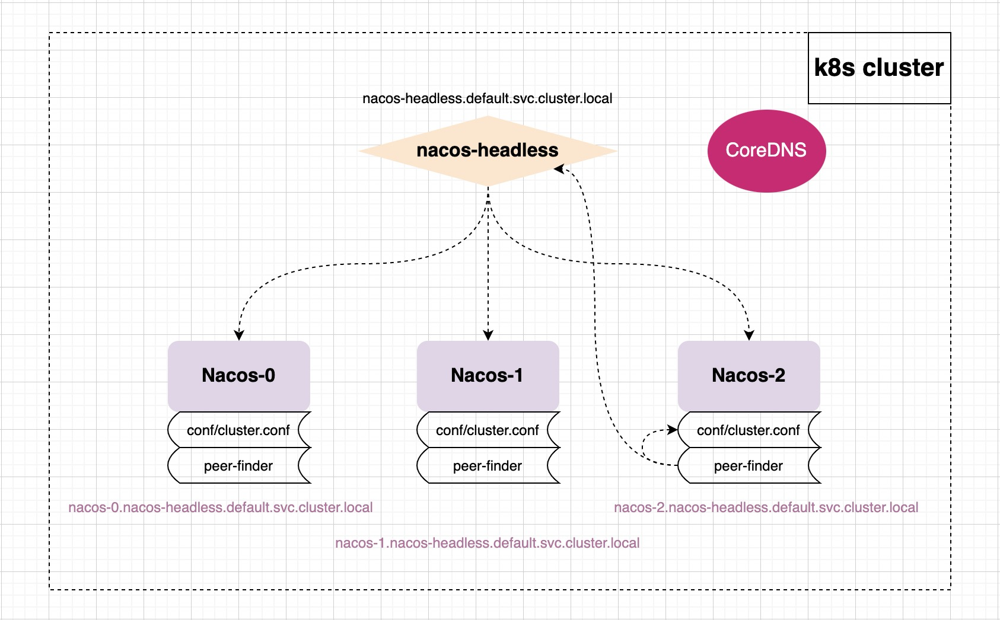

peer-finder 插件是用于不断地监听 nacos-headless 的服务列表变更，若列表有变更则写入 conf/cluster.conf

nacos-0.nacos-headless.default.svc.cluster.local:8848 nacos-1.nacos-headless.default.svc.cluster.local:8848 nacos-2.nacos-headless.default.svc.cluster.local:8848