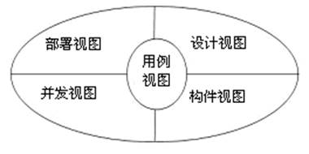
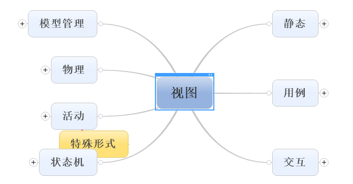
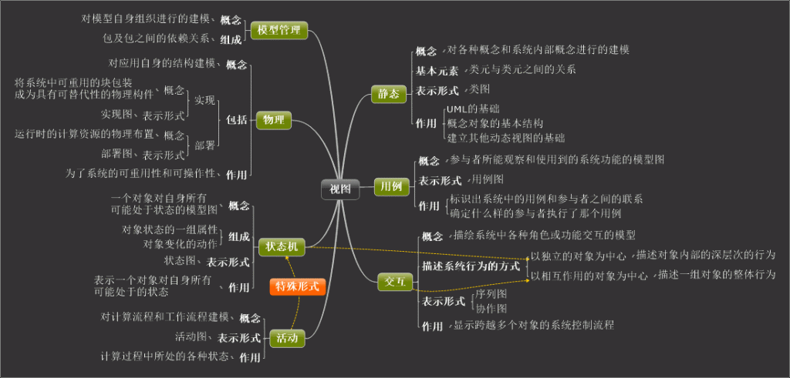

UML概念

UML的全称，统一建模语言（UML是 Unified Modeling
Language的缩写）是用来对软件系统进行可视化建模的一种语言。UML为面向对象开发系统的产品进行说明、可视化、和编制文档的一种标准语言。

**什么是模型**

>   模型是对现实世界的形状或状态的抽象模拟和简化。

**模型的分类**

描述系统的模型：软件模型分为逻辑模型和物理模型。逻辑模型描述未来系统用来做什么。物理模型描述未来系统做什么，规定了系统所采用的的技术，在设计阶段使用物理模型。

描述事物的模型：交通模型、建筑模型、设计模型、数据分析模型。用图形符号对现实世界中某个事物

**按照模型的用途分类：**

用例模型：表示业务系统或软件系统功能的模型。

对象模型：用来表示业务或软件系统的组成和结构。

动态模型：展现了系统的内部行文。包括顺序图、活动图、状态图。

**使用模型的理由最简单的理由：**

为了能够更好地理解正在开发的系统。通过建模，可以达到四个目的：

>   1、有助于按照需求对系统进行可视化的分析

>   2、能够系统的结构或行为

>   3、给出了知道构造系统的模板

>   4、对做出的决策进行文档化

UML中建模与视图

>   当我们用RUP软件开发模型开发软件系统时，可以从5个角度对软件系统进行建模，5个视图分别是用例视图、设计视图、构件视图、并发视图和部署视图，即从5个角度来描述系统的五个方面。在这五个视图中，以用例视图为目标，分别构造其它四个视图。

1．用例视图

描述了系统的功能和参与者，由多个用例图组成，是主要的需求模型。

2．设计视图

又称逻辑视图，描述了软件系统的组成、结构和行为，是软件系统的蓝图。该视图常由类图、交互图、状态图和活动图组成。

3．构件视图

描述了软件系统的组成成分，即软件发布时，系统包含的软件构件和文件。该视图常用构件图、交互图、状态图和活动图描述。

4．并发视图

描述系统各部分之间的同步和异步执行情况。该视图常用状态图和协作图来描述。

5．部署视图

描述了软件系统的各部分如何部署到各硬件节点上。该视图常用部署图、交互图、状态图和活动图描述。

下面是描述软件系统的5种视图，如图28所示。

图 2-28 软件系统

UML中七中视图

本文是我们主要介绍UML的七种视图，所谓一张图胜于千言万语，我们就用图来介绍UML的视图：

**UML的七种视图：**

**七种视图的基本含义：**

