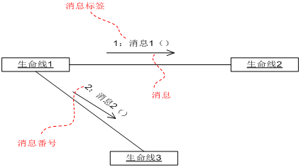
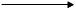
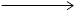
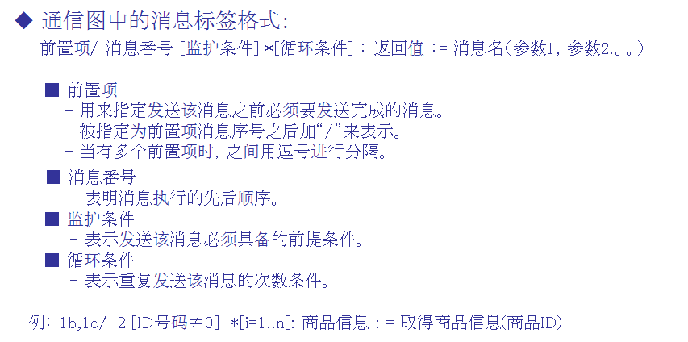
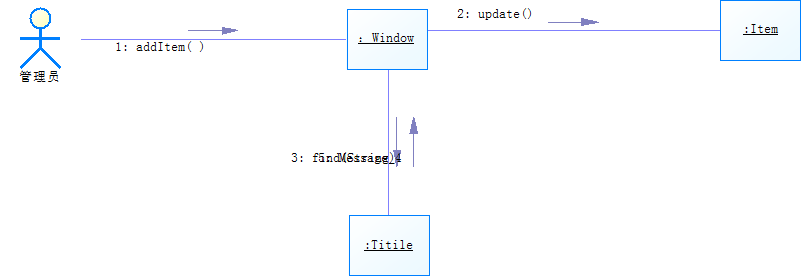
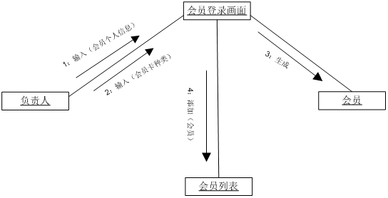
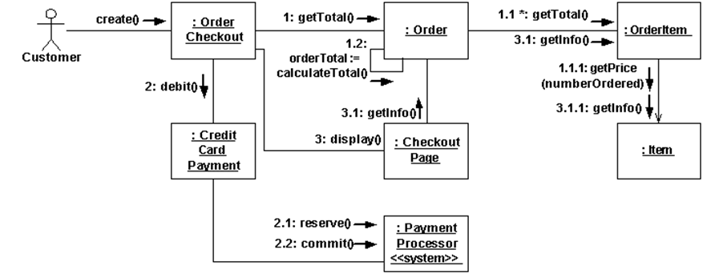
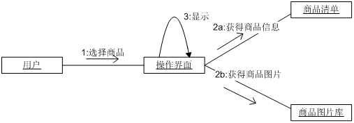

协作图概述

**协作**

>   包含一组对象和链，用于描述系统的行为是如何由系统成分协作实现的。在一定的语境中一组对象以及实现某些行为的对象间的相互作用。协作图就是表现对象协作关系的图。强调组织机构和交互角色。以生命线之间的链接为核心来描述对象之间的消息交互。

**作用**

显示对象及其交互关系的空间组织结构

表现一个类操作的实现

**组成**

协作图基本元素：活动者、对象、链接、消息。

>   对象：用来表示操作图中参与交互的对象。

>   多对象：用来表示协作图中参与交互的多个对象。

>   链接：两个或多个对象之间的独立连接，是对象引用元组，是关联的实例。链的表示形式：一个或多个相连的线或弧。

>   消息：对象之间发送的消息。

**示例**

**通信图的建立**

>   1\. 确定交互过程的上下文(context)；

>   2\. 识别参与交互过程的对象；

>   3\. 如果需要，为每个对象设置初始特性；

>   4\. 确定对象之间的链(link)，以及沿着链的消息；

>   5\. 从引发这个交互过程的初始消息开始，将随后的每个消息附到相应的链上；

>   6\. 如果需要表示消息的嵌套，则用Dewey十进制表示法；

>   7\. 如果需要说明时间约束，则在消息旁边加上约束说明；

>   8\. 如果需要，可以为每个消息附上前置条件和后置条件。

**协作图建模风格**

>   •把注意力集中于关键的交互。

>   •对于参数，优先考虑使用参数名而不是参数类型。

>   •不要对明显的返回值建模。

>   •可以把返回值建模为方法调用的一部分。

>   •为每个消息画出箭头。

>   •注明导航性(Navigability)时要慎重。

**顺序图协作图对比**

>   •顺序图强调消息的时间顺序，协作图强调参加交互的对象的组织，两者可以相互转换。

>   •顺序图不同于协作图的两个特征：

>   –顺序图有对象生命线

>   –顺序图有控制焦点

>   •协作图不同于顺序图的两个特征：

>   –协作图有路径

>   –协作图必须有消息顺序号

>   •顺序图可以表示某些协作图无法表示的信息；同样，协作图也可以表示某些顺序图无法表示的信息。

■顺序图是按照时间顺序从上到下排列消息来描述系统中生命线之间的消息交互情况。

通信图是着眼于生命线之间的链接来描述生命线之间的消息交互情况。

■ 顺序图中的消息可以省略消息番号。

通信图中的消息必须明确消息番号来表示消息发送的先后顺序。

■ 顺序图中，用组合片段“par”来描述消息的并行处理。

通信图中，用“数字+字母”的消息番号定义方式来描述消息的并行处理。

协作图的详细描述

**消息分类**

-   同步消息

-   异步消息

-   返回消息

**消息编号**

通过消息编号指明消息的先后顺序

**消息标签的格式**

**与类图的一致性**

类图表示的是系统的静态结构，交互图表示的是系统的动态行为。两者之间要保持一致性。

-   交互图中的生命线对应于类图中适当的类。

-   交互图中有消息交互的两个生命线，在类图中对应的两个类之间应该有一定的关系。

-   交互图中的消息，在类图中接受该消息的生命线所对应的类中应该有某个操作与之相对应。

**协作图的表示**

协作图的控制结构

**并行处理**

相同数字的消息番号后面跟上不同字母来识别并行消息

**循环表示：（以后补充）**

**分支表示：（以后补充）**

序列图和协作图对比

协作图和序列图表达的信息一样，只是方法不同，可通过适当的方式进行转化。协作图和序列图的不同点：

-   协作图明确表示了角色关系，通过协作角色来限定协作中的对象或链。

-   协作图不将时间作为单独的维来表示，必须使用顺序号来判断消息的顺序以及并行线程。

-   序列图和协作图都表示对象间的交互作用，序列图侧重时间顺序，协作图侧重对象间的关系，时间顺序可以从对象流经的顺序编号中获得。

-   序列图被用于表示方案，而协作图被用于过程的详细设计。
