UML活动图

**概念**

>   活动图是另一个种动态视图，描述动作和动作导致对象状态改变的结果，而不用考虑引发状态改变的事件。描述了系统从一种活动转换到另一种活动的过程。

**活动图的作用：**

>   用来描述系统或者某个业务的处理流程，业务相关的工作流描述、用例的事件流描述、程序的算法描述。描述业务或软件系统的活动轨迹。说明了了一系列活动控制流。

**活动图的图组成元素：**

1、起点

【作用】描述活动图的开始状态

【表示方式】黑的实心圆

2、终止点

【作用】描述活动图的终止状态

【表示方式】实心圆的空心圆

3、活动

【作用】可以是手动也可以自动的执行任务。构成业务和处理的一个单位，用圆角长方形表示。

【表示方式】圆角矩形

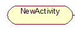

4、状态

【作用】活动的所处状态

【表示方式】椭圆矩形

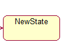

5、转换，控制流

【作用】描述一个活动转向另一个活动

【表示方式】带箭头的实线段，指向转向的活动

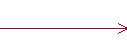

6\. 判决节点和监护条件

【作用】一个输入转换，多个输出转换，每个输出转换上都有一个监护条件，用来表示满足条件时才进行转换。

【表示方式】菱形表示

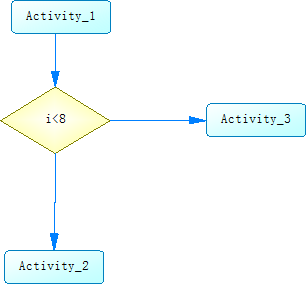

7\. 分叉和汇合（fork并发节点和join并发节点）

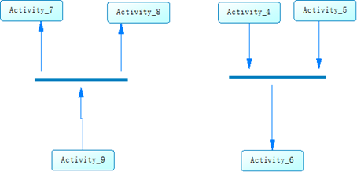

8\. 泳道（参与者）

由组织内的某个人执行活动图。每个泳道代表一个责任区

**状态图中“动作”和活动图中的“动作状态”区别：**

>   相同点：都是原子性的，动作要么不执行，要么就完全执行，不能中断。执行时间都极短

>   不同点：动作状态和状态图中的状态不同，不能有入口动作和出口动作，也不能有内部转移

**活动图建模**

>   确保从判决节点出来的每个转移都有一个监护条件。

>   确保决策点上的监护条件形成一个完备集。

>   监护条件不重叠，互斥。

>   确保每个分叉只有一个进入转移

>   确保每个汇合只有一个退出转移

>   小于5条泳道。

活动图的详细描述

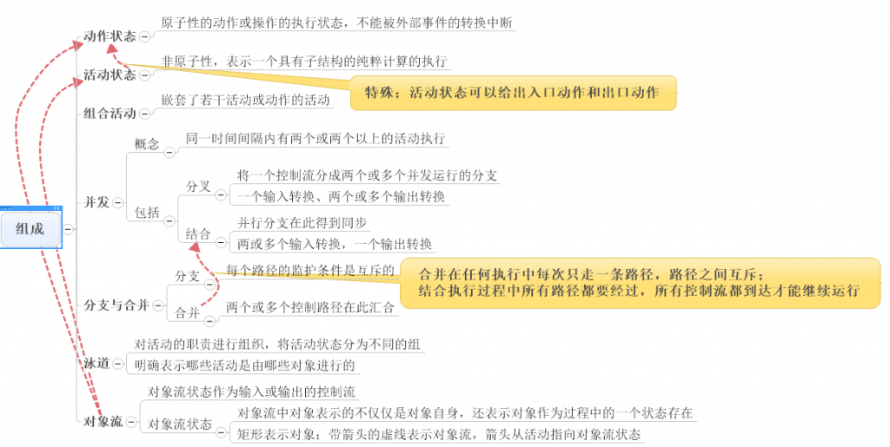

**泳道**

由组织内的某个人执行活动图。每个泳道代表一个责任区

**分支合并**

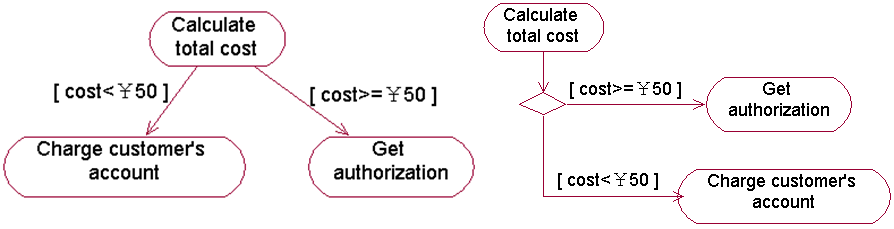

**分叉汇合（并发）**

**对象节点使用**

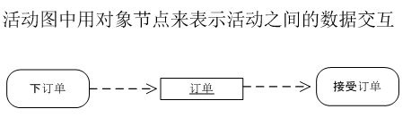

**发送接收信号活动**

>   发送信号活动和事件受理活动

>   发送信号活动：表示的是让外部发生某种事件的活动。

>   事件受理活动：表示的是对于外部发生的事件进行接收的活动。

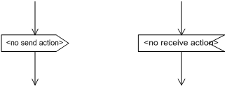

**活动图与状态图比较**

活动图描述的是从activity到activity的控制流，而状态图描述的是对象的状态及状态之间的转移。

–对于以下几种情况可以使用活动图：

>   分析用例

>   理解涉及多个用例的工作流

>   处理多线程应用

–对于下面的情况要使用状态图：

显示一个对象在其生命周期内的行为。

活动图的示例：

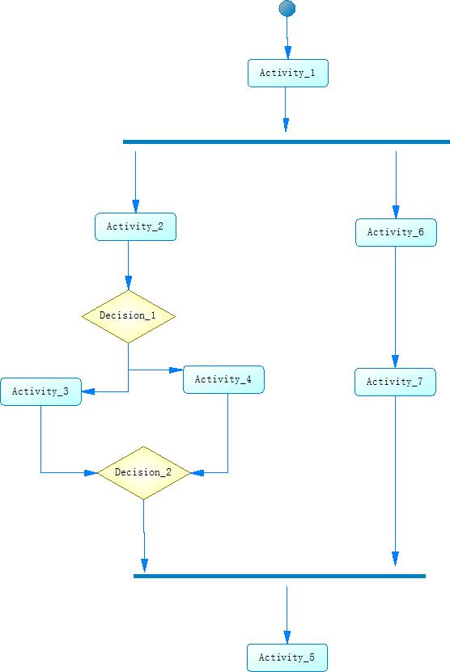

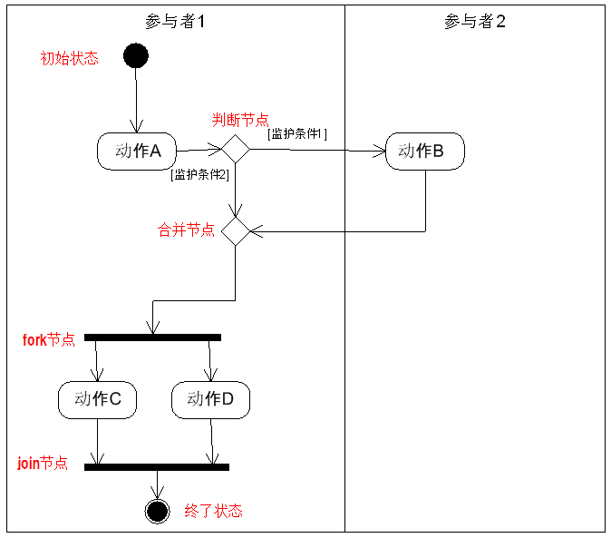

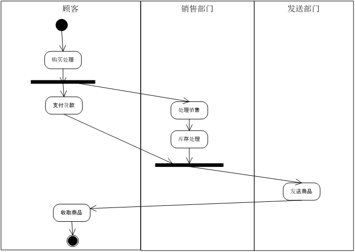

活动图处理具体复杂的不同事物：

**标识永道的活动图**

**标识对象流的活动图**

**标识参数的活动图**

**标识别针的或从图**

**标识中断的活动图**

**标识异常的活动图**

**标识扩展区的活动图**

**标识信号的活动图**

**标识嵌套的活动图**

活动图的建模方式：

**对工作流程进行建模**

**对操作流程进行建模**
