UML状态图

**定义**

>   对象在生命周期内、在外部时间的作用下，对象从一中状态迁移到另一种状态构成的完整系列图，就是一个状态机。

记录下给定时刻状态的机器，根据不同的输入对每个给定的变化而改变其状态或引发一个动作。

>   在UML中，状态机由对象的各个状态和连接这些状态的转换组成，是展示状态与状态转换的图。

>   状态图本质上就是一个状态机或是状态机的特殊情况。由表示状态的节点和表示状态之间转换的带箭头的直线组成。

**状态机图的作用：**

>   状态机图用来描述一个对象从生成到消失整个生命周期内所经历的状态变化。。状态机图用来反映型对象的行为建模（时间响应）

-   表示一个对象对于来自外部的事件如何做出反应的情况。

-   当生命周期内有复杂状态变化的对象，或者需要把握其状态迁移变化的对象才需要画状态机图。

-   包括状态序列、引发事件、一系列响应动作

**状态机的组成元素：**

状态（初始状态结束状态一般状态）、转移、事件、动作。

**认识状态的概念和分类：**

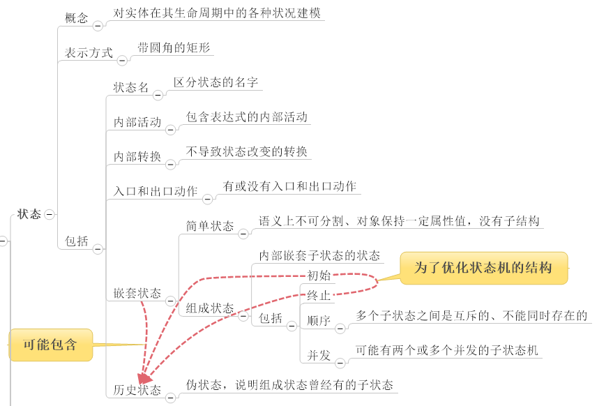

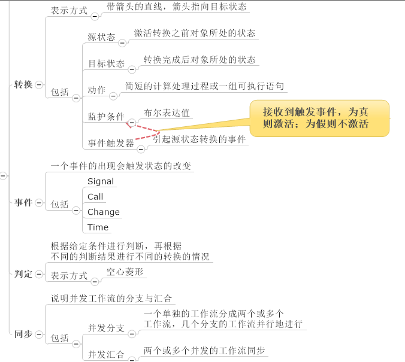

**状态图示例**

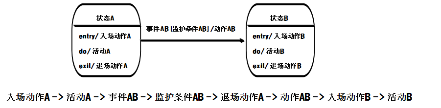

状态图的表示

**状态的表示方法：**

初始状态：对象的起始状态

终止状态：对象最后的状态。

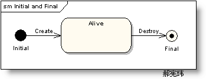

中间状态：使用对象的属性来描述对象的状态。

分类：简单状态、组合状态、历史状态。

描述：状态名称、进入退出动作、内部事务、子状态、活动。

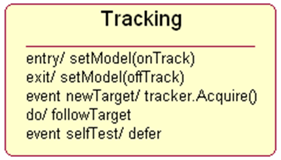

**动作表示方法：**

entry/action：进入状态时执行的动作

exit/action：退出状态时执行的动作

do/activity：处于改状态时执行的动作

event/action(argument)：对象内部迁移，状态相应某个事件锁执行的活动。

**迁移的表示方法：**

使用带箭头实线表示，包括三个要素，事件。监护条件，动作。下面是对水池的操作

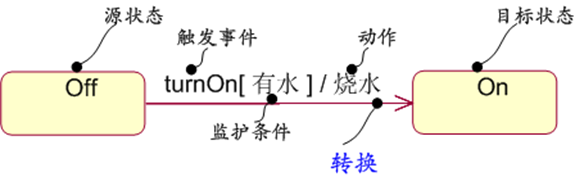

其中事件是turnON的动作，haswater是监护条件，监护条件成立，则执行后边的flowWater动作
，最终转换为ON状态。

-   触发事件，触发对象状态改变的原因、分为四类：调用事件，调用者给接受者发送的时间。信号事件，异步传递信息包。改变时间，改变事件是指对系统的某个条件表达式不断
    进行的循环测试。时间事件，当时间达到某个特定的时刻。

-   监护条件是一个布尔型表达式。

-   动作是原子性的，在执行过程中不能被中断。

**分支的表示方法：**

对象在外部时间的作用下，根据监护条件的不同值，转向不同的目标状态，对象的状态根据监护条件的取值二发生分支。根据监护条件的真假触发不同的分支。

**完整的状态机图：**

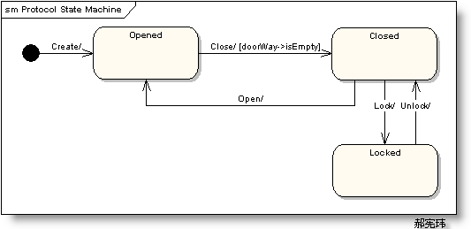

状态图的迁移分类

**外部迁移：**使用带箭头实线表示，包括三个要素，事件。监护条件，动作。下面是对水池的操作

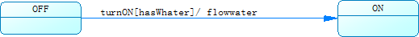

>   其中事件是turnON的动作，haswater是监护条件，监护条件成立，则执行后边的flowWater动作
>   ，最终转换为ON状态。

>   能够触发对象状态改变的对象分为四类：调用事件，调用者给接受者发送的时间。信号事件，异步传递信息包。改变时间，改变事件是指对系统的某个条件表达式不断进行的循环测试。时间事件，当时间达到某个特定的时刻。

>   监护是一个布尔型表达式。

>   动作是原子性的，在执行过程中不能被中断。

>   活动是对象处于某个状态时执行的一系列动作

**自身迁移：**状态可以有返回自身状态的转移，称之为自身转移（Self-Transitions）

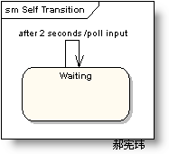

**自动迁移：**没有时间出发时，监护条件为真时执行的动作。

**复合迁移：**由多个外部迁移组成。符合迁移有判决节点和多个简单迁移组合而成。

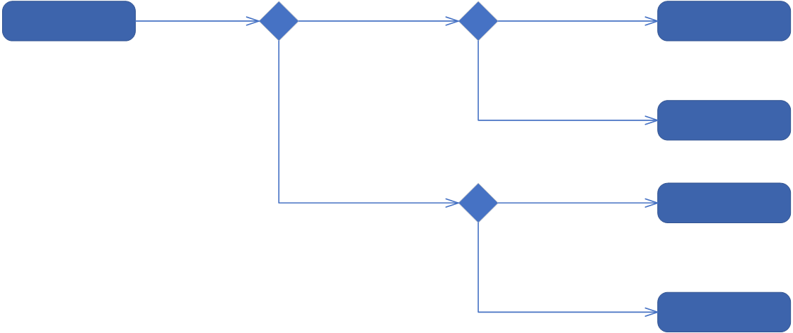

**同期迁移（为了实现并发状态）**

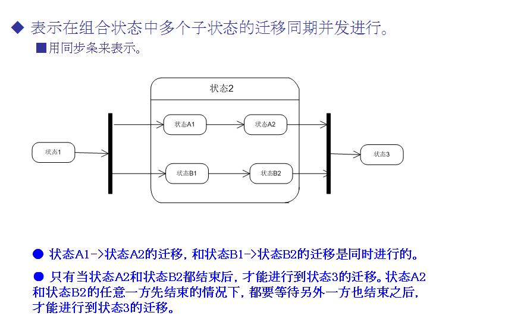

状态图的状态分类

**简单状态**

>   状态机描述了门对象的生存期间的状态序列，引起转移的事件，以及因状态转移而伴随的动作（Action）.

>   状态有Opened、Closed、Locked。

>   事件有 Open、Close、Lock和Unlock。

**组合状态**

>   嵌套在另外一个状态中的状态称之为子状态（sub-state）,一个含有子状态的状态被称作组合状态（Compound
>   States）. 如下图，【Check PIN】是组合状态，【Enter PIN】是子状态。

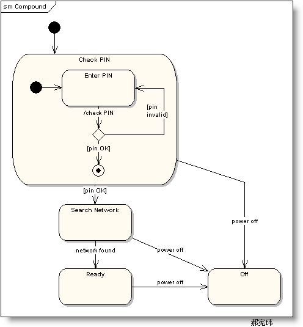

>   也可用以下方式进行描述

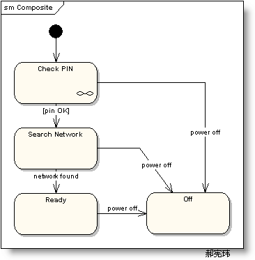

>   如上图，状态机【Check PIN】的细节被分割到另外一个图中了。

>   示例：

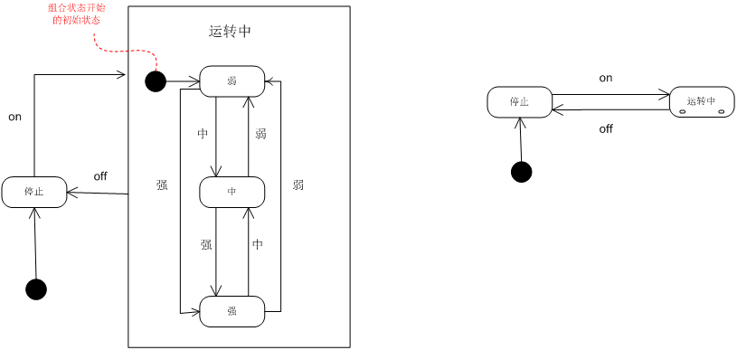

**历史状态**

>   历史状态是一个伪状态（Pseudostate）,其目的是记住从组合状态中退出时所处的子状态，当再次进入组合状态，可直接进入这个子状态，而不是再次从组合状态的初态开始。

>   历史状态符为H符号外加一圆圈来表示。

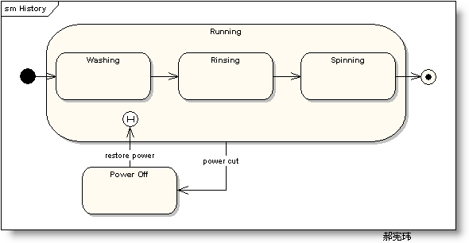

>   在上图的状态图中，正常的状态顺序是:【Washing】-
>   \>【Rinsing】-\>【Spinning】。

>   如果是从状态【Rinsing】突然停电（Power
>   Cut）退出，,洗衣机停止工作进入状态【Power
>   Off】，当电力恢复时直接进入状态【Running】。

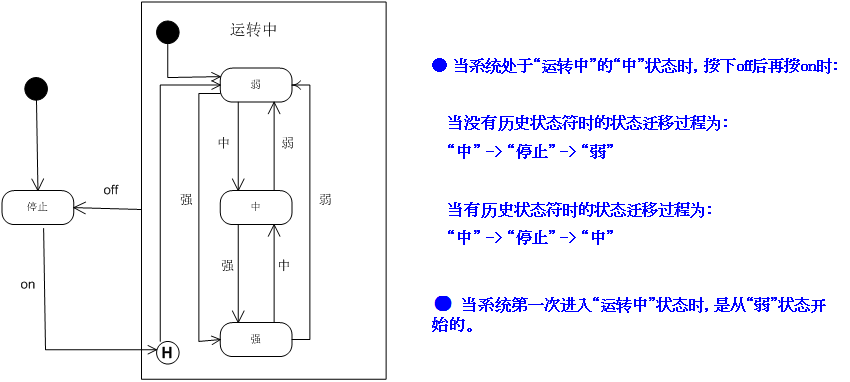

**并发状态**

>   在一个组合状态中，同时有多个子状态存在的时候，该组合状态称为并发状态。

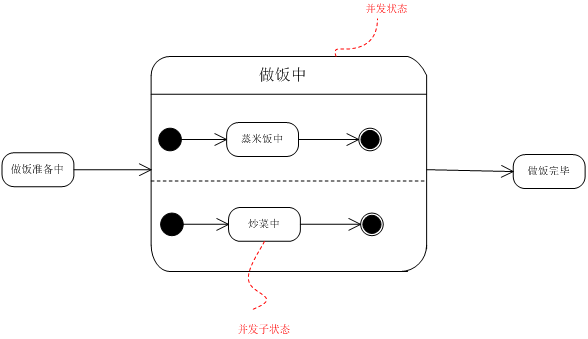

绘制状态机图

**建模风格**

-   把初态放置在左上角；把终态放置在右下角。

-   用过去式命名转移事件。

-   警戒条件不要重叠。

-   不要把警戒条件置于初始转移上。

**问题**

考虑一个培训课程。

该培训课程由讲义和练习两部分组成，最初由讲义开始。

在讲义或者练习的过程中会插入休息。如果是在讲义过程中插入休息，那么休息完毕后再继续讲义。如果在练习过程中插入休息，那么休息之后再继续练习。

**解答**

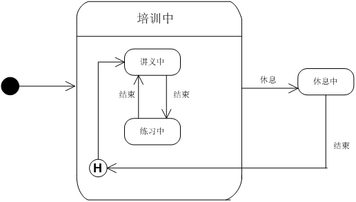

状态机图和交互图的一致性

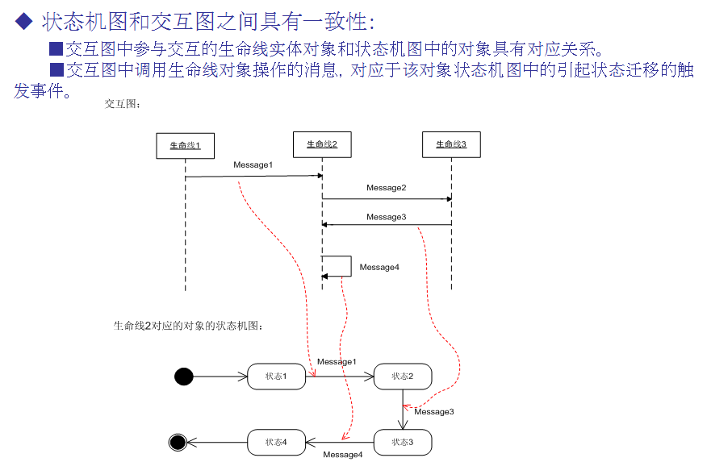

活动图和状态图的各自作用：

**状态图的作用：**

1、清晰描述状态之间的转换顺序，通过转换顺序可以清晰看出事件的执行顺序

2、清晰的事件顺序有利于程序员在开发程序时避免出现事件错序的情况

3、清晰地描述了状态转换时所必须触发德尔事件、监护条件和动作等影响转换的因素，有利于程序员汇总非法事件的进入

4、通过判断更好地描述工作流因为不同的条件发生的分支

**活动图的作用：**

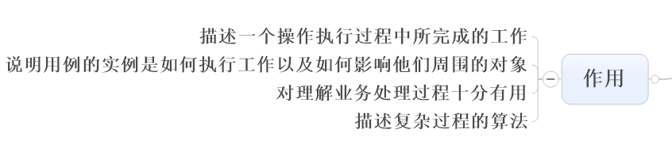

**活动图和状态图的区别：**

1、目的不同

活动图的主要目的是描述动作及对象的改变结果，而状态图则是描述对象、子系统、系统在生命周期中的各种行为

2、活动图中的状态转换不需要任何触发事件，状态图则需要触发事件

3、活动图种的动作可以放在泳道中，状态图不可以
