UML构件图与部署图

**定义**

为了描述系统实现方面的信息，使系统具有可重用性和可操作性的目的，构件图和部署图来表示实现单元。用来描述系统的文件构成，软件运行环境和硬件构成的两种图形—构件图和部署图。主要用来描述系统中能用眼睛看到的那一部分。

构件图

**构件图定义**

构件图是用来表示系统中构件与构件之间、构建内部结构的关系图

构件之间的依赖关系：与类图中类间依赖关系相同，都是使用虚线箭头表示

构件和接口之间的依赖关系：
一个构件使用了其他元素的接口，依赖关系可以用箭头的虚线表示，箭头指向接口符号

**构件图要素**

构件、接口

**构件图示例**

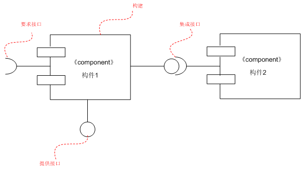

**构件定义**

将系统中可重用的模块封装为具有可替代性的物理单元，称为构件。构件表示的是系统内预先定义好访问接口的可以再利用的软件部件。

构件的特征：

1、代码特征：包含和封装了实现系统功能的类、其他元素的实现代码以及某些构成系统状态的实例对象

2、身份特征：构件拥有身份和状态，用于定位在其上的物理对象

构件的表示：

**接口定义**

构件之间通过接口连接起来。接口定义了操作调用的方法，并且不包含操作的具体实现。

-   提供接口：构件提供给外部的接口

-   要求接口：构件访问外部需要的几口

接口表示示例：

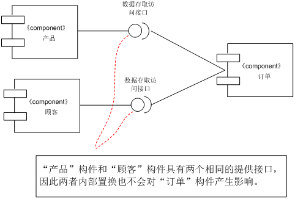

**构件之间的关系**

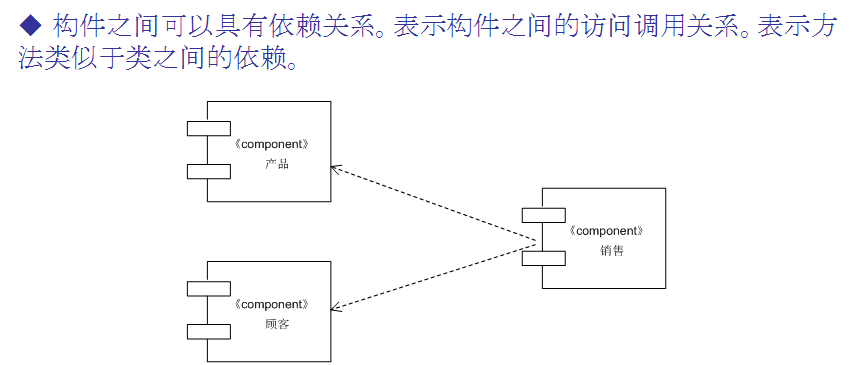

**构件的内部结构**

-   部分（part） - 构成构件的组成部分。

-   端口（port）- 构件内部和外部的边界。一个端口可连接若干个接口。

-   连接（connect） -
    连接构件的组成部分；同类之间的关联一样，可以指定连接端名和多重度。

内部结构示例

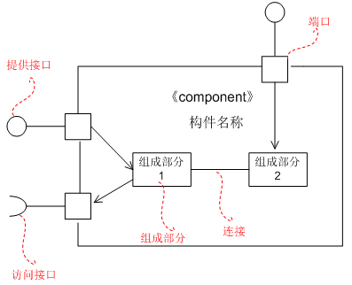

部署图

**定义：**

>   部署图用来描述运行时，部署着系统的物理文件的硬件设备（计算机，打印机）之间的相互关系（通信联接）。

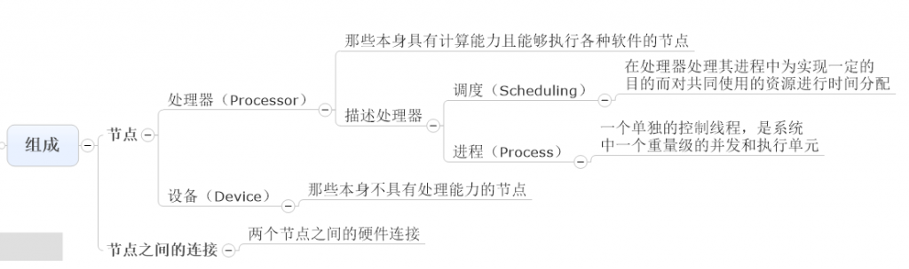

**组成要素**

-   节点

-   节点间的关联

**节点**

硬件设备+运行环境

立方体表示

分为节点类型：节点实例。

节点示例：

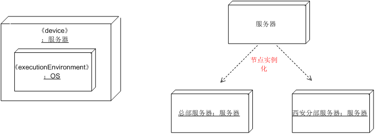

**节点间的关系**

>   部署图中节点和节点之间的关系表示的是节点间的通信连接

-   节点之间的关系可以用构造型来表示。

-   节点间的关联可指定多重度。

节点间关系的示例：

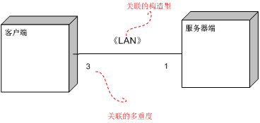

**成果物**

>   在部署图的节点中还可以指定配置在该节点中的成果物。
>   成果物为系统所使用的物理文件。成果物可以是源代码文件，执行文件，构件的实现文件，数据库文件，文书等物理文件实体。

>   成果物表示

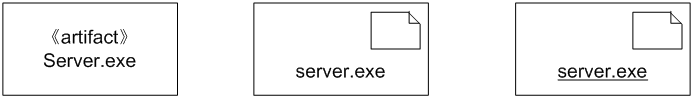

**成果物和节点之间的依赖关系**

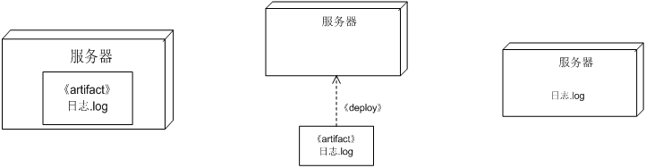

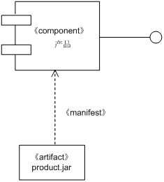

**部署图的作用**

1、描述一个具体应用的主要部署结构。硬件、内部运行环境、部署的软件。

2、平衡系统运行时的计算资源分布

超市信息管理系统的部署图：

**部署图的示例**

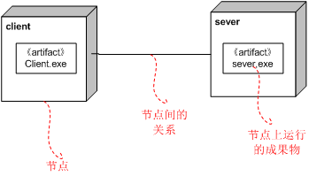
