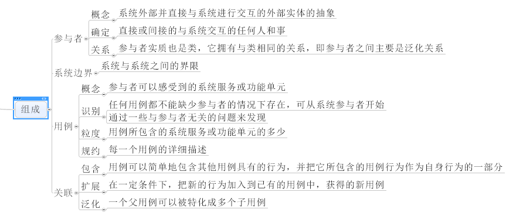
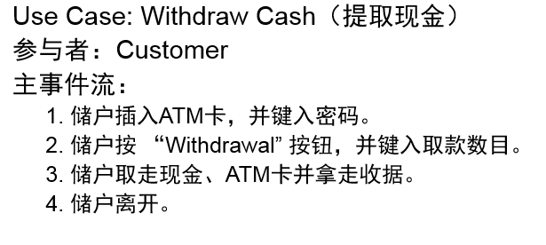
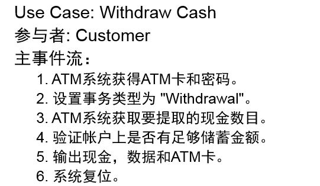
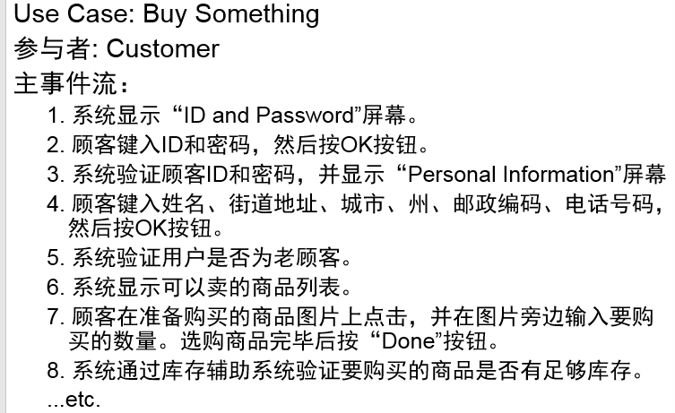
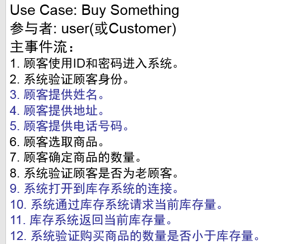
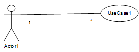
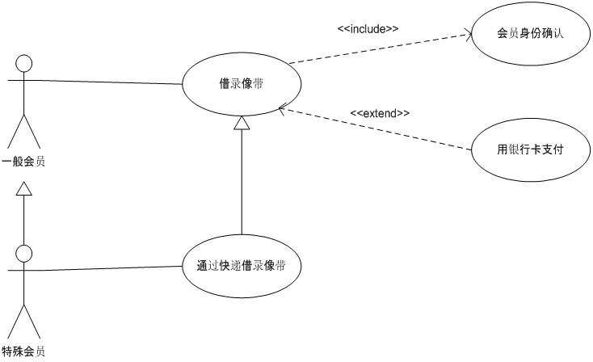
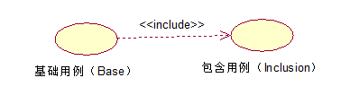
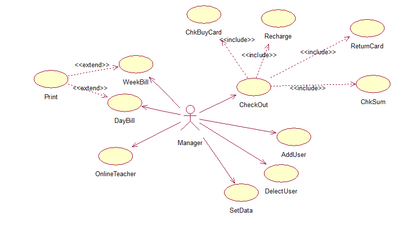

用例图基本概述

**概念**

用例是代表系统中各个项目相关人员之间就系统的行为所达成的契约。**站在用户角度**描述**用户的需求**。

用例图是由参与者、用例以及它们之间的关系构成的用于**描述系统功能**的**动态视图**。

>   用例图的作用是描述参与者和用例的关系，表示系统的用户使用了系统中的哪些用例。

**组成**

用例图组成的概念

-   参与者：可以是系统使用者、外部硬件、现有系统。既可以与对象进行信息交换、也可以被动接受来自于对象系统的信息。

-   用例：系统提供的功能。一个用例会涉及到多个参与者和系统本身。消息序列+错误条件。

**用例图实例**

用例图详细描述

**用例模型准则**

1.  首先确保系统边界

2.  确保关注参与者。

3.  每个用例必须给用户提供价值。

4.  用例是非形式化的。

**用例特点**

-   用例描述了用户提出的需求

-   用例可大可小

-   用例对应一个具体的用户目标

**用例图目的**

-   明确开发系统的主要功能

-   明确开发对象的范围

-   明确开发对象和外界的关系

**用例描述**

-   是对用例图的补充，用例描述和用例图合称为用例模型。

-   用来详细描述用例内部的业务流程。

-   包括概要、脚本（一段藐视具体流程的文字）、事件流（各种条件下的执行流程：前提条件、时候条件、基本条件、代替流、错误流）。

**用例模板**

>   •用例名称：处理订单

>   •标识符：UC1701

>   •用例描述：当一个订单初始化或者被查询的时候这个用例开始。它处理有关订单的初始化定义和授权等问题。当订单业务员完成了同一个顾客的对话的时候，
>   它就结束了。

>   •参与者：订单业务员

>   •优先级：1

>   •状态：通过审查

>   •前置条件：订单业务员登录进系统

>   •后置条件：下订单；库存数目减少

>   •基本操作流程：

>   –1. 顾客来订购一个吉他，并且提供信用卡作为支付手段。……

>   –2. …..

>   •可选操作流程：

>   –顾客来订购一个吉他，并且使用汇票的方式。……

>   –顾客来订购一个风琴，并且提供信用卡作为支付手段。……

>   –顾客使用信用卡下订单，但那张信用卡是无效的。

>   –顾客来下订单，但他想要的商品没有存货。

>   •被泛化的用例：无

>   •被包含的用例：登录 (UC1706)。

>   •被扩展的用例：无

>   •修改历史记录：

>   –张三，定义基本操作流程，2003年5月4日

>   –张三，定义可选操作流程，2003年5月8日

**用例描述中常见错误**

-   只描述系统的行为，没有描述actor的行为。

-   只描述actor的行为，没有描述系统的行为。

-   设定对用户界面的设计的要求。

-   过于冗长。

错误例子：

错误说明：

分别对应常见错误的1234.

改进：

**用例图建立步骤**

>   (1) 找出系统外部的参与者和外部系统，确定系统的边界和范围；

>   (2) 确定每一个参与者所期望的系统行为；

>   (3) 把这些系统行为命名为Use Case；

>   (4) 使用泛化、包含、扩展等关系处理系统行为的公共或变更部分；

>   (5) 编制每一个Use Case的脚本；

>   (6) 绘制Use Case图；

>   (7) 区分主事件流和异常情况的事件流，可以把表示异常情况的事件流作为单独的Use
>   Case处理；

>   (8) 细化Use Case图，解决Use Case间的重复与冲突问题。

**实例分析！！！**

用例图中的关联

**参与者-用例关联关系**

表示参与者和用例之间的通信。关联可以是多重度的。

**参与者-参与者泛化关系**

某一个参与者相关联的所有用例，都和另外一个参与者相关联

**包含**

>   【表示方式】虚线箭头 + include；箭头由基础用例指向被包含用例

>   【作用】提高用例模型的可维护性；简化描述避免多个用例中重复描述同一段行为或对同一段行为描述不一致

>   【包含图】

**扩展**

>   【表示方式】虚线箭头 + extend；箭头指向基础用例

>   【作用】一定条件下，扩展用例为基础用例增加新的行为

>   【扩展图】

**泛化**

>   【表示方式】实线空三角箭头；箭头指向父用例

>   【作用】子用例继承父用例所有的结构、行为和关系，是父用例的一种特殊形式

>   【泛化图】

扩展关系和包含关系的比较：

1、扩展关系：基础用例提供一个或多个插入点，扩展用例为插入点提供需要插入的行为

包含关系中只有一个插入点

2、扩展关系：基础用例执行，扩展不一定执行

包含关系：基础用例执行，包含用例必须执行

3、扩展关系：即使没有扩展用例，基础用例本身是完整的

包含关系：没有包含用例，基础用例本身不完整

用例图的表示

