UML语言的组成：

包括构造块、规则、公共机制

**构造快：**

事物：事物代表了系统中最简单的实体。

关系：关系代表了实体间的联系。

图：代表了实体间按某种规则链接在一起组成的更大的实体。

**规则：**构造块应该遵守的规则，名称、作用范围、可见性、完整性、可执行等属性，在软件系统或业务系统中事物应该遵守的约束或规定。

名称：值每个构造块代表的事务应该有一个名字。

范围：每个构造快代表的事物的使用范围。

可见性：方位构造快代表的事物是，授予访问者的权限或者级别。

完整性：构造块代码的事物应该有完整的含义。

可执行性：构造块代表的事物具有实际含义和合理性。

**公共机制：**每个事物都必须遵守的通用规则。细分为：项数、修饰、通用划分、扩展机制。

构造块——事物(也成为符号)的解释

>   结构符号代表了业务系统或软件系统中的某个简单事物。结构符号代表的简单事物有7种，分别是类(对象)、接口、主动类、用例、协作、构件和节点。结构符号常用名词命名。下面分别介绍7种结构符号的表示法和含义。

**结构符号**

结构符号代表了业务系统或软件系统中的某个简单事物。结构符号代表的简单事物有7种，分别是类(对象)、接口、主动类、用例、协作、构件和节点。结构符号常用名词命名。下面分别介绍7种结构符号的表示法和含义。

1．类和对象

类是对具有相同属性、相同操作以及相同关系的一组对象的共同特征的抽象，类是对一组对象共同特征的描述，即，类是对象的模板，而对象是类的一个实例。

(1)类的表示

>   在UML中，类表示为一个长方形，垂直地把长方形分为三个区，如图5
>   所示。顶部区域显示类的名字。中间的区域列出类的属性。底部的区域列出类的操作。在表示一个类时，类名不能省略，属性和操作可以省略。

图5是Flight类(航线)的图形表示。正如我们所能见到的，类名是 Flight;

我们可以在中间区域看到Flight类的3个属性：flightNumber，departureTime 和
flightDuration。

在底部区域中我们可以看到Flight类有两个操作：delayFlight 和 getArrivalTime。

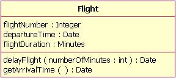

图 1: Flight类的类图

图5 表示Flight类的UML符号

(2)对象的表示

>   对象也是用一个矩形表示的，但在矩形框中不再写出属性名和方法名，只是用“对象名：类名”的格式表示一个对象，并且，对象名和类名下面必须带下划线。例如，属于类People中的对象“李世民”的表示方法如图6所示。

图6表示对象“李世民”的UML符号

| 李世民：People |
|----------------|

2．接口

因为外界是通过类或对象(或构件)的方法类访问对象或类的(或构件)，因此把类或构件的方法集合称为接口。接口向外界声明了类(或构件)能提供的服务。

接口分为供给接口和需求接口两种，供给接口只能向其他类(或构件)提供服务，需求接口表示类(或构件)需要用到其他类(或构件)提供的服务。

上述两种接口的表示方法如图7所示。

图7 表示接口的UML符号

3．主动类

>   一个对象可以是主动的也可以是被动的。主动对象是可以改变自身状态的对象。例如，定时器和时钟就可以在没有外部事件触发的情况下，能自已改变它们自身状态。通常使用进程或者线程来实现创建主动对象。被动对象只有在接受到消息后才会改变自身的状态。例如，银行账户的属性不会发生变化，除非银行账户(对象)接收到一条设置余额(一种用于更新账户余额的操作)的消息。因为大多数对象都是被动对象，所以，我们假设所有对象都是被动对象。

主动类是指创建主动对象的类。主动类的表示与一般类相似，只是最外框是粗线描述而已，如主动类Radio的表示方法如图8所示。

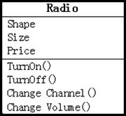

图8 表示主动类Radio的符号

4．用例

>   在系统中，为完成某个任务而执行的一系列动作的集合称为用例实例。用例是对一组用例实例共同行为的描述，这组用例实例具有相似的特征。因此，用例是对一组用例实例共同特征的描述；用例实例是用例的一次具体执行过程，用例是对一组用例实例的描述。用例与用例实例的关系正如类与对象的关系。

>   在UML中，用例是用一个实线椭圆来表示的，在椭圆中写入用例名称，如用例“取款”的表示方法如图9所示。

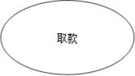

图9 用例“取款”的表示方法

5．协作

协作是指有意义的交互，即一组对象为了完成某个任务，而在相互间进行的交互。

用例的实现是指实现某个用例的一组对象之间的交互，即把一个用例表示为多个对象间的交互(协作)。从本质上说，协作就是用例的实现。

协作用一个带两个分栏的虚线椭圆表示的，例如，用例“销售”，用协作“销售”表示时，其对应的表示方法如图10所示。

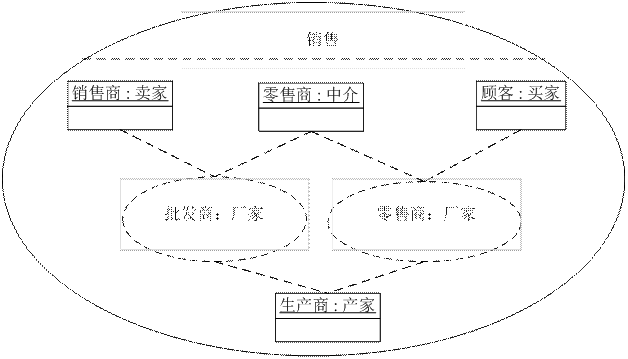

图10 协作“销售”

协作图“销售”表示的语义如下：

(1)生产商生产出产品并以低价售给批发商和零售商，从中获得了利润。

(2)批发商以比生产商较高的价格出售给销售商或零售商，零售商在自己的商店得到
更高利润。

(3)顾客以较高的价格买到自己想要的商品。

6．构件

构件也称组件，它是指系统设计中的一个相对独立的软件部件，它把功能实现部分隐藏在内部，对外声明了一组接口(包括供给接口和需求接口)。因此，两个具有相同接口的构件可以相互替换。

构件是比“对象”更大的软件部件，例如一个COM组件、一个DLL文件、一个JavaBeans以及一个执行文件都可以是构件。为了更好地在UML模型中对它们进行表示，于是引入了构件(也译为组件)。

构件通常采用带有两个小方框的矩型表示，构件的名字写在方框中，如图11所示。

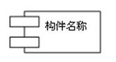

图11 表示构件的UML符号

7．节点

节点是指硬件系统中的物理部件，它通常具有存储空间或处理能力，如PC机、打印机、服务器、显示器等都是节点。在UML中，用一个立方体表示一个节点，例如，节点“显示器”的表示方法如图12所示。

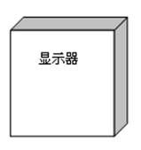

图12 节点“显示器”的UML符号

**行为符号**

>   行为符号是用来表示业务系统或软件系统中事物之间的交互以及交互引起的事物本身的状态变化。行为符号描述了事物的动态特征。描述事物的行为特征在两个方面：事物之间的交互和事物本身的状态变化，描述这2个方面的符号也有2种：一种符号代表事物间的交互；一种符号代表事物本身的状态。

1．交互

交互(interaction)是指为了完成某个任务的对象之间的相互作用，这种作用通过信息的发送和接收来完成。

交互的表示方法很简单，只需使用一条有向直线来表示对象间的交互，并在有向直线上方标注消息名称即可，如图13所示。

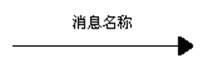

图13 表示交互的UML符号

2．状态

在对象生命周期内，在事件驱动下，对象从一种状态迁移到另一状态，这些状态序列就构成了状态机，即一个状态机由多个状态组成。

在UML中，将状态表示为一个圆角矩形，并在矩形中写上状态名称。例如，手机处在“正在通话”状态的表示方法如图14所示。

图14 表示“正在通话”状态的UML符号

**分组符号**

对于一个中大型的软件系统而言，通常会包含大量的类、接口以及协作，因此也就会存在大量的简单事物和行为特征，为了能有效地对这些事物进行分类和管理，就需要对其进行分组。在UML中可通过“包(Package)”来实现这一目标。

表示“包(Package)”的图形符号与Windows中表示文件夹的图符很相似，包的作用与文件夹的作用也很相似。如“java.awt”包的表示方法如图15所示。

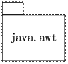

图15 表示“java.awt”包的UML符号

**注释符号**

在UML中，用来对其他事物进行解释的部分(文本解释)称为注释。注释符号用一个右上角折起来的矩形表示，解释的文字就写在矩形框中，如图16所示。

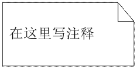

图16 表示注释的UML符号

**构造块——关系符号的解释**

前面介绍了表示事物的元素符号，本节将介绍反映事物之间关系的关系符号。在UML中，共定义了24种关系，相应的有24种关系符号，如表2-1所示。

表2-1 UML中的关系及其符号

| 关系大类 | 关系变种  | UML中的关系 | UML符号             | 关系大类 | 关系变种 | UML中的关系 | UML符号             |
|----------|-----------|-------------|---------------------|----------|----------|-------------|---------------------|
| 抽象     | 派生      | 依赖关系    | 《derive》          | 导入     | 私有     | 依赖关系    | 《access》          |
|          | 显现      |             | 《manifest》        |          | 公有     |             | 《import》          |
|          | 实现      | 实现关系    | 虚线加空心三角      | 信息流   |          |             | 《flow》            |
|          | 精化      | 依赖关系    | 《refine》          | 包含并   |          |             | 《merge》           |
|          | 跟踪      |             | 《trace》           | 许可     |          |             | 《permit》          |
| 关联     |           | 关联关系    | 实线                | 协议符合 |          |             | 未指定              |
| 绑定     |           | 依赖关系    | 《bind》 (参数表)   | 替换     |          | 依赖关系    | 《substitu-te》     |
| 部署     |           |             | 《deploy》          | 使用     | 调用     |             | 《call》            |
| 扩展     | Extend    |             | 《extend》 (扩展点) |          | 创建     |             | 《create》          |
| 扩展     | extension | 扩展关系    | 实线加实心三角      |          | 实例化   |             | 《instanti-ate》    |
| 泛化     |           | 泛化关系    | 实线加空间三角      |          | 职责     |             | 《responsi-bility》 |
| 包含     |           | 依赖关系    | 《include》         |          | 发送     |             | 《send》            |

上述有24种关系，在UML中，可以归纳为关联关系、实现关系、泛化关系、扩展关系和依赖关系5种，下面介绍这些关系的表示方法。

1．关联关系

>   只要2个类之间存在某种关系，我们就认为2个类之间存在关联。关联是人们赋予事物之间的联系，即，只要我们认为2个事物之间有某种联系，就认为事物之间存在关联。实现关系、泛化关系、扩展关系和依赖关系都属于关联关系，是更具体的关联关系。关联关系是最高层次的关系，在所有关系中，关联的语义最弱的。

在关联关系中，有两种比较特殊的关系，它们是聚合关系和组合关系。

(1)关联关系的表示

>   关联关系是是比较抽象的关系，它包含的语义较少；聚合关系和组合关系是更具体的关联关系，它包含的语义更具体。在UML中，使用一条实线来表示关联关系如图17所示。

图17 表示关联关系的UML符号

(2)聚合关系

>   聚合(Aggregation)是一种特殊形式的关联，表示类之间的关系是整体与部分的关系。聚合关系是一种松散的对象间关系——计算机与它的外围设备就是聚合关系。一台计算机和它的外设之间只是很松散地结合在一起，这些外设可有可无，可以与其他计算机共享。即，部分可以离开整体而存在。

>   聚合的表示方法如图18(a)所示。其中棱形端表示事物的整体，另一端表示事物的部分。如计算机就是整体，外设就是部分。

(3)组合关系

>   如果发现“部分”类的存在是完全依赖于“整体”类的，那么就应使用“组合”关系
>   来描述。组合关系是一种非常强的对象间关系，就像树和树叶之间的关系。树和它的叶子紧密联系在一起，叶子完全依赖树，它们不能被其他的树所分享，并且当树死去时，叶子也会随之死去——这就是组合，在组合关系中，部分依赖于整体而存在。组合是一种强的聚合关系，它的表示方法如图18(b)所示。

(a) (b)

图18 表示聚合关系和组合关系的UML符号

2．泛化关系

>   泛化关系描述了从特殊事物到一般事物之间的关系，也就是子类到父类之间的关系，或者子接口到父接口的关系。表示泛化关系的符号是从子类指向父类的带空心箭头的实线，其表示方法如图19所示。而从父类到子类的关系则是特化关系。

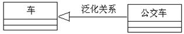

图19 表示泛化关系的UML符号

3．实现关系

>   实现关系是用来规定接口与实现接口的类之间的关系。接口是操作的集合，这些操作声明了类或组件所提供的服务。表示实现关系的符号是从类指向接口的带空心箭头的虚线，其表示方法如图20所示。

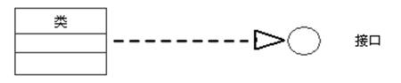

图20 表示实现关系的UML符号

4．依赖关系

假设有两个元素X、Y，如果元素X的值发生变化，就会引起元素Y的值的变化，则称元素Y依赖(Dependency)于元素X。依赖关系的表示如图21所示。

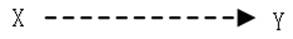

图21 表示依赖关系的UML符号

如果两个元素是类，则类间的依赖现象有多种，如一个类向另一个类发消息；一个类是另一个类的数据成员；一个类是另一个类的某个方法的参数。

从本质上说，聚合、组合、泛化以及实现关系都属于依赖关系，但是它们有更特别的语义。

5．扩展关系

在UML中，用一个带箭头的实线表示扩展关系，如图22所示。这里的扩展含义是指对一个元类的扩展，即，通过扩展元类的语义，获得新的元类。

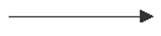

图22 表示扩展关系的UML符号
