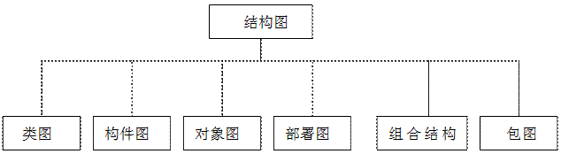
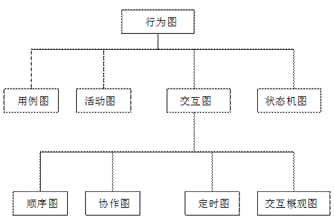
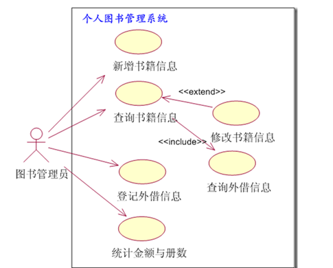
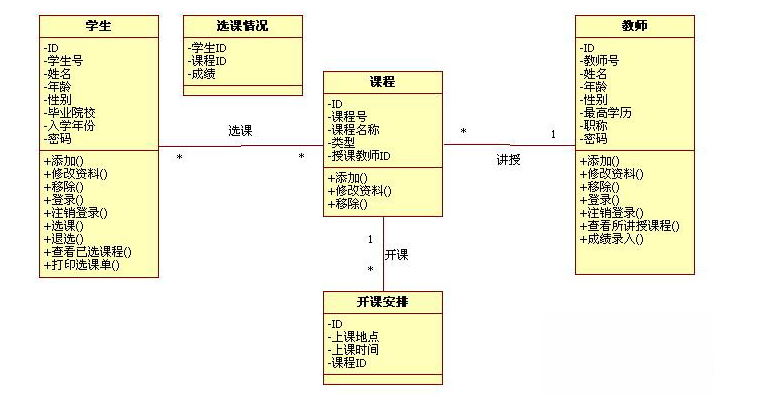
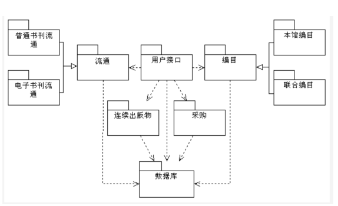
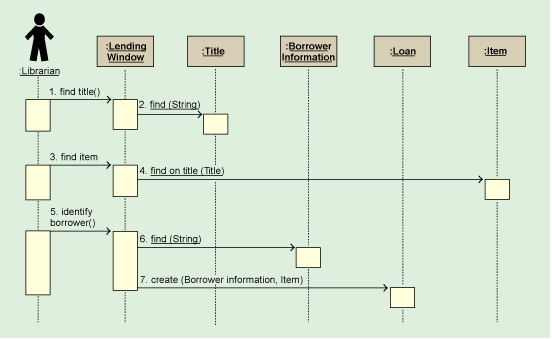
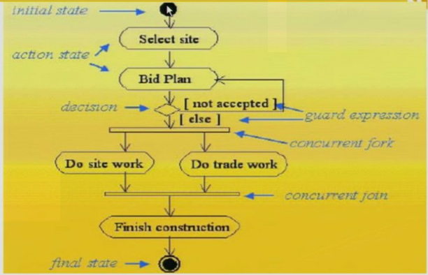
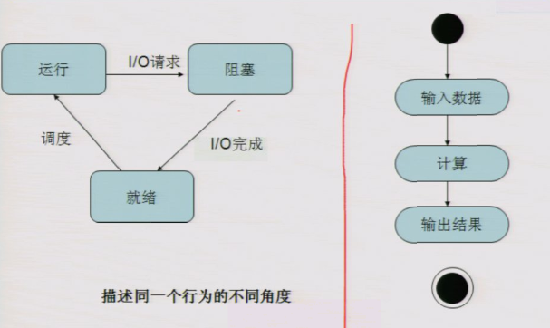
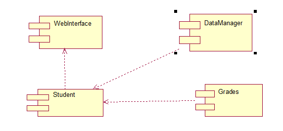
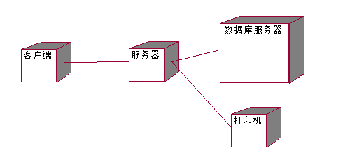

UML构造块——图的解释

UML中的图可分为两大类：结构图和行为图。结构图描绘系统中事物的组成及结构关系；行为图描绘系统中事物间的相互交互行为。下面是UML图的组成，如图23所示。（图是根据UML中存在的构造块进行说明的，视图是根据要具体解决的问题对系统进行说明。也就是说，要想完成某个视图，需要使用一个或者多个UML中的构造块，由事物构成的图）

图23 UML图的组成

**1．结构图（静态结构图）**

结构图又分为6种，如图24所示。

图6-24 结构图组成

(1)类图

类图是使用UML建模时最常用的图，它展示了系统中的静态事物、它们的结构以及它们之间的相互关系。这种图的典型用法是描述系统的逻辑设计和物理设计。

(2)构件图

构件图可以展示一组构件的组织和彼此间的依赖关系，它用于说明软件系统如何实现，以及软件系统内构件如何协同工作等。

(3)对象图

对象图可以展示系统中的一组对象，它是系统在某一时刻的快照，也可以说对象图是类图在某一时刻的快照。

(4)部署图

部署图可以展示物理系统运行时的架构，同时可以描述系统中的硬件架构和硬件上驻留的软件架构。

(5)组合结构图

组合结构图可以展示系统的内部结构。

(6)包图

包图用于描绘包之间的依赖关系(包是一个用于组织其他模型元素的通用模型元素)。

**2．行为图（动态性位图）**

行为图又细分为4种，如图6-25所示。

图6-25 行为图组成

(1)活动图

活动图显示系统内部的活动控制流程。通常需要使用活动图描述不同的业务过程。

(2)状态图

状态图显示对象从一种状态迁移到其它状态的转换过程。状态图是一个动态视图，对事件驱动的行为建模尤其重要，例如可以利用状态图描述一个电话路由系统中交换机的状态，不同的事件可以令交换机转移至不同的状态，用状态图对交换机建模有助于理解交换机的动态行为。在
UML 2.0中，状态图被称为状态机图(state machine diagram)。

(3)协作图

协作图(也称通信图)是交互图的一种，交互图还包括顺序图(以及UML
2.0中新定义的其他几种图，稍后将介绍)。协作图突出对象之间的合作与交互。

(4)顺序图

顺序图是另一种交互图，它强调一个系统中间相互作用时消息的时间顺序。

UML 2.0中又增加了下列几种行为图：

(5)时间图

时间图也是一种交互图，它描绘与交互对象的状态转换或条件变化有关的详细时间 信息。

(6)交互概观图

交互概观图是一种高层视图，用于从总体上显示交互序列之间的控制流。

注意：在实际进行系统建模时，几乎没有人会使用到UML标准中定义的所有图。

(7)用例图

用例描述了系统的工作方式，以及系统能提供的服务。用例图描述了系统外部参与者如何使用系统提供的服务。

注意：组合结构图、包图及用例图是UML 2.0中新增的结构图。

3\. 图的功能

在UML 2.0中共定义了13种图。

| 图分类     | 作 用                                                                      | 描述              |
|------------|----------------------------------------------------------------------------|-------------------|
| 类图       | 描述系统中的类组成和类之间的关系                                           | 与UML 1.0相同     |
| 对象图     | 描述系统在某个时刻对象的组成和关系                                         | UML 1.0非正式图   |
| 复合结构图 | 描述复合对象的内部结构                                                     | UML 2.0新增       |
| 构件图     | 描述构件的结构与组成                                                       | 与UML 1.0相同     |
| 部署图     | 描述在系统中各个节点上的构件及其构件之间的关系                             | 与UML 1.0相同     |
| 包图       | 描述系统的宏观结构，并用包来表示                                           | UML中非正式图     |
| 用例图     | 描述用户与系统如何交互及系统提供的服务                                     | 与UML 1.0相同     |
| 活动图     | 描述活动控制流程及活动节点的转换过程                                       | 与UML 1.0相同     |
| 状态机图   | 描述对象生命周期内，在外部事件的作用下，对象从一种状态如何转换到另一种状态 | 与UML 1.0相同     |
| 顺序图     | 描述对象之间的交互，重点在强调消息发送的顺序                               | 与UML 1.0相同     |
| 协作图     | 描述对象之间的交互，重点在于强调对象的职责                                 | UML 1.0中的协作图 |
| 定时图     | 描述对象之间的交互，重点在于描述时间信息                                   | UML 2.0 新增      |
| 交互概观图 | 是一种顺序图与活动图的混合嫁接                                             | UML 2.0新增       |

表2-2 UML 2.0中的图

从使用的角度来看，可以将UML的13种图分为结构模型(也称为静态模型)和行为模型(也称为动态模型)两大类。

构造块——图与视图的实现关系

图可视化地描绘了系统某个方面的局部特征；多个相关的图可以描述系统的某个方面的全部特征，我们把描述系统某个方面全部特征的多个图的集合称为视图。

在UML参考手册第2版中，将UML图划分为4大应用类型和9种视图，如表2-3所示。

表2-3 UML图和视图

| 应用类型 | 视 图        | 组成                               |
|----------|--------------|------------------------------------|
| 结构领域 | 静态视图     | 类图，对象图                       |
|          | 设计视图     | 复合结构图、协作图、构件图，对象图 |
|          | 用例视图     | 用例图                             |
| 动态领域 | 状态视图     | 状态机图                           |
|          | 活动视图     | 活动图                             |
|          | 交互视图     | 顺序图、通信图，时间图，交互概述图 |
| 物理领域 | 部署视图     | 部署图                             |
| 模型管理 | 模型管理视图 | 包图                               |
|          | 特性描述     | 包图                               |

其中，结构领域的视图描述了系统中的结构成员及其相互关系；动态领域的视图描述了系统随时间变化的行为；物理领域的视图描述了系统的硬件结构和部署在这些硬件上的系统软件；模型管理领域的视图说明了系统的分层组织结构。

构造块——对各种图的简单描述

13、用例图（use case diagrams）

>   【概念】描述用户需求，从用户的角度描述系统的功能

>   【描述方式】椭圆表示某个用例；人形符号表示角色

>   【目的】帮组开发团队以一种可视化的方式理解系统的功能需求

>   【用例图】

1、类图（class diagrams）

>   【概念】显示系统的静态结构，表示不同的实体是如何相关联的

>   【描述方式】三个矩形

>   【目的】表示一个逻辑类或实现类，逻辑类通常是用户的业务所涉及的事物；实现类是程序员处理的实体

>   【类图】

3、 对象图（object diagrams）

>   【概念】类图的一个实例，描述系统在具体时间点上所包含的对象以及各个对象的关系

>   【对象图】

10、 序列图（顺序图）

>   【概念】描述对象之间的交互顺序，着重体现对象间消息传递的时间顺序

>   【描述方式】横跨图的顶部，每个框表示每个类的实例或对象；类实例名称和类名称使用冒号分开

>   【目的】显示流程中不同对象之间的调用关系，还可以显示不同对象的不同调用。

>   【序列图】

4、 协作图（Collaboration diagrams）

【概念】描述对象之间的合作关系，侧重对象之间的消息传递

8、 状态图（Statechart diagrams）

【概念】描述对象的所有状态以及事件发生而引起的状态之间的转移

【描述方式】

-   起始点：实心圆

-   状态之间的转换：使用开箭头的线段

-   状态：圆角矩形

-   判断点：空心圆

-   一个或多个终止点：内部包含实心圆的圆

【目的】表示某个类所处的不同状态以及该类在这些状态中的转换过程

7、 活动图（Activity diagrams）

>   【概念】描述满足用例要求所要进行的活动以及活动时间的约束关系

>   【描述方式】

-   起始点：实心圆

-   活动：圆角矩形

-   终止点：内部包含实心圆的圆

-   泳道：实际执行活动的对象

    【目的】表示两个或多个对象之间在处理某个活动时的过程控制流程

    【活动图】

活动图和状态图区别：

2、构件图（Component diagrams）

>   【概念】描述代码构件的物理结构以及各构件之间的依赖关系

>   【描述方式】构件

>   【目的】提供系统的物理视图，根据系统的代码构件显示系统代码的整个物理结构

>   【构架图】

4、 部署图（Deployment diagrams）

>   【概念】系统中硬件的物理体系结构

>   【描述方式】

1.  三维立方体表示部件

2.  节点名称位于立方体上部

    【目的】显示系统的硬件和软件的物理结构

    【部署图】

