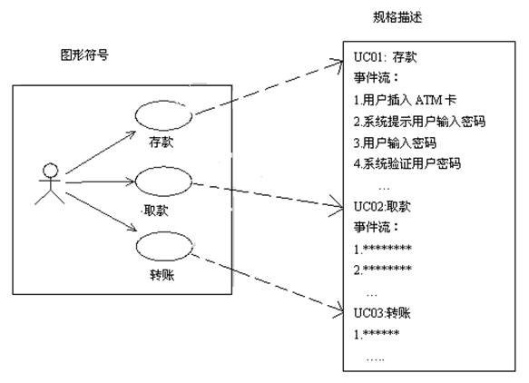
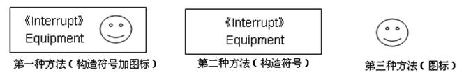

规则

>   在UML中，代表事物的元素符号在使用时应遵守一系列规则，每个元素必须遵守的3种语义规则如下：

>   l
>   名称：每个元素应该有一个名字，即，事物、关系和图都应该有一个名字。和任何语言一样，名字即是一个标识符。

>   l 范围：每个元素起作用的范围。相当于程序设计语言中变量的“作用域”。

>   l
>   可见性：我们知道，UML元素可能属于一个类或包中，因此，所有元素都具有可见属性。在UML中，为元素定义了4种可见性，如表2-4所示。

表2-4 UML元素的可见性

| 元素的可见性 | 规 则(假设被访问的元素在包中)                | 标准表示法 |
|--------------|----------------------------------------------|------------|
| public       | 任一元素若能访问包，则就可以访问包中的元素它 | +          |
| protected    | 只有包中的元素或子包才能访问它               | \#         |
| private      | 只有包中的元素才能访问它                     | -          |
| package      | 只有声明在同一个包中的元素才能访问该元素     | ～         |

公共机制

在UML语言中，定义了4种公共机制：规格描述、修饰、通用划分和扩展机制。

**规格描述**

>   在UML语言中，对每一个元素有一个图形符号来表示，同时，对每个图形符号的语义有一个详细的文字描述，这种对图形符号的语义进行的文字描述称为规格描述，也称为详述。

>   如图26所示，在左边的方框中有三个用图形符号表示的用例，分别是：“存款“、“取款”
>   、”转账”，在右边的方框中，分别对每个图形符号表示的用例进行了详细的文字描述，即规格描述。

图26 图形符号与对应的规格描述

**修饰**

>   在UML中，每个元素符号对事物的主要方面提供了可视化表示，而若想将事物的细节表示出来，则必须对元素符号加以修饰。例如，用斜体字表示抽象类，用+，-符号表示元素的访问级别，这些都是通过修饰符号来表示事物的细节。所谓修饰就是增加元素符号的内涵，为被修饰的元素提供更多的信息。

**通用划分**

>   UML通用划分，即对UML元素进行分组，包括两组：类与对象、接口与实现。

>   l 类与对象：类是对对象共同特征的描述、是对象的模板，而对象则是类的实例。

>   l
>   接口与实现：接口是一种声明、一个合同、是一组方法的集合，而实现则是完成一个合同、实现接口中的声明。

>   在UML中，用例就是一种对功能的声明和定义，是对事物功能的抽象描述；而协作则是实现用例声明的功能；操作名是声明服务的，而方法体则是实现服务的。因此，用例与协作、操作名与方法体之间就是接口与实现的关系。

**扩展机制**

>   由于UML中定义的元素符号不能表示所有的事物，因此需要通过一些方法对元素符号进行扩展，主要的扩展机制有：构造型、标记值和约束。

1．构造型

>   构造型就是指分析师自已定义一种新的UML元素符号，给这种新的元素符号赋予特别的含义，例如，分析师可以定义一个元素符号《Interrupt》，用该元素符号代表“中断”。

>   表示同一构造型元素符号的方法有3种，图27所示就是用3种不同方式来表示设备“中断”这种构造型，其中假设Equipment(设备)是类名称。

>   图27 构造型的3种表示方法

>   l
>   第一种表示方法：创建一种新的UML元素符号《Interrupt》，表示“中断”，在构造元素符号右边放置一个图标。构造符号“《Interrupt》”与图标一起代表“中断”。

>   l
>   第二种表示法：创建一种新的UML元素符号《Interrupt》，表示“中断”，这是一种标准表示方法。

>   l 第三种表示方法：直接用一个图标表示新的构造元素符号，该符号的语义是“中断”。

2．标记值

>   标记值是用来为事物(元素符号)添加新特征的，其表示方法是用格式如“{标记信息}”的字符串表示。标记信息通常是一个字符串，它由名称、分隔符和值3个部分组成。例如，标记信息：{name=“李小平”}
>   。在这个标记信息中，名称是name ; 分隔符是= ;标记值是”李小平”
>   。其中，名称表示了事物的属性。标记值表示了事物的属性值。

3．约束

>   约束是用来标识元素之间约束条件，是用来增加新的语义或改变已存在规则的一种机制(通过文本和OCL两种方法表示约束)。约束的表示方法和标记值的表示方法类似，都是使用花括号括起来的字符串来表示，不过不能够把它放在元素中，而是要放在相关的元素附近。
