几种关系

在UML类图中，常见的有以下几种关系: 泛化（Generalization）, 实现（Realization）,
关联（Association), 聚合（Aggregation）, 组合(Composition), 依赖(Dependency)

**1. 泛化（Generalization）**

【泛化关系】：（is a）是一种继承关系, 表示一般与特殊的关系,
它指定了子类如何特化父类的所有特征和行为。子类拥有超类所欲的属性和擦偶偶。
例如：老虎是动物的一种, 即有老虎的特性也有动物的共性.

【箭头指向】：带三角箭头的实线，箭头指向父类

**2. 实现（Realization）**

【实现关系】：是一种类与接口的关系, 表示类是接口所有特征和行为的实现.

【箭头指向】：带三角箭头的虚线，箭头指向接口

**3. 关联（Association)**

【关联关系】：(has a )是一种拥有的关系,
它使一个类知道另一个类的属性和方法；如：老师与学生，丈夫与妻子

【关系要素】：

-   关联名：动词、有方向（黑三角表示）。

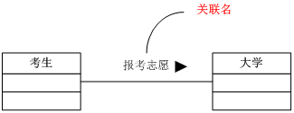

-   关联端名：关联的一端相对于另一端的特征，功能和离场。

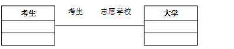

-   多重度：相关联的实例对象之间的对应关系。

必须是1 1

0或者1 0. .1

0以上 0. . \* 或 \*

1以上 1 . . \*

指定区间 1 . . 10

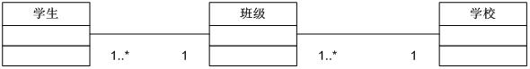

-   关联方向：

关联的两个类互相之间都会去向对方发送消息的情况下，称为双向关联。关联端两端都要用箭头明示。

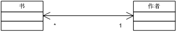

关联的两个类之间，只能由一端向另外一端的类发消息，而反过来不行时，称为单向关联。接受消息一方的关联端用箭头表示，不能接受消息一方的关联端用“X”进行表示。

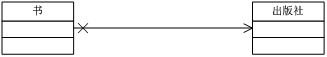

关联的某一端的关联方向尚未明确的情况下，可不标明方向性。

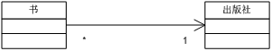

-   限定符：为了减少相关联的对象数目而设置的条件。限定符用小矩形框表示，矩形框加在关联端上，矩形框内要写明限定符属性。限定符属性对应于关联的另一侧类中的一个属性。

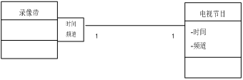

【代码体现】：拥有者含有一个成员变量，指向被拥有者。

【箭头及指向】：带普通箭头的实心线，指向被拥有者

上图中，老师与学生是双向关联，老师有多名学生，学生也可能有多名老师。但学生与某课程间的关系为单向关联，一名学生可能要上多门课程，课程是个抽象的东西他不拥有学生。

【特殊关系】

-   递归关联：一个类和自身具有某种关联时，称为递归关联。

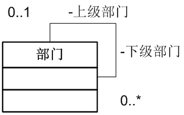

-   多重关联：两个类之间具有多个不同意义的关联，可以通过附加关联名或者关联端名来进行区分。

**4. 依赖(Dependency)**

【依赖关系】：是一种使用的关系, 即一个类的实现需要另一个类的协助,
所以要尽量不使用双向的互相依赖.

【关系分类】：

-   一个类的对象作为另外一个类的参数被调用。

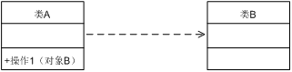

-   一个类的对象作为局部变量被调用。

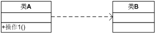

-   一个类的对象作为全局变量被调用

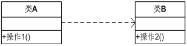

【代码表现】：局部变量、方法的参数或者对静态方法的调用

【箭头及指向】：带箭头的虚线，指向被使用者

**5. 聚合（Aggregation）**

【聚合关系】：(part of)是整体与部分的关系, 且部分可以离开整体而单独存在.
如车和轮胎是整体和部分的关系, 轮胎离开车仍然可以存在.

聚合关系是关联关系的一种，是强的关联关系；关联和聚合在语法上无法区分，必须考察具体的逻辑关系。

【代码体现】：成员变量

【箭头及指向】：带空心菱形的实心线，菱形指向整体

**6. 组合(Composition)**

【组合关系】：是整体与部分的关系, 但部分不能离开整体而单独存在.
如公司和部门是整体和部分的关系,
没有公司就不存在部门.组合关系是关联关系的一种，是比聚合关系还要强的关系，它要求普通的聚合关系中代表整体的对象负责代表部分的对象的生命周期

【代码体现】：成员变量

【箭头及指向】：带实心菱形的实线，菱形指向整体

各种关系的强弱顺序：

**泛化 = 实现 \> 组合 \> 聚合 \> 关联 \> 依赖**

下面这张UML图，比较形象地展示了各种类图关系：

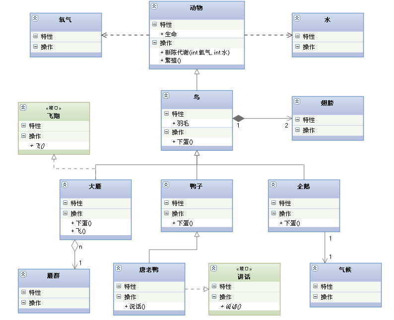

聚合与组合的区分

**途径**

1）物理上整体的事物与它的部分事物，例如：人体与各种人体器官

2）组织机构与它的下级组织或部门，例如：市场部与公关部、产品部

3）团体（组织）与成员，例如：班级与学生

4）空间上的包容关系，例如：教室与桌椅

5）抽象事物的整体与部分，例如：学科与学科分支

6）具体事物和它的某个抽象方面，例如：人员基本信息与各个阶段的信息

7）在材料上的组成关系，例如：面包与面包材料

**原则**

1）聚合中的整体对象和部分对象，若不属于问题域，则应该去掉，例如：业务系统中，职工与家庭的聚合关系。

2）聚合中的整体对象和部分对象，若不是系统责任需要的，则应该去掉，例如：赛车系统中，车和车轮的聚合关系。

3）聚合中的部分对象若只有一个属性，则应该考虑取消它，把属性放到整体对象中去。例如：汽车销售系统中，汽车和只有规格一个属性的车轮聚合。

4）如果两个对象不能明显分出整体---部分关系，则不应该用聚合关系表示。例如：财务系统中，名细帐和总帐，不明显有整体部分结构。
