类图概述

**类图定义**

>   类图显示了系统的静态结构。类图就是用于对系统中的各种概念进行建模，并描绘类图之间的静态关系。再简单一点，类就是一组具有相同结构、行为、关系的一群对象。

**组成要素**

类（类名，属性，操作）、关系（关联，泛化，聚合等）

**类图示例**

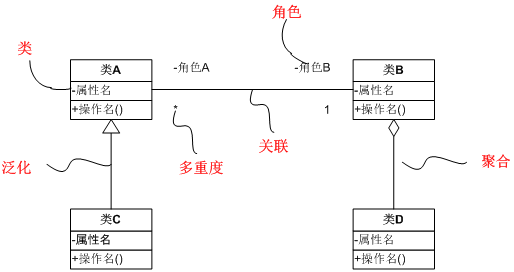

**类的表示**

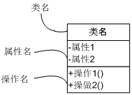

**类的关系**

已经单独说明

类的详细描述

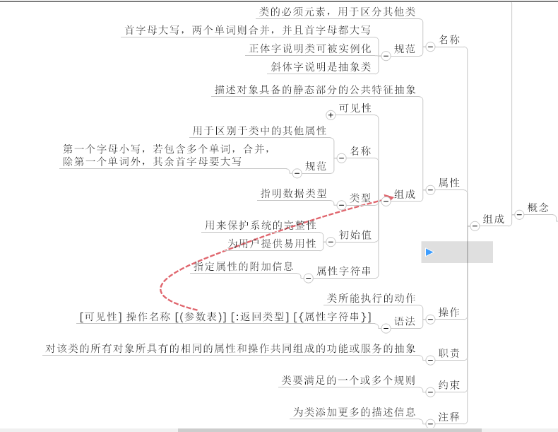

**类的名称**

**类的属性**

\- hello : String = "hello"

**类的操作**

\+getHello(in num:int = 1):String

**可见性：**公有类型（public）、受保护类型（protected）、私有类型（private）、Implementation。

-   公有类型（public）：允许在类的外面使用或查看该属性

-   受保护类型（protected）：允许子类访问父类中受保护类型的属性

-   私有类型（private）：只有类本身能够访问，外部一概不能

-   包访问类型（package）Implementation：该属性仅仅在被定义的包中才能够可见

**作用域**

-   类作用域：类的所有对象共享的属性或者操作，成为类作用域属性或者类作用域操作。即静态的属性和方法。在属性名或者操作名加下划线，或者之前加{static}标记。类作用域的属性值在该类的所有对象中共享。类作用域的操作是通过类来调用的。

-   实例作用域：类得所有对象拥有各自独立的值的属性作为实例作用域属性。需要通过访问对象来调用的操作成为实例作用域操作。默认情况下属性和操作为实例作用域。实例作用域要调用具体具体的对象来实现。

用到的构造块——事物有：类、接口、协作、注释、约束和包。

用到的构造块——关系：依赖、繁华、关联关系、实现关系。

类版型

**边界类（boundary class)**

-   定义：位于系统与外界的交界处，包括所有窗体(form)、报表(report)、与外部设备的接口(interface)，以及与其它系统的接口等。

-   表示方式：

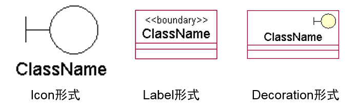

-   说明：通过usecase可以确定需要的边界类。每个actor/usecase至少需要一个边界类。

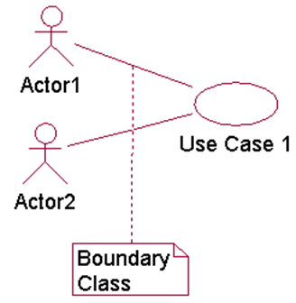

**实体类**

-   定义：保存持久存储的信息。

-   表示方式：

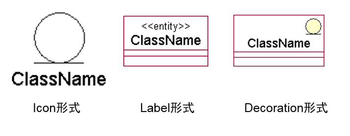

-   说明：对应数据库表。可以通过事件流和交互图发现。

**控制类**

-   负责其他类工作的类。

-   表示方式：

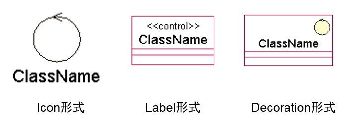

-   说明：每个usecase有一个控制类，控制usecase中事件的顺序。控制类负责发送接收消息。

类图的抽象层次

**概念层**

类图描述应用领域中的概念，一般地，这些概念和类有很自然的联系，但两者并没有直接的映射关系。概念层的类图应独立于具体的程序设计语言。

**说明层**

类图描述软件的接口部分，而不是软件的实现部分。

**实现层**

类图才真正考虑类的实现问题，揭示实现细节。实现层的类图可能是大多数人最常用的类图，但在很多时候，说明层的类图更易于开发者之间的相互理解和交流。

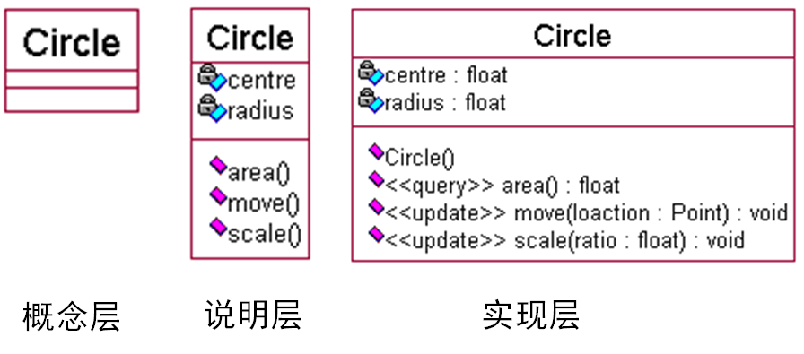

特殊的类图

**抽象类和抽象方法**

不能直接实例化的类。抽象类和抽象方法的名字要用斜体表示（标准方法法）或者使用草图表示法《》

示例：

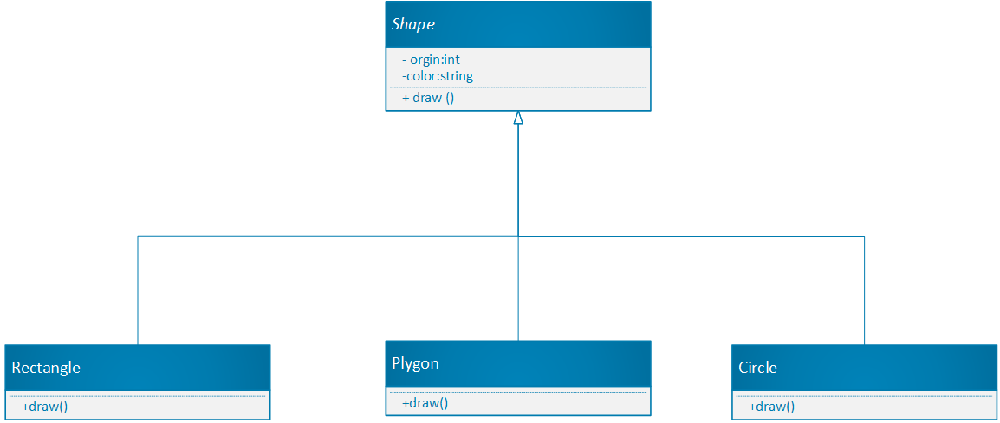

**接口**

>   定义：接口是一种特殊的类，所有接口都是有构造型的类，定义类或者组件，或者子系统公开给外部的操作的功能之定义操作的功能，不对操作进行实现。

>   表示方式：有两种方式来表示接口，一种使用图标表示，没有列出接口包含的具体的方法。一种是构造型表示接口，列出了接口的内部方法。

接口关系：接口同样具有依赖和泛化的关系

>   依赖：一个类通过依赖关系与接口相连接，仅仅依赖于接口中的操作

>   泛化：跟类之间泛化关系同理

>   接口优点：只要接口定义不变，对接口的实现进行改变，也不用改变调用接口的操作。

示例：

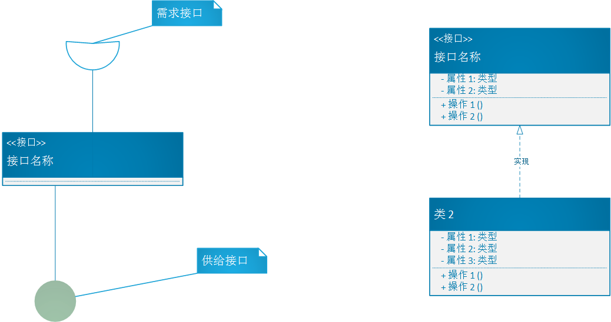

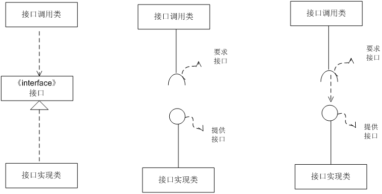

**关联类**

在多对多关系中，有些属性不属于关联两端的任何一个类。在分析阶段使用关联类代替。

在设计阶段必须将关联类设计为具体的可实现编程的类。关联类和关联线之间使用虚线连接，没有箭头三角。

通过关联类描述关联的属性和操作以及其他信息。

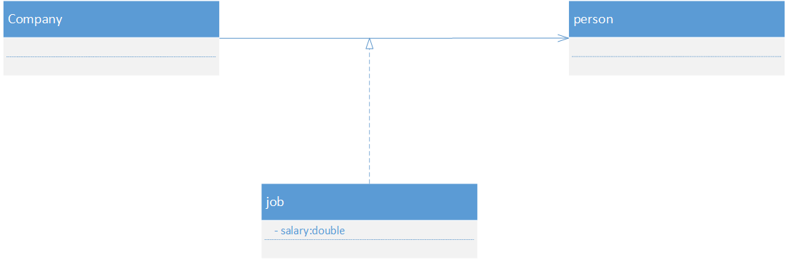

**模板类**

模板类又称作参数化类。模板类定义了一族类，模板类拥有一个参数，这个参数表中的参数称为形参，当用实际参数代替形参之后，才能穿件一个具体的类。右上角有一个虚线框，列出了形参表。

示例：

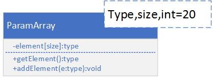

**主动类**

程序在运行时能够主动改变自身状态的对象就是主动对象。用于创建主动对象的类就是主动类。在程序执行期间一个主动对象能够控制自身的活动，具有独立的控制权。不需要外界消息的驱动。是种类，创建时钟对象能改变自身状态。

**嵌套类**

在类的内部定义新的类。

示例：

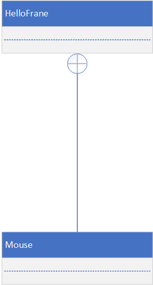
