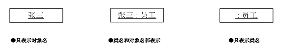
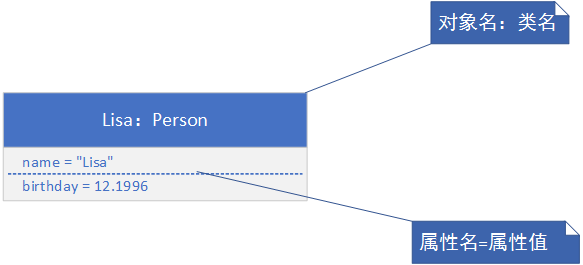
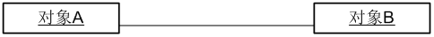
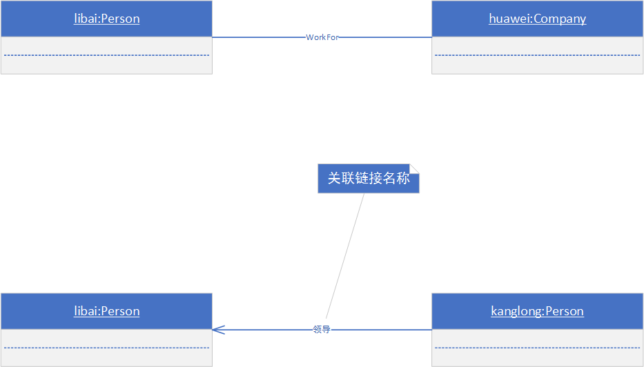

对象图概述

**定义**

表示系统在某一时刻内部的对象状态，是系统的快照。对象图显示了一组对象和他们之间的关系。对象是客观存在的事物，所有的对象都有属性。

**三要素**

状态：对象状态值在某一时刻对象所有属性的集合。

行为：没有一个对象是孤立存在的，对象可以被操作，也可以操作别的对象，对象的这些动态特征成为对象的行为。

标识：为了讲一个对象和其他对象分开，赋予对象一个标识，以区别其他对象。

**对象与类的区别**

对象是类的一个实例，类是对一组对象的共同特征进行概括和描述。

对象是存在于时间空间中的具体实体，二类是一个类型。

类泛华了对象，对象特化了实体。类是定义，对象是实例。

**对象分类**

物理对象和概念对象。物理对象是客观存在的事物，概念对象是无形的事物。

领域对象和实现对象。从现实世界中识别出来的对象是领域对象。为了满足需求而构造的对象成为实现对象。

主动对象和被动对象。主动对象能够改变自身状态的对象，被动对象，只有接收到消息后才会改变自身状态。

**对象表示**

对象图实例：类在某一时刻的实例。在系统给的某一时刻存在。

对象图中的元素：对象、协作、注释、约束和包。

**对象图表示**

**对象图的用途**

-   系统快照，表示体统在某一时刻的状态。

-   辅助分析类图中的多重度关系。

对象图中的关系

**双向链接和单向链接**

实例：

