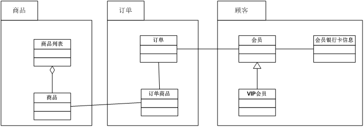
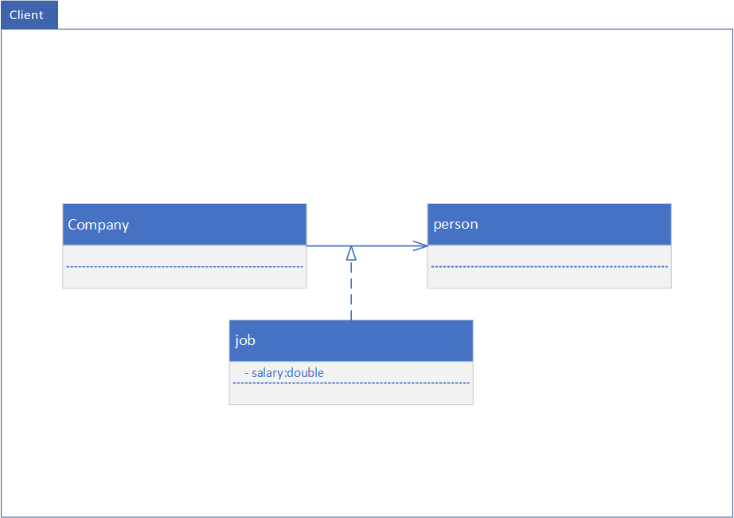
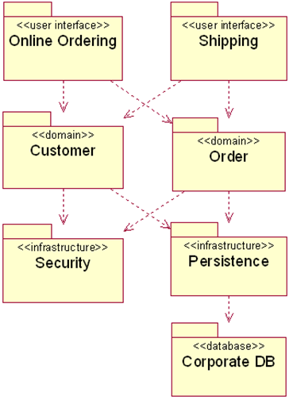
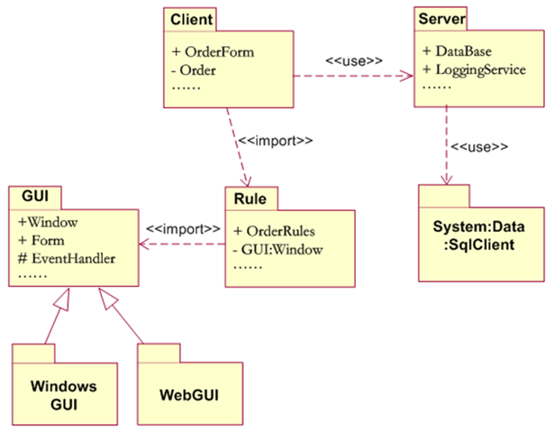
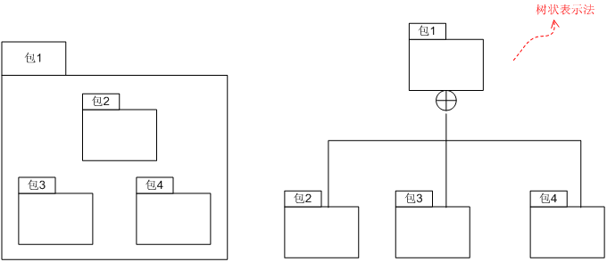
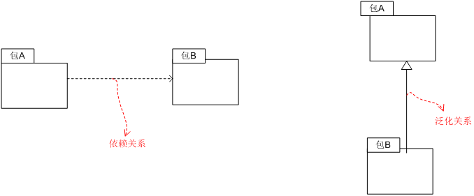
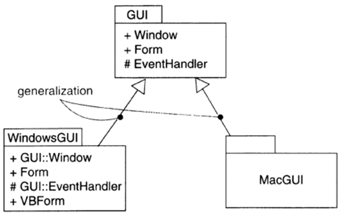

包图概述

**包图定义**

使用包图可以将相关元素归入一个系统。一个包中可以包含附属包、图表或单个元素。

**包的表示**

**组成元素**

类、接口、构建、节点、协作、用例、子包。

**包图优点：**

为了方便对类和接口的开发进行管理。

-   用于组织模型中的元素进行分组以便更容易理解。

-   对包中的元素进行可见性控制。

-   对于以上相关的元素进行分组。

-   以包为单位对系统进行配置管理。

-   以包为单位分配设计任务。

-   包提供了一个封闭的空间，避免命名冲突。

**包的应用**

-   对建模元素进行分组。提高模型的可读性和可维护性。

**包的设计原则**

前三个原则互斥。共同闭包原则希望包越大越好。共同重用原则要求包越小越好。

-   重用等价原则：指的是把类放入包中时，应考虑把包作为可重用的单元。

-   共同闭包原则：指的是把那些需要同时改变的类放在一个包中。如果一个类的行为和/或结构的改变要求另一个类作相应的改变，则这两个类应放在一个包中；•共同闭包原则就是要提高包的内聚性、降低包与包之间的耦合度，希望在改动或升级一个包的时候要尽量少影响别的包。

-   共同重用原则：指的是不会一起使用的类不要放在同一包中。修改了一个对用户实际上毫无影响的类，却逼得用户不得不重新检查是否还可以同样方式使用新的包是不合理的

-   非循环依赖原则：指的是包之间的依赖关系不要形成循环。

**包图建模风格**

-   内聚性

-   垂直分层类包图。显示了系统的逻辑分层。自上而下的方式画出分层结构。

-   用版型指明体系结构的层次

详细说明

**包图表示**

**包中的元素：**

可以包含其他建模元素类和接口、用例、子包、构件。包图可以嵌套。包图没有实例。

**包中元素的可见性：**

\+ public 共有的，任何元素都可以访问。

\# protected 保护的，继承可以访问。

\- private 私有的，同一个包内可以访问。

**包中类的表示**

包名：：类名来表示包和类的对应关系。com.ykl::Server

**包的层次化表示**

包中还包含另外的包。

包之间的关系

包之间的关系可以是依赖关系或者泛化关系。包之间的故障逆袭取决于保内的关系。

**依赖关系：**用虚线箭头表示

>   **《use》关系：**客户包中的元素以某种方式使用提供者包中的某些公共元素。被访问元素可见性为+

>   **《import》关系：**客户报和提供者包命名空间合并。（若重名会出现命名冲突。）

>   **《access》关系：**客户包通过全名访问提供者包中的元素。被访问元素可见性为+

>   **《trace》关系：**客户报从提供者包进化而来。表示两个包不是属于同一级别。

**泛化关系：**子包继承了父包所有的公共元素和保护元素。

