序列图概述

**定义**

>   交互图是一种表示对象之间以及对象与系统外部的参与者actor之间动态联系的图形文档。序列图和协作图都是交互图，彼此等价，可以相互转化。

>   序列图是对对象之间传送消息的时间顺序的可视化表示。序列图用于表现交互，侧重于强调时间顺序。协作图着重描述系统成分如何系统协同工作。

>   **序列图将交互关系表示为一个二维图，**一个顺序图显示了一系列的对象和在在这些对象之间发送和接受消息的先后顺序。顺序图中水平方向为对象维，沿水平方向排列参与交互的对象；竖向方向为时间维，沿垂直向下方向按时间递增顺序列出各对象所发出和接收的消息。

**序列图示例**

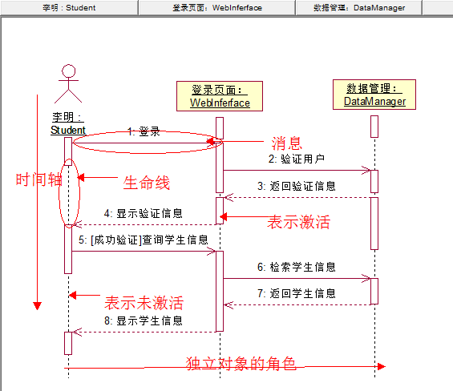

>   注：虚线表示，此时对象不处于激活状态，双道线，表示对象处于激活状态；消息使用从一个对象的生命线到另一个对象的生命线的箭头表示。

**序列图的作用：**

>   检查用例图中描述的用户需求，。

>   和类图相互补充，表示对象之间的消息交互。

**序列图与类图的关系**

>   描述系统静态结构的类图和描述系统动态行为的交互图之间要保持一致性：

-   交互图中的生命线对应于类图中的类。

-   交互图中有消息交互的生命线，对应在类图中的两个类之间应该有一定的关联。

-   交互图中的消息对应于类图中接受该消息生命线所对应的类的某个操作。

**序列图的组成：**

>   序列图是由对象、生命线、激活和消息等构成的。

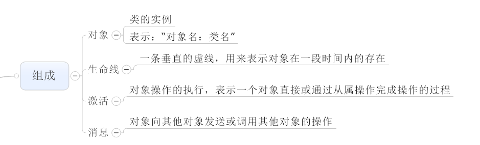

**建立顺序图的步骤**

>   1\. 确定交互过程的上下文(context)；

>   2\. 识别参与交互过程的对象；

>   3.
>   为每个对象设置生命线，即确定哪些对象存在于整个交互过程中，哪些对象在交互过程中被创建和撤销；

>   4.
>   从引发这个交互过程的初始消息开始，在生命线之间从顶到下依次画出随后的各个消息；

>   5\. 如果需要表示消息的嵌套，或/和表示消息发生时的时间点，则采用FOC；

>   6\. 如果需要说明时间约束，则在消息旁边加上约束说明；

>   7\. 如果需要，可以为每个消息附上前置条件和后置条件。

**顺序图建模风格**

-   把注意力集中于关键的交互

-   对于参数，优先考虑使用参数名而不是参数类型。

-   不要对明显的返回值建模。

-   可以把返回值建模为方法调用的一部分。

**顺序图建立的问题**

-   顺序图中消息的循环发送，在消息名字前加循环条件

    \*[ for all order lines]: message1()

-   顺序图中消息的条件发送，在消息名字前加条件子句； 使用文字说明；

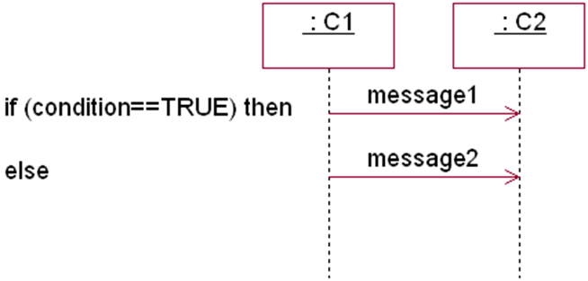

-   顺序图中时间约束的表示，用constraint(约束)来表示。

-   顺序图中递归的表示，利用嵌套的FOC表示

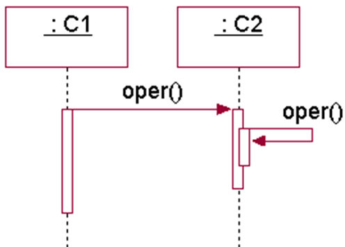

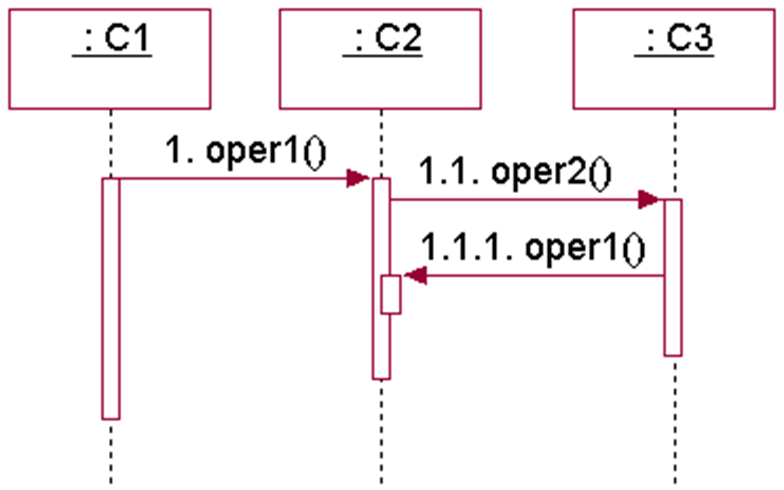

序列图的详细描述

**生命线**

矩形框+虚线

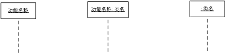

**控制焦点（也叫作激活）**

>   对象生命周期，矩形表示对象处于激活状态。对象获得CPU控制权。完成工作后，释放控制权，对象处于空闲状态，成为去激活。

-   表示方法：在生命线上用细长的矩形框来表示。矩形框最上端表示处理的开始时点，矩形框的最下端表示处理的结束时点。

**消息**

用来描述对象之间所进行的通信。发送消息用实线箭头，返回消息用虚线箭头。

消息可以分为以下类别：

-   **同步消息**：对象发送消息后，等到接收消息的对象执行完所有操作才能继续执行自己的操作。实心箭头。

-   **异步消息**：发送消息的对象发送后，不用等待接受对象，继续执行自己的操作。空心箭头

-   **返回消息**：接受消息的对象，返回数据并交回控制权，非发送消息的对象。对于同步消息的应答。可以省略。

-   **创建消息**：《create》

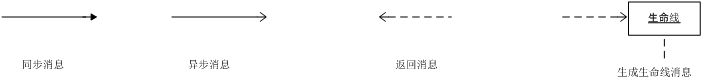

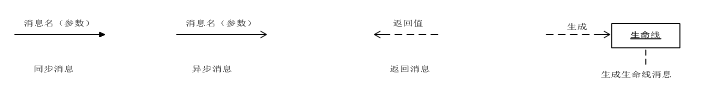

-   **销毁对象：--\>×**

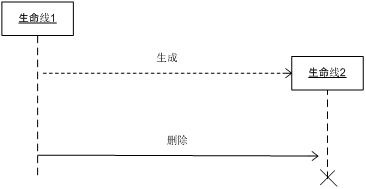

-   **发现消息**：发送方不明确的消息。

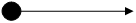

-   **丢失消息**：接收方不明确的消息。

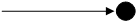

**递归调用：**从生命线下个自身通过折现进行消息发送的表示。

**消息的编号**

>   顺序编号、分层编号。顺序图中的消息可以省略消息番号。通信图中的消息必须明确消息番号来表示消息发送的先后顺序。

**顺序图的示例**

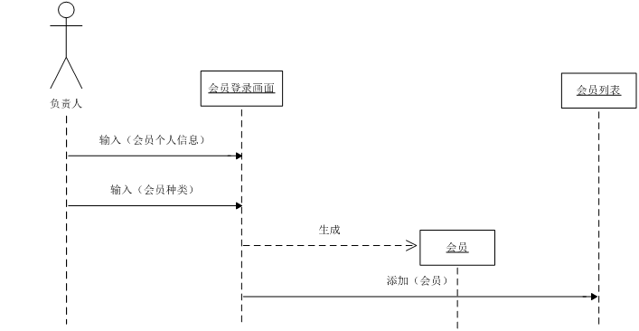

序列图的复杂结构

**高级概念：**

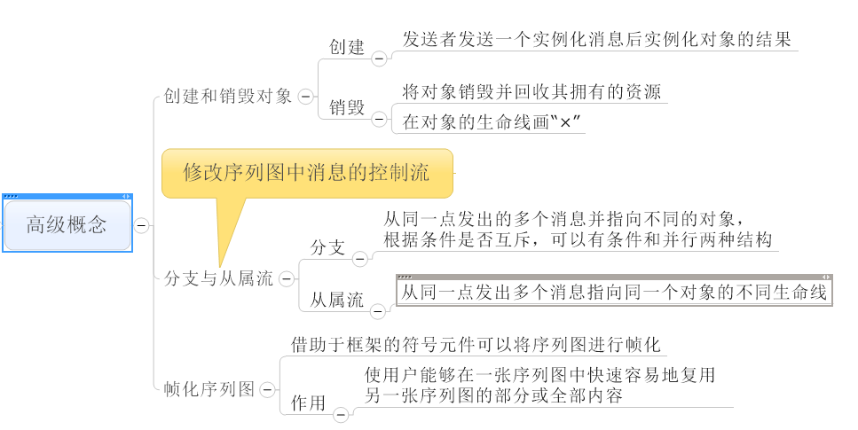

**组合区：**有多个区域组成，每个组合区有一个操作符。操作符表示对象执行方式，分支、并发或者循环。区域之间用虚线隔开。每个区域拥有一个监护条件和一个组合语句。监护条件写在方括号中。

**操作符：**操作符表示对象的执行方式。声明组合区的类型，写在组合区的左上角。

**分支结构**

alt和opt能够表示分支结构。alt表示多选一，opt表示判断单选一。

实例描述：上面区域的监护条件是x\<10，执行calculate(x)函数。下面区域的监护条件(else),执行put(x)

实例逻辑：\*\*\*\*\*

序列图：

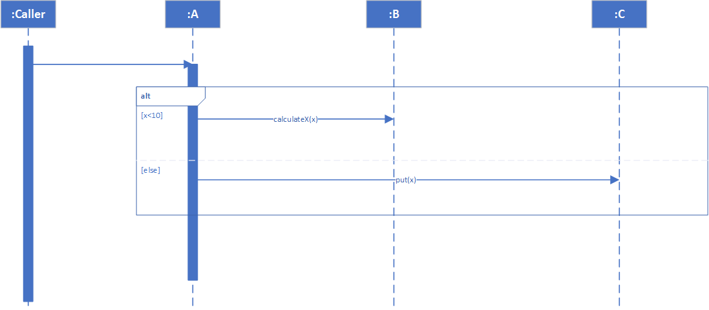

**循环结构**

操作符：Loop(1,3)表示for(i = 1,i\<n;i++)

序列图：

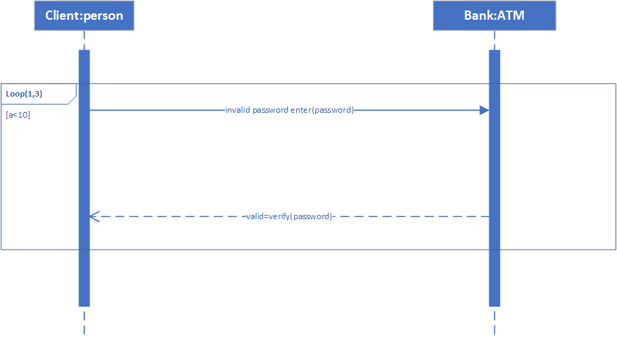

**并发控制**

par组合区域中的多个区域种的操作是并行执行，没有先后顺序。

序列图：输入用户名和输入money是没有先婚后顺序。

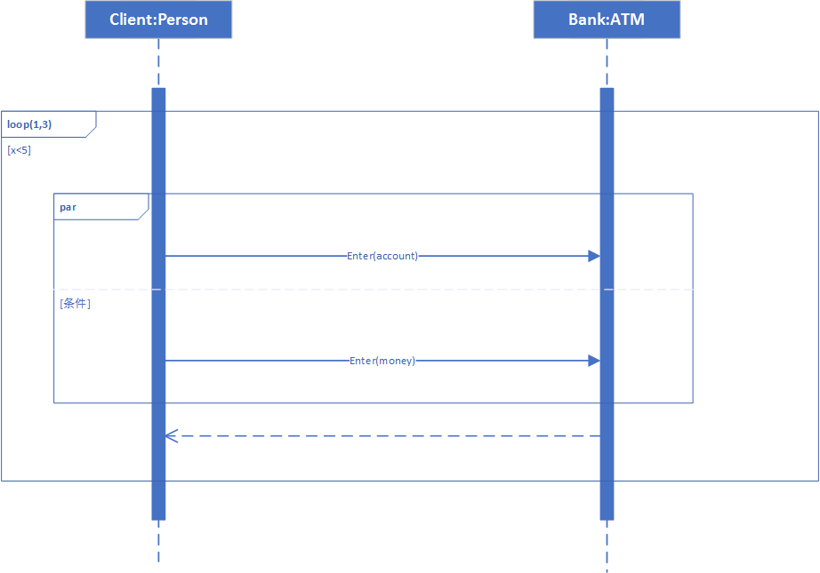

**consider消息列表**

只有消息列表中的消息才能被执行。通过asser组合区进行判断。

序列图：

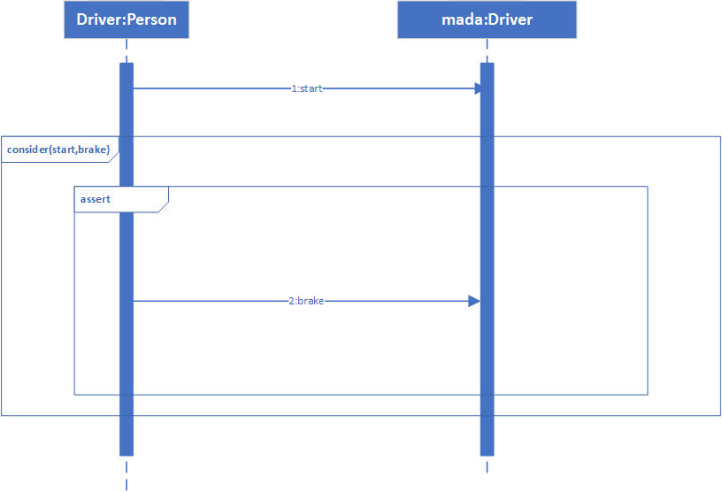

**ignore消息列表**

ignore消息列表中的信息被忽略。通过assert组合区进行判断。

序列图：（以后补充）

**break**

与循环操作配合使用，如果执行，则跳出循环语句，表示在给定条件满足时退出交互序列。

序列图：（以后补充）

**critical**

组合临界区，在临界区中的操作要么全被直行，要么都不执行。为了保持事务的原子性。

序列图：（以后补充）

**交互调用ref**

>   在一个交互的执行过程中去参照调用另外一个在它处定义好了的交互序列称为交互调用。

>   序列图：在框架的head部分用关键字“ref”进行标识，框架中央指明要调用的交互序列名称。方便合理组织顺序图中的元素，简化图中的交互调用关系，增强复杂交互关系的可读性和可维护性。

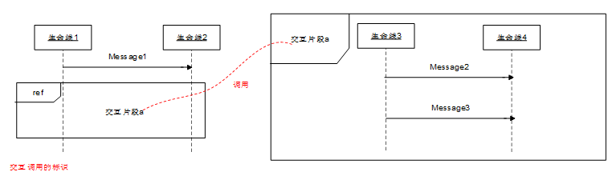
