基本描述

**定义**

Unified Modelling Language，统一建模语言。面向对象系统的分析方法。

**特点**

-   统一标准：面向对象的标准化建模语言

-   面向对象

-   可视化

-   独立于过程

-   概念明确，表示简洁，图形结构清晰，容易掌握

基本模型

| **类型**   | **图名** | **概要说明**                                                                             |                                                                                      |
|------------|----------|------------------------------------------------------------------------------------------|--------------------------------------------------------------------------------------|
| 静态结构图 | 类图     | 表示分析设计领域的静态结构。                                                             |                                                                                      |
|            | 对象图   | 表示系统中的多个对象在某一时刻的状态。                                                   |                                                                                      |
|            | 包图     | 对UML的模型元素进行分组整理，还可表示多个包之间的关系。                                  |                                                                                      |
|            | 构件图   | 表示构成软件的各个可重复再利用的部件的内部结构以及部件之间的相互关系。                   |                                                                                      |
|            | 部署图   | 表示系统执行时的硬件构成以及硬件节点之间的关系。                                         |                                                                                      |
| 动态行为图 | 用例图   | 表示从系统外部看到的系统所提供给用户可使用的功能。                                       |                                                                                      |
|            | 活动图   | 表示某个业务的具体处理流程，或者程序的某个算法。                                         |                                                                                      |
|            | 交互图   | 顺序图（时序图）                                                                         | 按照时间顺序从上到下来表示生命线之间的消息交互。可结合用例图用来表示某个用例的脚本。 |
|            |          | 通信图（协作图）                                                                         | 以参与交互的生命线之间的连接为着眼点来表示生命线之间的消息交互。                     |
|            | 状态图   | 表示某个对象在其生命周期内，各个状态之间的迁移变化以及引起状态迁移的触发事件之间的关系。 |                                                                                      |

**用例图（usecase diagram）**

-   定义：表示从系统外部看到的系统所提供给用户可以使用的功能。

-   使用：需求分析阶段，根据从用户收集来的需求，明确开发对象时使用。

-   组成要素：参与者、用例、系统边界

-   示例：

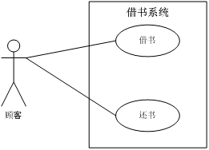

**类图（class diagram）**

-   定义：分析设计领域的静态结构

-   使用：描述系统的静态结构，任何开发阶段**。**

-   要素：类名、属性、操作、关系

-   示例：

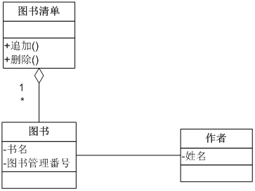

**对象图（Object Diagram）**

-   定义：对象图描述在某一时刻系统内对象的状态。

-   使用：用来辅助决定类图中类和类之间的多重关系（关联关系？）

-   要素：对象名、关系

-   示例：

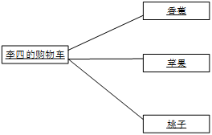

**顺序图（Sequence Diagram)**

-   定义：交互图的一种。按照时间顺序来描述对象生命之间的消息交换。

-   作用：描述系统的动态行为。

-   要素：生命线、消息交互。

-   示例：

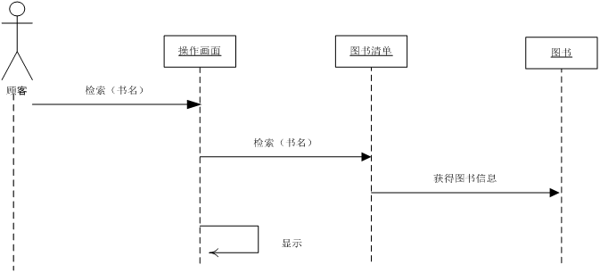

**通信图（Communication Diagram）**

-   定义：交互图的一种。以生命线之间的链接关系为中心来描述消息交互。

-   作用：描述系统的的动态行为。

-   要素：生命线、消息

-   示例：

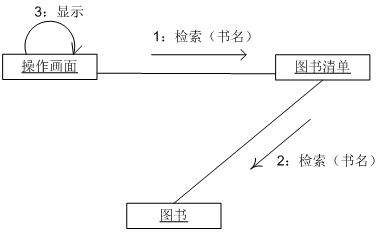

**状态图（Statemachine Diagram）**

-   定义：着眼于一个对象，描述该对象在生命周期内的状态迁移变化情况。

-   作用：描述某个对象生命周期内，随外部时间的触发，而进行的状态变化图。

-   要素：状态（初始状态、中间状态、终结状态）、事件

-   示例：

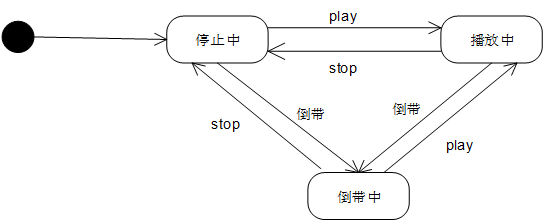

**活动图（Activity Diagram）**

-   定义：描述系统业务流程、用例流程的图。

-   作用：描述活动的流程。

-   要素：开始节点、结束节点、活动、判断节点和监护条件、fork节点、join节点、参与者。

-   示例：

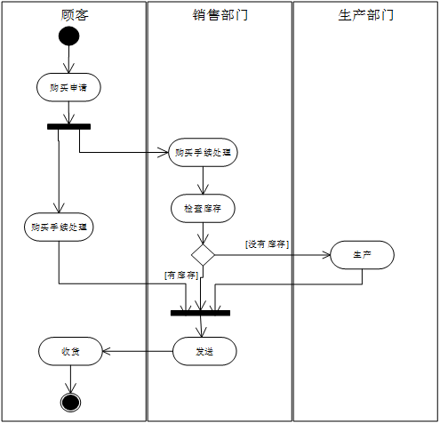

**构建图（Component Diagram）**

-   定义：描述构成系统的软件构建的结构及其相互关系的图。构建为构成软件系统的可以再利用的部件。

-   作用：设计阶段辅助设计。

-   要素：构件、构件之间的关系。

-   示例：

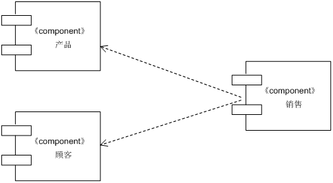

**部署图（Deployment Diagram）**

-   定义：描述软件运行时的硬件、配置在硬件上的软件、硬件节点之间的关系的图。

-   作用：

-   要素：节点、节点之间的关系。

-   示例：

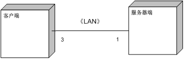

**包图（Package Diagram）**

-   定义：对构成系统的模型元素进行分组整理的图。

-   作用：

-   要素：包、包之间的关系。

-   示例：

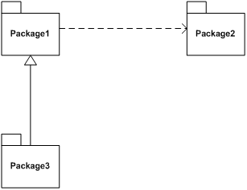

UML应用

**领域**

软件、非软件系统

**需求分析阶段**

用例图表示客户需求，通过用例建模可以对外部的角色以及他们所需要的系统功能建模。

**分析阶段**

逻辑视图、动态视图描述所要解决的问题。

类图描述系统的静态结构。

协作图、状态图、顺序图、活动图描述系统的动态特征。

只为问题的类建模、不定义软件系统的解决方案的细节。

**设计阶段**

把分析阶段的结果扩展成为技术解决方案，加入新的类来提供技术基础结构——用户接口，数据库操作。

设计阶段的机构结果是构造阶段的详细的规格说明。

**构造阶段**

把设计阶段的类转换成某种面向对象程序设计语言的代码。

**测试阶段**

单元测试、集成测试、系统测试、接收测试

不同测试阶段使用不同的UML图作为他们的工作基础。单元测试使用类图和类的规格说明；集成测试典型的使用构件图和协作图。系统测试使用用例图来去人系统的行为是否符合这些图中的定义。

UML例子

1.  类图表示之间的类关系

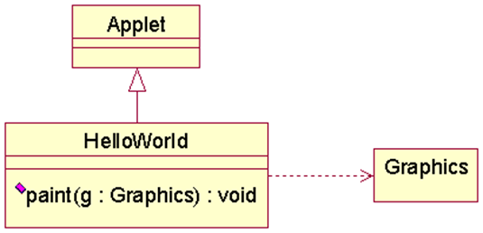

1.  包图表示类的组织关系

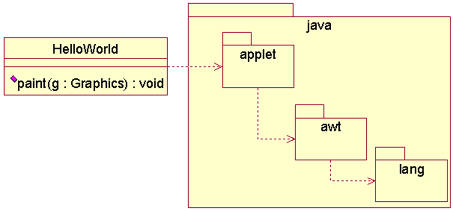

1.  对象顺序图表示执行关系

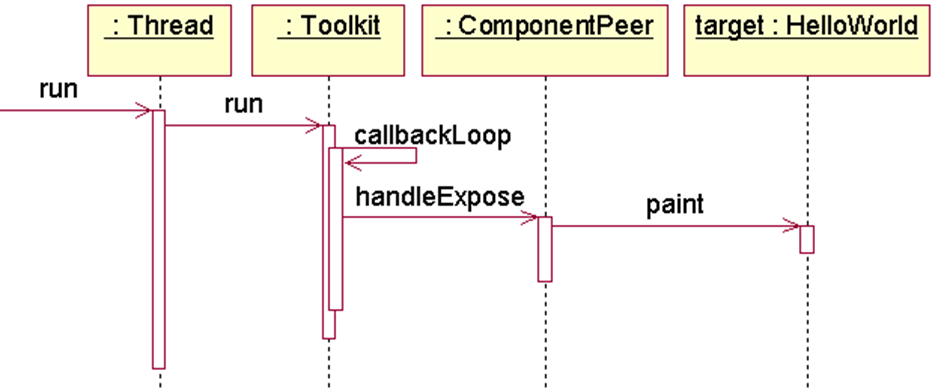

1.  构件图表示整个系统的架构

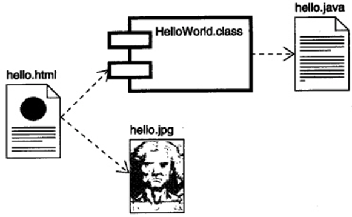
